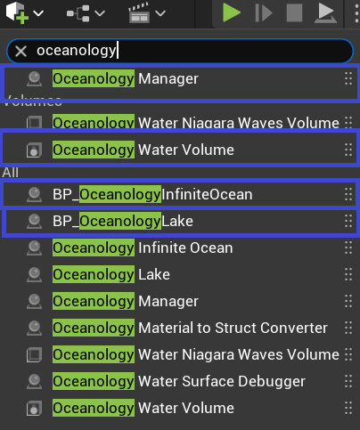
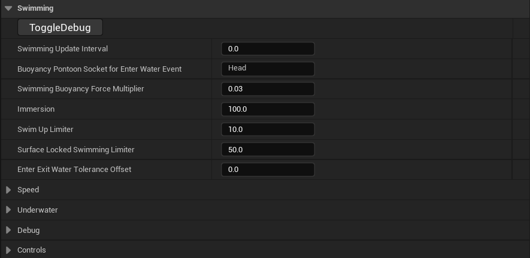
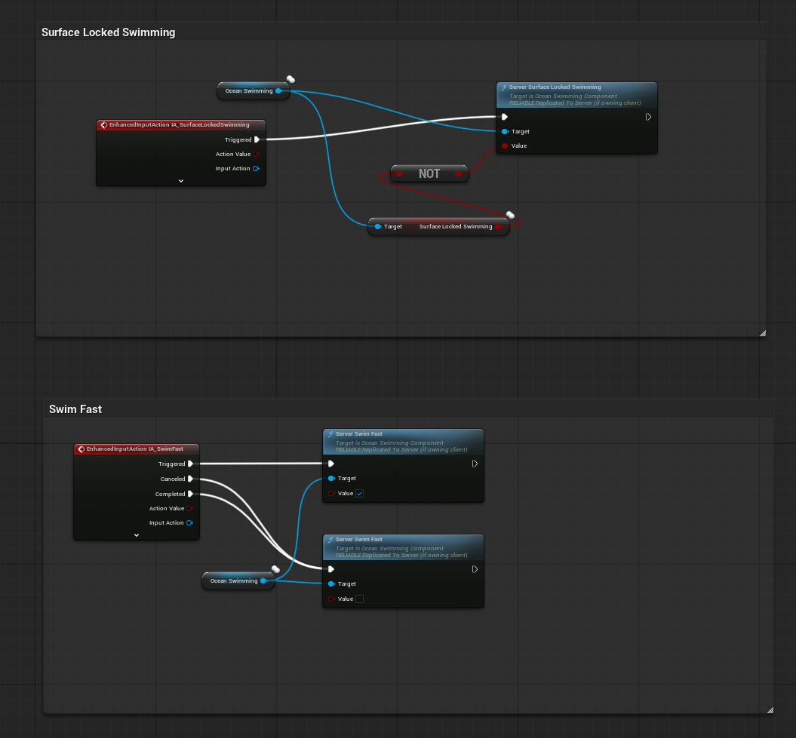
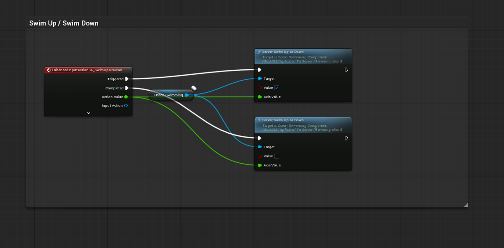
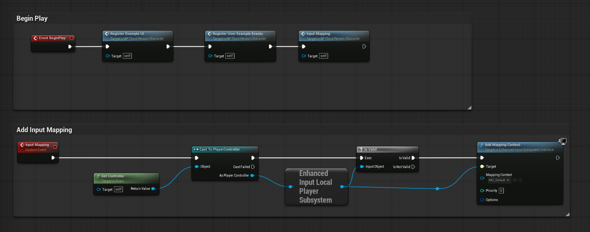

# Oceanology Legacy - Swimming

🏊 Character System

🎮 Game Ready

📋 Step-by-Step

Implement realistic character swimming with the OceanSwimming component in Oceanology Legacy.

---

## Prerequisites

| Requirement | Details |
|-------------|---------|
| **Engine** | UE5.x (latest release) |
| **Plugin** | Oceanology Legacy installed and configured |
| **Scene** | Water body with Oceanology Water Volume |
| **Character** | A Character Blueprint with CharacterMovementComponent |

:::info About Swimming
Swimming in Oceanology Legacy is driven by two components: the `OceanBuoyancyComponent` (water detection, floating) and `OceanSwimmingComponent` (movement, drowning, underwater effects). Character swimming requires exactly **two pontoons**: one for the body (floating) and one for the head (drowning detection).
:::

---

## Step-by-step

:::note 1. Add the required Oceanology actors to your scene
Open your level and use the **Quickly Add to the Project** menu (the `+` button in the toolbar or right-click in the viewport). Search for `oceanology` to filter the available actors.

You will need to drag the following actors into your scene:
- **Oceanology Manager** - The central controller that manages all Oceanology systems. This actor is required for any Oceanology feature to work.
- **Oceanology Water Niagara Waves Volume** - Optional volume for Niagara-based wave effects.
- **Oceanology Water Volume** - Defines the region where buoyancy and swimming calculations are performed. This volume detects when characters enter the water.
- **BP_OceanologyInfiniteOcean** - The infinite ocean water body. Use this for open sea environments.
- **BP_OceanologyLake** _(optional)_ - A bounded lake water body. Add this if your level includes lakes or enclosed water areas.

At minimum, you need: **Oceanology Manager**, **Oceanology Water Volume**, and one water body (**BP_OceanologyInfiniteOcean** or **BP_OceanologyLake**).

:::

:::note 2. Locate the Character Blueprint
In the **Content Browser**, navigate to:
`Plugins > Oceanology Legacy > Character > Blueprints`

Here you will find:
- **BP_ThirdPersonCharacter** - A pre-configured character Blueprint with swimming already set up. This is an excellent reference for understanding the component configuration.
- **BP_ThirdPersonGameMode** - The game mode that spawns the swimming-enabled character.

You can either:
1. **Use the included character directly** - Drag `BP_ThirdPersonCharacter` into your scene or set it as the default pawn in your Game Mode.
2. **Study and replicate the setup** - Open this Blueprint to understand the component configuration, then apply the same setup to your own character.

For this guide, we will open `BP_ThirdPersonCharacter` to examine its configuration.

:::

:::note 3. Add the OceanBuoyancy and OceanSwimming components
Open your Character Blueprint in the **Blueprint Editor**. In the **Components** panel, click **+ Add** and search for `ocean`.

You will see several Oceanology components available:
- **Ocean Buoyancy** - Required. Handles water surface detection and applies buoyancy forces.
- **Ocean Swimming** - Required. Manages swimming movement, drowning, and effects.
- **Ocean Audio** - Optional. Adds water interaction sounds.
- **Oceanology Empty Wave Solver** - A blank wave solver for custom implementations.
- **Oceanology Gerstner Wave Solver** - Samples Gerstner wave displacement.
- **Oceanology Heightmap** - Samples heightmap-based water surfaces.
- **Oceanology Infinite** - References the infinite ocean system.
- **Oceanology Underwater** - Optional. Handles underwater post-processing effects.

Add both **Ocean Buoyancy** and **Ocean Swimming** to your character. The order in the component hierarchy does not matter, but both must be present for swimming to function correctly.

**Important:** The OceanSwimming component references the OceanBuoyancy component internally. Both components must exist on the same actor.

:::

---

## Configuring the OceanBuoyancy Component for Swimming

Character buoyancy differs significantly from vessel buoyancy. While ships use 5-8 pontoons distributed across their hull, characters require exactly **two pontoons** with specific purposes.

:::note 4. Configure the OceanBuoyancy component
Select the **OceanBuoyancy** component in your character Blueprint. In the **Details** panel, configure the **Buoyancy** category:

**Debug Buttons:**
- **DebugPontoons** - Click to visualize pontoon positions in the viewport.
- **ToggleDebug** - Enables runtime debug visualization.

**Core Buoyancy Settings:**
- **Buoyancy Update Interval** - `0.0` (updates every frame for responsive swimming)
- **Default Mesh Density** - `900.0` kg/m³ (slightly less than water, allowing the character to float)
- **Water Fluid Density** - `1030.0` kg/m³ (standard seawater density)
- **Water Fluid Linear Damping** - `1.0` (reduces forward/backward velocity in water)
- **Water Fluid Angular Damping** - `2.5` (reduces rotation velocity in water)
- **Water Velocity Damper** - `(0.1, 0.1, 0.1)` (per-axis velocity reduction)
- **Limit Underwater Max Velocity** - ✅ Enabled
- **Max Underwater Velocity** - `100.0` (caps swimming speed for realistic movement)

**Pontoons Array - Critical for Swimming:**

The **Pontoons** array is the most important configuration for character swimming. You need exactly **2 pontoons** with specific roles:

### Pontoon [0] - FullBody (Buoyancy Control)
This pontoon controls the character's overall floating behavior.

| Property | Value | Explanation |
|----------|-------|-------------|
| **Socket** | `FullBody` | Attaches to a socket on the character's skeletal mesh (typically at the pelvis/center of mass) |
| **Pontoon** | `(0.0, 0.0, 100.0)` | Offset from socket position. Z=100 places it at body center |
| **Radius** | `10.0` | Size of the sampling sphere. Larger = smoother buoyancy |
| **Density Override** | `0.0` | Uses Default Mesh Density (900.0) |
| **Mode** | `Buoyancy` | This pontoon applies floating forces |

### Pontoon [1] - Head (Water Entry Detection)
This pontoon detects when the character's head enters/exits water, triggering drowning mechanics.

| Property | Value | Explanation |
|----------|-------|-------------|
| **Socket** | `Head` | Attaches to the head bone socket |
| **Pontoon** | `(0.0, 0.0, 0.0)` | No offset - directly at the head socket position |
| **Radius** | `1.0` | Small radius for precise head-water intersection detection |
| **Density Override** | `0.0` | Uses Default Mesh Density |
| **Mode** | `Water Enter Exit Event Only` | **Critical!** This pontoon does NOT apply forces - it only triggers events |

**Global Wave Settings:**
- **Global Wave Force Multiplier** - `2.0` (how much waves affect the character)
- **Global Wave Force Enabled** - ✅ Enabled (character responds to wave motion)

**Understanding Pontoon Modes:**
- `Buoyancy` - The pontoon samples water height and applies upward force to keep the character floating. Use this for the body.
- `Water Enter Exit Event Only` - The pontoon samples water height but applies NO force. Instead, it fires events when entering/exiting water. Use this for the head to detect submersion without affecting physics.

**Why Two Pontoons?**
- The **FullBody** pontoon keeps the character floating at the correct height relative to the water surface.
- The **Head** pontoon independently tracks whether the head is underwater, which is essential for:
  - Triggering the drowning timer
  - Enabling underwater visual effects
  - Switching audio to muffled underwater sounds
  - Activating breath-holding mechanics

**Socket Requirements:**
Your character's Skeletal Mesh must have sockets named `FullBody` (or similar, at center of mass) and `Head` (at the head bone). If your skeleton uses different socket names, update these values accordingly.

:::

---

## Configuring the OceanSwimming Component

The OceanSwimming component controls all swimming-specific behavior: movement speed, drowning, underwater effects, and input handling.

:::note 5. Configure the OceanSwimming component - Main Settings
Select the **OceanSwimming** component in your character Blueprint. In the **Details** panel, configure the **Swimming** category:

**Debug:**
- **ToggleDebug** - Enables runtime visualization of swimming state.

**Core Swimming Settings:**
- **Swimming Update Interval** - `0.0` (updates every frame for responsive controls)
- **Buoyancy Pontoon Socket for Enter Water Event** - `Head` - **Critical!** This tells the swimming system which pontoon to use for detecting water entry. Must match the socket name from Pontoon [1].
- **Swimming Buoyancy Force Multiplier** - `0.03` - Fine-tunes how strongly buoyancy affects the character while swimming. Lower values = character sinks more easily when not actively swimming up.
- **Immersion** - `100.0` - Percentage of body considered submerged. At 100%, the character is fully in swimming mode.
- **Swim Up Limiter** - `10.0` - Limits how quickly the character can ascend. Prevents unrealistically fast vertical movement.
- **Surface Locked Swimming Limiter** - `50.0` - Controls how strongly the character is held at the water surface when surface-locked mode is active.
- **Enter Exit Water Tolerance Offset** - `0.0` - Offset for water entry/exit detection threshold.

**Collapsed Categories (configure in next steps):**
- **Speed** - Swimming velocity settings
- **Underwater** - Drowning and visual effects
- **Debug** - Debug visualization options
- **Controls** - Rotation and input settings

:::

:::note 6. Configure Speed, Drowning, and Underwater Effects
Expand the **Speed** and **Underwater** categories:

### Speed Settings

| Property | Value | Explanation |
|----------|-------|-------------|
| **Swim Max Speed** | `300.0` | Normal swimming speed in Unreal units per second. This is the default movement speed when the character is swimming without holding the sprint input. |
| **Swim Fast Max Speed** | `600.0` | Sprint swimming speed. Activated when the player holds the **Swim Fast** input (default: Left Shift). This doubles the normal speed for quick traversal. |

### Underwater > Drowning

| Property | Value | Explanation |
|----------|-------|-------------|
| **Drowning Enabled** | ✅ Enabled | Master toggle for the drowning system. Disable for underwater-only games or characters with breathing apparatus. |
| **Drowning Time Warning in Seconds** | `7` | Time in seconds before the drowning warning triggers. When the character's head has been underwater for 7 seconds, a warning event fires (screen effects, UI warnings, etc.). |
| **Drowning Time Death in Seconds** | `5` | Time in seconds after the warning before death occurs. The player has 5 additional seconds to surface after the warning before drowning kills the character. |

**Total Submersion Time:** With default values, the character can stay underwater for **12 seconds total** (7 seconds until warning + 5 seconds until death).

### Underwater > Effects

| Property | Value | Explanation |
|----------|-------|-------------|
| **Enable Underwater Effects** | ✅ Enabled | Master toggle for all particle effects. |
| **Head Bubbles Effect Niagara** | `NS_Head_Bubbles` | Niagara system for bubbles emitting from the character's head/mouth area. |
| **Head Socket Name** | `head_Socket` | Socket on the Skeletal Mesh where head bubbles spawn. |
| **Right Foot Bubbles Effect Niagara** | `NS_Foot_Bubbles` | Niagara system for bubbles from the right foot. |
| **Left Foot Bubbles Effect Niagara** | `NS_Foot_Bubbles` | Niagara system for bubbles from the left foot. |
| **Right Foot Socket Name** | `foot_r_Socket` | Socket on the right foot bone. |
| **Left Foot Socket Name** | `foot_l_Socket` | Socket on the left foot bone. |
| **Stop Head Bubbles While Swim Fast** | ✅ Enabled | Disables head bubbles during sprint swimming. |
| **Stop Right Foot Bubbles While Swim Fast** | ✅ Enabled | Disables right foot bubbles during sprint swimming. |
| **Stop Left Foot Bubbles While Swim Fast** | ✅ Enabled | Disables left foot bubbles during sprint swimming. |
| **Swim Fast Trail Effect Niagara** | `NS_SwimFast_Trail` | Niagara system for the speed trail during sprint swimming. |
| **Swim Fast Trail Socket Name** | `swim_fast_trail_Socket` | Socket where the trail spawns (typically at the pelvis). |

### Sound

| Property | Value | Explanation |
|----------|-------|-------------|
| **Swim Fast Trail Sound** | `None` | Optional sound asset that plays during fast swimming. |

:::

:::note 7. Configure Debug and Controls
Expand the **Debug** and **Controls** categories:

### Debug

| Property | Value | Explanation |
|----------|-------|-------------|
| **Debug Enabled** | ❌ Disabled | Enables runtime debug visualization showing swimming state, pontoon positions, and force vectors. Enable during development, disable for shipping. |

### Controls

| Property | Value | Explanation |
|----------|-------|-------------|
| **Swimming Orient Rotation to Movement** | ✅ Enabled | The character rotates to face the direction of movement while swimming. This creates natural-feeling swimming where the character turns toward where they're going. |
| **Swimming Use Controller Rotation Yaw** | ❌ Disabled | When disabled, the character's yaw is controlled by movement direction, not the camera/controller. Enable this if you want the character to always face where the camera is looking (tank controls). |

**Rotation Behavior Combinations:**

| Orient to Movement | Use Controller Yaw | Result |
|--------------------|-------------------|--------|
| ✅ | ❌ | **Recommended.** Character turns toward movement direction. Natural swimming feel. |
| ❌ | ✅ | Character always faces camera direction. Tank-style controls. |
| ✅ | ✅ | Mixed behavior. Controller yaw overrides movement orientation. |
| ❌ | ❌ | Character does not rotate while swimming. Unusual, rarely used. |

:::

---

## Creating Swimming Input Blueprint Logic

Now you need to create the Blueprint logic that responds to swimming inputs and calls the appropriate OceanSwimming component functions.

:::note 8. Implement Surface Locked Swimming and Swim Fast inputs
Navigate to your Character Blueprint's **Event Graph** to implement the swimming input logic.

### Surface Locked Swimming (L key)

This input toggles **surface-locked mode**, where the character stays at the water surface and cannot dive.

**Blueprint Logic:**

1. **Add Enhanced Input Action node** - Select **IA_SurfaceLockedSwimming**.

2. **Get Ocean Swimming component reference**.

3. **Get current Surface Locked Swimming state:**
   - Drag from Ocean Swimming → Get **Surface Locked Swimming** (boolean property).

4. **Add NOT node** - Invert the current state to toggle it.
   - Input: Current Surface Locked Swimming value
   - Output: Inverted value

5. **Call Server Surface Locked Swimming:**
   - Target: Ocean Swimming component
   - Value: Output from NOT node (toggles between true/false)

**How it works:**
- First press: Surface Locked Swimming = `true` → Character stays at surface.
- Second press: Surface Locked Swimming = `false` → Character can dive freely.

### Swim Fast (Left Shift key)

This input enables sprint swimming when held.

**Blueprint Logic:**

1. **Add Enhanced Input Action node** - Select **IA_SwimFast**.

2. **Connect the outputs:**
   - **Triggered** - Fires when the key is pressed.
   - **Cancelled** - Fires if the action is interrupted.
   - **Completed** - Fires when the key is released.

3. **Get Ocean Swimming component reference**.

4. **Call Server Swim Fast:**

**For Triggered output (key pressed):**
- Target: Ocean Swimming component
- Value: ✅ `true` (fast swimming active)

**For Cancelled/Completed output (key released):**
- Target: Ocean Swimming component
- Value: ❌ `false` (fast swimming deactivated)

:::

:::note 9. Implement Swim Up / Swim Down input
This input allows vertical movement underwater. **Q** swims up, **E** swims down.

**Blueprint Logic:**

1. **Add Enhanced Input Action node** - Search for `EnhancedInputAction` and select **IA_SwimUpOrDown**.

2. **Connect the outputs:**
   - **Triggered** - Fires continuously while the key is held.
   - **Completed** - Fires when the key is released.
   - **Action Value** - Float value indicating direction (+1 for up, -1 for down).

3. **Get Ocean Swimming component reference** - Drag from your OceanSwimming component variable.

4. **Call Server Swim Up or Down** - This is a replicated function for multiplayer support.

**For Triggered output (key pressed):**
- Target: Ocean Swimming component
- Value: ✅ `true` (swimming is active)
- Axis Value: Connect from **Action Value** output

**For Completed output (key released):**
- Target: Ocean Swimming component
- Value: ❌ `false` (swimming stopped)
- Axis Value: Connect from **Action Value** output

**How it works:**
- Pressing **Q** sends Axis Value = +1.0, causing upward swimming.
- Pressing **E** sends Axis Value = -1.0, causing downward swimming.
- Releasing the key sets Value = false, stopping vertical movement.

:::

:::note 10. Configure the Input Mapping Context in BeginPlay
Open your Character Blueprint and navigate to the **Event Graph**. You need to register the Input Mapping Context when the game starts.

**BeginPlay Event Chain:**
1. **Event BeginPlay** - Fires when the character spawns.
2. **Register Example UI** - (Optional) Initializes any example UI widgets.
3. **Register User Example Events** - (Optional) Binds example gameplay events.
4. **Input Mapping** - Custom event that registers the input context.

**Add Input Mapping - Custom Event Implementation:**
Create a custom event called `Input Mapping` with the following logic:

1. **Get Controller** - Get the character's controller reference.
   - Target: `self`
   - Returns: Controller reference

2. **Cast To PlayerController** - Verify it's a player controller.
   - Object: Controller reference
   - Returns: As Player Controller

3. **Get Enhanced Input Local Player Subsystem** - Access the input subsystem.
   - Returns: Enhanced Input Local Player Subsystem reference

4. **Is Valid** - Check if the subsystem exists.
   - Input Object: Subsystem reference
   - Returns: Is Valid (boolean)

5. **Add Mapping Context** - Register the input mapping.
   - Target: Enhanced Input Subsystem Interface
   - Mapping Context: `IMC_Default`
   - Priority: `0`
   - Options: (leave default)

This ensures that when the character spawns, all swimming-related input bindings are active.

:::

:::note 11. Understand the Input Mapping Context
The swimming system requires the following Input Actions (already included in Oceanology Legacy's **IMC_Default**):

| Input Action | Default Key | Purpose |
|--------------|-------------|---------|
| **IA_Jump** | Space | Jump / Exit water |
| **IA_Move** | WASD | Horizontal movement (shared with ground movement) |
| **IA_Look** | Mouse | Camera control (shared with ground movement) |
| **IA_SwimFast** | Left Shift | Sprint swimming - hold to swim faster |
| **IA_SurfaceLockedSwimming** | L | Toggle surface-locked mode - character stays at water surface |
| **IA_SwimUpOrDown** | Q / E | Vertical swimming - Q swims up, E swims down |
| **IA_ToggleUI** | H | Toggle UI visibility |
| **IA_Zoom** | Mouse Wheel | Camera zoom |

These Input Actions are defined in the Input Mapping Context **IMC_Default**, located in:
`Plugins > Oceanology Legacy > Character > Input`

:::

---

## Configuring the Water Volume

The Water Volume defines the region where swimming calculations are performed. Configure it to match your water body.

:::note 12. Configure the Water Volume settings
Select the **OceanologyWaterVolume** actor in the **Outliner**. In the **Details** panel, configure the **Transform** and **Settings** categories.

**Transform:**
- **Location** - Position the volume to cover your water body. Example: `(410.0, -600.0, -930.0)`
- **Rotation** - `(0.0, 0.0, 0.0)` (no rotation needed for box volumes)
- **Scale** - `(1.0, 1.0, 1.0)` (use Brush Settings for size, not scale)
- **Mobility** - `Static` for best performance. Use `Movable` only if the volume needs to move at runtime.

**Settings:**
- **Set Volume Bounds** - Click this button to automatically adjust the volume boundaries to match your water body.
- **Oceanology Water** - Select which water body this volume tracks. Choose **BP_OceanologyInfiniteOcean** for ocean environments.
- **Bounds Align Actor** - Leave as `None` for infinite oceans, or select a reference actor for lakes.
- **Check Initial Overlap on Begin Play** - ✅ Enabled. Detects if actors start inside the water volume.
- **Initial Overlap on Begin Play Delay** - `0.5` seconds. Brief delay before checking overlaps.
- **Enable Buoyancy in Area** - ✅ Enabled. Required for characters to float.
- **Enable Swimming in Area** - ✅ Enabled. **This is the critical setting that activates swimming behavior.**
- **Physics Volume Terminal Velocity** - `4000.0`. Maximum falling speed within the volume.
- **Physics Volume Priority** - `0`. Priority when multiple volumes overlap.
- **Physics Volume Fluid Friction** - `0.3`. Resistance applied to movement in water.

**Debug:**
- **Debug Enabled** - ❌ Disabled. Enable to visualize volume boundaries at runtime.

:::

:::note 13. Configure the Water Volume bounds (Brush Settings)
Still with the **OceanologyWaterVolume** selected, expand the **Brush Settings** category to configure the physical size of the swimming area.

**Brush Settings:**
- **X** - `35000.0` (width of the volume in Unreal units)
- **Y** - `35000.0` (depth of the volume in Unreal units)
- **Z** - `5000.0` (height of the volume - how deep underwater characters can swim)
- **Wall Thickness** - `10.0`
- **Hollow** - ❌ Disabled
- **Tessellated** - ❌ Disabled
- **Brush Shape** - `Box`
- **Display Shaded Volume** - ❌ Disabled (enable temporarily for debugging)
- **Shaded Volume Opacity Value** - `0.25`

The Z dimension is particularly important for swimming. It determines the vertical space where swimming is active. A value of `5000.0` allows characters to dive approximately 50 meters below the water surface.

**Tip:** For testing, enable **Display Shaded Volume** temporarily to visualize the swimming area in the editor. Remember to disable it before shipping your game.

:::

---

## Input Action Summary Table

| Input Action | Key | Blueprint Function | Behavior |
|--------------|-----|-------------------|----------|
| IA_SwimUpOrDown | Q / E | Server Swim Up or Down | Hold Q to ascend, E to descend |
| IA_SurfaceLockedSwimming | L | Server Surface Locked Swimming | Toggle surface lock on/off |
| IA_SwimFast | Left Shift | Server Swim Fast | Hold to sprint swim |
| IA_Move | WASD | (Handled by CharacterMovementComponent) | Horizontal movement |
| IA_Jump | Space | (Handled by CharacterMovementComponent) | Exit water / Jump |

---

## Multiplayer Considerations

All swimming functions use the **Server** prefix (e.g., `Server Swim Up or Down`, `Server Swim Fast`). These are **replicated functions** that:

1. Execute on the client for immediate visual feedback.
2. Replicate to the server for authoritative state.
3. Propagate to other clients for synchronized movement.

This architecture ensures swimming works correctly in multiplayer games without additional networking code.

---

## Troubleshooting Common Issues

| Problem | Likely Cause | Solution |
|---------|--------------|----------|
| Character doesn't swim | Enable Swimming in Area is disabled | Check Water Volume settings, enable swimming |
| Character sinks immediately | Default Mesh Density too high | Reduce Default Mesh Density below 1030.0 |
| Character floats too high | Default Mesh Density too low | Increase Default Mesh Density closer to 900-950 |
| Drowning doesn't trigger | Head pontoon misconfigured | Verify Head pontoon uses `Water Enter Exit Event Only` mode |
| No bubble effects | Socket names don't match | Verify socket names match your skeleton |
| Swim Up/Down doesn't work | Input Mapping not registered | Verify IMC_Default is added in BeginPlay |
| Surface lock doesn't toggle | Blueprint logic incorrect | Verify NOT node inverts the current state |
| Fast swimming same speed as normal | Max Underwater Velocity too low | Increase Max Underwater Velocity in OceanBuoyancy |
| Character rotates unexpectedly | Wrong rotation settings | Set Orient to Movement = ✅, Use Controller Yaw = ❌ |

---

## Complete Swimming Setup Checklist

Use this checklist to verify your swimming implementation:

**Scene Setup:**
- [ ] Oceanology Manager added to level
- [ ] Oceanology Water Volume added to level
- [ ] Water body (Ocean or Lake) added to level
- [ ] Water Volume linked to correct water body
- [ ] Enable Buoyancy in Area = ✅
- [ ] Enable Swimming in Area = ✅

**Character Components:**
- [ ] OceanBuoyancy component added
- [ ] OceanSwimming component added
- [ ] Two pontoons configured (FullBody + Head)
- [ ] FullBody pontoon Mode = `Buoyancy`
- [ ] Head pontoon Mode = `Water Enter Exit Event Only`
- [ ] Buoyancy Pontoon Socket for Enter Water Event = `Head`

**Skeletal Mesh Sockets:**
- [ ] FullBody socket exists (or equivalent)
- [ ] Head socket exists
- [ ] head_Socket exists (for bubbles)
- [ ] foot_r_Socket exists (for bubbles)
- [ ] foot_l_Socket exists (for bubbles)
- [ ] swim_fast_trail_Socket exists (for trail)

**Input System:**
- [ ] IMC_Default registered in BeginPlay
- [ ] IA_SwimUpOrDown Blueprint logic implemented
- [ ] IA_SurfaceLockedSwimming Blueprint logic implemented
- [ ] IA_SwimFast Blueprint logic implemented

**Testing:**
- [ ] Character floats at water surface
- [ ] Q/E moves character up/down
- [ ] Left Shift increases swim speed
- [ ] L toggles surface lock
- [ ] Drowning warning appears after 7 seconds underwater
- [ ] Character dies after 12 seconds underwater
- [ ] Bubble effects appear underwater
- [ ] Speed trail appears during fast swimming

---

## Summary

In this complete Swimming guide, you learned how to:

1. **Set up the scene** - Add Oceanology Manager, Water Volume, and water bodies.
2. **Locate the example character** - Find the included `BP_ThirdPersonCharacter`.
3. **Add swimming components** - Attach OceanBuoyancy and OceanSwimming to your character.
4. **Configure the two-pontoon system** - FullBody for floating, Head for drowning detection.
5. **Set swimming parameters** - Speed, buoyancy force, limiters, and rotation behavior.
6. **Configure drowning** - Warning and death timers for underwater breath management.
7. **Set up underwater effects** - Bubble particles and speed trails using Niagara.
8. **Create Blueprint logic** - Connect inputs to OceanSwimming component functions.
9. **Register input mapping** - Add IMC_Default in BeginPlay.
10. **Configure Water Volume** - Set bounds and enable swimming in the volume.

Your character is now fully configured for swimming in Oceanology Legacy. Test thoroughly in different water conditions and adjust parameters to match your game's feel.

---

## Default Swimming Controls Reference

| Action | Key | Description |
|--------|-----|-------------|
| Move | WASD | Swim horizontally |
| Look | Mouse | Control camera |
| Swim Up | Q | Ascend toward surface |
| Swim Down | E | Descend deeper |
| Swim Fast | Left Shift (hold) | Sprint swimming |
| Surface Lock | L | Toggle surface-locked mode |
| Exit Water | Space | Jump out of water |
| Toggle UI | H | Show/hide UI |
| Zoom | Mouse Wheel | Camera zoom |

---

_End of Swimming Guide_
