# Oceanology Legacy — Buoyancy

_Last updated: 2025-12-05_

## Prerequisites
- Unreal Engine 5.6 or newer.
- **Oceanology Legacy** installed and configured (see the **Setup** page).
- At least one **Oceanology Legacy** water body placed in your level (infinite ocean or lake).
- Basic familiarity with **Blueprints**, **physics**, and **collision** in Unreal Engine.

## Notes
- Buoyancy in Oceanology Legacy is driven by the `OceanBuoyancyComponent`. This component samples the water surface and applies forces so your actors float and react to waves.
- You can attach it to **Static Mesh Actors**, **Skeletal Mesh Actors**, or simple **Blueprint Actors**. Start with a simple test actor before moving on to complex boats or ships.
- The workflow in this page focuses on clarity and repeatability: prepare a clean Blueprint, add buoyancy, verify physics and collision, and only then iterate on the details.

---

## Step-by-step

:::note 1. Add the required Oceanology actors to your scene
Open your level and use the **Quickly Add to the Project** menu (the `+` button in the toolbar or right-click in the viewport). Search for `oceanology` to filter the available actors.

You will need to drag the following actors into your scene:
- **Oceanology Manager** — The central controller that manages all Oceanology systems. This actor is required for any Oceanology feature to work.
- **Oceanology Water Volume** — Defines the region where buoyancy calculations are performed. Each water body requires its own Water Volume.
- **BP_OceanologyInfiniteOcean** — The infinite ocean water body. Use this for open sea environments.
- **BP_OceanologyLake** _(optional)_ — A bounded lake water body. Add this if your level includes lakes or enclosed water areas.

If you plan to use multiple water bodies (for example, an ocean and a lake), you must place a separate **Oceanology Water Volume** for each one.

:::

:::note 2. Configure the Water Volume bounds and assign a water body
Select the **OceanologyWaterVolume** actor in the **Outliner**. In the **Details** panel, locate the **Settings** category. Here you will find the following options:

- **Set Volume Bounds** — Click this button to automatically adjust the volume boundaries. This ensures the buoyancy region matches the extents of your water body.
- **Bounds Align Actor** — Optionally select an actor to align the volume bounds to a specific reference (useful for lakes or custom-shaped water areas).
- **Oceanology Water** — This is the most important setting. Use the dropdown to select which water body this volume should track for buoyancy calculations. Choose **BP_OceanologyInfiniteOcean** for ocean environments.

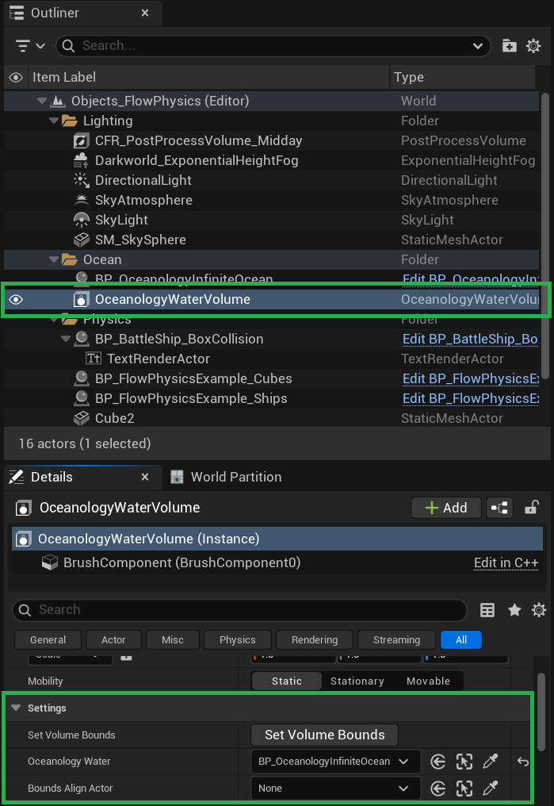
:::

:::note 3. Link the Water Volume to the correct water body
If your level contains multiple water bodies, you need to ensure each **Oceanology Water Volume** is linked to the correct one.

Click the **Oceanology Water** dropdown in the **Settings** category. A picker will appear showing all available water bodies in your level. Select the appropriate water body:
- Choose **OceanologyInfiniteOcean** for ocean buoyancy.
- Choose **BP_OceanologyLake** for lake buoyancy.

This linkage tells the buoyancy system which water surface to sample when calculating floating forces for actors inside this volume.

:::

:::note 4. Add pre-configured buoyant actors from the Prefabs folder
Oceanology Legacy includes ready-to-use buoyant actors that you can drag directly into your scene to test the buoyancy setup.

In the **Content Browser**, navigate to:
`Plugins > Oceanology Legacy > Design > Ocean > Prefabs > BattleShip`

Here you will find several pre-configured ship Blueprints:
- **BP_BattleShip_BoxCollision** — Uses simplified box collision for buoyancy. Best for performance.
- **BP_BattleShip_CustomCollision** — Uses custom collision shapes for more accurate floating behavior.
- **BP_BattleShip_Pawn** — A controllable ship pawn with buoyancy already configured.

Drag any of these prefabs into your scene within the Water Volume area. Press **Play** to see the ship float and react to the waves.

These prefabs are excellent starting points. Once you understand how buoyancy works, you can duplicate them or examine their **OceanBuoyancyComponent** settings to create your own buoyant actors.

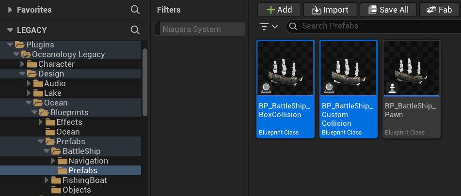
:::

---

## Additional Buoyant Prefabs

Oceanology Legacy includes several additional pre-configured buoyant actors beyond the BattleShip. These are useful for testing different buoyancy scenarios or as templates for your own creations.

:::note 5. Explore the Objects folder for simple test prefabs
In the **Content Browser**, navigate to:
`Plugins > Oceanology Legacy > Design > Ocean > Prefabs > Objects`

Here you will find simple geometric prefabs ideal for learning and testing:
- **BP_ComplexPrefabCube** — A cube with multiple pontoon points for more realistic rotation and wave response.
- **BP_SimplePrefabCube** — A basic cube with minimal buoyancy configuration. Perfect for understanding the fundamentals before moving to complex actors.

These prefabs are excellent for isolating buoyancy behavior without the complexity of a full ship model.

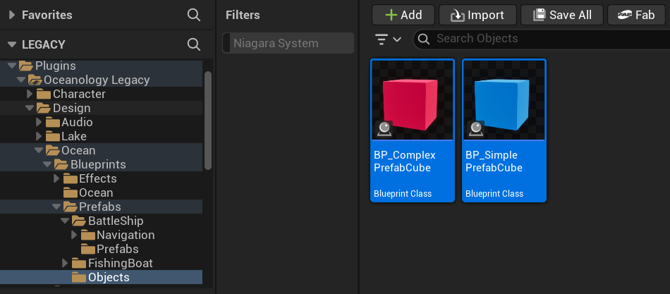
:::

:::note 6. Explore the FishingBoat folder for smaller vessel prefabs
Navigate to:
`Plugins > Oceanology Legacy > Design > Ocean > Prefabs > FishingBoat > Prefabs`

This folder contains smaller boat prefabs:
- **BP_FishingBoat_BoxCollision** — A fishing boat using simplified box collision for buoyancy calculations. Offers better performance.
- **BP_FishingBoat_CustomCollision** — A fishing boat with custom collision shapes that conform more closely to the hull geometry.

These smaller vessels behave differently than the large BattleShip due to their reduced mass and size. They are more responsive to waves and demonstrate how buoyancy parameters scale with vessel dimensions.

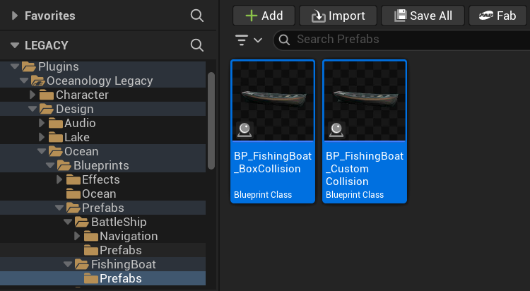
:::

---

## Adding the OceanBuoyancy Component to Custom Actors

To make any actor buoyant, you need to add the **OceanBuoyancy** component. This section explains how to add and configure it.

:::note 7. Add the OceanBuoyancy component to your Blueprint
Open your Blueprint actor in the **Blueprint Editor**. In the **Components** panel, click **+ Add** and search for `ocean`.

You will see several Oceanology components available:
- **Ocean Buoyancy** — The core buoyancy component. Add this to make your actor float.
- **Ocean Audio** — Adds water interaction sounds (splashes, underwater ambience).
- **Ocean Swimming** — Enables swimming behavior for characters.
- **Oceanology Empty Wave Solver** — A blank wave solver for custom implementations.
- **Oceanology Gerstner Wave Solver** — Samples Gerstner wave displacement.
- **Oceanology Heightmap** — Samples heightmap-based water surfaces.
- **Oceanology Infinite** — References the infinite ocean system.
- **Oceanology Underwater** — Handles underwater post-processing and effects.

Select **Ocean Buoyancy** to add it to your actor. The component will appear in your component hierarchy.

:::

:::note 8. Configure the OceanBuoyancy component settings
With the **OceanBuoyancy** component selected, locate the **Buoyancy** category in the **Details** panel. Here you will find all the parameters that control how your actor floats.

**Core Settings:**
- **Buoyancy Update Interval** — How often buoyancy is recalculated (0.0 = every frame).
- **Default Mesh Density** — The density of your mesh in kg/m³. Lower values make the actor float higher.
- **Water Fluid Density** — The density of water (default 1030.0 for seawater).
- **Water Fluid Linear Damping** — Reduces linear velocity when submerged.
- **Water Fluid Angular Damping** — Reduces rotational velocity when submerged.
- **Water Velocity Damper** — Additional velocity dampening per axis.
- **Max Underwater Velocity** — Caps the maximum speed when fully submerged.

**Pontoons Array:**
Pontoons are the sampling points where the component checks the water surface height. Each pontoon has:
- **Socket** — Optional socket name to attach the pontoon to a skeletal mesh bone.
- **Pontoon** — The local offset position (X, Y, Z) relative to the actor origin.
- **Radius** — The size of the pontoon sphere. Larger radius = smoother buoyancy response.
- **Density Override** — Override the default mesh density for this specific pontoon.
- **Mode** — Set to `Buoyancy` for standard floating behavior.

**Wave Interaction:**
- **Global Wave Force Multiplier** — Scales how much waves push the actor (default 2.0).
- **Global Wave Force Enabled** — Toggle wave forces on/off.

**Flow Settings:**
- **Angle Adjusted Force Strength** — How much the water flow direction affects the actor.
- **Orient Mesh Rotation Yaw Towards Flow Direction** — Automatically rotate the actor to face the current direction.

**Debug Options:**
- **Debug Enabled** — Visualize pontoon positions and buoyancy calculations at runtime.
- **Debug Sphere Color Pontoons** — Color for pontoon visualization spheres.
- **Debug Sphere Radius Multiplier** — Scale the debug sphere size.

:::

---

## Understanding the BattleShip Blueprint Structure

The **BP_BattleShip_BoxCollision** prefab demonstrates a well-organized buoyancy setup. Understanding its structure will help you create your own buoyant actors.

:::note 9. Examine the BattleShip component hierarchy
Open **BP_BattleShip_BoxCollision** in the Blueprint Editor. In the **Components** panel, you will see the following hierarchy:

- **Box Collision** _(root)_ — A Box Collision component that serves as the physics body. This is where physics simulation occurs.
  - **SKM_BattleShip** — Skeletal Mesh for animated parts (flags, rigging).
  - **SM_BattleShip** — The main ship hull Static Mesh.
  - **SM_BattleShip_Ropes** — Decorative rope details.
  - **SM_BattleShip_Rudder** — The ship's rudder.
- **OceanBuoyancy** — The buoyancy component (not parented to collision).

The key insight here is that the **Box Collision** component is the root and has **Simulate Physics** enabled. All visual meshes are children of this collision volume, so they move together as a single physics body.

:::

:::note 10. Configure the Box Collision component (Physics settings)
Select the **Box Collision** component. This is the physics body that drives the entire ship's movement.

**Shape Settings:**
- **Box Extent** — Defines the collision volume size. For the BattleShip: `2000.0 x 500.0 x 200.0` (length x width x height in Unreal units).

**Physics Settings (Critical):**
- **Simulate Physics** — ✅ **Enabled**. This is essential. Without this, the actor will not respond to buoyancy forces.
- **Mass (kg)** — `5000.0`. The total mass of the vessel. Heavier objects sit lower in the water and respond more slowly to waves.
- **Linear Damping** — `1.0`. Reduces linear velocity over time. Higher values make the ship stop moving faster.
- **Angular Damping** — `1.0`. Reduces rotational velocity. Higher values prevent excessive rocking.
- **Enable Gravity** — ✅ **Enabled**. Gravity pulls the ship down while buoyancy pushes it up, creating realistic floating behavior.

The balance between **Mass**, **Damping**, and the **OceanBuoyancy** pontoon settings determines how your vessel feels in the water.

:::

:::note 11. Configure the Box Collision component (Collision settings)
Still on the **Box Collision** component, scroll to the **Collision** category.

**Recommended Settings:**
- **Generate Overlap Events** — ✅ **Enabled**. Allows detection when other actors enter the ship's volume.
- **Can Character Step Up On** — `Yes`. Allows characters to walk on the ship deck.
- **Collision Presets** — `Custom...`
- **Collision Enabled** — `Collision Enabled (Query and Physics)`. Enables both physics collision and overlap queries.
- **Object Type** — `PhysicsBody`. Identifies this as a physics-simulated object.

**Collision Responses:**
- **WorldStatic** — `Block`. The ship collides with static world geometry.
- **WorldDynamic** — `Overlap`. Overlaps with dynamic objects (can be changed to Block if needed).
- **Pawn** — `Ignore`. Allows characters to stand on the ship without pushing it.
- **PhysicsBody** — `Block`. Collides with other physics objects.
- **Vehicle** — `Ignore`. Prevents interference with vehicle physics.
- **Destructible** — `Ignore`.

These settings ensure the ship interacts properly with the world while allowing characters to walk on its surface.

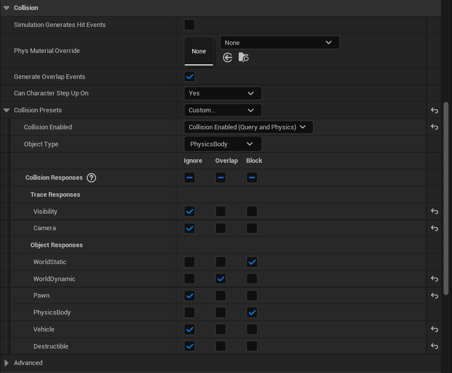
:::

---

## Configuring Child Mesh Components

The visual meshes inside the BattleShip have specific physics and collision settings. Understanding these configurations is crucial because child components must **not** simulate physics independently — only the root collision component should drive the physics simulation.

:::note 12. SM_BattleShip — Main hull mesh settings
Select **SM_BattleShip** in the component hierarchy. This is the main ship hull that players see.

:::

:::note 13. SM_BattleShip — Physics configuration
With **SM_BattleShip** selected, examine the **Physics** category:

- **Simulate Physics** — ❌ **Disabled**. This is critical. The hull mesh must not simulate physics independently. Physics simulation is handled by the parent Box Collision component.
- **Mass (kg)** — Greyed out (not applicable since physics is disabled).
- **Linear Damping** — `1.0`
- **Angular Damping** — `1.0`
- **Enable Gravity** — ✅ Enabled (inherited from parent).

The key principle is that all visual meshes should have **Simulate Physics disabled**. They follow the parent physics body automatically through the component hierarchy.

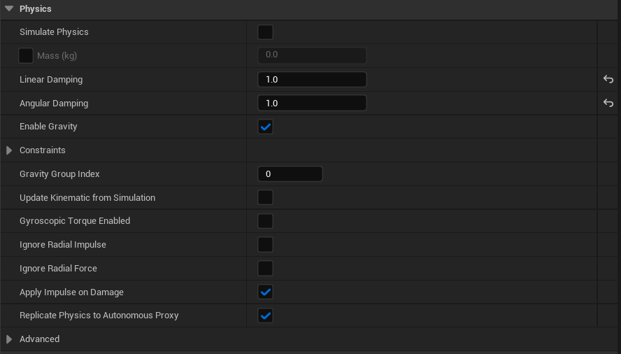
:::

:::note 14. SM_BattleShip — Collision configuration
Still on **SM_BattleShip**, examine the **Collision** category:

- **Generate Overlap Events** — ✅ **Enabled**. Allows detecting when objects overlap with the hull.
- **Can Character Step Up On** — `Yes`. Enables characters to walk on the deck.
- **Collision Presets** — `Custom...`
- **Collision Enabled** — `Collision Enabled (Query and Physics)`
- **Object Type** — `PhysicsBody`

**Collision Responses:**
- **Visibility** — `Ignore` (for trace responses)
- **Camera** — `Ignore`
- **WorldStatic** — `Block`
- **WorldDynamic** — `Overlap`
- **Pawn** — `Ignore`. This is important — it prevents the hull from pushing characters around, allowing them to stand on the ship naturally.
- **PhysicsBody** — `Block`
- **Vehicle** — `Ignore`
- **Destructible** — `Ignore`

The hull collision allows characters to walk on the deck while still blocking physics objects and world geometry.

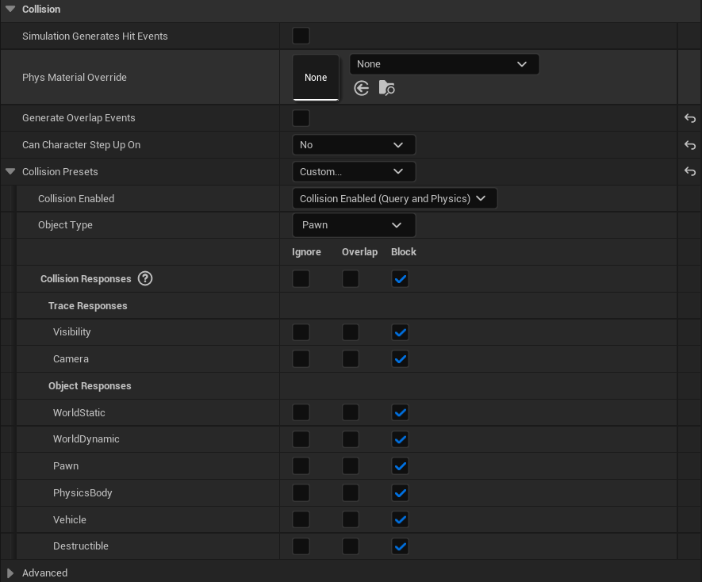
:::

:::note 15. SM_BattleShip_Ropes — Decorative mesh settings
Select **SM_BattleShip_Ropes** in the component hierarchy. This mesh contains the rope and rigging details on the ship.

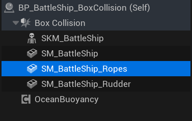
:::

:::note 16. SM_BattleShip_Ropes — Physics configuration
With **SM_BattleShip_Ropes** selected, examine the **Physics** category:

- **Simulate Physics** — ❌ **Disabled**. Decorative meshes should never simulate physics.
- **Linear Damping** — `0.01`
- **Angular Damping** — `0.0`
- **Enable Gravity** — ✅ Enabled

Notice the lower damping values compared to the main hull. Since this mesh doesn't simulate physics, these values have no practical effect, but they demonstrate that decorative elements can have minimal physics overhead.

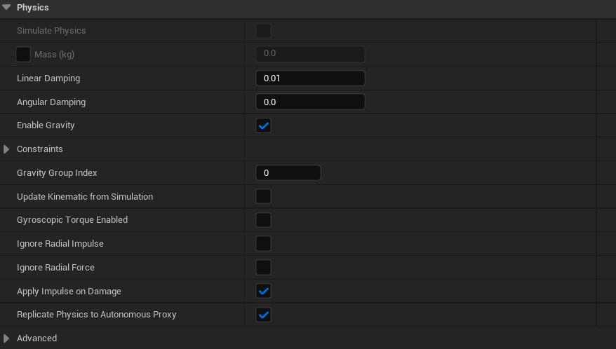
:::

:::note 17. SM_BattleShip_Ropes — Collision configuration
Still on **SM_BattleShip_Ropes**, examine the **Collision** category:

- **Collision Presets** — `NoCollision`
- **Collision Enabled** — `No Collision`
- **Object Type** — `WorldStatic`

**Collision Responses:**
All responses are set to **Ignore**.

Decorative meshes like ropes should have **no collision**. This improves performance and prevents unintended interactions. Players will walk through the ropes visually, but since they are thin decorative elements, this is acceptable and expected behavior.

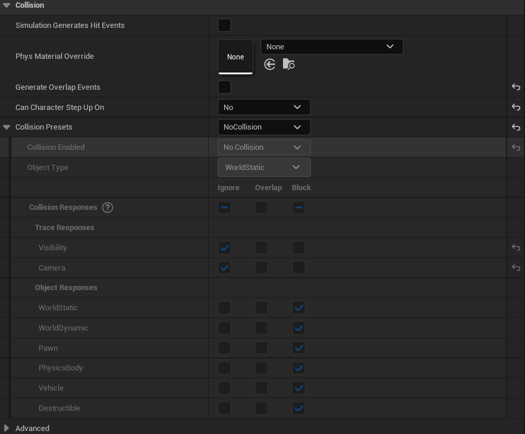
:::

:::note 18. SM_BattleShip_Rudder — Functional mesh settings
Select **SM_BattleShip_Rudder** in the component hierarchy. The rudder is typically animated or controlled for steering, but in this prefab it serves as a static visual element.

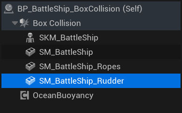
:::

:::note 19. SM_BattleShip_Rudder — Physics configuration
With **SM_BattleShip_Rudder** selected, examine the **Physics** category:

- **Simulate Physics** — ❌ **Disabled**. Like all child meshes, the rudder does not simulate physics independently.
- **Linear Damping** — `0.01`
- **Angular Damping** — `0.0`
- **Enable Gravity** — ✅ Enabled

These settings mirror the rope mesh — minimal damping since physics simulation is disabled.

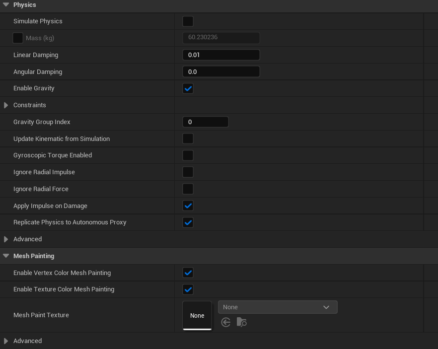
:::

:::note 20. SM_BattleShip_Rudder — Collision configuration
Still on **SM_BattleShip_Rudder**, examine the **Collision** category:

- **Collision Presets** — `NoCollision`
- **Collision Enabled** — `No Collision`
- **Object Type** — `WorldStatic`

**Collision Responses:**
All responses are set to **Ignore**.

The rudder has no collision enabled. For most gameplay scenarios, players will not interact directly with the rudder. If you need rudder collision (for example, for damage detection or physical interaction), you can change this to `BlockAll` or a custom preset.

:::

---

## BP_BattleShip_BoxCollision — Configuration Summary

The following table summarizes the physics and collision setup for each component in the BattleShip:

| Component | Simulate Physics | Collision Enabled | Purpose |
|-----------|------------------|-------------------|---------|
| **Box Collision** (root) | ✅ Yes | Query and Physics | Drives all physics simulation |
| **SM_BattleShip** | ❌ No | Query and Physics | Main hull with walkable surface |
| **SM_BattleShip_Ropes** | ❌ No | No Collision | Decorative only |
| **SM_BattleShip_Rudder** | ❌ No | No Collision | Visual element |
| **OceanBuoyancy** | — | — | Applies buoyancy forces to root |

**Key Principles:**
1. Only the **root component** should have **Simulate Physics** enabled.
2. Visual meshes are children of the physics body and move automatically.
3. Use **No Collision** for decorative elements to improve performance.
4. The **OceanBuoyancy** component applies forces to the root physics body.
5. Configure collision responses carefully to allow characters to walk on the vessel.

---

## BP_BattleShip_CustomCollision — Advanced Collision Setup

The **BP_BattleShip_CustomCollision** prefab demonstrates an alternative approach to buoyancy collision. Instead of using a simple Box Collision, this Blueprint uses a **custom collision mesh** that conforms to the hull shape. This allows for more accurate collision detection when characters interact with the ship, at the cost of slightly reduced performance.

**When to use Custom Collision:**
- When characters need to walk on detailed deck geometry
- When precise collision with the hull shape matters (docking, mooring)
- When visual accuracy is more important than raw performance

**When to use Box Collision instead:**
- For distant ships or AI-controlled vessels
- When performance is critical (many ships in scene)
- When characters do not interact directly with the ship

:::note 21. Examine the CustomCollision component hierarchy
Open **BP_BattleShip_CustomCollision** in the Blueprint Editor. Notice the different component structure compared to the BoxCollision variant:

- **CustomCollision** _(root)_ — A Static Mesh component using a custom collision mesh instead of a primitive shape.
  - **Skeletal Mesh Origin** — An empty scene component that serves as a transform reference for the skeletal mesh.
    - **SKM_BattleShip** — The skeletal mesh with animated elements.
  - **SM_BattleShip** — The main hull static mesh.
  - **SM_BattleShip_Ropes** — Decorative rope details.
  - **SM_BattleShip_Rudder** — The ship's rudder.
- **OceanBuoyancy** — The buoyancy component.

The key difference is that the root component is now a **Static Mesh** with a custom collision shape, rather than a primitive Box Collision.

:::

:::note 22. Configure the CustomCollision root component
Select the **CustomCollision** component. This Static Mesh serves as the physics body for the entire ship.

**Transform Settings:**
- **Scale** — `1.5, 1.5, 1.5`. The collision mesh is scaled uniformly. Adjust this to match your ship's visual scale.
- **Mobility** — `Movable`. Required for physics simulation.

**Static Mesh Settings:**
- **Static Mesh** — `SM_BattleShip_Collision_02`. This is a simplified mesh specifically designed for collision. It approximates the hull shape without the fine details of the visual mesh.

**Physics Settings:**
- **Simulate Physics** — ✅ **Enabled**. This is the physics body that drives the ship.
- **Mass (kg)** — `5000.0`. Same mass as the BoxCollision variant.
- **Linear Damping** — `1.0`
- **Angular Damping** — `1.0`
- **Enable Gravity** — ✅ **Enabled**

The custom collision mesh provides a better approximation of the hull shape than a box, resulting in more realistic collision behavior when the ship interacts with other objects or when characters walk on the deck.

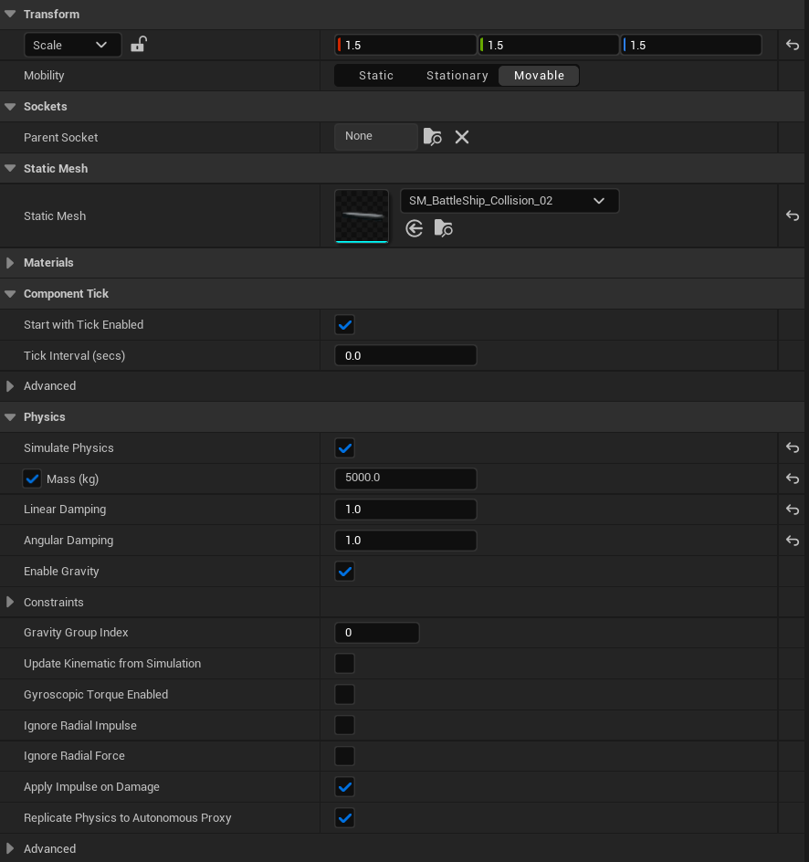
:::

:::note 23. SKM_BattleShip — Collision configuration
With **SKM_BattleShip** selected, examine the **Collision** category:

- **Generate Overlap Events** — ✅ **Enabled**
- **Can Character Step Up On** — `Yes`. Allows characters to walk on animated deck elements.
- **Collision Presets** — `Custom...`
- **Collision Enabled** — `Collision Enabled (Query and Physics)`
- **Object Type** — `PhysicsBody`

**Collision Responses:**
- **Visibility** — `Ignore`
- **Camera** — `Ignore`
- **WorldStatic** — `Block`
- **WorldDynamic** — `Overlap`
- **Pawn** — `Ignore`. Prevents pushing characters around.
- **PhysicsBody** — `Block`
- **Vehicle** — `Ignore`
- **Destructible** — `Ignore`

The Skeletal Mesh has collision enabled to allow characters to interact with animated deck elements. This is important for gameplay scenarios where players walk on moving ship parts like gangplanks or rotating cranes.

:::

:::note 24. Skeletal Mesh Origin — Collision configuration
Select **Skeletal Mesh Origin** in the hierarchy. This is an empty Scene Component used as a transform parent for the skeletal mesh.

**Collision Settings:**
- **Collision Presets** — `Custom...`
- **Collision Enabled** — `No Collision`
- **Object Type** — `Pawn`

**Collision Responses:**
All responses are set to **Ignore**.

Since this is just a transform reference node, it has no collision. The actual collision is handled by the root CustomCollision component and the child meshes.

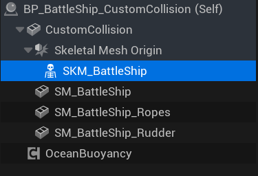
:::

:::note 25. Skeletal Mesh Origin — Physics configuration
Still on **Skeletal Mesh Origin**, examine the **Physics** category:

- **Simulate Physics** — ❌ **Disabled**
- **Linear Damping** — `0.01`
- **Angular Damping** — `0.0`
- **Enable Gravity** — ✅ Enabled

As a Scene Component, this node does not participate in physics simulation. It simply provides a transform hierarchy for organizing the skeletal mesh.

:::

:::note 26. SM_BattleShip_Rudder — Component selection
Select **SM_BattleShip_Rudder** in the component hierarchy. In the CustomCollision variant, the rudder configuration is similar to the BoxCollision version.

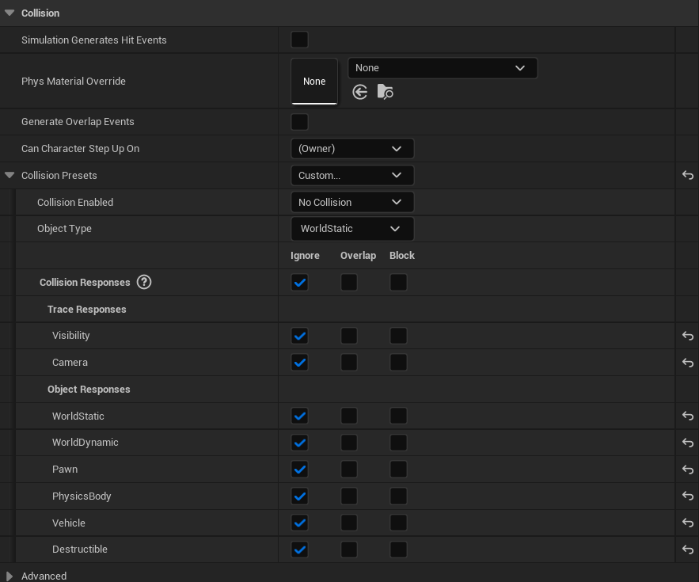
:::

:::note 27. SM_BattleShip_Rudder — Collision configuration
With **SM_BattleShip_Rudder** selected, examine the **Collision** category:

- **Collision Presets** — `Custom...`
- **Collision Enabled** — `No Collision`
- **Object Type** — `Pawn`

**Collision Responses:**
All responses are set to **Ignore**.

The rudder has no collision, identical to the BoxCollision variant. This is a visual-only element that does not interact with physics or characters.

:::

:::note 28. SM_BattleShip_Rudder — Physics configuration
Still on **SM_BattleShip_Rudder**, examine the **Physics** category:

- **Simulate Physics** — ❌ **Disabled**
- **Linear Damping** — `0.01`
- **Angular Damping** — `0.0`
- **Enable Gravity** — ✅ Enabled

The rudder does not simulate physics independently. It follows the parent component's transform automatically. These minimal damping values have no practical effect since physics simulation is disabled.

:::

:::note 29. SM_BattleShip_Ropes — Component selection
Select **SM_BattleShip_Ropes** in the component hierarchy. This mesh contains the decorative rope and rigging elements of the ship.

:::

:::note 30. SM_BattleShip_Ropes — Collision configuration
With **SM_BattleShip_Ropes** selected, examine the **Collision** category:

- **Collision Presets** — `Custom...`
- **Collision Enabled** — `Collision Enabled (Query and Physics)`
- **Object Type** — `Pawn`

**Collision Responses:**
All responses are set to **Block**.

Notice that in the CustomCollision variant, the ropes mesh has **collision enabled** with blocking responses. This differs from the BoxCollision variant where ropes had no collision. This configuration allows for more detailed interaction — characters and projectiles will collide with the rope geometry. However, this comes at a performance cost due to the complex rope mesh shape.

If you experience performance issues, consider changing this to `No Collision` as shown in the BoxCollision variant.

:::

:::note 31. SM_BattleShip_Ropes — Physics configuration
Still on **SM_BattleShip_Ropes**, examine the **Physics** category:

- **Simulate Physics** — ❌ **Disabled**
- **Linear Damping** — `0.01`
- **Angular Damping** — `0.0`
- **Enable Gravity** — ✅ Enabled

Like all child components, the ropes mesh does not simulate physics independently. It inherits movement from the root CustomCollision component through the hierarchy.

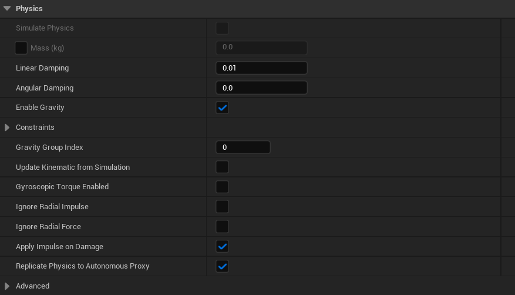
:::

:::note 32. SM_BattleShip — Component selection
Select **SM_BattleShip** in the component hierarchy. This is the main visual hull mesh that players see. In the CustomCollision variant, this mesh has different collision settings compared to the BoxCollision version.

:::

:::note 33. SM_BattleShip — Collision configuration
With **SM_BattleShip** selected, examine the **Collision** category:

- **Can Character Step Up On** — `(Owner)`. Inherits the setting from the parent component.
- **Collision Presets** — `Custom...`
- **Collision Enabled** — `No Collision`
- **Object Type** — `WorldStatic`

**Collision Responses:**
All responses are set to **Ignore**.

In the CustomCollision variant, the main hull mesh **SM_BattleShip** has **no collision**. This is because the collision is handled by the root **CustomCollision** component which uses the dedicated collision mesh `SM_BattleShip_Collision_02`. The visual hull mesh is purely for rendering and does not participate in physics interactions.

This separation of visual mesh and collision mesh is a common optimization technique — the collision mesh can be much simpler than the detailed visual mesh.

:::

:::note 34. SM_BattleShip — Physics configuration
Still on **SM_BattleShip**, examine the **Physics** category:

- **Simulate Physics** — ❌ **Disabled**
- **Linear Damping** — `0.01`
- **Angular Damping** — `0.0`
- **Enable Gravity** — ✅ Enabled
- **Physics Transform Update Mode** — `Simulation Updates Component Transform`

The visual hull does not simulate physics. The **Physics Transform Update Mode** setting ensures this mesh follows the physics simulation of the parent component correctly.

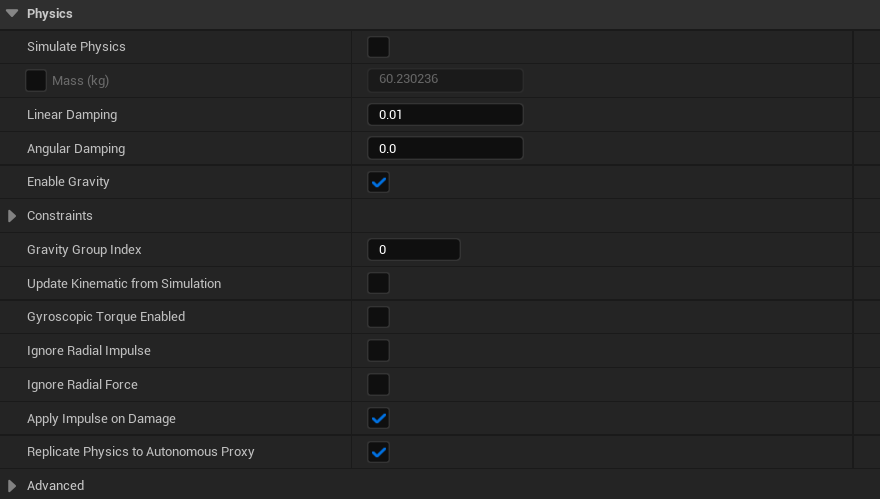
:::

:::note 35. SKM_BattleShip — Component selection
Select **SKM_BattleShip** in the component hierarchy. This is the Skeletal Mesh containing animated elements like flags, rigging, and other moving parts. It is nested under the **Skeletal Mesh Origin** transform node.

:::

:::note 36. Review the Pontoons configuration
Select the **OceanBuoyancy** component and expand the **Pontoons** array. This ship uses **5 pontoons** strategically placed to create stable floating behavior.

**Pontoon Positions (X, Y, Z):**
- **Index [0]** — `1300.0, 0.0, 0.0` (bow/front center)
- **Index [1]** — `800.0, 500.0, 0.0` (front starboard)
- **Index [2]** — `800.0, -500.0, 0.0` (front port)
- **Index [3]** — `-1500.0, 500.0, 200.0` (rear starboard, elevated)
- **Index [4]** — `-1500.0, -500.0, 200.0` (rear port, elevated)

All pontoons share these settings:
- **Radius** — `100.0`
- **Density Override** — `0.0` (uses default mesh density)
- **Mode** — `Buoyancy`

**Global Wave Force Multiplier** — `2.0`

The pontoon layout creates a stable platform: one pontoon at the bow provides forward stability, while four pontoons at mid-ship and stern prevent excessive rolling and pitching. The rear pontoons are elevated (Z = 200) to account for the stern geometry.

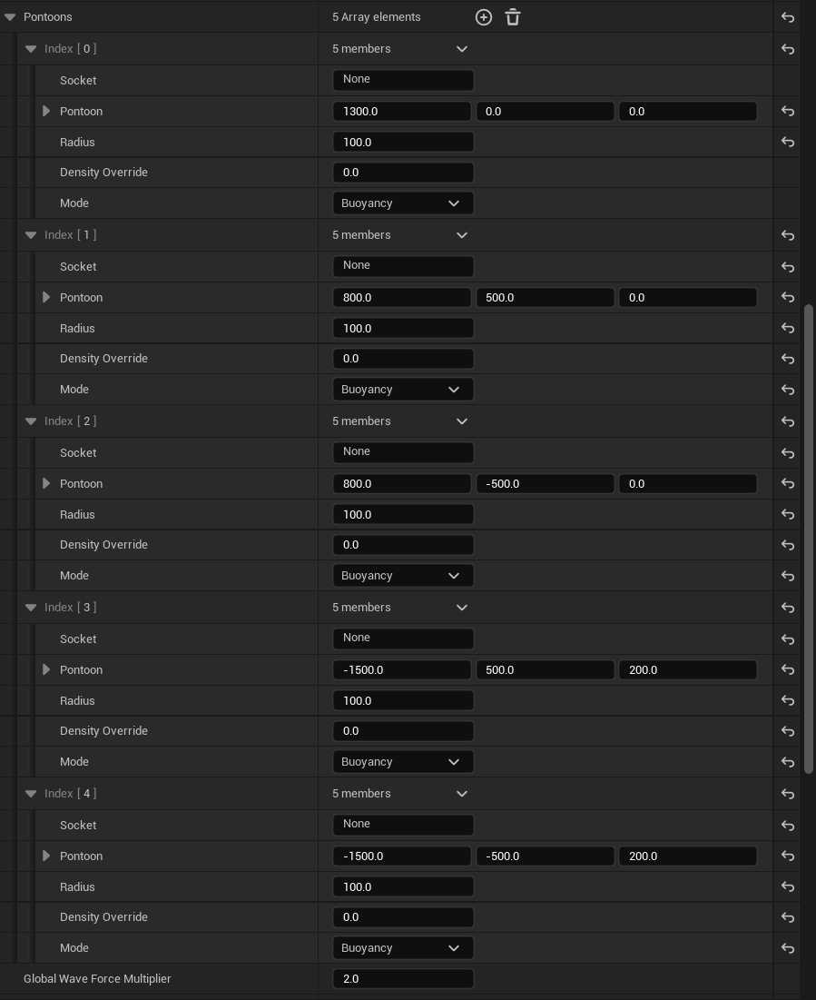
:::

---

## Comparison: BoxCollision vs CustomCollision

The following table summarizes the key differences between the two BattleShip variants:

| Aspect | BP_BattleShip_BoxCollision | BP_BattleShip_CustomCollision |
|--------|---------------------------|-------------------------------|
| **Root Component** | Box Collision (primitive) | Static Mesh with custom collision |
| **Collision Shape** | Simple box approximation | Hull-conforming mesh |
| **SM_BattleShip Collision** | Enabled (walkable surface) | Disabled (handled by root) |
| **SM_BattleShip_Ropes Collision** | No Collision | Collision Enabled (Block All) |
| **Performance** | ✅ Better | ⚠️ Slightly lower |
| **Collision Accuracy** | ⚠️ Approximate | ✅ Precise |
| **Character Interaction** | Basic deck walking | Detailed geometry interaction |

**Recommendations:**

- Use **BoxCollision** for:
  - Background ships or AI vessels
  - Scenes with many ships
  - Mobile or performance-critical projects
  - Ships where players don't need precise deck interaction

- Use **CustomCollision** for:
  - Hero ships (player-controlled vessels)
  - Cinematic sequences requiring accurate collision
  - Games where players explore ship interiors
  - Scenarios requiring precise docking or mooring

---

## Pontoon Placement Guidelines

When configuring pontoons for your own vessels, follow these general principles:

| Vessel Size | Recommended Pontoons | Placement Strategy |
|-------------|---------------------|-------------------|
| Small (boats, rafts) | 3-4 | Triangle or square pattern |
| Medium (fishing boats) | 4-5 | One bow, two mid, one-two stern |
| Large (ships, barges) | 5-8 | One bow, four corners, additional stern |
| Very Large (carriers) | 8+ | Grid pattern following hull shape |

**Pontoon Placement Tips:**
1. Always place at least one pontoon at the bow (front) for forward stability.
2. Use symmetric port/starboard placement to prevent listing (tilting to one side).
3. Elevate stern pontoons if the rear of the vessel sits higher in the water.
4. Increase **Radius** for smoother buoyancy response, decrease for more reactive behavior.
5. Adjust **Global Wave Force Multiplier** to control how much waves affect the vessel.
6. Use **Debug Enabled** to visualize pontoon positions during testing.

---

## Troubleshooting Common Issues

| Problem | Likely Cause | Solution |
|---------|--------------|----------|
| Ship sinks immediately | Simulate Physics disabled on root | Enable Simulate Physics on root component |
| Ship flies into the sky | Mass too low or buoyancy too high | Increase Mass or reduce Default Mesh Density |
| Ship rocks excessively | Damping too low or pontoons too small | Increase Angular Damping or Pontoon Radius |
| Ship doesn't respond to waves | Global Wave Force disabled | Enable Global Wave Force and adjust multiplier |
| Characters fall through deck | Collision disabled on walkable mesh | Enable collision on SM_BattleShip or SKM_BattleShip |
| Ship collides with itself | Child meshes have conflicting collision | Set decorative meshes to No Collision |
| Performance issues | Complex collision on many meshes | Use BoxCollision variant or simplify collision |

---

## Summary

In this guide, you learned how to:

1. **Set up the scene** — Add Oceanology Manager, Water Volume, and water bodies to your level.
2. **Configure Water Volumes** — Link each volume to the correct water body for buoyancy calculations.
3. **Use pre-built prefabs** — Test buoyancy with the included BattleShip, FishingBoat, and simple cube prefabs.
4. **Add the OceanBuoyancy component** — Make any actor buoyant by adding and configuring this component.
5. **Understand the BattleShip structure** — Learn how physics, collision, and component hierarchies work together.
6. **Choose between BoxCollision and CustomCollision** — Select the right approach based on your performance and accuracy needs.
7. **Configure pontoons** — Place and tune pontoons for stable, realistic floating behavior.

With this knowledge, you can now create your own buoyant actors and customize their behavior to match your project's requirements.
