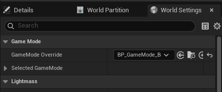
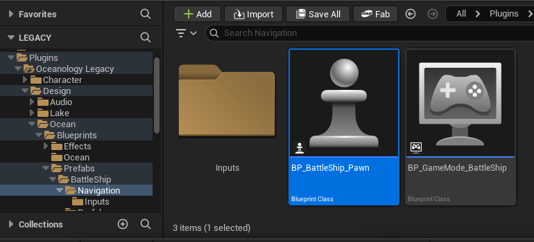
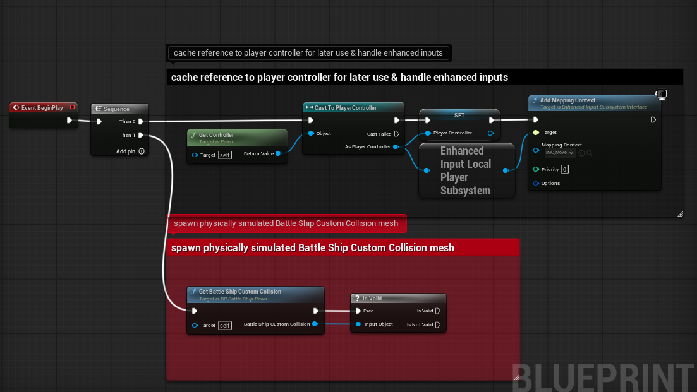
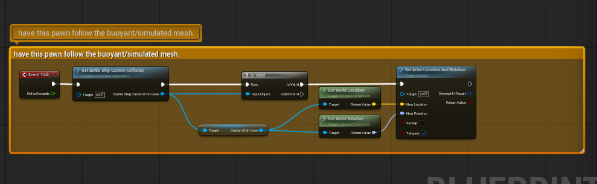
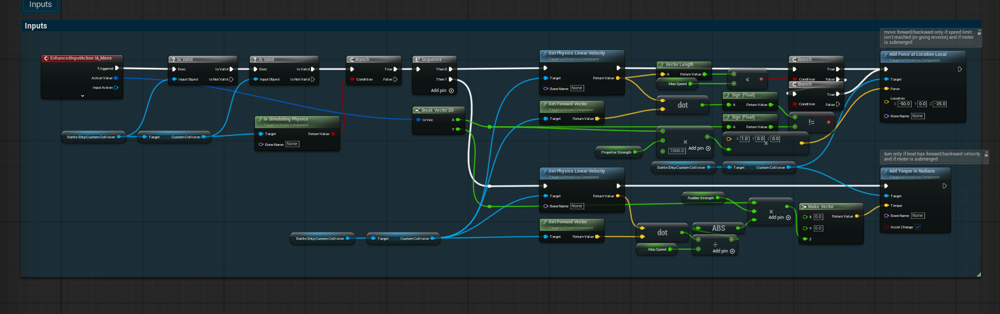
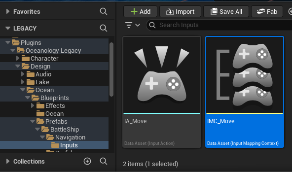
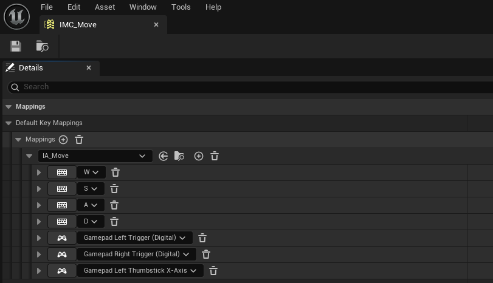
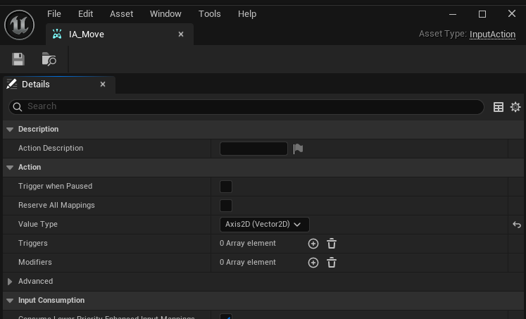

# Oceanology Legacy - Navigation

🚢 Vessel Control

🎮 Input System

🤖 AI Ready

Control buoyant vessels with keyboard, mouse, or gamepad using the Pawn-based navigation system.

---

## Prerequisites

| Requirement | Details |
|-------------|---------|
| **Engine** | UE5.x (latest release) |
| **Plugin** | Oceanology Legacy installed and configured |
| **Scene** | Water body with buoyancy setup |
| **Skills** | Basic familiarity with Pawns and Enhanced Input |

:::info About Navigation
The navigation system uses a **Pawn-based architecture** where players control a lightweight Pawn following a physics-simulated buoyant mesh. This separation keeps input handling clean while allowing realistic wave-based movement.
:::

---

## Step-by-step

:::note 1. Locate the Navigation assets in the Content Browser
Open the **Content Browser** and navigate to:
`Plugins > Oceanology Legacy > Design > Ocean > Prefabs > BattleShip > Navigation`

This folder contains all the navigation-related assets:
- **Inputs** - A subfolder containing the Enhanced Input assets (Input Actions and Input Mapping Contexts).
- **BP_BattleShip_Pawn** - The player-controllable Pawn Blueprint that handles input and follows the buoyant ship mesh.
- **BP_GameMode_BattleShip** - A Game Mode Blueprint pre-configured to spawn the BattleShip Pawn as the default player character.

These assets work together to provide a complete ship navigation system out of the box.

:::

:::note 2. Configure your level to use the BattleShip Game Mode
To enable ship navigation in your level, you need to override the default Game Mode.

Open **World Settings** (Window > World Settings or click the Settings button in the toolbar and select World Settings). In the **Game Mode** section, locate the **GameMode Override** dropdown.

Click the dropdown and select **BP_GameMode_BattleShip**. This tells Unreal Engine to use the BattleShip navigation system when playing this level.

:::

:::note 3. Examine the Game Mode configuration
To understand how the Game Mode is configured, open **BP_GameMode_BattleShip** in the Blueprint Editor. Since this is a data-only Blueprint, click **Class Defaults** in the toolbar to view its settings.

**Key Settings:**

| Property | Value | Purpose |
|----------|-------|---------|
| **Default Pawn Class** | `BP_BattleShip_Pawn` | The Pawn spawned for each player |
| **Player Controller Class** | `PlayerController` | Standard player controller |
| **HUD Class** | `HUD` | Default HUD (customize as needed) |
| **Game Session Class** | `GameSession` | Standard session handling |
| **Game State Class** | `GameStateBase` | Standard game state |
| **Player State Class** | `PlayerState` | Standard player state |

The most important setting is **Default Pawn Class**. This determines what actor the player controls when the game starts. By setting it to `BP_BattleShip_Pawn`, players will automatically possess the ship navigation Pawn.

:::

---

## Understanding the BattleShip Pawn

The **BP_BattleShip_Pawn** is the core of the navigation system. It handles player input and synchronizes with a physics-simulated buoyant ship mesh.

:::note 4. Locate the BattleShip Pawn Blueprint
In the **Content Browser**, navigate to the Navigation folder and select **BP_BattleShip_Pawn**. This Blueprint Class contains all the logic for ship navigation.

Double-click to open it in the Blueprint Editor to examine its structure and logic.

:::

:::note 5. Examine the Event BeginPlay logic
Open the **Event Graph** of BP_BattleShip_Pawn. The **Event BeginPlay** node initializes the navigation system with two main tasks:

**Section 1: Cache reference to player controller for later use & handle enhanced inputs**
This section:
1. Gets the Player Controller using `Get Controller` and casts it to `PlayerController`.
2. Stores the reference in a `Player Controller` variable for later use.
3. Accesses the **Enhanced Input Local Player Subsystem** to register input mappings.
4. Calls `Add Mapping Context` to activate the `IMC_Move` Input Mapping Context with Priority 0.

**Section 2: Spawn physically simulated Battle Ship Custom Collision mesh**
This section:
1. Calls `Get Battle Ship Custom Collision` to retrieve a reference to the buoyant ship mesh.
2. Uses `Is Valid` to verify the reference exists before proceeding.

The separation of Pawn and buoyant mesh is intentional - the Pawn handles input while the physics-simulated mesh handles realistic water interaction.

:::

:::note 6. Examine the Event Tick logic
The **Event Tick** section keeps the Pawn synchronized with the buoyant ship mesh every frame.

**Section: Have this pawn follow the buoyant/simulated mesh**
This logic:
1. Gets the `Battle Ship Custom Collision` reference.
2. Validates it with `Is Valid`.
3. Retrieves the world location and rotation of the `Custom Collision` component.
4. Calls `Set Actor Location And Rotation` on the Pawn (self) with:
   - **New Location** - The buoyant mesh's world location.
   - **New Rotation** - The buoyant mesh's world rotation.
   - **Sweep** - Disabled (direct teleport).
   - **Teleport** - Enabled (no physics interpolation).

This approach ensures the player's viewpoint follows the ship's movement while the physics simulation runs independently on the buoyant mesh.

:::

---

## Input Handling

The navigation system uses Unreal Engine's **Enhanced Input System** for flexible, rebindable controls.

:::note 7. Examine the movement input logic
The input handling section processes the **IA_Move** Input Action to control ship movement.

**EnhancedInputAction IA_Move** triggers when the player provides movement input. The logic flow:

1. **Validation Chain** - Multiple `Is Valid` checks ensure all required references exist (Battle Ship Custom Collision, physics simulation state).

2. **Is Simulating Physics** - Verifies the buoyant mesh is actively simulating physics before applying forces.

3. **Propulsion System:**
   - `Get Physics Linear Velocity` retrieves current ship speed.
   - `Vector Length` calculates the speed magnitude.
   - Compares against `Max Speed` to enforce speed limits.
   - `Get Forward Vector` determines the ship's forward direction.
   - `Add Force at Location Local` applies thrust force based on `Propeller Strength` (default: 1000.0).
   - Force is applied only when below max speed and with valid forward/backward input.

4. **Rudder System:**
   - `Get Physics Linear Velocity` checks if the ship is moving (rudder only works when in motion).
   - `Get Forward Vector` and `dot` product determine movement direction.
   - `Add Torque in Radians` applies rotational force based on `Rudder Strength`.
   - Torque is scaled by the horizontal input axis (A/D keys or left thumbstick).

The comments in the Blueprint explain key conditions: "move forward/backward only if speed limit isn't reached (or going reverse) and if motor is submerged" and "turn only if boat has forward/backward velocity and if motor is submerged."

:::

---

## Enhanced Input Assets

The Input Actions and Input Mapping Contexts define how player input translates to ship movement.

:::note 8. Locate the Input assets
In the **Content Browser**, navigate to:
`Plugins > Oceanology Legacy > Design > Ocean > Prefabs > BattleShip > Navigation > Inputs`

This folder contains:
- **IA_Move** - An Input Action that captures 2D movement input (forward/backward and left/right).
- **IMC_Move** - An Input Mapping Context that binds keyboard keys and gamepad controls to the IA_Move action.

:::

:::note 9. Examine the Input Mapping Context (IMC_Move)
Open **IMC_Move** to see the default key bindings. In the **Mappings** section, you will find:

**Keyboard Mappings:**

| Key | Function |
|-----|----------|
| **W** | Forward (positive Y axis) |
| **S** | Backward (negative Y axis) |
| **A** | Turn Left (negative X axis) |
| **D** | Turn Right (positive X axis) |

**Gamepad Mappings:**

| Input | Function |
|-------|----------|
| **Left Trigger (Digital)** | Backward |
| **Right Trigger (Digital)** | Forward |
| **Left Thumbstick X-Axis** | Turn Left/Right |

You can add or modify mappings to support additional input devices or customize the control scheme for your game.

:::

:::note 10. Examine the Input Action (IA_Move)
Open **IA_Move** to see its configuration:

**Key Settings:**

| Property | Value | Purpose |
|----------|-------|---------|
| **Value Type** | `Axis2D (Vector2D)` | Captures both horizontal (X) and vertical (Y) input simultaneously |
| **Triggers** | `0 Array element` | No special triggers (fires continuously while held) |
| **Modifiers** | `0 Array element` | No input modifiers applied |
| **Trigger when Paused** | Disabled | Input ignored when game is paused |
| **Reserve All Mappings** | Disabled | Allows input to propagate to other actions |

The **Axis2D** value type is essential for ship navigation because it captures both forward/backward (Y axis) and turning (X axis) input as a single Vector2D value. This allows the Blueprint to process both movement dimensions in one Input Action event.

:::

---

## Relationship with Buoyancy Prefabs

The navigation system is designed to work with the BattleShip buoyancy prefabs. Understanding this relationship helps when creating custom vessels.

:::note 11. Review the BattleShip prefab variants
In the **Content Browser**, navigate to:
`Plugins > Oceanology Legacy > Design > Ocean > Prefabs > BattleShip > Prefabs`

Here you will find three BattleShip variants:

| Prefab | Purpose | Navigation Compatible |
|--------|---------|----------------------|
| **BP_BattleShip_BoxCollision** | Simple box collision for buoyancy | ⚠️ Requires modification |
| **BP_BattleShip_CustomCollision** | Hull-conforming collision mesh | ✅ Yes (referenced by Pawn) |
| **BP_BattleShip_Pawn** | Player-controlled navigation Pawn | ✅ Yes (this is the controller) |

The **BP_BattleShip_Pawn** references and follows the **BP_BattleShip_CustomCollision** prefab. When the game starts, the Pawn spawns and locates the CustomCollision ship in the level to synchronize with its physics simulation.

**Important:** For navigation to work, you must have a **BP_BattleShip_CustomCollision** actor placed in your level. The Pawn will automatically find and follow it.

:::

---

## Configuration Summary

The following table summarizes the key components of the navigation system:

| Component | Location | Purpose |
|-----------|----------|---------|
| **BP_GameMode_BattleShip** | Navigation folder | Sets BP_BattleShip_Pawn as Default Pawn Class |
| **BP_BattleShip_Pawn** | Navigation folder | Handles input and follows buoyant mesh |
| **IMC_Move** | Navigation > Inputs | Maps keys/buttons to IA_Move action |
| **IA_Move** | Navigation > Inputs | Captures 2D movement input (Axis2D) |
| **BP_BattleShip_CustomCollision** | Prefabs folder | Physics-simulated buoyant ship mesh |

**Key Principles:**
1. The **Game Mode** determines which Pawn class players control.
2. The **Pawn** handles input but does not simulate physics directly.
3. The **buoyant mesh** (CustomCollision) handles all physics simulation.
4. The Pawn **follows** the buoyant mesh every tick, keeping input and physics separated.
5. **Enhanced Input** provides flexible, rebindable controls for keyboard and gamepad.

---

## Navigation Parameters

The BP_BattleShip_Pawn exposes several parameters for tuning ship handling:

| Parameter | Default Value | Description |
|-----------|---------------|-------------|
| **Propeller Strength** | `1000.0` | Force applied when accelerating forward/backward |
| **Rudder Strength** | Variable | Torque applied when turning left/right |
| **Max Speed** | Variable | Maximum linear velocity before thrust is disabled |

**Tuning Tips:**
1. **Increase Propeller Strength** for faster acceleration (larger ships may need higher values).
2. **Increase Rudder Strength** for tighter turns (be careful not to make it feel unrealistic).
3. **Adjust Max Speed** to balance gameplay feel with realism.
4. These values interact with the **Mass** and **Damping** settings on the buoyant mesh - tune them together for best results.

---

## Troubleshooting Common Issues

| Problem | Likely Cause | Solution |
|---------|--------------|----------|
| Ship doesn't move at all | Game Mode not set | Set GameMode Override to BP_GameMode_BattleShip in World Settings |
| Ship doesn't respond to input | Input Mapping Context not added | Verify Add Mapping Context is called in BeginPlay |
| Pawn spawns but doesn't follow ship | CustomCollision ship not in level | Place BP_BattleShip_CustomCollision in your level |
| Ship moves but camera doesn't follow | Camera not attached to Pawn | Add a Camera component to BP_BattleShip_Pawn |
| Controls feel sluggish | Damping too high on buoyant mesh | Reduce Linear/Angular Damping on the CustomCollision component |
| Ship spins uncontrollably | Rudder Strength too high | Reduce Rudder Strength or increase Angular Damping |
| Ship accelerates infinitely | Max Speed not enforced | Verify the speed check logic in the movement Blueprint |
| Gamepad not working | Missing gamepad mappings | Add gamepad bindings to IMC_Move |

---

## Summary

In this guide, you learned how to:

1. **Locate the Navigation assets** - Find the Game Mode, Pawn, and Input assets in the BattleShip > Navigation folder.
2. **Configure the Game Mode** - Set the GameMode Override in World Settings to enable ship navigation.
3. **Understand the Pawn architecture** - Learn how the Pawn follows a physics-simulated buoyant mesh for realistic wave response.
4. **Examine the input logic** - Understand how Enhanced Input drives propulsion and rudder controls.
5. **Configure Input Mappings** - Review and customize keyboard and gamepad bindings in IMC_Move.
6. **Understand the Input Action** - Learn why Axis2D is used for combined movement input.
7. **Connect Navigation with Buoyancy** - Understand the relationship between the Pawn and the CustomCollision buoyant mesh.

With this knowledge, you can customize the navigation system for your own vessels or create entirely new player-controlled boats and ships.
