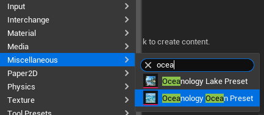
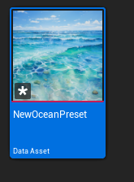
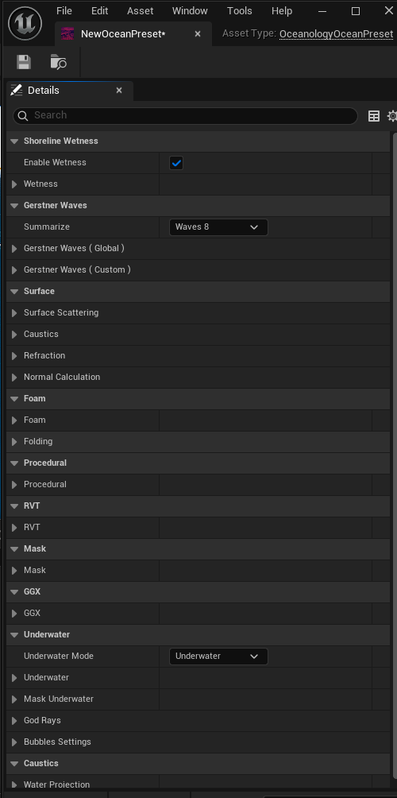
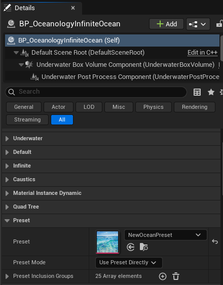
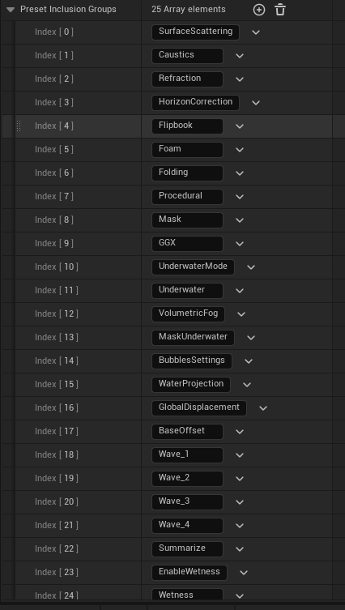

# Oceanology Legacy — Presets

_Last updated: 2025-12-06_

## Overview

**Presets** in Oceanology Legacy allow you to save and reuse complete ocean configurations. A preset stores all visual and behavioral settings for your ocean — including wave parameters, surface properties, foam, caustics, underwater effects, and more — in a reusable Data Asset.

This system enables you to:
- **Save ocean configurations** — Capture your perfect ocean look as a reusable asset
- **Share between projects** — Export presets and import them into other projects
- **Quick iteration** — Switch between different ocean styles instantly
- **Team collaboration** — Artists can create presets for developers to use
- **Multiple water types** — Create presets for different environments (tropical, arctic, stormy, calm)

## How Presets Work

1. **Create a Preset Asset** — Use the Content Browser to create a new Oceanology Preset Data Asset.
2. **Configure the Preset** — Open the asset and adjust all ocean parameters.
3. **Assign to Ocean** — Reference the preset in your ocean actor.
4. **Select Inclusion Groups** — Choose which parameter groups the preset should control.

Presets are **Data Assets**, meaning they exist as standalone files in your project that can be duplicated, shared, and version-controlled.

---

## Prerequisites

- Unreal Engine 5.6 or newer.
- **Oceanology Legacy** installed and configured.
- A **BP_OceanologyInfiniteOcean** or **BP_OceanologyLake** actor in your level.

## Notes

- Oceanology provides two preset types: **Ocean Preset** (for infinite oceans) and **Lake Preset** (for bounded lakes).
- Presets use an **Inclusion Groups** system that lets you selectively apply only certain parameter categories.
- Changes to a preset asset automatically update all ocean actors using that preset.
- You can override individual parameters on the ocean actor even when using a preset.

---

## Step-by-step

:::note 1. Create a new Preset asset
In the **Content Browser**, right-click to open the context menu. Navigate to:
**Miscellaneous** → Search for `ocea` to filter the options.

You will see two preset types:
- **Oceanology Lake Preset** — For bounded lake water bodies (BP_OceanologyLake).
- **Oceanology Ocean Preset** — For infinite ocean water bodies (BP_OceanologyInfiniteOcean).

Select **Oceanology Ocean Preset** to create a new ocean preset asset.


:::

:::note 2. Name and locate your Preset asset
After creating the preset, a new **Data Asset** appears in your Content Browser. 

**Asset Properties:**
- **Name** — Give it a descriptive name like `NewOceanPreset`, `TropicalOcean`, `StormyNorthSea`, etc.
- **Type** — `Data Asset` (specifically an OceanologyOceanPreset)
- **Thumbnail** — Shows a preview of ocean water to help identify the asset.

**Organization Tips:**
- Create a dedicated folder for presets (e.g., `Content/Ocean/Presets/`)
- Use descriptive names that indicate the ocean style
- Consider prefixing with `OP_` (Ocean Preset) for easy searching

Double-click the asset to open it and configure its parameters.


:::

:::note 3. Configure the Preset parameters
Open the preset asset to access all configurable ocean parameters. The **Details** panel shows all available categories:

**Shoreline Wetness:**
| Property | Description |
|----------|-------------|
| **Enable Wetness** | ✅ Toggles shoreline wetness effect |
| **Wetness** | Wetness intensity and parameters |

**Gerstner Waves:**
| Property | Description |
|----------|-------------|
| **Summarize** | Wave complexity preset (e.g., `Waves 8`) |
| **Gerstner Waves (Global)** | Global wave parameters affecting all waves |
| **Gerstner Waves (Custom)** | Individual wave layer configurations |

**Surface:**
| Property | Description |
|----------|-------------|
| **Surface Scattering** | Light scattering through water surface |
| **Caustics** | Underwater light caustic patterns |
| **Refraction** | Water refraction settings |
| **Normal Calculation** | Surface normal generation method |

**Foam:**
| Property | Description |
|----------|-------------|
| **Foam** | Main foam parameters (color, intensity, coverage) |
| **Folding** | Wave folding foam settings |

**Procedural:**
| Property | Description |
|----------|-------------|
| **Procedural** | Procedural detail noise and variation |

**RVT:**
| Property | Description |
|----------|-------------|
| **RVT** | Runtime Virtual Texture heightmap settings |

**Mask:**
| Property | Description |
|----------|-------------|
| **Mask** | Water masking parameters |

**GGX:**
| Property | Description |
|----------|-------------|
| **GGX** | GGX specular reflection model settings |

**Underwater:**
| Property | Description |
|----------|-------------|
| **Underwater Mode** | Underwater rendering mode (e.g., `Underwater`) |
| **Underwater** | Underwater fog and color settings |
| **Mask Underwater** | Underwater masking parameters |
| **God Rays** | Volumetric light shafts underwater |
| **Bubbles Settings** | Underwater bubble particle configuration |

**Caustics:**
| Property | Description |
|----------|-------------|
| **Water Projection** | Caustic projection settings |

Each category can be expanded to reveal detailed parameters. Configure these to create your desired ocean appearance.


:::

:::note 4. Assign the Preset to your Ocean actor
Select **BP_OceanologyInfiniteOcean** in the **Outliner**. In the **Details** panel, locate the **Preset** category:

**Actor Hierarchy:**
- BP_OceanologyInfiniteOcean (Self)
  - Default Scene Root
  - Underwater Box Volume Component
  - Underwater Post Process Component

**Available Categories on Ocean Actor:**
- Underwater
- Default
- Infinite
- Caustics
- Material Instance Dynamic
- Quad Tree
- **Preset** ← Configure here

**Preset Settings:**
| Property | Value | Explanation |
|----------|-------|-------------|
| **Preset** | `NewOceanPreset` | Select your preset asset from the dropdown. The thumbnail preview helps identify the correct preset. |
| **Preset Mode** | `Use Preset Directly` | How the preset is applied. Options include direct use or blending. |
| **Preset Inclusion Groups** | `25 Array elements` | Which parameter groups from the preset should be applied. See Note 5 for details. |

**Preset Mode Options:**
- **Use Preset Directly** — Applies all selected inclusion groups from the preset immediately.
- **Blend With Current** — Interpolates between current ocean settings and preset values.

Once assigned, the ocean actor will use the parameters defined in your preset.


:::

:::note 5. Configure Preset Inclusion Groups
The **Preset Inclusion Groups** array controls which parameter categories the preset affects. Expand this array to see all 25 available groups:

| Index | Group Name | Controls |
|-------|------------|----------|
| [0] | **SurfaceScattering** | Light scattering through water surface |
| [1] | **Caustics** | Caustic light patterns |
| [2] | **Refraction** | Water refraction effects |
| [3] | **HorizonCorrection** | Horizon line adjustment |
| [4] | **Flipbook** | Animated texture flipbooks |
| [5] | **Foam** | Foam color, intensity, coverage |
| [6] | **Folding** | Wave folding foam |
| [7] | **Procedural** | Procedural noise and detail |
| [8] | **Mask** | Water masking |
| [9] | **GGX** | GGX specular reflections |
| [10] | **UnderwaterMode** | Underwater rendering mode |
| [11] | **Underwater** | Underwater fog and color |
| [12] | **VolumetricFog** | Volumetric fog settings |
| [13] | **MaskUnderwater** | Underwater masking |
| [14] | **BubblesSettings** | Bubble particles |
| [15] | **WaterProjection** | Water projection settings |
| [16] | **GlobalDisplacement** | Global wave displacement |
| [17] | **BaseOffset** | Base height offset |
| [18] | **Wave_1** | First wave layer parameters |
| [19] | **Wave_2** | Second wave layer parameters |
| [20] | **Wave_3** | Third wave layer parameters |
| [21] | **Wave_4** | Fourth wave layer parameters |
| [22] | **Summarize** | Wave summary/complexity |
| [23] | **EnableWetness** | Wetness toggle |
| [24] | **Wetness** | Wetness parameters |

**How Inclusion Groups Work:**

- **Included** — Parameters from this group are loaded from the preset.
- **Excluded** — Parameters from this group use the ocean actor's own values (allowing manual override).

**Use Cases:**

| Scenario | Include | Exclude |
|----------|---------|---------|
| Full preset application | All groups | None |
| Custom waves with preset look | Surface, Foam, Underwater | Wave_1-4, GlobalDisplacement |
| Preset waves with custom foam | Wave_1-4, Summarize | Foam, Folding |
| Only underwater from preset | Underwater, UnderwaterMode | Everything else |

This system provides granular control over which aspects of the preset are applied, enabling powerful customization workflows.


:::

---

## Creating Custom Presets — Workflow

### Starting from Scratch

1. Create a new **Oceanology Ocean Preset** asset.
2. Open the asset and configure all parameters manually.
3. Save the asset.
4. Assign to your ocean actor.

### Starting from Existing Ocean

1. Configure your ocean actor to look exactly how you want.
2. Create a new **Oceanology Ocean Preset** asset.
3. Copy values from the ocean actor to the preset.
4. Save the preset for reuse.

### Duplicating Presets

1. Right-click an existing preset in Content Browser.
2. Select **Duplicate**.
3. Rename the new preset.
4. Modify parameters as needed.

---

## Preset Organization Best Practices

### Naming Convention

```
[Type]_[Environment]_[Variation]

Examples:
OP_Tropical_Calm
OP_Tropical_Stormy
OP_Arctic_Frozen
OP_Mediterranean_Clear
OP_DeepOcean_Dark
LP_MountainLake_Clear    (LP = Lake Preset)
LP_Swamp_Murky
```

### Folder Structure

```
Content/
└── Ocean/
    └── Presets/
        ├── Tropical/
        │   ├── OP_Tropical_Calm
        │   ├── OP_Tropical_Stormy
        │   └── OP_Tropical_Sunset
        ├── Arctic/
        │   ├── OP_Arctic_Calm
        │   └── OP_Arctic_Frozen
        └── Lakes/
            ├── LP_MountainLake_Clear
            └── LP_Swamp_Murky
```

---

## Troubleshooting Common Issues

| Problem | Likely Cause | Solution |
|---------|--------------|----------|
| Preset not applying | Preset not assigned | Select preset in ocean actor's Preset property |
| Only some settings apply | Inclusion groups filtered | Check Preset Inclusion Groups array |
| Changes to preset not visible | Asset not saved | Save the preset asset after editing |
| Ocean looks different than preset preview | Lighting/environment difference | Preset only controls water, not scene lighting |
| Can't find preset in dropdown | Wrong preset type | Use Ocean Preset for ocean, Lake Preset for lake |
| Preset overriding manual tweaks | Inclusion group enabled | Remove the group from Inclusion Groups array |

---

## Summary

In this guide, you learned how to:

1. **Create a Preset asset** — Use Miscellaneous menu to create Ocean or Lake presets.
2. **Configure preset parameters** — Set all ocean visual properties in the preset asset.
3. **Assign presets to ocean actors** — Reference presets in the Preset category.
4. **Use Preset Inclusion Groups** — Selectively apply only certain parameter categories.
5. **Organize presets** — Follow naming conventions and folder structures for maintainability.

Presets are powerful tools for managing ocean configurations across your project. They enable rapid iteration, easy sharing, and consistent water appearance throughout your game.

---

## Quick Reference

### Preset Types

| Type | Use For | Actor |
|------|---------|-------|
| Oceanology Ocean Preset | Infinite oceans | BP_OceanologyInfiniteOcean |
| Oceanology Lake Preset | Bounded lakes | BP_OceanologyLake |

### Inclusion Groups Summary

| Category | Groups |
|----------|--------|
| **Waves** | Wave_1, Wave_2, Wave_3, Wave_4, Summarize, GlobalDisplacement, BaseOffset |
| **Surface** | SurfaceScattering, Refraction, HorizonCorrection, GGX |
| **Foam** | Foam, Folding |
| **Underwater** | Underwater, UnderwaterMode, MaskUnderwater, VolumetricFog, BubblesSettings |
| **Effects** | Caustics, WaterProjection, Flipbook, Procedural, Mask |
| **Shoreline** | EnableWetness, Wetness |

---

_End of Presets Guide_
