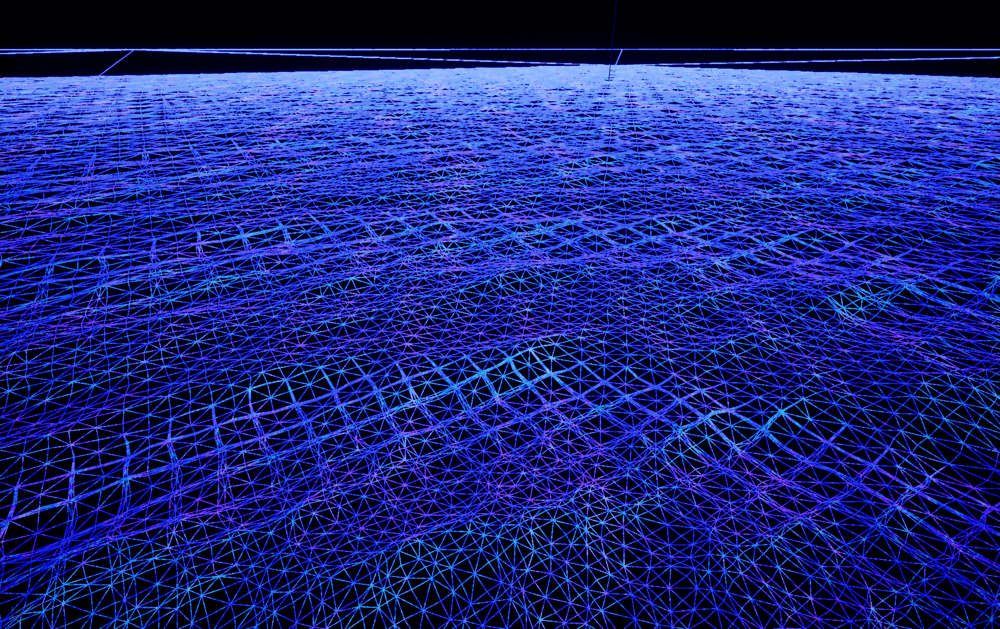
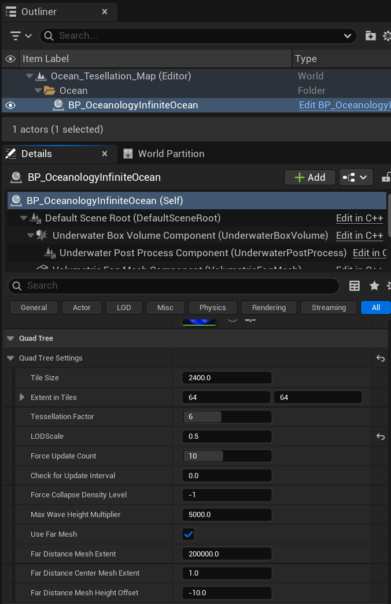

# Oceanology Legacy - QuadTree CPU

<div className="doc-badge doc-badge-violet">🔲 LOD System</div>
<div className="doc-badge doc-badge-cyan">⚡ Performance</div>
<div className="doc-badge doc-badge-emerald">🌍 Infinite Ocean</div>

Dynamic mesh generation with seamless Level of Detail transitions based on camera distance.

---

## Overview

The **QuadTree CPU** system is the core mesh generation technology powering Oceanology Legacy's infinite ocean. It dynamically generates and manages the ocean surface mesh using a quadtree subdivision algorithm, providing seamless LOD transitions.

| Feature | Benefit |
|---------|---------|
| **Dynamic Subdivision** | High detail near camera, lower detail at distance |
| **Seamless Transitions** | No visible seams or popping artifacts |
| **Optimal Performance** | Renders detail only where needed |
| **Infinite Scale** | Supports vast ocean expanses |

## How QuadTree Works

1. **Root Level** - The ocean starts as a grid of large tiles covering the visible area
2. **Subdivision** - Tiles closer to camera subdivide into smaller, more detailed tiles
3. **LOD Transitions** - Tiles dynamically subdivide or collapse as camera moves
4. **Seamless Stitching** - Adjacent tiles of different LODs connect without gaps

The result is a continuous ocean surface that appears highly detailed up close while maintaining excellent performance for vast ocean expanses.



The wireframe visualization above shows the QuadTree in action:
- **Foreground (bottom)** - Dense tessellation with small triangles for detailed wave displacement.
- **Midground (center)** - Medium tessellation as detail becomes less critical.
- **Background (top)** - Coarse tessellation for distant water where individual waves aren't distinguishable.

---

## Prerequisites

- Unreal Engine 5.6 or newer.
- **Oceanology Legacy** installed and configured (see the **Setup** page).
- A level with **BP_OceanologyInfiniteOcean** placed in the scene.

## Notes

- The QuadTree system runs on the **CPU**, calculating tile subdivisions each frame based on camera position. This offloads the GPU for wave displacement and shading.
- All QuadTree settings are found on the **BP_OceanologyInfiniteOcean** actor in the **Quad Tree** category.
- Changes to QuadTree settings take effect immediately in the editor and at runtime.
- The system includes a **Far Mesh** option for rendering extremely distant ocean without QuadTree overhead.

---

## Step-by-step

:::note 1. Select the Infinite Ocean actor
In the **Outliner**, locate and select **BP_OceanologyInfiniteOcean**. This is the main ocean actor that contains all QuadTree settings.

The actor hierarchy shows:
- **Default Scene Root** - The root transform component.
- **Underwater Box Volume Component** - Defines the underwater region for post-processing.
- **Underwater Post Process Component** - Handles underwater visual effects.
- **Volumetric Fog Mesh Component** - Optional volumetric fog for atmosphere.

In the **Details** panel, scroll down to find the **Quad Tree** category. This contains all mesh generation settings.


:::

:::note 2. Configure Quad Tree Settings
Expand the **Quad Tree Settings** subcategory to access all parameters:

### Core Tile Settings

| Property | Default | Explanation |
|----------|---------|-------------|
| **Tile Size** | `2400.0` | The base size of each ocean tile in Unreal units. Larger values create bigger tiles that cover more area but with less granular LOD control. Smaller values provide finer LOD transitions but increase CPU overhead. |
| **Extent in Tiles** | `64, 64` | The total ocean coverage expressed as a grid of tiles. With Tile Size = 2400 and Extent = 64×64, the ocean covers 153,600 × 153,600 units (approximately 1.5 km × 1.5 km). Increase for larger playable ocean areas. |

### Tessellation and LOD

| Property | Default | Explanation |
|----------|---------|-------------|
| **Tessellation Factor** | `6` | Controls the geometric density within each tile. Higher values produce more triangles per tile, resulting in smoother wave shapes but higher vertex count. Range: 1-8 recommended. |
| **LODScale** | `0.5` | Multiplier for LOD distance thresholds. Lower values (e.g., 0.25) cause tiles to subdivide at closer distances, saving performance. Higher values (e.g., 1.0) maintain detail further from the camera. |
| **Force Collapse Density Level** | `-1` | Forces all tiles to collapse to a specific LOD level. Set to `-1` to disable (normal adaptive LOD). Set to `0` for maximum detail everywhere, or higher numbers for forced lower detail. Useful for debugging or specific visual styles. |

### Update Behavior

| Property | Default | Explanation |
|----------|---------|-------------|
| **Force Update Count** | `10` | Number of frames to force QuadTree recalculation after significant camera movement. Higher values ensure smooth transitions during fast camera motion but increase CPU load. |
| **Check for Update Interval** | `0.0` | Time interval (in seconds) between QuadTree update checks. `0.0` means check every frame. Increase to reduce CPU usage at the cost of slightly delayed LOD transitions. |

### Wave Height

| Property | Default | Explanation |
|----------|---------|-------------|
| **Max Wave Height Multiplier** | `5000.0` | Maximum vertical displacement for wave height calculations. This value affects how the QuadTree accounts for wave peaks when determining tile visibility and culling. Increase if waves are being incorrectly culled at screen edges. |

### Far Distance Mesh

The Far Mesh system renders extremely distant ocean beyond the QuadTree's range using a simple, low-cost mesh.

| Property | Default | Explanation |
|----------|---------|-------------|
| **Use Far Mesh** | ✅ Enabled | Enables the far distance mesh for rendering ocean beyond the QuadTree extent. Disable only if your game never shows distant ocean views. |
| **Far Distance Mesh Extent** | `200000.0` | Size of the far mesh in Unreal units. With default value, the far mesh extends 200 km in each direction, ensuring the ocean reaches the horizon in any camera orientation. |
| **Far Distance Center Mesh Extent** | `1.0` | Scale factor for the center portion of the far mesh. Adjust to control blending between QuadTree and far mesh. |
| **Far Distance Mesh Height Offset** | `-10.0` | Vertical offset for the far mesh relative to the main ocean surface. Negative values place it slightly below the QuadTree mesh to prevent z-fighting at the transition boundary. |


:::

---

## Understanding the Parameters

### Tile Size vs. Extent in Tiles

These two parameters work together to define your ocean's total coverage:

```
Total Ocean Size = Tile Size × Extent in Tiles

Example (default values):
2400.0 × 64 = 153,600 Unreal units per axis
153,600 × 153,600 = ~1.5 km × 1.5 km playable ocean
```

**Recommendations:**

| Use Case | Tile Size | Extent | Coverage |
|----------|-----------|--------|----------|
| Small lake/pond | 1200 | 16×16 | ~19 km² |
| Coastal area | 2400 | 32×32 | ~77 km² |
| Open ocean (default) | 2400 | 64×64 | ~153 km² |
| Massive ocean | 2400 | 128×128 | ~307 km² |

### Tessellation Factor Impact

The Tessellation Factor dramatically affects both visual quality and performance:

| Factor | Triangles per Tile | Visual Quality | Performance Impact |
|--------|-------------------|----------------|-------------------|
| 2 | Low | Blocky waves | Minimal |
| 4 | Medium | Acceptable | Low |
| 6 | High (default) | Smooth waves | Moderate |
| 8 | Very High | Ultra-smooth | High |

**Tip:** For mobile or VR projects, consider Tessellation Factor 4. For cinematic quality, use 6-8.

### LODScale Behavior

LODScale controls how aggressively the QuadTree reduces detail with distance:

| LODScale | Behavior | Best For |
|----------|----------|----------|
| 0.25 | Aggressive LOD, detail only very close | Performance-critical, VR |
| 0.5 | Balanced (default) | Most projects |
| 0.75 | Extended detail range | Cinematic, photoreal |
| 1.0 | Maximum detail at all distances | Screenshots, film |

---

## Performance Optimization

### CPU Considerations

The QuadTree runs on the CPU. Monitor these factors:

1. **Extent in Tiles** - Larger extents require more subdivision calculations.
2. **Check for Update Interval** - Set to `0.016` (60 FPS) or `0.033` (30 FPS) to reduce CPU load.
3. **Force Update Count** - Lower values reduce sustained CPU spikes after camera movement.

### GPU Considerations

While QuadTree runs on CPU, it affects GPU workload:

1. **Tessellation Factor** - Directly increases vertex count and vertex shader load.
2. **Tile Size** - Smaller tiles mean more draw calls (batching mitigates this).
3. **Far Mesh** - Enabling this adds one additional draw call but prevents rendering the full QuadTree to the horizon.

### Recommended Settings by Platform

| Platform | Tile Size | Extent | Tessellation | LODScale |
|----------|-----------|--------|--------------|----------|
| High-end PC | 2400 | 64×64 | 6-8 | 0.5-0.75 |
| Mid-range PC | 2400 | 64×64 | 4-6 | 0.5 |
| Console (PS5/XSX) | 2400 | 64×64 | 6 | 0.5 |
| Console (PS4/XB1) | 2400 | 32×32 | 4 | 0.25-0.5 |
| Mobile/VR | 1200 | 32×32 | 2-4 | 0.25 |

---

## Troubleshooting Common Issues

| Problem | Likely Cause | Solution |
|---------|--------------|----------|
| Ocean doesn't reach horizon | Far Mesh disabled or extent too small | Enable Use Far Mesh, increase Far Distance Mesh Extent |
| Visible seams between tiles | T-junction artifacts | This shouldn't happen with Oceanology - report as bug |
| Waves clipped at screen edges | Max Wave Height Multiplier too low | Increase Max Wave Height Multiplier |
| Low framerate | Tessellation too high or extent too large | Reduce Tessellation Factor, increase LODScale |
| Ocean LOD pops visibly | LODScale too aggressive | Increase LODScale for smoother transitions |
| Flickering at horizon | Z-fighting with far mesh | Adjust Far Distance Mesh Height Offset (more negative) |
| CPU usage spikes when moving | Force Update Count too high | Reduce Force Update Count |

---

## Debugging the QuadTree

To visualize the QuadTree structure:

1. **Wireframe Mode** - In the editor viewport, press **Alt + 2** or select **View Mode > Wireframe** to see the mesh tessellation.
2. **LOD Coloring** - Use the Ocean material's debug features to color-code LOD levels.
3. **Stat Commands** - Use `stat oceanology` in the console to view QuadTree statistics (if available).

The wireframe view clearly shows:
- Tile boundaries as larger squares
- Tessellation density within each tile
- LOD transitions as tile size changes with distance

---

## Summary

In this guide, you learned how to:

1. **Understand QuadTree fundamentals** - How hierarchical subdivision creates efficient ocean meshes.
2. **Configure tile settings** - Set Tile Size and Extent for your ocean coverage needs.
3. **Tune tessellation and LOD** - Balance visual quality and performance with Tessellation Factor and LODScale.
4. **Enable far mesh** - Extend ocean rendering to the horizon efficiently.
5. **Optimize for your platform** - Apply recommended settings for different hardware targets.

The QuadTree CPU system is the foundation of Oceanology Legacy's infinite ocean. Proper configuration ensures your ocean looks great while maintaining excellent performance across all target platforms.

---

## Quick Reference

| Parameter | Default | Range | Impact |
|-----------|---------|-------|--------|
| Tile Size | 2400.0 | 600-4800 | Ocean coverage granularity |
| Extent in Tiles | 64×64 | 16-256 | Total ocean area |
| Tessellation Factor | 6 | 1-8 | Mesh density per tile |
| LODScale | 0.5 | 0.1-1.0 | Detail distance falloff |
| Force Update Count | 10 | 1-30 | LOD transition smoothness |
| Check for Update Interval | 0.0 | 0.0-0.1 | CPU update frequency |
| Force Collapse Density Level | -1 | -1 to 8 | Override LOD (-1 = auto) |
| Max Wave Height Multiplier | 5000.0 | 1000-10000 | Wave culling threshold |
| Use Far Mesh | ✅ | On/Off | Horizon rendering |
| Far Distance Mesh Extent | 200000.0 | 50000-500000 | Far mesh coverage |
| Far Distance Mesh Height Offset | -10.0 | -50 to 0 | Z-fighting prevention |

---

_End of QuadTree CPU Guide_
