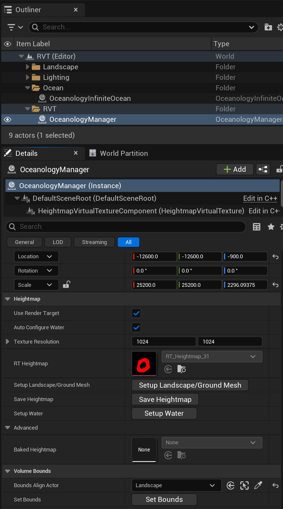
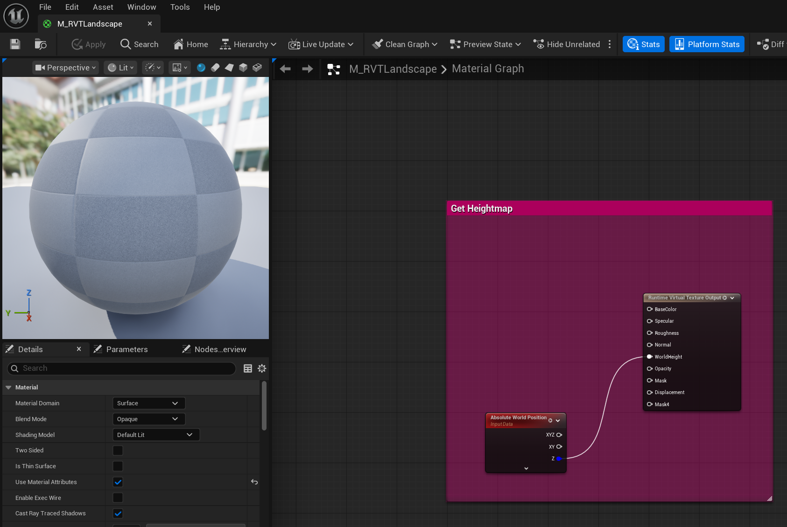
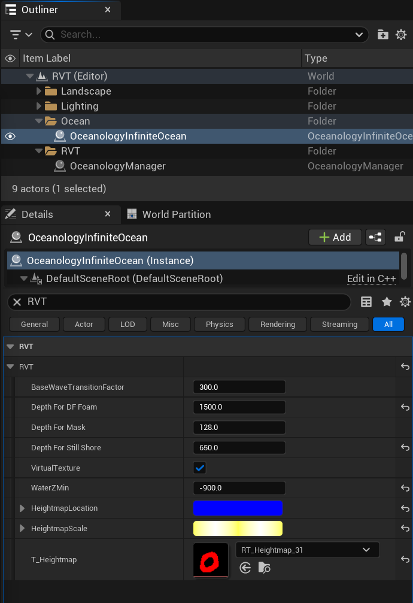
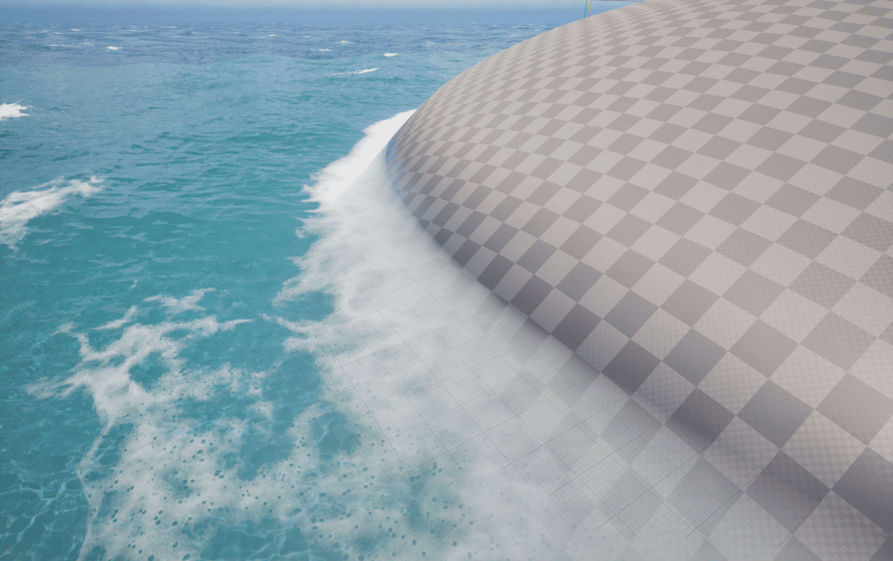

# Oceanology Legacy - RVT Heightmap

<div className="doc-badge doc-badge-violet">🏖️ Shoreline Effects</div>
<div className="doc-badge doc-badge-cyan">🌊 Water-Terrain Interaction</div>
<div className="doc-badge doc-badge-emerald">📐 Runtime Virtual Texture</div>

Enable realistic water-terrain interaction with dynamic shoreline foam, depth effects, and wave masking.

---

## Overview

**RVT Heightmap** enables realistic water-terrain interaction by reading landscape height data through Unreal Engine's Runtime Virtual Texture system. The ocean dynamically generates effects where water meets land.

| Effect | Description |
|--------|-------------|
| **Shoreline Foam** | White foam appears where waves touch the beach |
| **Depth Transparency** | Water becomes clearer in shallow areas |
| **Wave Masking** | Waves naturally flatten near the shore |
| **Still Shore Areas** | Calm water in very shallow regions |

## How RVT Heightmap Works

1. **Landscape writes height** - Your landscape material outputs world height to a Runtime Virtual Texture
2. **Ocean reads height** - The ocean material samples this texture to know terrain position
3. **Effects are calculated** - Based on the height difference between water surface and terrain, the ocean generates foam, adjusts transparency, and modifies wave behavior.

This GPU-based approach is highly performant and works with any landscape shape, including complex coastlines, islands, and underwater terrain.

---

## Prerequisites

- Unreal Engine 5.6 or newer.
- **Oceanology Legacy** installed and configured.
- A **Landscape** actor in your level (the terrain that will interact with water).
- Basic familiarity with **Materials** and **Runtime Virtual Textures** in Unreal Engine.

## Notes

- RVT Heightmap requires your landscape material to output height data to a Runtime Virtual Texture. Oceanology provides a ready-to-use material for this purpose.
- The system works with both **Landscape** actors and custom **Ground Meshes**.
- Performance impact is minimal as all calculations happen on the GPU using virtual texture sampling.
- This feature is essential for realistic coastal scenes and should be configured for any project featuring shorelines.

---

## Step-by-step

:::note 1. Add the required Oceanology actors to your scene
Open your level and use the **Quickly Add to the Project** menu (the `+` button in the toolbar or right-click in the viewport). Search for `oceanology` to filter the available actors.

You will need to drag the following actors into your scene:
- **Oceanology Manager** - The central controller that manages all Oceanology systems, including RVT Heightmap configuration.
- **Oceanology Water Niagara Waves Volume** - Optional volume for Niagara-based wave effects.
- **Oceanology Water Volume** - Defines the region where water interactions occur.
- **BP_OceanologyInfiniteOcean** - The infinite ocean water body.
- **BP_OceanologyLake** _(optional)_ - A bounded lake water body.

For RVT Heightmap, the critical actors are **Oceanology Manager** (which contains the heightmap configuration) and **BP_OceanologyInfiniteOcean** (which contains the RVT settings).


:::

:::note 2. Configure the Oceanology Manager - Heightmap Settings
Select the **OceanologyManager** actor in the **Outliner**. In the **Details** panel, you will see the **HeightmapVirtualTextureComponent** as part of the actor hierarchy.

Expand the component and configure the **Heightmap** category:

**Transform:**
- **Location** - Position that covers your landscape. Example: `(-12600.0, -12600.0, -900.0)`
- **Rotation** - `(0.0, 0.0, 0.0)`
- **Scale** - Size of the heightmap coverage area. Example: `(25200.0, 25200.0, 2296.09375)` - This should encompass your entire landscape.

**Heightmap Settings:**
| Property | Value | Explanation |
|----------|-------|-------------|
| **Use Render Target** | ✅ Enabled | Uses a render target for dynamic heightmap updates. Required for runtime terrain modifications. |
| **Auto Configure Water** | ✅ Enabled | Automatically configures the ocean to use this heightmap. Recommended for most setups. |
| **Texture Resolution** | `1024 × 1024` | Resolution of the heightmap texture. Higher values provide more detail but use more memory. 1024×1024 is a good balance. |
| **RT Heightmap** | `RT_Heightmap_31` | The Render Target asset used for heightmap storage. Oceanology provides this asset. |

**Action Buttons:**
- **Setup Landscape/Ground Mesh** - Click to automatically configure your landscape to write to the RVT.
- **Save Heightmap** - Bakes the current heightmap to a static texture for improved performance.
- **Setup Water** - Configures the ocean to read from this heightmap.

**Advanced:**
| Property | Value | Explanation |
|----------|-------|-------------|
| **Baked Heightmap** | `None` | Optional pre-baked heightmap texture. Use for static landscapes to improve performance. |

**Volume Bounds:**
| Property | Value | Explanation |
|----------|-------|-------------|
| **Bounds Align Actor** | `Landscape` | The actor to align heightmap bounds to. Select your landscape for automatic sizing. |
| **Set Bounds** | Button | Click to automatically set bounds based on the selected Bounds Align Actor. |


:::

:::note 3. Configure the Landscape - Virtual Texture Settings
Select your **Landscape** actor in the **Outliner**. In the **Details** panel, configure the **Virtual Texture** category:

**Transform:**
- **Location** - Your landscape position. Example: `(-12600.0, -12600.0, -800.0)`
- **Rotation** - `(0.0, 0.0, 0.0)`
- **Scale** - `(100.0, 100.0, 100.0)` (typical landscape scale)

**Virtual Texture Settings:**
| Property | Value | Explanation |
|----------|-------|-------------|
| **Draw in Virtual Textures** | `1 Array element` | The list of RVTs this landscape writes to. |
| **Index [0]** | `RVT_Heightmap` | The Runtime Virtual Texture asset. Oceanology provides this asset - select it from the dropdown. |
| **Create Volumes** | Button | Creates the necessary RVT volumes in your level. Click this after assigning the RVT. |
| **Draw in Main Pass** | `Always` | Ensures the landscape renders in both the main pass and the virtual texture pass. |

**Advanced:**
| Property | Value | Explanation |
|----------|-------|-------------|
| **Virtual Texture Render with Quad** | ✅ Enabled | Optimizes RVT rendering using quad primitives. |
| **High Quality PerPixel Height** | ✅ Enabled | Enables high-precision height sampling for better foam accuracy. |
| **Virtual Texture Num LODs** | `6` | Number of LOD levels for the virtual texture. |
| **Virtual Texture LOD Bias** | `0` | LOD bias offset. Leave at 0 for default behavior. |

**Important:** After configuring these settings, click **Create Volumes** to generate the Runtime Virtual Texture Volume actor in your level.


:::

:::note 4. Configure the Landscape Material - RVT Output
Your landscape material must output its height data to the Runtime Virtual Texture. Oceanology provides a ready-to-use material called **M_RVTLandscape**.

Open **M_RVTLandscape** in the Material Editor. The key setup is:

**Material Settings (Details Panel):**
| Property | Value | Explanation |
|----------|-------|-------------|
| **Material Domain** | `Surface` | Standard surface material. |
| **Blend Mode** | `Opaque` | Solid, non-transparent surface. |
| **Shading Model** | `Default Lit` | Standard PBR lighting. |
| **Two Sided** | ❌ Disabled | Single-sided rendering for performance. |
| **Is Thin Surface** | ❌ Disabled | Standard surface thickness. |
| **Use Material Attributes** | ✅ Enabled | Enables material attribute passing. |
| **Cast Ray Traced Shadows** | ✅ Enabled | Allows ray-traced shadow casting. |

**Material Graph - Get Heightmap Function:**

The material contains a **"Get Heightmap"** Material Function that:

1. **Absolute World Position** node - Gets the current pixel's world position.
2. **Component Mask (Z)** - Extracts the Z (height) component.
3. **Runtime Virtual Texture Output** - Writes the height to the RVT.

The **Runtime Virtual Texture Output** node has these connections:
- **BaseColor** - (optional) Landscape base color
- **Specular** - (optional) Specular value
- **Roughness** - (optional) Roughness value
- **Normal** - (optional) Normal map
- **WorldHeight** - **Critical!** Connect the Z component of Absolute World Position here
- **Opacity** - (optional) Opacity value
- **Mask** - (optional) Mask value
- **Displacement** - (optional) Displacement value
- **Mask4** - (optional) Additional mask

**The WorldHeight output is the essential connection** - this is what the ocean reads to generate shoreline effects.


:::

:::note 5. Configure the Ocean - RVT Settings
Select **OceanologyInfiniteOcean** (or your ocean actor) in the **Outliner**. In the **Details** panel, locate the **RVT** category:

**Scene Hierarchy:**
Your Outliner should show:
- **Landscape** folder
- **Lighting** folder
- **Ocean** folder
  - **OceanologyInfiniteOcean**
  - **RVT** folder
    - **OceanologyManager**

**RVT Settings on OceanologyInfiniteOcean:**

| Property | Default | Explanation |
|----------|---------|-------------|
| **BaseWaveTransitionFactor** | `300.0` | Distance over which waves transition near the shore. Higher values create smoother wave-to-shore transitions. |
| **Depth For DF Foam** | `1500.0` | Water depth at which Distance Field foam appears. Controls how far from shore the foam extends. |
| **Depth For Mask** | `128.0` | Depth threshold for the water mask effect. Affects transparency in shallow areas. |
| **Depth For Still Shore** | `650.0` | Depth below which the shore is considered "still" (minimal wave activity). Creates calm shallow water. |
| **VirtualTexture** | ✅ Enabled | **Master toggle for RVT Heightmap.** Must be enabled for all shoreline effects to work. |
| **WaterZMin** | `-900.0` | Minimum Z height for water calculations. Should match or be below your lowest underwater terrain. |

**Heightmap References:**
| Property | Value | Explanation |
|----------|-------|-------------|
| **HeightmapLocation** | (Blue bar) | World location of the heightmap origin. Auto-configured when using Setup Water. |
| **HeightmapScale** | (Yellow bar) | Scale of the heightmap coverage. Auto-configured when using Setup Water. |
| **T_Heightmap** | `RT_Heightmap_31` | Reference to the heightmap render target. Must match the RT Heightmap in Oceanology Manager. |

**Tip:** If you used **Auto Configure Water** in the Oceanology Manager (Note 2), these values should already be correctly set. If not, click **Setup Water** in the Oceanology Manager to configure them automatically.


:::

:::note 6. Verify the Result - Shoreline Foam
After completing the configuration, enter **Play mode** or use **Simulate** to see the RVT Heightmap in action.

You should see:
- **White foam** appearing where the ocean meets the landscape
- **Smooth transitions** from deep water to shallow areas
- **Wave masking** - waves naturally flatten as they approach the shore
- **Depth-based effects** - water clarity changes based on depth

The image shows a typical result: foam correctly appearing at the water-terrain intersection, creating a realistic shoreline effect.

**If foam doesn't appear:**
1. Verify **VirtualTexture** is ✅ enabled on the ocean actor.
2. Check that **RVT_Heightmap** is assigned to both the Landscape and Oceanology Manager.
3. Ensure your landscape material outputs **WorldHeight** to the Runtime Virtual Texture Output.
4. Click **Setup Landscape/Ground Mesh** and **Setup Water** in the Oceanology Manager.


:::

---

## Understanding the RVT Parameters

### Depth Parameters Explained

The depth parameters control how different effects appear based on water depth:

```
Water Surface (Z = 0)
      │
      │ ◄─── Depth For Mask (128) ───── Transparency mask begins
      │
      │ ◄─── BaseWaveTransitionFactor (300) ───── Waves start transitioning
      │
      │ ◄─── Depth For Still Shore (650) ───── Shore becomes calm
      │
      │ ◄─── Depth For DF Foam (1500) ───── Maximum foam distance
      │
      ▼
Seabed (Landscape)
```

| Parameter | Effect | Increase Value | Decrease Value |
|-----------|--------|----------------|----------------|
| BaseWaveTransitionFactor | Wave flattening distance | Smoother, gradual transitions | Sharper wave cutoff |
| Depth For DF Foam | Foam coverage area | More foam, extends further from shore | Less foam, closer to waterline |
| Depth For Mask | Transparency mask range | Larger shallow clear area | Smaller clear area |
| Depth For Still Shore | Calm water zone | Larger calm area near shore | Smaller calm zone |

### Visual Quality vs. Performance

| Setting | Higher Value | Lower Value |
|---------|--------------|-------------|
| Texture Resolution (1024) | More precise foam edges | Better performance, softer edges |
| Virtual Texture Num LODs (6) | Better distance quality | Faster streaming |
| High Quality PerPixel Height | Accurate foam placement | Faster rendering |

---

## Troubleshooting Common Issues

| Problem | Likely Cause | Solution |
|---------|--------------|----------|
| No foam appears | VirtualTexture disabled | Enable VirtualTexture on ocean actor |
| Foam everywhere | Heightmap not configured | Click Setup Landscape/Ground Mesh in Manager |
| Foam at wrong height | WaterZMin incorrect | Adjust WaterZMin to match terrain lowest point |
| Foam too far from shore | Depth For DF Foam too high | Reduce Depth For DF Foam value |
| No foam in some areas | Landscape missing RVT output | Apply M_RVTLandscape or configure material |
| Flickering foam | LOD issues | Increase Virtual Texture Num LODs |
| Performance issues | Resolution too high | Reduce Texture Resolution to 512×512 |
| Foam not matching terrain | Bounds mismatch | Click Set Bounds in Oceanology Manager |

---

## Quick Setup Checklist

Use this checklist for rapid RVT Heightmap setup:

**Oceanology Manager:**
- [ ] Added to level
- [ ] Heightmap component configured
- [ ] Texture Resolution set (1024×1024 recommended)
- [ ] Bounds Align Actor set to Landscape
- [ ] Clicked "Set Bounds"
- [ ] Clicked "Setup Landscape/Ground Mesh"
- [ ] Clicked "Setup Water"

**Landscape:**
- [ ] RVT_Heightmap assigned in Draw in Virtual Textures
- [ ] Clicked "Create Volumes"
- [ ] Draw in Main Pass = Always
- [ ] Virtual Texture Render with Quad = ✅
- [ ] High Quality PerPixel Height = ✅

**Landscape Material:**
- [ ] Using M_RVTLandscape OR
- [ ] Custom material with Runtime Virtual Texture Output
- [ ] WorldHeight connected to Absolute World Position Z

**Ocean (OceanologyInfiniteOcean):**
- [ ] VirtualTexture = ✅ Enabled
- [ ] T_Heightmap assigned (RT_Heightmap_31)
- [ ] WaterZMin matches terrain lowest point
- [ ] Depth parameters tuned for your scene

---

## Summary

In this guide, you learned how to:

1. **Understand RVT Heightmap** - How the ocean reads terrain height for shoreline effects.
2. **Add Oceanology actors** - Set up the Manager and Ocean in your scene.
3. **Configure Oceanology Manager** - Set up the heightmap component with proper bounds and resolution.
4. **Configure the Landscape** - Enable RVT output and assign the heightmap texture.
5. **Set up the landscape material** - Ensure WorldHeight is output to the Runtime Virtual Texture.
6. **Configure the ocean RVT settings** - Enable VirtualTexture and tune depth parameters.
7. **Verify the result** - Confirm shoreline foam appears correctly.

RVT Heightmap is essential for creating realistic coastal environments. The system is highly performant and works with any terrain shape, making it ideal for open-world games with complex coastlines.

---

## Quick Reference

| Parameter | Location | Default | Purpose |
|-----------|----------|---------|---------|
| Texture Resolution | Oceanology Manager | 1024×1024 | Heightmap detail level |
| Use Render Target | Oceanology Manager | ✅ | Dynamic heightmap updates |
| Auto Configure Water | Oceanology Manager | ✅ | Automatic ocean setup |
| RVT_Heightmap | Landscape | Asset | Virtual texture reference |
| Draw in Main Pass | Landscape | Always | Render in both passes |
| VirtualTexture | Ocean | ✅ | Master RVT toggle |
| BaseWaveTransitionFactor | Ocean | 300.0 | Wave transition distance |
| Depth For DF Foam | Ocean | 1500.0 | Foam coverage depth |
| Depth For Mask | Ocean | 128.0 | Transparency mask depth |
| Depth For Still Shore | Ocean | 650.0 | Calm water zone depth |
| WaterZMin | Ocean | -900.0 | Minimum water height |

---

_End of RVT Heightmap Guide_
