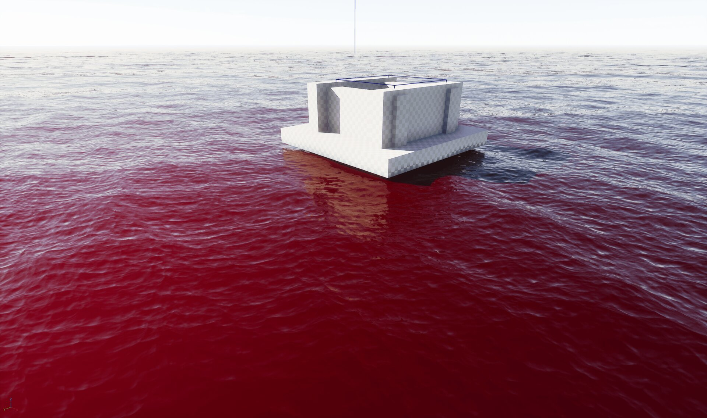
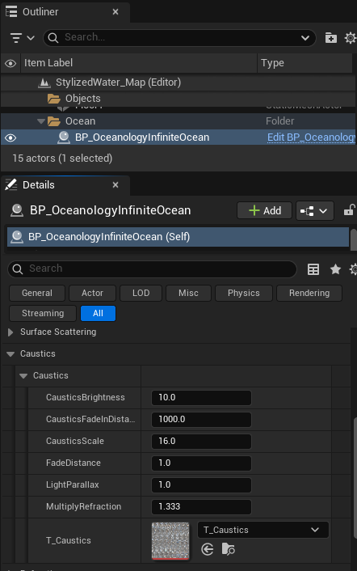
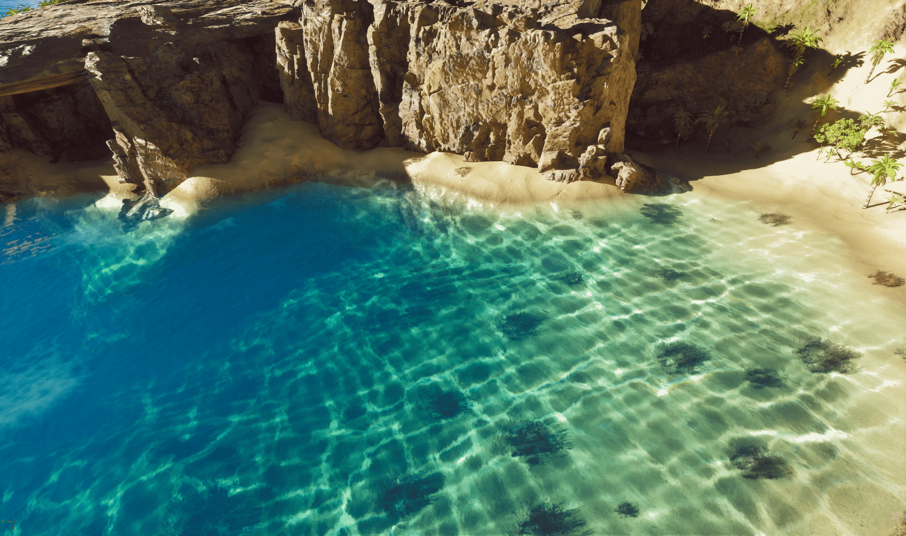
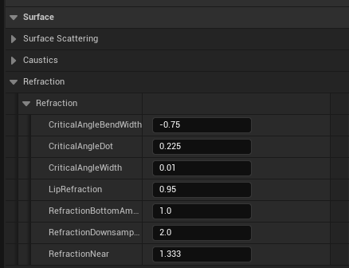
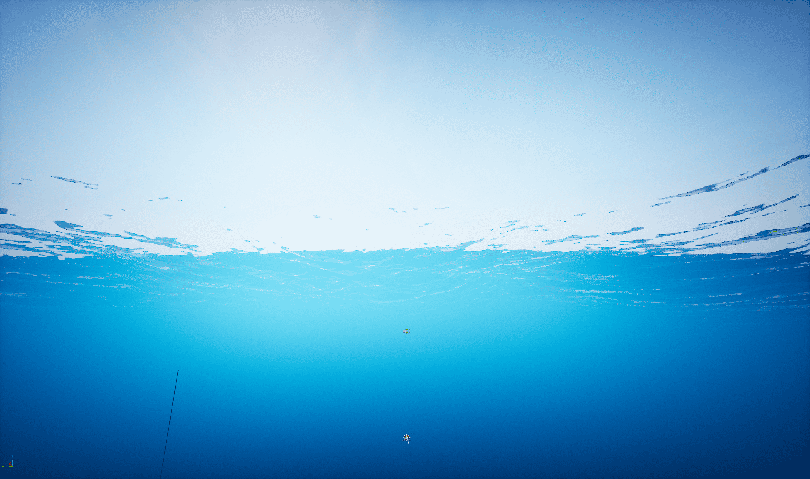
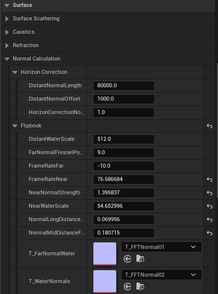
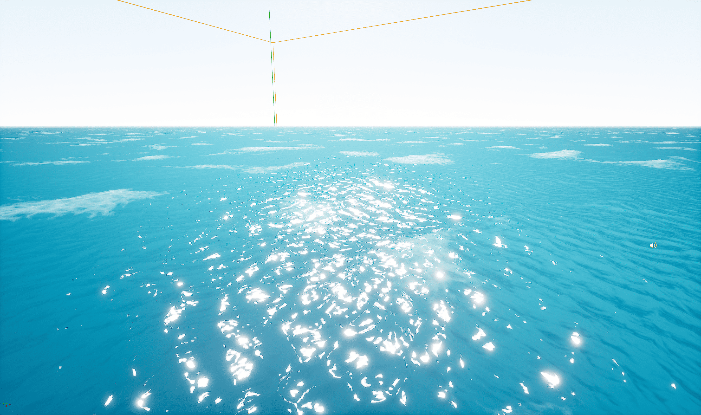

# Oceanology Legacy - Surface

🎨 Visual Appearance

🌊 Water Rendering

💎 Materials

Configure water surface rendering including scattering, absorption, caustics, and reflections.

---

## Prerequisites

| Requirement | Details |
|-------------|---------|
| **Engine** | Unreal Engine 5.3 or newer |
| **Plugin** | Oceanology Legacy installed and configured |
| **Scene** | Water body placed in your level |
| **Skills** | Basic familiarity with Materials and shaders |

:::info About Surface Rendering
Surface settings control the visual appearance of water bodies: scattering, absorption, caustics, refraction, and normal calculations. Each water body can have unique surface settings.
:::

---

## Step-by-step

:::note 1. Add the Oceanology actors to your scene
To configure surface settings, you first need the appropriate Oceanology actors in your level. Use the **Quickly Add to the Project** menu (the `+` button in the toolbar) and search for `oceanology`.

**Available Actors:**
- **Oceanology Manager** - Required for all Oceanology systems to function.
- **Oceanology Water Niagara Waves Volume** - Defines regions for Niagara-based wave effects.
- **Oceanology Water Volume** - Required for buoyancy and swimming systems.
- **BP_OceanologyInfiniteOcean** - The infinite ocean water body with all surface settings.
- **BP_OceanologyLake** - A bounded lake water body.
- **Oceanology Infinite Ocean** - Alternative infinite ocean actor.
- **Oceanology Lake** - Alternative lake actor.
- **Oceanology Material to Struct Converter** - Utility for converting material parameters.
- **Oceanology Water Surface Debugger** - Debug visualization for water surfaces.

For surface configuration, drag **BP_OceanologyInfiniteOcean** (or **BP_OceanologyLake** for lakes) into your scene. All surface settings will be available in the **Details** panel under their respective categories.

:::

---

## Surface Scattering Configuration

:::note 2. Configure Surface Scattering settings
Select your **BP_OceanologyInfiniteOcean** actor and locate the **Surface Scattering** category in the **Details** panel. This section controls how light interacts with the water surface.

**Surface Scattering Parameters:**
- **CameraVectorPower** - `2.0`. Power applied to camera direction calculations.
- **FadeLengthScattering** - `600000.0`. Distance over which scattering fades.
- **FadeOffsetScattering** - `1000.0`. Offset for the scattering fade transition.
- **PhaseGHigh** - `0.4`. High-frequency phase function parameter for scattering.
- **PhaseGLow** - `0.75`. Low-frequency phase function parameter.
- **ScatterBoost** - `10.0`. Overall scattering intensity multiplier.
- **SurfaceScatteringExponent** - `1.0`. Exponent for surface scattering falloff.
- **SurfaceScatteringIntensity** - `2.0`. Base intensity of surface scattering.
- **SurfaceScatteringPower** - `5.0`. Power curve for scattering calculations.
- **SurfaceScatteringReflectionAttenuation** - `0.5`. How much scattering affects reflections.
- **SurfaceScatteringReflectionIntensity** - `1.0`. Intensity of scattered light in reflections.
- **TopDownExp** - `2.0`. Exponent for top-down viewing angle calculations.
- **Water Fresnel Exponent** - `20.0`. Controls the sharpness of the Fresnel falloff.
- **Water Fresnel Roughness** - `0.2`. Surface roughness for Fresnel calculations.
- **Water Fresnel Specular** - `0.225`. Base specular reflectivity of the water surface.
- **Water Roughness** - `0.075`. Overall surface roughness affecting specular highlights.

These parameters work together to create the final surface appearance. Adjusting **ScatterBoost** and the **Phase** values has the most noticeable impact on the overall look.

:::

:::note 3. Configure Water Fresnel, Absorption, and Scattering colors
Scroll down in the **Surface Scattering** category to find the material response and color settings.

**Water Fresnel Settings:**
- **Water Fresnel Exponent** - `20.0`. Controls the sharpness of the Fresnel falloff. Higher values concentrate reflections at grazing angles.
- **Water Fresnel Roughness** - `0.2`. Surface roughness for Fresnel calculations.
- **Water Fresnel Specular** - `0.225`. Base specular reflectivity of the water surface.
- **Water Roughness** - `0.075`. Overall surface roughness affecting specular highlights.
- **Water Specular** - `0.1125`. Specular intensity multiplier.

**Color Settings:**
- **Absorption** - The color gradient showing what wavelengths are absorbed as light travels through water. The example shows a warm gradient from light peach to darker orange-red.
- **Scattering** - The color gradient for light that scatters within the water volume. This affects the overall tint of the water body.

For realistic ocean water, use cool blue-green gradients for both Absorption and Scattering. The warm colors shown here are used to demonstrate the dramatic effect these settings can have.

:::

:::note 4. Absorption and Scattering color demonstration
The **Absorption** and **Scattering** properties control the underwater color of your water body. This example shows an extreme configuration to demonstrate the effect clearly.

In this scene, the **Absorption** color has been set to a deep red, which dramatically changes how the water appears. As light travels through the water:
- Shallow areas appear lighter with the absorption color tinting the view
- Deeper areas become increasingly saturated with the absorption color
- Objects partially submerged show the color transition at the waterline

This red ocean example is intentionally extreme for demonstration purposes. For realistic water, use subtle blue-green absorption colors. However, stylized projects might use unusual colors for alien oceans, polluted water, or fantasy environments.

:::

---

## Caustics Configuration

:::note 5. Configure Caustics settings
Expand the **Caustics** category to configure the light patterns that appear on underwater surfaces.

**Caustics Parameters:**
- **CausticsBrightness** - `10.0`. Overall intensity of the caustic light patterns. Higher values create more visible caustics.
- **CausticsFadeInDistance** - `1000.0`. Distance over which caustics fade in from the camera.
- **CausticsScale** - `16.0`. Size of the caustic pattern. Smaller values create finer, more detailed patterns.
- **FadeDistance** - `1.0`. Controls how quickly caustics fade with depth.
- **LightParallax** - `1.0`. Parallax offset for caustic light rays.
- **MultiplyRefraction** - `1.333`. Refraction multiplier for caustic calculations (matches water IOR).
- **T_Caustics** - `T_Caustics`. The texture used for caustic patterns.

Caustics are most visible in shallow water with a light-colored bottom (sand, rock). Adjusting **CausticsBrightness** and **CausticsScale** will have the most noticeable impact on the visual result.

**Performance Note:** Caustics add rendering cost. For distant water or performance-critical scenarios, consider reducing **CausticsBrightness** or increasing **CausticsFadeInDistance**.

:::

:::note 6. Caustics visual result
This beach scene demonstrates caustics in action. Notice the characteristic rippling light patterns projected onto the sandy floor beneath the water surface.

Key observations:
- **Light patterns on sand** - The caustic texture creates realistic underwater light refraction visible on the seabed.
- **Depth variation** - Caustics are more visible in shallow areas and fade in deeper water.
- **Color interaction** - The caustic patterns interact with the absorption color, creating the turquoise-to-deep-blue gradient.
- **Surface detail** - Wave motion animates the caustic patterns, adding life to the underwater environment.

This level of detail is essential for tropical beach scenes, shallow pools, and any environment where players can see the underwater floor.

:::

---

## Refraction Configuration

:::note 7. Configure Refraction settings
Expand the **Refraction** category to configure how light bends when passing through the water surface.

**Refraction Parameters:**
- **CriticalAngleBendWidth** - `-0.75`. Controls the width of the critical angle bending zone.
- **CriticalAngleDot** - `0.225`. Dot product threshold for critical angle calculations.
- **CriticalAngleWidth** - `0.01`. Width of the critical angle transition.
- **LipRefraction** - `0.95`. Refraction intensity at the water's edge (shoreline).
- **RefractionBottomAmount** - `1.0`. How much the underwater terrain is refracted.
- **RefractionDownsample** - `2.0`. Downsample factor for refraction rendering (higher = better performance, lower quality).
- **RefractionNear** - `1.333`. The index of refraction for water (1.333 is physically accurate for water).

The **RefractionNear** value of `1.333` matches real water. Increasing this value creates more dramatic bending, while decreasing it reduces the effect. For stylized water, you might adjust this based on artistic preference.

:::

:::note 8. Refraction visual result - Underwater view
When the camera is positioned below the water surface, you can observe several important rendering features controlled by the Refraction settings:

- **Surface Refraction** - The water surface acts as a refractive boundary, bending light from above. Notice how the sky and above-water scene appear distorted when viewed from below.
- **Total Internal Reflection** - At steep viewing angles, the surface becomes mirror-like, reflecting the underwater environment.
- **Snell's Window** - The circular area where you can see through the surface is determined by the critical angle settings.
- **Surface Waves** - Wave displacement affects how the underwater view of the surface animates.

This underwater perspective is crucial for games featuring diving, submarines, or underwater exploration. The quality of this view depends on your **Refraction** and **Normal Calculation** settings.

:::

---

## Normal Calculation Configuration

:::note 9. Configure Normal Calculation settings
Expand the **Normal Calculation** category to control how surface normals are computed for lighting and reflections.

**Horizon Correction:**
- **DistantNormalLength** - `80000.0`. The distance at which distant normal blending begins.
- **DistantNormalOffset** - `1000.0`. Offset for the distant normal transition.
- **HorizonCorrectionNormalStrength** - `1.0`. Intensity of the horizon normal correction. Higher values create smoother horizons.

**Flipbook:**
The flipbook system uses animated normal maps for detailed surface motion.
- **DistantWaterScale** - `512.0`. Scale of the distant water normal texture.
- **FarNormalFresnelPower** - `9.0`. Fresnel falloff for far normals.
- **FrameRateFar** - `-10.0`. Animation speed for distant normals (negative = reverse direction).
- **FrameRateNear** - `76.686684`. Animation speed for near normals.
- **NearNormalStrength** - `1.395837`. Intensity of near surface normals.
- **NearWaterScale** - `54.652996`. Scale of the near water normal texture.
- **NormalLongDistanceScale** - `0.069956`. Scale multiplier for long-distance normals.
- **NormalMidDistanceScale** - `0.180715`. Scale multiplier for mid-distance normals.
- **T_FarNormalWater** - `T_FFTNormal01`. Texture used for distant water normals.
- **T_WaterNormals** - `T_FFTNormal02`. Texture used for near water normals.

These settings control the multi-scale normal system that provides detail at all viewing distances without texture repetition artifacts.

:::

:::note 10. Normal Calculation visual result - Sun specular highlights
This view demonstrates the **Normal Calculation** system's effect on surface lighting. Key observations:

- **Sun Specular** - Bright highlights appear where the sun reflects off the water surface. The intensity and spread of these highlights are controlled by the **NearNormalStrength** and **Water Roughness** settings.
- **Multi-scale Detail** - Notice how the surface has detail at multiple scales - fine ripples nearby and broader wave patterns in the distance.
- **Foam Patches** - White foam areas break up the surface, adding realism to open ocean scenes.
- **Horizon Quality** - The **Horizon Correction** settings ensure the distant water blends smoothly with the sky without harsh edges or artifacts.

The balance between normal strength, roughness, and the flipbook animation speeds determines whether your ocean looks calm and glassy or rough and active.

:::

---

## Surface Settings Reference

The following table summarizes the key surface parameters and their visual effects:

| Category | Parameter | Default | Effect |
|----------|-----------|---------|--------|
| **Surface Scattering** | ScatterBoost | 10.0 | Overall scattering intensity |
| **Surface Scattering** | SurfaceScatteringIntensity | 2.0 | Base surface light interaction |
| **Surface Scattering** | PhaseGLow / PhaseGHigh | 0.75 / 0.4 | Scattering directionality |
| **Water Fresnel** | Water Fresnel Exponent | 20.0 | Reflection angle sharpness |
| **Water Fresnel** | Water Roughness | 0.075 | Specular highlight spread |
| **Caustics** | CausticsBrightness | 10.0 | Underwater light pattern intensity |
| **Caustics** | CausticsScale | 16.0 | Size of caustic patterns |
| **Refraction** | RefractionNear | 1.333 | Index of refraction (water = 1.333) |
| **Normal Calculation** | NearNormalStrength | ~1.4 | Surface detail intensity |
| **Colors** | Absorption | Gradient | Underwater color with depth |
| **Colors** | Scattering | Gradient | Overall water tint |

---

## Common Surface Presets

Use these starting points for different water types:

| Water Type | ScatterBoost | Absorption | Roughness | CausticsBrightness |
|------------|--------------|------------|-----------|-------------------|
| **Tropical Clear** | 8.0 | Light cyan | 0.05 | 15.0 |
| **Deep Ocean** | 12.0 | Deep blue | 0.1 | 5.0 |
| **Murky Lake** | 15.0 | Brown-green | 0.15 | 2.0 |
| **Stylized Fantasy** | 5.0 | Custom | 0.02 | 20.0 |
| **Realistic Ocean** | 10.0 | Blue-green gradient | 0.075 | 10.0 |

---

## Troubleshooting Common Issues

| Problem | Likely Cause | Solution |
|---------|--------------|----------|
| Water appears too dark | Absorption too strong | Lighten Absorption gradient colors |
| No caustics visible | CausticsBrightness too low or wrong surface | Increase CausticsBrightness, ensure light-colored underwater geometry |
| Harsh specular highlights | Water Roughness too low | Increase Water Roughness to 0.1-0.2 |
| Flat, unrealistic surface | NearNormalStrength too low | Increase NearNormalStrength and verify normal textures |
| Underwater view distorted | RefractionNear incorrect | Reset RefractionNear to 1.333 |
| Horizon looks wrong | Horizon Correction disabled | Adjust DistantNormalLength and HorizonCorrectionNormalStrength |
| Performance issues | High-quality settings everywhere | Increase RefractionDownsample, reduce CausticsBrightness for distant water |
| Color banding in water | Scattering fade too short | Increase FadeLengthScattering |

---

## Summary

In this guide, you learned how to:

1. **Add Oceanology actors** - Place the required actors in your scene to enable surface configuration.
2. **Configure Surface Scattering** - Control how light interacts with the water surface including Fresnel reflections and specular highlights.
3. **Set up Absorption and Scattering colors** - Define underwater color behavior using color gradients.
4. **Enable Caustics** - Add realistic underwater light patterns on submerged surfaces.
5. **Configure Refraction** - Adjust how light bends at the water surface for both above and below water views.
6. **Tune Normal Calculation** - Set up multi-scale normals for detailed surface motion at all distances.

With these settings, you can create water surfaces ranging from crystal-clear tropical beaches to deep murky lakes, or even stylized fantasy oceans with custom colors.
