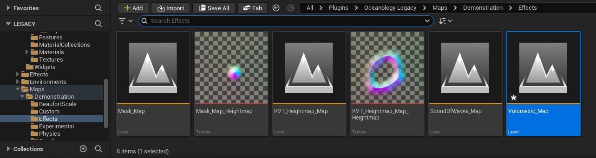
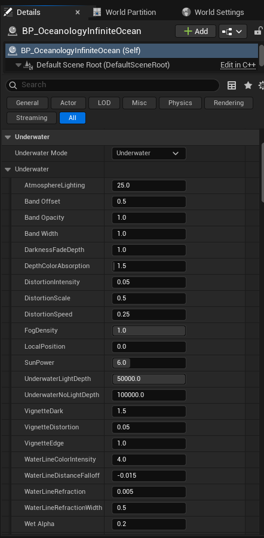
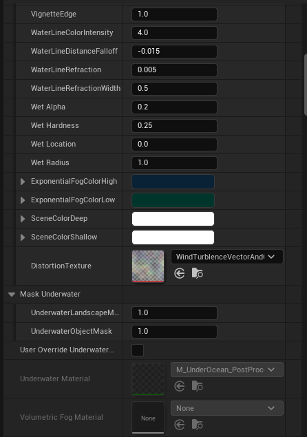
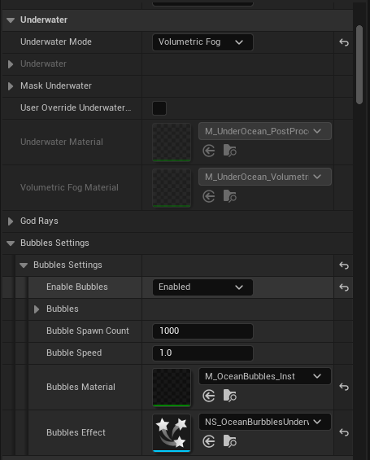
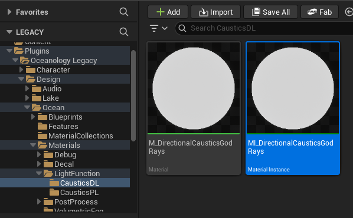

# Oceanology Legacy — Underwater

_Last updated: 2025-12-08_

## Prerequisites
- Unreal Engine 5.6 or newer.
- **Oceanology Legacy** installed and configured (see the **Setup** page).
- At least one **Oceanology Legacy** water body placed in your level (infinite ocean or lake).
- A **Directional Light** in your scene (required for God Rays).
- Basic familiarity with **Post-Processing**, **Materials**, and **Niagara** in Unreal Engine.

## Notes
- Underwater rendering in Oceanology Legacy provides immersive effects when the camera goes below the water surface. This includes fog, color absorption, distortion, vignette, water line effects, caustics, god rays, and bubbles.
- Oceanology Legacy offers two underwater modes: **Underwater** (post-process based) and **Volumetric Fog** (volumetric rendering). Each mode has different visual characteristics and performance implications.
- The workflow in this page covers both modes and explains how to configure God Rays using Light Functions on your Directional Light.

---

## Step-by-step

:::note 1. Open the Volumetric demonstration map
Oceanology Legacy includes a demonstration map that showcases underwater effects. In the **Content Browser**, navigate to:
`Plugins > Oceanology Legacy > Maps > Demonstration > Effects`

Here you will find several demonstration levels:
- **Mask_Map** — Demonstrates underwater masking features.
- **Mask_Map_Heightmap** — Heightmap-based masking demonstration.
- **RVT_Heightmap_Map** — Runtime Virtual Texture heightmap features.
- **RVT_Heightmap_Map_Heightmap** — Combined RVT and heightmap demonstration.
- **SoundOfWaves_Map** — Audio features demonstration.
- **Volumetric_Map** — **Underwater volumetric fog and effects demonstration.**

Open **Volumetric_Map** to see a pre-configured underwater environment with all effects enabled. This is an excellent reference for understanding how the underwater systems work together.

:::

:::note 2. Select the Underwater Mode
Select your **BP_OceanologyInfiniteOcean** actor and locate the **Underwater** category in the **Details** panel. The first setting is **Underwater Mode**, which determines how underwater rendering is handled.

**Available Modes:**
- **None** — Underwater effects are disabled. Use this for surface-only water or when you handle underwater rendering separately.
- **Underwater** — Post-process based underwater rendering. Provides good visual quality with moderate performance cost.
- **Volumetric Fog** — Volumetric rendering for more realistic light scattering and fog. Higher visual fidelity but increased performance cost.

Click the dropdown to select your preferred mode. The available settings will change based on your selection.

:::

---

## Underwater Mode Configuration

:::note 3. Configure Underwater mode settings (Part 1)
With **Underwater Mode** set to `Underwater`, expand the **Underwater** subcategory to access all post-process parameters.

**Atmosphere and Lighting:**
- **AtmosphereLighting** — `25.0`. Controls the intensity of atmospheric lighting underwater.
- **SunPower** — `6.0`. Intensity of sunlight penetrating the water surface.
- **UnderwaterLightDepth** — `50000.0`. Maximum depth where light is still visible.
- **UnderwaterNoLightDepth** — `100000.0`. Depth at which complete darkness occurs.

**Water Surface Band:**
- **Band Offset** — `0.5`. Vertical offset of the water surface band effect.
- **Band Opacity** — `1.0`. Opacity of the surface band.
- **Band Width** — `1.0`. Thickness of the surface transition band.

**Depth and Fog:**
- **DarknessFadeDepth** — `1.0`. How quickly darkness increases with depth.
- **DepthColorAbsorption** — `1.5`. Rate at which colors are absorbed underwater.
- **FogDensity** — `1.0`. Overall density of underwater fog.
- **LocalPosition** — `0.0`. Local offset for fog calculations.

**Distortion:**
- **DistortionIntensity** — `0.05`. Strength of underwater visual distortion.
- **DistortionScale** — `0.5`. Scale of the distortion pattern.
- **DistortionSpeed** — `0.25`. Animation speed of distortion.

**Vignette:**
- **VignetteDark** — `1.5`. Darkness intensity at screen edges.
- **VignetteDistortion** — `0.05`. Distortion amount in vignette area.
- **VignetteEdge** — `1.0`. Sharpness of vignette edge.

**Water Line:**
- **WaterLineColorIntensity** — `4.0`. Color intensity at the water surface line.
- **WaterLineDistanceFalloff** — `-0.015`. Falloff rate for water line effect.
- **WaterLineRefraction** — `0.005`. Refraction amount at water line.
- **WaterLineRefractionWidth** — `0.5`. Width of refraction zone.

**Wet Effect:**
- **Wet Alpha** — `0.2`. Opacity of wet screen effect when exiting water.

:::

:::note 4. Configure Underwater mode settings (Part 2)
Scroll down to find additional underwater settings including wet effects, colors, and masking options.

**Wet Effect Settings:**
- **Wet Hardness** — `0.25`. Sharpness of wet droplet edges.
- **Wet Location** — `0.0`. Position offset for wet effect.
- **Wet Radius** — `1.0`. Size of wet effect coverage.

**Exponential Fog Colors:**
- **ExponentialFogColorHigh** — Blue color for shallow underwater fog.
- **ExponentialFogColorLow** — Darker blue for deep underwater fog.

**Scene Colors:**
- **SceneColorDeep** — Color tint applied at maximum depth.
- **SceneColorShallow** — Color tint applied near the surface.

**Distortion Texture:**
- **DistortionTexture** — `WindTurbulenceVectorAndIntensity`. The texture used for underwater distortion animation.

**Mask Underwater:**
- **UnderwaterLandscapeMask** — `1.0`. Mask intensity for landscape geometry.
- **UnderwaterObjectMask** — `1.0`. Mask intensity for object geometry.
- **User Override Underwater** — Checkbox to enable custom underwater material override.

**Materials:**
- **Underwater Material** — `M_UnderOcean_PostProc`. The post-process material used for underwater rendering.
- **Volumetric Fog Material** — `None`. Not used in standard Underwater mode.

:::

:::note 5. Configure God Rays, Volumetric Fog, and Bubbles
Continue scrolling to find the advanced effect settings that work with both underwater modes.

**God Rays:**
This section is collapsed by default. God Rays require a Light Function on your Directional Light (covered in steps 9-10).

**Volumetric Fog:**
- **MultiScatteringContribution** — `2000.0`. Contribution of multiple scattering to fog appearance.
- **MultiScatteringOcclusion** — `1000.0`. Occlusion factor for scattered light.
- **Wet Alpha** — `0.5`. Wet effect opacity for volumetric mode.
- **ExponentialFogColor** — Blue color for volumetric fog.

**Bubbles Settings:**
- **Enable Bubbles** — `Enabled`. Toggle underwater bubble particles.
- **Bubble Spawn Count** — `1000`. Number of bubbles to spawn.
- **Bubble Speed** — `1.0`. Rising speed of bubbles.
- **Bubbles Material** — `M_OceanBubbles_Inst`. Material instance for bubble rendering.
- **Bubbles Effect** — `NS_OceanBubblesUnderwater`. Niagara system for bubble particles.

**Default:**
- **ReloadSettings** — Button to reset all underwater settings to defaults.

:::

---

## Volumetric Fog Mode Configuration

:::note 6. Configure Volumetric Fog mode
Change **Underwater Mode** to `Volumetric Fog` for more realistic light scattering and atmospheric effects.

When Volumetric Fog mode is selected, the settings panel changes to show volumetric-specific options:

**Mask Underwater:**
- **User Override Underwater** — Checkbox to enable custom material override.

**Materials:**
- **Underwater Material** — `M_UnderOcean_PostProc`. Post-process material for screen effects.
- **Volumetric Fog Material** — `M_UnderOcean_Volumetric`. Material that renders the volumetric fog.

**God Rays:**
Collapsed section for god ray configuration (requires Light Function setup).

**Volumetric Fog:**
- **MultiScatteringContribution** — `2000.0`. Controls how much multiple scattering contributes to the fog appearance. Higher values create denser, more atmospheric fog.
- **MultiScatteringOcclusion** — `1000.0`. Controls light occlusion from scattered rays.
- **Wet Alpha** — `0.5`. Opacity of wet screen effect.
- **ExponentialFogColor** — The color of the volumetric fog (blue by default).

Volumetric Fog mode provides more physically accurate light behavior but requires more GPU resources than the standard Underwater mode.

:::

:::note 7. Configure Bubbles in Volumetric Fog mode
The **Bubbles Settings** work identically in both underwater modes. With Volumetric Fog selected, scroll down to configure bubble particles.

**Bubbles Settings:**
- **Enable Bubbles** — `Enabled`. Toggle to enable or disable underwater bubble particles.
- **Bubble Spawn Count** — `1000`. Total number of bubble particles in the system. Increase for denser bubble fields, decrease for performance.
- **Bubble Speed** — `1.0`. Multiplier for bubble rising velocity. Values above 1.0 make bubbles rise faster.
- **Bubbles Material** — `M_OceanBubbles_Inst`. The material instance used to render bubble particles. You can create custom materials for stylized bubbles.
- **Bubbles Effect** — `NS_OceanBubblesUnderwater`. The Niagara particle system that spawns and animates bubbles.

Bubbles add significant visual interest to underwater scenes. They respond to camera movement and create a sense of being submerged in water.

:::

---

## Caustics Configuration

:::note 8. Configure Caustics for underwater rendering
Caustics create the characteristic light patterns seen underwater. Select your **BP_OceanologyInfiniteOcean** actor and search for `caustics` in the Details panel search box.

**Preset Inclusion Groups:**
- **Preset Inclusion Groups** — `25 Array elements`. Defines which presets include caustics.
- **Index [1]** — `Caustics`. Ensures caustics are included in the preset system.

**Caustics Parameters:**
- **CausticsBrightness** — `10.0`. Overall brightness of caustic light patterns.
- **CausticsFadeInDistance** — `1000.0`. Distance over which caustics fade in.
- **CausticsScale** — `16.0`. Size of the caustic pattern texture.
- **FadeDistance** — `1.0`. How quickly caustics fade with depth.
- **LightParallax** — `1.0`. Parallax effect for caustic light rays.
- **MultiplyRefraction** — `1.333`. Refraction multiplier (matches water IOR).
- **T_Caustics** — `T_Caustics`. The texture used for caustic patterns.

These settings affect how caustics appear both on underwater surfaces and when viewed from below the water surface.

:::

---

## God Rays Setup

God Rays create dramatic shafts of light penetrating the water surface. This requires assigning a Light Function material to your scene's Directional Light.

:::note 9. Locate the God Rays materials
In the **Content Browser**, navigate to:
`Plugins > Oceanology Legacy > Design > Ocean > Materials > LightFunction > CausticsDL`

Here you will find two assets:
- **M_DirectionalCausticsGodRays** — The master material for god ray caustics.
- **MI_DirectionalCausticsGodRays** — A material instance ready to use. **Use this one.**

The material instance is pre-configured with optimal settings. You can duplicate it if you need custom god ray variations for different scenes.

:::

:::note 10. Assign Light Function to Directional Light
Select your **Directional Light** actor in the scene. In the Details panel, search for `lightfunction` to filter the settings.

**Light Function Settings:**
- **Light Function Material** — `MI_DirectionalCausticsGodRays`. Assign the material instance from step 9.
- **Light Function Scale** — `1024.0, 1024.0, 1024.0`. Scale of the light function projection. Larger values spread the pattern over more area.
- **Fade Distance** — `100000.0`. Distance at which the light function fades out completely.

Once configured, god rays will appear as animated light shafts when the camera is underwater. The rays follow the directional light angle and create realistic caustic patterns on underwater surfaces.

**Tips:**
- Ensure your Directional Light has **Cast Shadows** enabled for best results.
- Adjust **Light Function Scale** based on your scene scale.
- The **Fade Distance** should be larger than your maximum underwater view distance.

:::

---

## Underwater Mode Comparison

The following table compares the two underwater rendering modes:

| Aspect | Underwater Mode | Volumetric Fog Mode |
|--------|-----------------|---------------------|
| **Rendering Method** | Post-process | Volumetric rendering |
| **Visual Quality** | Good | Excellent |
| **Performance Cost** | Moderate | Higher |
| **Light Scattering** | Approximated | Physically-based |
| **Fog Density Control** | Basic | Advanced (MultiScattering) |
| **Best For** | Mobile, performance-critical | PC, cinematic quality |
| **God Rays Support** | ✅ Yes | ✅ Yes |
| **Bubbles Support** | ✅ Yes | ✅ Yes |
| **Caustics Support** | ✅ Yes | ✅ Yes |

**Recommendations:**

- Use **Underwater** mode for:
  - Mobile or lower-end hardware
  - Scenes where underwater is secondary
  - Projects prioritizing performance

- Use **Volumetric Fog** mode for:
  - PC and console projects
  - Cinematic underwater sequences
  - Games focused on underwater exploration
  - Scenes requiring realistic light behavior

---

## Underwater Settings Reference

| Category | Parameter | Default | Effect |
|----------|-----------|---------|--------|
| **Lighting** | AtmosphereLighting | 25.0 | Atmospheric light intensity |
| **Lighting** | SunPower | 6.0 | Sunlight penetration strength |
| **Depth** | UnderwaterLightDepth | 50000.0 | Light visibility depth |
| **Depth** | UnderwaterNoLightDepth | 100000.0 | Complete darkness depth |
| **Fog** | FogDensity | 1.0 | Underwater fog thickness |
| **Fog** | DepthColorAbsorption | 1.5 | Color absorption rate |
| **Distortion** | DistortionIntensity | 0.05 | Visual distortion strength |
| **Vignette** | VignetteDark | 1.5 | Edge darkening intensity |
| **Water Line** | WaterLineColorIntensity | 4.0 | Surface line visibility |
| **Bubbles** | Bubble Spawn Count | 1000 | Number of bubble particles |
| **Volumetric** | MultiScatteringContribution | 2000.0 | Fog scattering amount |
| **Caustics** | CausticsBrightness | 10.0 | Light pattern intensity |

---

## Troubleshooting Common Issues

| Problem | Likely Cause | Solution |
|---------|--------------|----------|
| No underwater effect visible | Underwater Mode set to None | Change Underwater Mode to Underwater or Volumetric Fog |
| Underwater too dark | SunPower or AtmosphereLighting too low | Increase SunPower and AtmosphereLighting values |
| Underwater too bright | UnderwaterLightDepth too high | Reduce UnderwaterLightDepth or increase DepthColorAbsorption |
| No god rays visible | Light Function not assigned | Assign MI_DirectionalCausticsGodRays to Directional Light |
| God rays not animating | Material not properly connected | Verify Light Function Material is the material instance, not the master |
| No bubbles appearing | Enable Bubbles disabled | Enable bubbles in Bubbles Settings |
| Bubbles too sparse | Bubble Spawn Count too low | Increase Bubble Spawn Count |
| Heavy distortion | DistortionIntensity too high | Reduce DistortionIntensity to 0.02-0.05 |
| Performance issues | Volumetric Fog mode on weak hardware | Switch to standard Underwater mode |
| Water line not visible | WaterLineColorIntensity too low | Increase WaterLineColorIntensity |

---

## Summary

In this guide, you learned how to:

1. **Explore demonstration maps** — Open the Volumetric_Map to see pre-configured underwater effects.
2. **Select Underwater Mode** — Choose between None, Underwater, or Volumetric Fog rendering modes.
3. **Configure Underwater mode** — Set up post-process based underwater with lighting, fog, distortion, and vignette.
4. **Configure Volumetric Fog mode** — Enable physically-based light scattering for realistic underwater rendering.
5. **Enable Bubbles** — Add animated bubble particles using the Niagara system.
6. **Set up Caustics** — Configure underwater light patterns for realistic illumination.
7. **Enable God Rays** — Assign Light Function materials to your Directional Light for dramatic light shafts.

With these settings, you can create immersive underwater environments ranging from bright tropical shallows to dark ocean depths.
