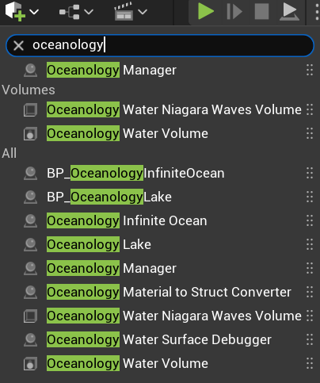
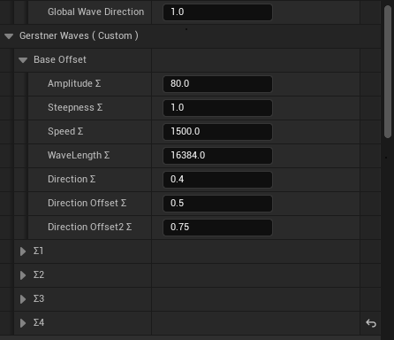
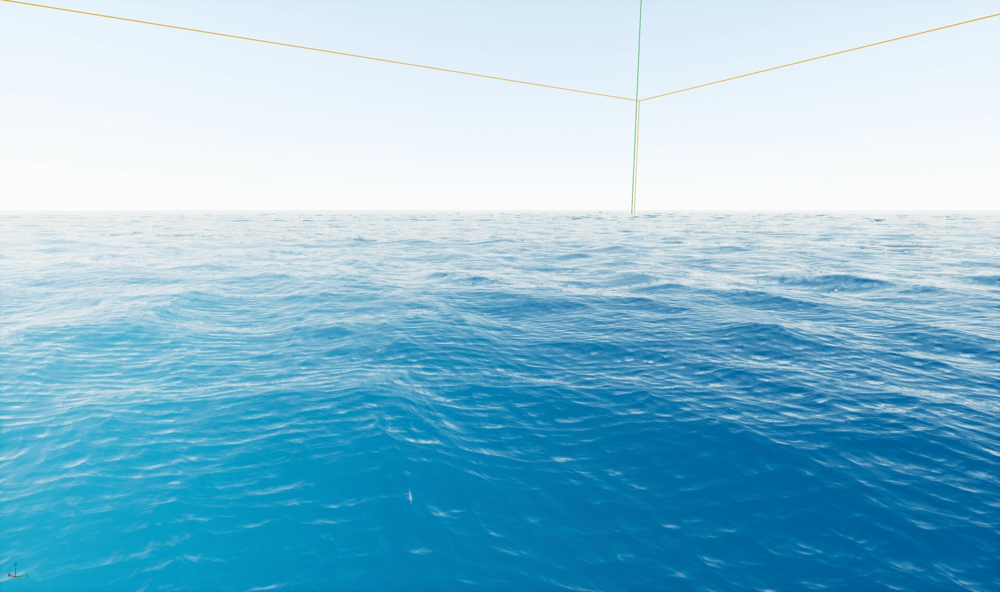
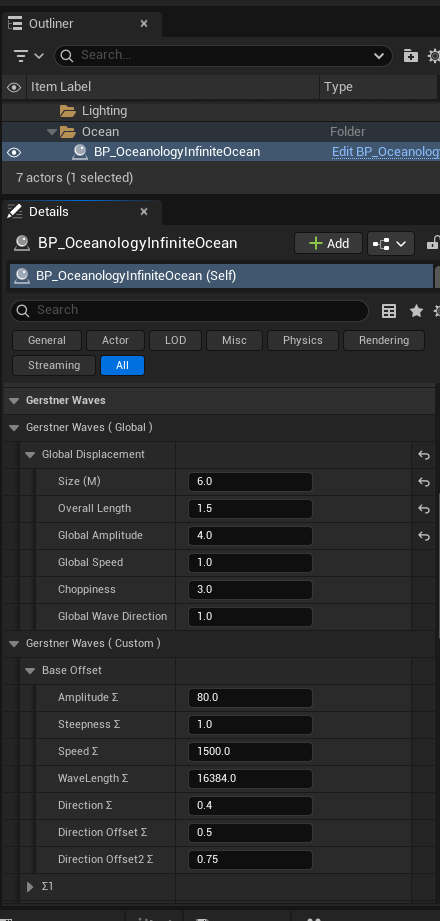
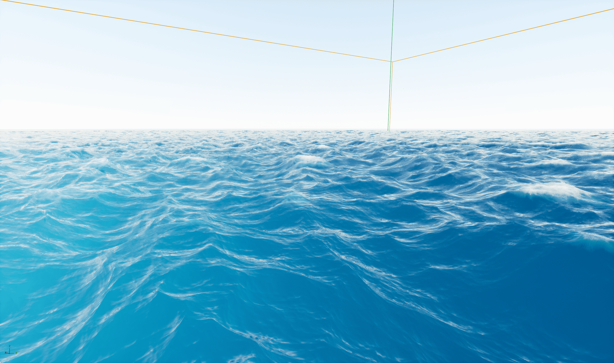

# Oceanology Legacy — Waves

_Last updated: 2025-12-08_

## Prerequisites
- Unreal Engine 5.6 or newer.
- **Oceanology Legacy** installed and configured (see the **Setup** page).
- At least one **Oceanology Legacy** water body placed in your level (infinite ocean or lake).
- Basic familiarity with **Blueprints** and **material parameters** in Unreal Engine.

## Notes
- Oceanology Legacy uses **Gerstner Waves** to simulate realistic ocean surface displacement. Gerstner waves are a mathematical model that creates the characteristic circular motion of water particles, producing natural-looking wave peaks and troughs.
- The wave system is divided into two control levels: **Global parameters** that affect the entire ocean uniformly, and **Custom parameters** that allow fine-tuning of individual wave layers.
- Oceanology Legacy supports **4 wave layers (Σ1–Σ4)** that combine to create complex, organic wave patterns. Each layer can have different amplitude, speed, wavelength, and direction.
- Wave parameters directly affect **Buoyancy** calculations — any changes to wave settings will influence how objects float and respond to the water surface.

---

## Step-by-step

:::note 1. Add an Oceanology water body to your level
Open your level and use the **Quickly Add to the Project** menu (the `+` button in the toolbar or right-click in the viewport). Type `oceanology` in the search field to filter the available actors.

You will see several Oceanology actors available:

**Core Actors:**
- **Oceanology Manager** — The central controller for all Oceanology systems. Required for waves and other features to function.
- **Oceanology Water Volume** — Defines regions for buoyancy and underwater effects.

**Water Bodies:**
- **BP_OceanologyInfiniteOcean** — An infinite ocean water body with full wave simulation. Use this for open sea environments.
- **BP_OceanologyLake** — A bounded lake water body. Lakes can also have wave settings but typically use calmer configurations.
- **Oceanology Infinite Ocean** — Alternative infinite ocean actor.
- **Oceanology Lake** — Alternative lake actor.

**Utility Actors:**
- **Oceanology Water Niagara Waves Volume** — Enables Niagara-based wave effects in specific regions.
- **Oceanology Material to Struct Converter** — Utility for converting material parameters.
- **Oceanology Water Surface Debugger** — Visualizes wave calculations for debugging.

For this guide, drag **BP_OceanologyInfiniteOcean** into your scene along with the **Oceanology Manager**.

:::

---

## Configuring Gerstner Waves

The wave system is controlled through the **Gerstner Waves** category in the water body's Details panel. Parameters are organized into **Global** settings (affecting all waves uniformly) and **Custom** settings (per-layer control).

:::note 2. Access the Gerstner Waves settings
Select **BP_OceanologyInfiniteOcean** in the **Outliner**. In the **Details** panel, locate the **Gerstner Waves** category. This section contains all wave-related parameters.

**Gerstner Waves (Global)** controls the overall wave behavior:

| Parameter | Default | Description |
|-----------|---------|-------------|
| **Size (M)** | `8.0` | The overall scale of the wave mesh in meters. Larger values create broader wave patterns. |
| **Overall Length** | `1.0` | Multiplier for wave wavelength. Higher values stretch waves horizontally. |
| **Global Amplitude** | `1.0` | Master multiplier for wave height. Affects all wave layers proportionally. |
| **Global Speed** | `1.0` | Master multiplier for wave animation speed. Higher values make waves move faster. |
| **Choppiness** | `3.0` | Controls horizontal displacement of wave peaks. Higher values create sharper, more defined crests. |
| **Global Wave Direction** | `1.0` | Master direction offset applied to all wave layers. |

These global parameters provide quick, high-level control over the ocean's appearance without needing to adjust individual wave layers.

:::

:::note 3. Understand the Custom wave parameters
Below the Global settings, you will find **Gerstner Waves (Custom)** which provides fine-grained control over wave behavior.

**Base Offset** parameters define the foundational wave characteristics that individual layers modify:

| Parameter | Default | Description |
|-----------|---------|-------------|
| **Amplitude Σ** | `80.0` | Base amplitude value that wave layers scale from. Higher values increase overall wave height. |
| **Steepness Σ** | `1.0` | Base steepness factor. Controls how peaked vs. rounded the waves appear. |
| **Speed Σ** | `1500.0` | Base speed value in units per second. Individual layers modify this value. |
| **WaveLength Σ** | `16384.0` | Base wavelength in Unreal units. Determines the distance between wave peaks. |
| **Direction Σ** | `0.4` | Base direction angle. Combined with per-layer offsets to create varied wave directions. |
| **Direction Offset Σ** | `0.5` | First direction variation offset. |
| **Direction Offset2 Σ** | `0.75` | Second direction variation offset. |

**Wave Layers (Σ1–Σ4):**
The four expandable sections (Σ1, Σ2, Σ3, Σ4) allow individual control of each wave layer. Each layer contributes to the final wave pattern, creating complex interference patterns when combined.

:::

:::note 4. Preview the default wave configuration
With the default settings, the ocean displays gentle, rolling waves suitable for calm sea conditions. The default configuration prioritizes visual appeal and performance balance.

**Default Configuration Summary:**
- **Size:** 8.0 meters
- **Overall Length:** 1.0 (standard wavelength)
- **Global Amplitude:** 1.0 (baseline height)
- **Choppiness:** 3.0 (moderate peak definition)

This configuration works well for general-purpose ocean scenes, background water, and scenarios where buoyancy interactions should feel stable and predictable.

:::

---

## Creating Dramatic Stormy Waves

By adjusting the Global parameters, you can dramatically change the ocean's character from calm to stormy.

:::note 5. Configure stormy wave settings
To create more dramatic, stormy waves, modify the **Gerstner Waves (Global)** parameters:

| Parameter | Default | Stormy | Effect |
|-----------|---------|--------|--------|
| **Size (M)** | `8.0` | `6.0` | Smaller size creates tighter, more frequent wave patterns |
| **Overall Length** | `1.0` | `1.5` | Increased length stretches waves for longer swells |
| **Global Amplitude** | `1.0` | `4.0` | 4x amplitude creates significantly taller waves |
| **Global Speed** | `1.0` | `1.0` | Speed unchanged (adjust for faster storm dynamics) |
| **Choppiness** | `3.0` | `3.0` | Choppiness unchanged (increase for sharper peaks) |

The key changes are:
1. **Reduced Size** — Creates more wave frequency across the surface.
2. **Increased Overall Length** — Produces longer, more dramatic swells.
3. **Quadrupled Global Amplitude** — Dramatically increases wave height for stormy appearance.

These settings produce an aggressive ocean surface with whitecaps and steep wave faces, suitable for storm sequences, dramatic ship battles, or survival scenarios.

:::

:::note 6. Preview the stormy wave result
The modified settings create a visibly more turbulent ocean surface with:
- **Higher wave peaks** — More pronounced vertical displacement
- **Deeper troughs** — Increased contrast between peaks and valleys
- **More whitecaps** — Foam appears on wave crests due to steeper angles
- **Dynamic movement** — The surface feels more alive and threatening

**Important Considerations:**
- Higher amplitude waves will cause buoyant objects to rock more dramatically.
- Ships and boats will experience increased pitch and roll motion.
- Swimming characters may have difficulty maintaining position.
- Performance impact is minimal since wave calculations are GPU-based.

:::

---

## Wave Parameter Reference

### Global Displacement Parameters

| Parameter | Range | Description |
|-----------|-------|-------------|
| **Size (M)** | `1.0` – `20.0` | Wave mesh scale. Lower = tighter patterns, Higher = broader patterns |
| **Overall Length** | `0.1` – `5.0` | Wavelength multiplier. Higher values create longer swells |
| **Global Amplitude** | `0.0` – `10.0` | Master height multiplier. 0 = flat, 10 = extreme waves |
| **Global Speed** | `0.0` – `5.0` | Animation speed. 0 = frozen, 5 = very fast |
| **Choppiness** | `0.0` – `10.0` | Horizontal displacement. Higher = sharper peaks |
| **Global Wave Direction** | `0.0` – `1.0` | Direction offset for all layers |

### Base Offset Parameters

| Parameter | Range | Description |
|-----------|-------|-------------|
| **Amplitude Σ** | `0.0` – `500.0` | Base amplitude for layer calculations |
| **Steepness Σ** | `0.0` – `2.0` | Wave steepness factor |
| **Speed Σ** | `0.0` – `5000.0` | Base animation speed |
| **WaveLength Σ** | `1000.0` – `50000.0` | Base distance between peaks |
| **Direction Σ** | `0.0` – `1.0` | Primary wave direction |
| **Direction Offset Σ** | `0.0` – `1.0` | Secondary direction variation |
| **Direction Offset2 Σ** | `0.0` – `1.0` | Tertiary direction variation |

---

## Preset Configurations

The following presets demonstrate common wave scenarios:

| Scenario | Size | Length | Amplitude | Speed | Choppiness |
|----------|------|--------|-----------|-------|------------|
| **Calm Lake** | `10.0` | `0.5` | `0.3` | `0.5` | `1.0` |
| **Default Ocean** | `8.0` | `1.0` | `1.0` | `1.0` | `3.0` |
| **Choppy Seas** | `6.0` | `1.2` | `2.0` | `1.2` | `5.0` |
| **Stormy Ocean** | `6.0` | `1.5` | `4.0` | `1.0` | `3.0` |
| **Hurricane** | `4.0` | `2.0` | `8.0` | `1.5` | `7.0` |
| **Gentle Swells** | `12.0` | `2.0` | `1.5` | `0.7` | `2.0` |

**Usage Tips:**
1. Start with a preset close to your desired effect, then fine-tune individual parameters.
2. Test wave settings with buoyant objects to ensure gameplay feels correct.
3. Consider performance on target hardware when using extreme settings.
4. Use the **Water Surface Debugger** actor to visualize wave calculations during development.

---

## Interaction with Other Systems

Wave settings affect multiple Oceanology systems:

| System | Interaction |
|--------|-------------|
| **Buoyancy** | Pontoons sample wave height for floating calculations. Higher waves = more dramatic rocking. |
| **Swimming** | Wave motion affects swimming character stability and movement. |
| **Underwater** | Wave surface determines the underwater/above-water boundary. |
| **Niagara Effects** | Foam, spray, and particle effects respond to wave steepness and motion. |
| **Audio** | Ocean audio can be linked to wave parameters for dynamic soundscapes. |

**Synchronization Note:** The wave system uses deterministic Gerstner calculations, ensuring that visual waves and buoyancy sampling remain perfectly synchronized. Objects float on the exact wave surface you see rendered.

---

## Troubleshooting Common Issues

| Problem | Likely Cause | Solution |
|---------|--------------|----------|
| Ocean appears completely flat | Global Amplitude set to 0 | Increase Global Amplitude to 1.0 or higher |
| Waves look stretched or distorted | Extreme Size or Length values | Reset to defaults (Size: 8.0, Length: 1.0) |
| Buoyant objects clip through water | Wave height exceeds pontoon sampling | Increase pontoon sampling frequency or reduce amplitude |
| Waves animate too fast/slow | Global Speed misconfigured | Adjust Global Speed (1.0 = normal) |
| Waves all move same direction | Direction parameters not varied | Adjust Direction Σ and Offset values for variety |
| Performance issues | Very high Choppiness with complex scenes | Reduce Choppiness or simplify scene geometry |
| Waves don't match in multiplayer | Non-deterministic settings | Ensure all clients use identical wave parameters |

---

## Summary

In this guide, you learned how to:

1. **Add Oceanology water bodies** — Place the Infinite Ocean and Manager actors in your level.
2. **Access wave settings** — Find the Gerstner Waves category in the water body's Details panel.
3. **Understand Global parameters** — Control overall wave scale, amplitude, speed, and choppiness.
4. **Understand Custom parameters** — Fine-tune base offsets and individual wave layers (Σ1–Σ4).
5. **Create calm vs. stormy seas** — Adjust parameters to achieve different ocean moods.
6. **Use preset configurations** — Apply common wave scenarios as starting points.
7. **Understand system interactions** — Recognize how waves affect buoyancy, swimming, and other features.

With this knowledge, you can create any ocean condition from tranquil lakes to hurricane-force storms, all while maintaining realistic buoyancy behavior for your vessels and characters.
