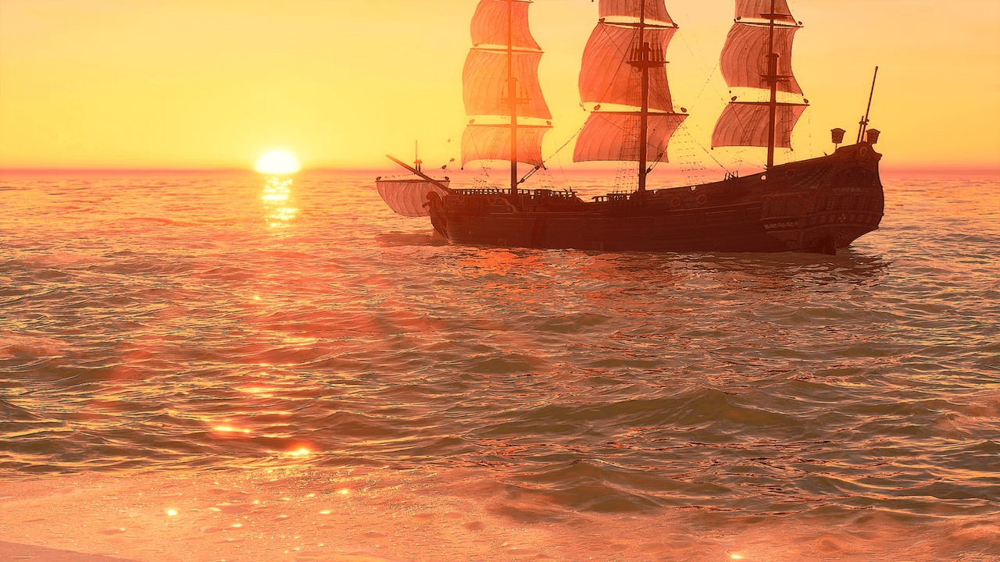

# Oceanology Legacy

Oceanology Legacy is a professional water solution for Unreal Engine. It focuses on predictable performance and clear controls so teams ship reliable results without surprises.

## Who it’s for
Game teams targeting a wide PC hardware range and stable 60–120 FPS.

## Highlights
- Optimized ocean surface rendering for smooth frame rates on mid‑range GPUs.
- Infinite and local ocean simulation for seas and small water bodies.
- Gerstner wave system with customizable wave profiles.
- Quadtree tessellation and World Partition compatibility for large maps.
- Basic coastal effects plus underwater volumetrics and post‑process.
- Dynamic audio analyzer and functional swimming with bubbles and transitions.
- RVT landscape integration for baked terrain interaction.
- Foundational multiplayer replication support.

## Requirements
- Unreal Engine 5.6 or newer.
- Windows with DirectX 12. Shader Model 6 recommended.

## Get started
Read the **Setup** guide to install and verify your first scene: [./setup.md](./setup.md)

## Support
Open a ticket via the Marketplace page or our Discord. Include engine version, plugin version, logs, and screenshots.