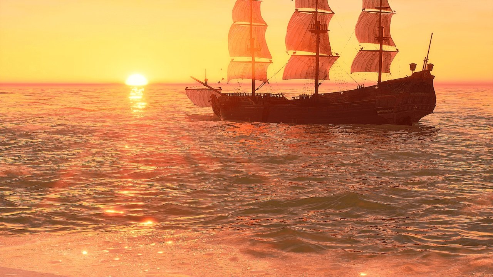

# Oceanology Legacy

🌊 Water Simulation

⚡ Optimized Performance

🎮 Game Ready

**Oceanology Legacy** is a production-ready water simulation system for Unreal Engine, optimized for broad hardware compatibility and consistent frame rates. Whether you're building action games, exploration experiences, or multiplayer projects that need to run smoothly on mid-range PCs, Oceanology Legacy delivers reliable water rendering without sacrificing visual quality.

---

## Who It's For

Oceanology Legacy is designed for teams who need water that performs consistently:

| Target | Use Case |
|--------|----------|
| **Game Studios** | Targeting 60-120 FPS on mid-range hardware while maintaining visual quality |
| **Indie Developers** | Accessible setup with clear controls and predictable behavior |
| **Multiplayer Projects** | Foundational replication support for synchronized water states |
| **Large World Projects** | Quadtree tessellation and World Partition compatibility |

---

## Core Features

### 🌊 Wave Simulation

- **Gerstner Wave System** - Four customizable wave layers (Σ1-Σ4) for complex, organic wave patterns
- **Customizable Wave Profiles** - Full control over amplitude, speed, wavelength, and direction
- **Deterministic Calculations** - Synchronized wave states for multiplayer and buoyancy systems

### ⚡ Performance & Scalability

- **Optimized Rendering** - Smooth frame rates on mid-range GPUs without sacrificing quality
- **Quadtree Tessellation** - Dynamic mesh density based on camera distance
- **World Partition Support** - Native streaming for large open worlds

### 🎨 Visual Effects

- **Underwater Volumetrics** - Light scattering, caustics, and post-process effects
- **Surface Rendering** - Reflections, refractions, and depth-based coloring
- **RVT Landscape Integration** - Runtime Virtual Texture support for seamless shoreline blending

### 🎮 Gameplay Systems

- **Pontoon Buoyancy** - Physics-accurate floating with configurable density and damping
- **Swimming System** - Complete character swimming with bubbles, transitions, and surface detection
- **Navigation** - Water-aware AI navigation support

### 🔧 Workflow & Flexibility

- **Presets System** - Save and load complete water configurations
- **Multiple Water Bodies** - Infinite oceans and local water bodies with independent settings
- **Dynamic Audio** - Audio analyzer for wave-driven soundscapes

---

## Technical Requirements

| Requirement | Specification |
|-------------|---------------|
| **Engine** | Unreal Engine 5.3 or newer |
| **Platform** | Windows, Mac, Linux |
| **Graphics API** | DirectX 12 (Shader Model 6 recommended) |
| **Hardware** | Mid-range GPU (GTX 1080 / RTX 3060+) or better |

---

## Documentation Structure

This documentation is organized to get you productive quickly:

| Section | Description |
|---------|-------------|
| **[Setup](./setup.md)** | Installation, project configuration, and first scene verification |
| **[Waves](./Waves.md)** | Gerstner wave parameters, presets, and wave layer customization |
| **[Buoyancy](./Buoyancy.md)** | Pontoon-based floating physics for vessels and objects |
| **[Swimming](./Swimming.md)** | Character swimming component setup, bubbles, and transitions |
| **[Underwater](./Underwater.md)** | Volumetric effects, post-processing, and caustics |
| **[Surface](./Surface.md)** | Water surface rendering, reflections, and refractions |
| **[QuadTreeCPU](./QuadTreeCPU.md)** | CPU-based quadtree tessellation and LOD configuration |
| **[Navigation](./Navigation.md)** | Water-aware AI navigation setup |
| **[Presets](./Presets.md)** | Saving, loading, and managing water presets |
| **[RVTHeightmap](./RVTHeightmap.md)** | Runtime Virtual Texture and landscape integration |

---

## Quick Start

<ol className="doc-steps">
  <li><strong>Install the Plugin</strong> - Enable Oceanology Legacy in your project's Plugins menu</li>
  <li><strong>Add Water to Your Level</strong> - Use Quick Add (+) and search for BP_OceanologyInfiniteOcean</li>
  <li><strong>Add the Manager</strong> - Place an Oceanology Manager actor to initialize the system</li>
  <li><strong>Configure Water Volume</strong> - Add an Oceanology Water Volume for buoyancy and swimming</li>
  <li><strong>Play</strong> - Enter Play mode to see your ocean in action</li>
</ol>

For detailed instructions, see the **[Setup Guide](./setup.md)**.

---

## Legacy vs NextGen

| Feature | Legacy | NextGen |
|---------|--------|---------|
| **Target Hardware** | Mid-range GPUs (GTX 1080 / RTX 3060+) | High-end GPUs (RTX 3080 / RTX 4070+) |
| **Wave System** | Gerstner (4 layers) | Spectral Gerstner + FFT |
| **Performance Focus** | 60-120 FPS on broad hardware | Maximum visual quality |
| **Shore Waves** | Basic coastal effects | Math-based breaking waves |
| **Best For** | Games, multiplayer, compatibility | Cinematics, AAA visuals |

:::tip Choosing the Right Version
Choose **Legacy** for reliable performance across diverse hardware. Choose **NextGen** for cutting-edge visuals on high-end systems.
:::

---

## Support & Community

  <h3>Need Help?</h3>
  
Join our Discord community for real-time support and discussions.

  <a href="https://discord.gg/VHJGBDR2as" target="_blank" rel="noopener noreferrer" className="btn btn-primary">Join Discord</a>

**Additional Resources:**
- **[Discord](https://discord.gg/VHJGBDR2as)** - Real-time community support
- **[FAB Store](https://www.fab.com/listings/1cd1f62e-0fa3-48bf-bc60-f0e06010fce3)** - Purchase and updates
- **Issue Reports** - Include engine version, plugin version, logs, and screenshots

---

**Ready to dive in?** Start with the **[Setup Guide →](./setup.md)**

