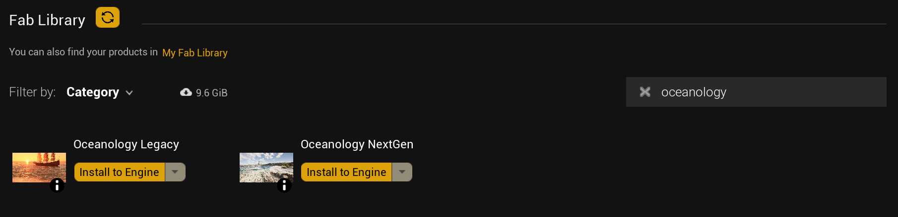
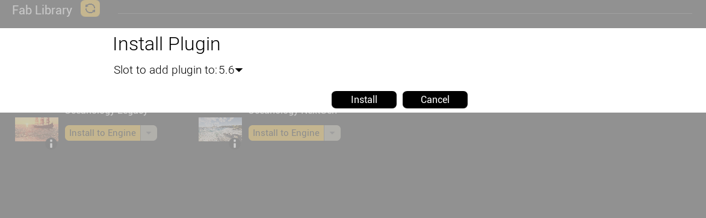
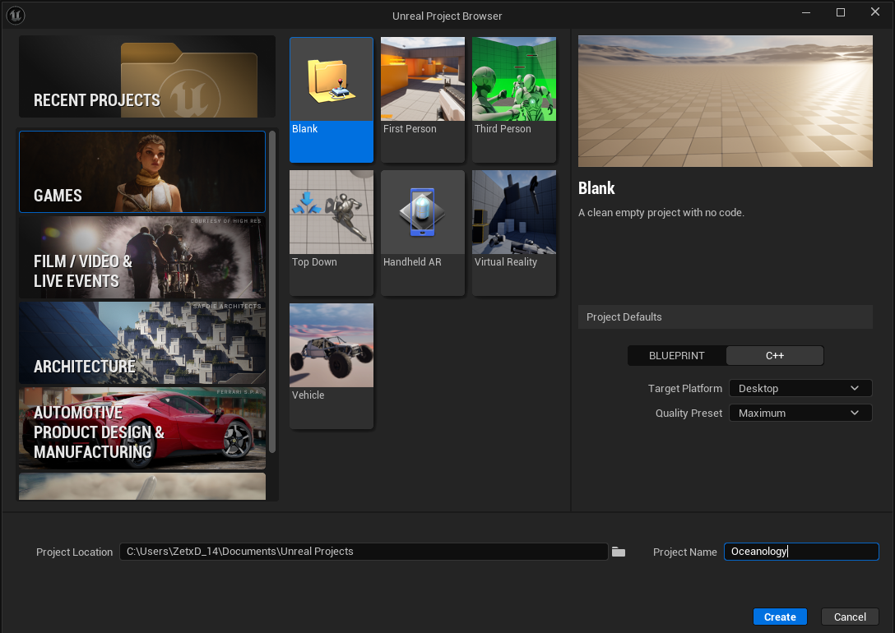
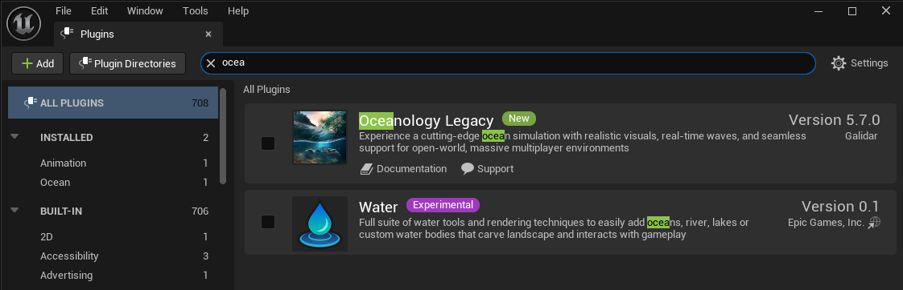
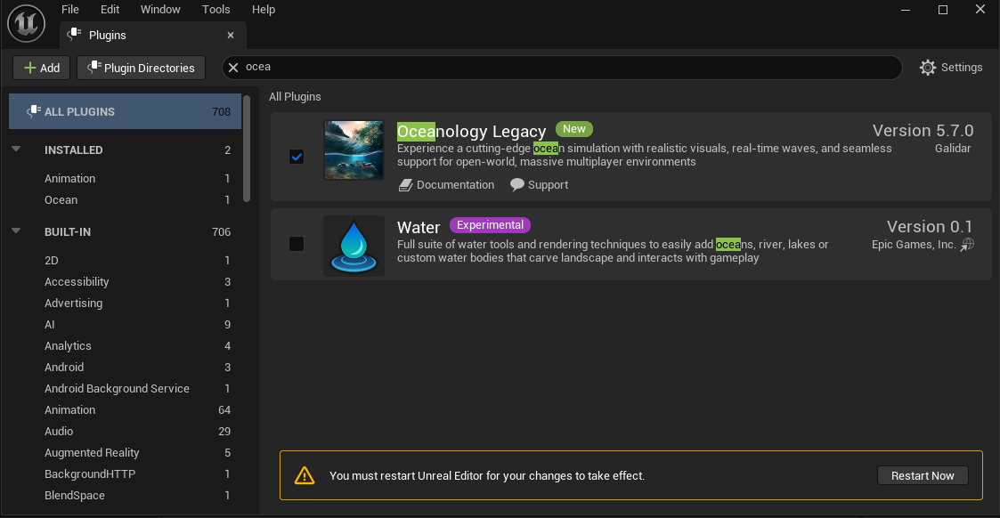
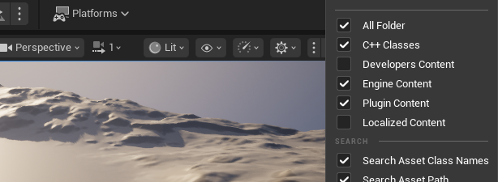
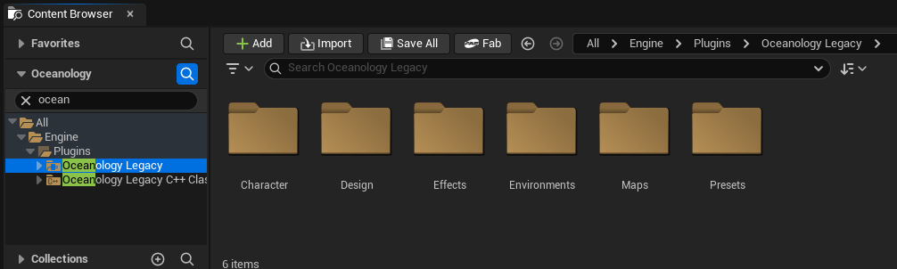

# Oceanology Legacy - Setup

📋 Step-by-Step Guide

⏱️ 10 Minutes

Get Oceanology Legacy up and running in your Unreal Engine project with this comprehensive setup guide.

---

## Prerequisites

Before you begin, ensure you have:

| Requirement | Details |
|-------------|---------|
| **Unreal Engine** | Version 5.3 or newer |
| **Operating System** | Windows with DirectX 12 capable GPU (GTX 1080 / RTX 3060+) |
| **Shader Model** | SM6 support recommended for advanced features |
| **Optional** | Mesh Distance Fields for shoreline effects |

:::info Legacy Focus
Oceanology Legacy focuses on classic ocean rendering with streamlined settings, optimized for performance across a wide range of hardware.
:::

---

## Installation Steps

### Step 1: Install the Plugin

Install from the FAB Marketplace into your Engine, or copy the plugin folder into `<Project>/Plugins/`.

If you manually copied files, restart the editor to load the plugin.

---

### Step 2: Enable the Plugin

1. Open **Edit → Plugins**
2. Search for **Oceanology Legacy**
3. Enable the plugin and accept the restart prompt
4. After restart, confirm there are no missing dependencies in the Output Log

---

### Step 3: Configure Project Settings

Navigate to **Edit → Project Settings** and configure the following:

#### Required Settings

| Category | Setting | Value |
|----------|---------|-------|
| **Platforms → Windows** | Default RHI | DirectX 12 |
| **Platforms → Windows** | D3D12 Shader Model 6 | ✅ Enabled |
| **Engine → Rendering** | Generate Mesh Distance Fields | ✅ Enabled |

#### Recommended Settings

| Category | Setting | Value |
|----------|---------|-------|
| **Engine → Rendering** | Global Illumination | Lumen |
| **Engine → Rendering** | Reflections | Lumen |
| **Engine → Rendering** | Shadow Map Method | Virtual Shadow Maps |

---

### Step 4: Open a Demo Map

Verify the installation by opening a demo map:

1. Open **Content Drawer**
2. Navigate to **Plugins → Oceanology Legacy → Maps**
3. Open **Legacy Example Map**
4. Wait for shaders to compile

This step ensures all assets load correctly and shaders compile for your system.

---

### Step 5: Place the Ocean

Add the ocean to your own level:

1. Open **Place Actors** panel
2. Search for **Legacy Ocean**
3. Drag it into your level
4. Scale and position to cover your playable area

:::tip Large Worlds
For expansive maps, use World Partition for optimal streaming performance.
:::

---

### Step 6: Apply Material Instance

Configure the water's appearance:

1. Select the ocean actor
2. Locate the **Material** section in Details
3. Use the provided material instance from plugin content
4. Customize:
   - Wave height and length
   - Foam thresholds
   - Normal intensity
   - Water color and transparency

---

### Step 7: Add Interactions

Enhance your ocean with gameplay features:

| Feature | Purpose |
|---------|---------|
| **Collision** | Enable if gameplay requires physical interaction |
| **Niagara Systems** | Add splash and foam particle effects |
| **Audio Cues** | Implement wave and ambient ocean sounds |

---

### Step 8: Test Your Setup

1. Save your level (**Ctrl+S**)
2. Click **Play In Editor**
3. Verify the ocean renders correctly
4. Test camera movement above and below water

---

## Troubleshooting

:::warning Common Issues

**Pink/Preview Materials**
Shaders are still compiling. Wait for compilation to complete - check the progress in the bottom-right corner of the editor.

**No Shoreline Foam**
Enable **Generate Mesh Distance Fields** in Project Settings and ensure distance fields are built for your landscape and static meshes.

**DX12/SM6 Errors**
Verify Project Settings are configured correctly and restart the editor after changes.

**Low Performance**
- Disable expensive debug views
- Reduce wave/spectrum layers
- Profile GPU usage with `stat gpu`
- Update graphics drivers

:::

---

## Next Steps

Now that Oceanology Legacy is set up, explore these features:

| Guide | Learn About |
|-------|-------------|
| **[Waves](./Waves.md)** | Configure Gerstner wave parameters |
| **[Buoyancy](./Buoyancy.md)** | Add floating physics to objects |
| **[Swimming](./Swimming.md)** | Implement character swimming |
| **[Underwater](./Underwater.md)** | Set up underwater effects |

---

  <h3>Need Help?</h3>
  
Join our Discord community for setup assistance and troubleshooting.

  <a href="https://discord.gg/VHJGBDR2as" target="_blank" rel="noopener noreferrer" className="btn btn-primary">Get Support</a>

