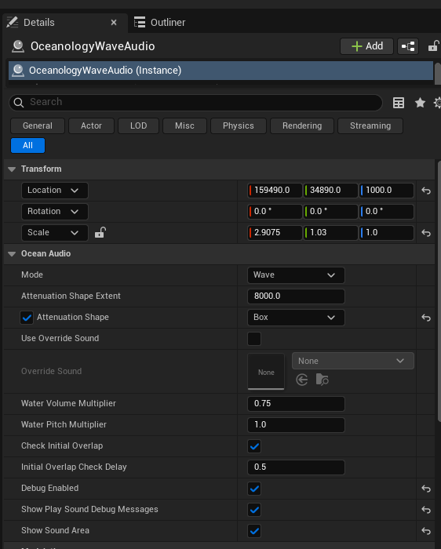

# Oceanology Next-Gen — Wave Audio

_Last updated: 2025-12-13_

## Prerequisites
- Unreal Engine 5.5 or newer.
- **Oceanology** installed and configured (see the **Setup** page).
- At least one **Oceanology** water body placed in your level (infinite ocean or lake).
- Basic familiarity with **audio systems** and **volumes** in Unreal Engine.

## Notes
- The Wave Audio system in Oceanology provides spatialized ocean sound effects that respond to the player's position relative to the water. This creates immersive audio environments where wave sounds change based on proximity and location.
- The system uses attenuation volumes to control how sound fades in and out as the player moves toward or away from the water.
- You can customize the audio behavior with different modes, volume multipliers, and pitch adjustments to match your project's audio design.

---

## Step-by-step

:::note 1. Add the Wave Audio actor to your scene
Open your level and use the **Quickly Add to the Project** menu (the `+` button in the toolbar or right-click in the viewport). Type `Oceanology` in the search field to filter the available actors.

Scroll through the list to find the audio-related actors:

**Volumes:**
- **Oceanology Water Niagara Waves Volume** — Volume for Niagara wave particle effects.
- **Oceanology Water Volume** — General water interaction volume.

**All Actors:**
- **Oceanology Infinite Ocean** — The infinite ocean water body.
- **Oceanology Lake** — Bounded lake water body.
- **Oceanology Manager** — Central Oceanology controller.
- **Oceanology Wave Audio** — The wave sound effect actor. Select this to add ocean audio.

Drag **Oceanology Wave Audio** into your scene and position it where you want the ocean sounds to emanate from (typically along the shoreline or over the water surface).

:::

:::note 2. Configure the Wave Audio settings
Select the **OceanologyWaveAudio** actor in your scene. In the **Details** panel, you will find the following configuration options:

**Transform Settings:**
- **Location** — Position the audio source where wave sounds should originate. Example: `159490.0, 34890.0, 1000.0`
- **Rotation** — `0.0, 0.0, 0.0` (typically no rotation needed for ambient audio).
- **Scale** — `2.9075, 1.03, 1.0`. Adjust to change the audio volume shape proportions.

**Ocean Audio Settings:**

- **Mode** — `Wave`. Determines the type of ocean audio. Wave mode provides continuous ocean wave sounds.
- **Attenuation Shape Extent** — `8000.0`. The maximum distance from the audio source where sound is audible. Beyond this distance, the sound fades to silence.
- **Attenuation Shape** — ✅ `Box`. The shape of the attenuation volume. Box creates a rectangular audio zone ideal for shorelines.
- **Use Override Sound** — ❌ Disabled. When enabled, allows using a custom sound asset instead of the default wave audio.
- **Override Sound** — `None`. Assign a custom Sound Wave or Sound Cue here when Use Override Sound is enabled.

**Volume and Pitch:**
- **Water Volume Multiplier** — `0.75`. Controls the overall volume of the wave sounds. Range 0.0 to 1.0.
- **Water Pitch Multiplier** — `1.0`. Controls the pitch of the wave sounds. Values below 1.0 lower the pitch, above 1.0 raise it.

**Overlap Detection:**
- **Check Initial Overlap** — ✅ Enabled. Checks if the player starts inside the audio volume when the level loads.
- **Initial Overlap Check Delay** — `0.5`. Delay in seconds before checking initial overlap.

**Debug Options:**
- **Debug Enabled** — ✅ Enabled. Shows debug information at runtime.
- **Show Play Sound Debug Messages** — ✅ Enabled. Displays messages when sounds play or stop.
- **Show Sound Area** — ✅ Enabled. Visualizes the audio attenuation volumes in the viewport.

:::

:::note 3. Visualize the audio attenuation volumes
With **Show Sound Area** enabled in the Debug options, the viewport displays wireframe volumes representing the audio zones:

- **Magenta/Pink wireframe box** — Represents the **Attenuation Shape Extent**. This is the outer boundary of the audio zone. Sound begins to fade as the player approaches this boundary and is completely silent outside it.
- **Cyan wireframe box** — Represents the **inner audio zone**. Within this area, the wave audio plays at full volume (modified by the Water Volume Multiplier).

**Understanding the audio falloff:**
The space between the cyan inner box and the magenta outer box is the **falloff zone**. As the player moves from the inner zone toward the outer boundary, the audio volume gradually decreases until it reaches zero at the magenta boundary.

**Placement tips:**
- Position the audio actor so the inner zone covers the area where players should hear full-volume waves (near the shoreline, on the beach).
- Extend the outer attenuation to reach areas where players should hear distant wave sounds (further inland, elevated areas).
- Use the Scale transform to stretch the box along shorelines for consistent audio coverage.

:::

---

## Audio Mode Reference

| Mode | Description | Best Use Case |
|------|-------------|---------------|
| **Wave** | Continuous rolling wave sounds | Ocean shores, beaches, open water |
| **Underwater** | Muffled underwater ambience | Submerged gameplay areas |
| **Splash** | Impact and splash sound effects | Player entering/exiting water |

---

## Configuration Guidelines

| Setting | Recommended Value | Use Case |
|---------|------------------|----------|
| **Attenuation Shape Extent** | `5000 - 10000` | Large open beaches |
| **Attenuation Shape Extent** | `2000 - 5000` | Small coves, harbors |
| **Attenuation Shape** | `Box` | Shorelines, linear water edges |
| **Attenuation Shape** | `Sphere` | Circular ponds, pools |
| **Water Volume Multiplier** | `0.5 - 0.8` | Background ambient audio |
| **Water Volume Multiplier** | `0.9 - 1.0` | Prominent wave sounds |
| **Water Pitch Multiplier** | `0.8 - 0.9` | Deeper, larger waves |
| **Water Pitch Multiplier** | `1.1 - 1.2` | Lighter, smaller waves |

---

## Troubleshooting Common Issues

| Problem | Likely Cause | Solution |
|---------|--------------|----------|
| No audio plays | Player outside attenuation volume | Increase **Attenuation Shape Extent** or reposition actor |
| Audio too quiet | Volume multiplier too low | Increase **Water Volume Multiplier** |
| Audio cuts off suddenly | No falloff zone | Ensure outer box is larger than inner box |
| Audio plays everywhere | Attenuation extent too large | Reduce **Attenuation Shape Extent** |
| Wrong audio plays | Override Sound incorrectly set | Clear **Override Sound** or check asset assignment |
| Audio doesn't start on level load | Initial overlap check disabled | Enable **Check Initial Overlap** |
| Can't see debug volumes | Debug disabled | Enable **Show Sound Area** in Debug options |

---

## Summary

In this guide, you learned how to:

1. **Add Wave Audio to your scene** — Use the Quickly Add menu to find and place the OceanologyWaveAudio actor.
2. **Configure audio settings** — Adjust mode, attenuation, volume, and pitch for your desired audio experience.
3. **Visualize audio volumes** — Use debug options to see the attenuation and falloff zones in the viewport.

With Wave Audio properly configured, your ocean environments will have immersive, spatialized sound effects that respond naturally to player movement, enhancing the overall atmosphere of your water scenes.
