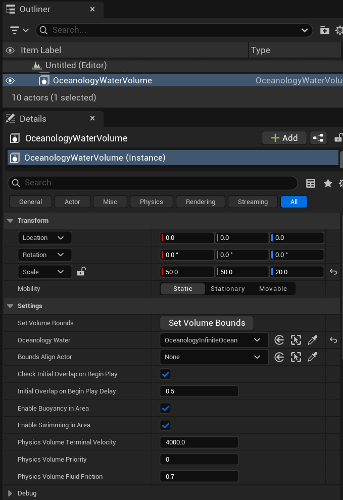
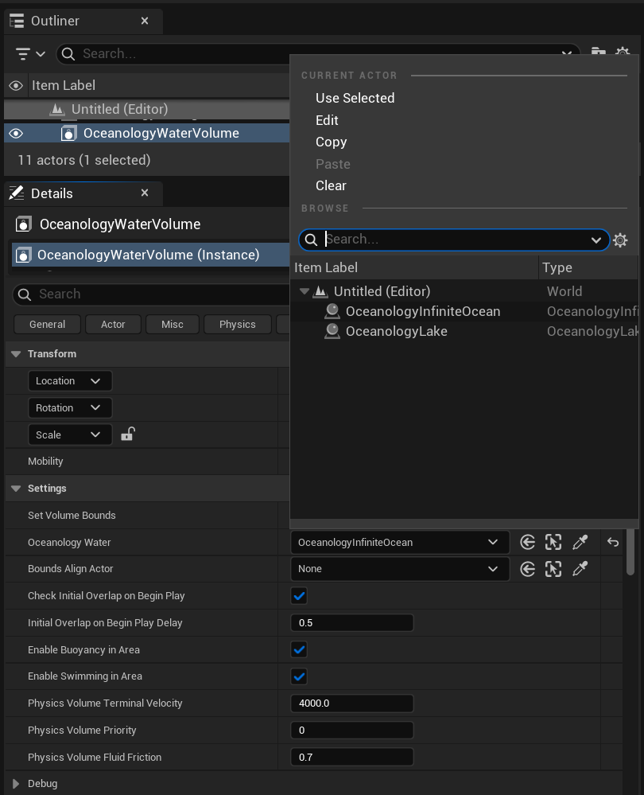
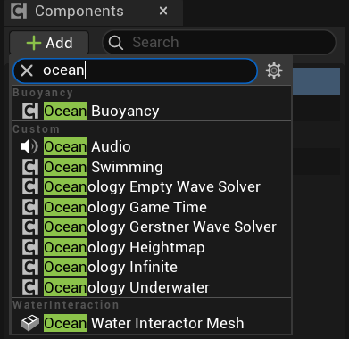
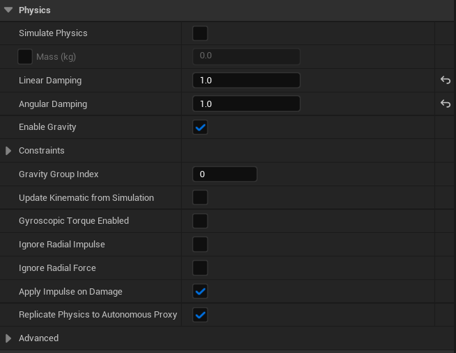
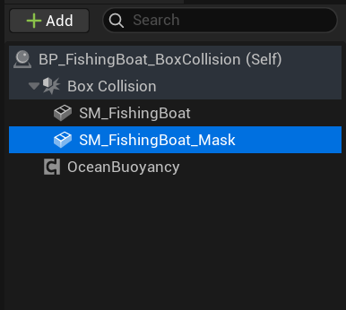
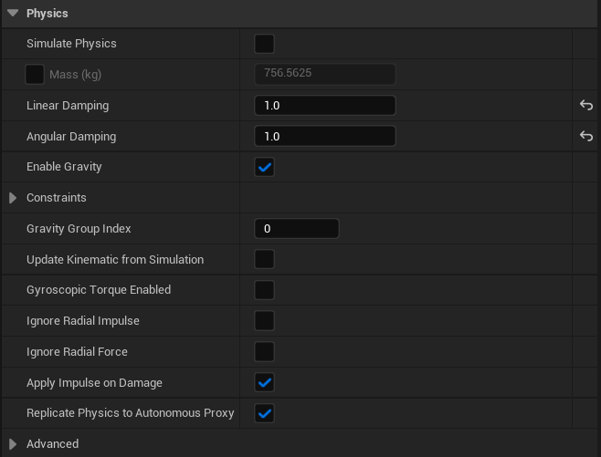
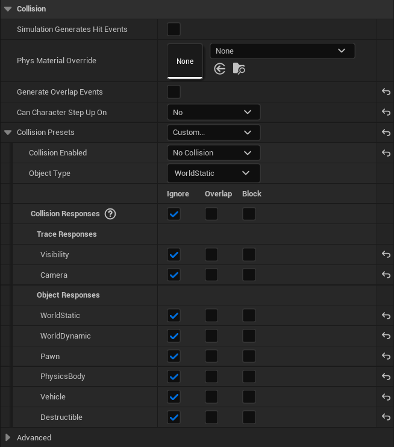
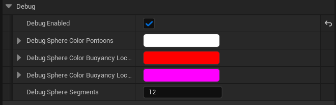

# Oceanology Next-Gen — Buoyancy

_Last updated: 2025-12-10_

## Prerequisites
- Unreal Engine 5.6 or newer.
- **Oceanology Next-Gen** installed and configured (see the **Setup** page).
- At least one **Oceanology Next-Gen** water body placed in your level (Infinite Ocean or Lake).
- Basic familiarity with **Blueprints**, **Physics**, and **Components** in Unreal Engine.

## Notes
- Oceanology Next-Gen uses a **pontoon-based buoyancy system** that simulates realistic floating behavior. Pontoons are virtual sampling points that query the water surface height and apply upward forces to keep objects afloat.
- The buoyancy system works in conjunction with **Oceanology Water Volume** actors, which define the regions where buoyancy and swimming are enabled.
- The **OceanBuoyancy** component can be added to any actor with physics enabled. It handles all buoyancy calculations, wave response, and optional flow physics.
- Proper physics and collision configuration on the root component is essential for realistic floating behavior. Child meshes should have physics disabled to avoid conflicts.
- The system supports **5 pontoons by default**, positioned at the corners and center of typical boat hulls. You can customize pontoon positions for any vessel shape.

---

## Step-by-step

:::note 1. Add an Oceanology Water Volume to your level
Open your level and use the **Quickly Add to the Project** menu (the `+` button in the toolbar or right-click in the viewport). Type `oceanology` in the search field to filter the available actors.

You will see several Oceanology actors available:

**Volumes:**
- **Oceanology Water Niagara Waves Volume** — Enables Niagara-based wave effects in specific regions.
- **Oceanology Water Volume** — Defines regions for buoyancy and underwater effects. Required for the buoyancy system.

**All Actors:**
- **BP_OceanologyChronos** — Time-of-day controller for dynamic lighting.
- **Oceanology Infinite Ocean** — An infinite ocean water body with full wave simulation.
- **Oceanology Lake** — A bounded lake water body.
- **Oceanology Light Source Controller** — Controls light source behavior with water.
- **Oceanology Manager** — The central controller for all Oceanology systems.
- **Oceanology Material to Struct Converter** — Utility for converting material parameters.
- **Oceanology Preset Converter Actor** — Converts presets between versions.
- **Oceanology Scrubber** — Utility actor for timeline scrubbing.
- **Oceanology Water Depth Debugger** — Visualizes water depth calculations.
- **Oceanology Water Interactor** — Enables interaction effects with water.
- **Oceanology Water Niagara Waves Volume** — Niagara wave effects volume.
- **Oceanology Water Surface Debugger** — Visualizes wave calculations for debugging.
- **Oceanology Water Volume** — Water physics volume.
- **Oceanology Wave Audio** — Dynamic audio based on wave conditions.

For buoyancy to work, you need both a water body (Infinite Ocean or Lake) and an **Oceanology Water Volume** that encompasses the area where floating objects will exist.


:::

:::note 2. Configure the Oceanology Water Volume
Select **OceanologyWaterVolume** in the **Outliner**. In the **Details** panel, you will see the **Transform** and **Settings** categories.

**Transform Settings:**
Configure the volume's position, rotation, and scale to cover your gameplay area. The default scale of `50.0 x 50.0 x 20.0` creates a volume of 5000 x 5000 x 2000 Unreal units. Set **Mobility** to `Static` for best performance.

**Settings Parameters:**

| Parameter | Default | Description |
|-----------|---------|-------------|
| **Set Volume Bounds** | Button | Click to automatically calculate volume bounds based on the selected water body. |
| **Oceanology Water** | `OceanologyInfiniteOcean` | Reference to the water body this volume is associated with. |
| **Bounds Align Actor** | `None` | Optional actor to align the volume bounds with. |
| **Check Initial Overlap on Begin Play** | `✓` | When enabled, checks for overlapping actors when the game starts. |
| **Initial Overlap on Begin Play Delay** | `0.5` | Delay in seconds before checking initial overlaps. |
| **Enable Buoyancy in Area** | `✓` | Master toggle for buoyancy within this volume. Must be enabled for floating objects. |
| **Enable Swimming in Area** | `✓` | Enables swimming mechanics for characters within this volume. |
| **Physics Volume Terminal Velocity** | `4000.0` | Maximum falling speed for objects within the volume. |
| **Physics Volume Priority** | `0` | Priority level when multiple volumes overlap. |
| **Physics Volume Fluid Friction** | `0.7` | Friction applied to objects moving through the water volume. |

Ensure **Enable Buoyancy in Area** is checked for floating objects to work correctly.


:::

:::note 3. Link the Water Volume to your water body
Click the dropdown next to **Oceanology Water** to select which water body this volume should reference. The browser will show all available Oceanology water bodies in your level.

**Available Options:**
- **Use Selected** — Uses the currently selected actor in the viewport.
- **Edit** — Opens the referenced asset for editing.
- **Copy** — Copies the reference.
- **Paste** — Pastes a copied reference.
- **Clear** — Removes the reference.

In the **Browse** section, you will see water bodies present in your level:
- **OceanologyInfiniteOcean** — The infinite ocean actor.
- **OceanologyLake** — Lake actors if present.

Select the appropriate water body for your scene. For open ocean environments, choose **OceanologyInfiniteOcean**.


:::

---

## Adding Buoyancy to Vessels

Oceanology Next-Gen includes prefab vessels ready for buoyancy, and you can also add buoyancy to your own actors.

:::note 4. Locate the prefab vessels
In the **Content Browser**, navigate to:
`Plugins > OCEANOLOGY NEXT-GEN > Design > Ocean > Blueprints > Prefabs`

Here you will find several ready-to-use vessel Blueprints:

| Prefab | Description |
|--------|-------------|
| **BP_FishingBoat_BoxCollision** | Fishing boat using box collision for physics. Recommended for most use cases. |
| **BP_FishingBoat_Custom_Collision** | Fishing boat with custom collision mesh for more accurate physics. |
| **BP_Floating_VillageBoat** | Traditional village-style boat. |
| **BP_MossyBoat** | Weathered boat with moss details. |
| **BP_Raft** | Simple wooden raft platform. |

These prefabs demonstrate the correct component hierarchy and physics setup for buoyant vessels.


:::

:::note 5. Add the OceanBuoyancy component
To add buoyancy to any actor, open the Blueprint and click **+ Add** in the **Components** panel. Type `ocean` in the search field to filter available components.

**Buoyancy Components:**
- **Ocean Buoyancy** — The main buoyancy component that handles floating physics.

**Custom Components:**
- **Ocean Audio** — Adds dynamic ocean audio to the actor.
- **Ocean Swimming** — Enables swimming behavior for characters.
- **Oceanology Empty Wave Solver** — Base wave solver for custom implementations.
- **Oceanology Game Time** — Syncs actor with game time.
- **Oceanology Gerstner Wave Solver** — Gerstner wave calculation component.
- **Oceanology Heightmap** — Heightmap-based water surface sampling.
- **Oceanology Infinite** — Infinite ocean mesh component.
- **Oceanology Underwater** — Underwater effects component.

**Water Interaction:**
- **Ocean Water Interactor Mesh** — Enables mesh-based water interaction effects.

Select **Ocean Buoyancy** to add it to your actor.


:::

:::note 6. Understand the component hierarchy
After adding the **OceanBuoyancy** component, your vessel Blueprint should have a hierarchy similar to:

```
BP_FishingBoat_BoxCollision (Self)
├── Box Collision          ← Root component (physics enabled)
│   ├── SM_FishingBoat     ← Visual mesh (physics disabled)
│   └── SM_FishingBoat_Mask ← Water mask mesh (physics disabled)
└── OceanBuoyancy          ← Buoyancy component
```

**Key Points:**
- The **root component** (Box Collision) handles all physics simulation.
- **Child meshes** should have physics disabled to prevent conflicts.
- The **OceanBuoyancy** component can be placed anywhere in the hierarchy but typically sits at the root level.
- The **Mask mesh** is used for underwater rendering effects and should have no collision.


:::

---

## Configuring Physics for the Root Component

The root component requires specific physics settings for buoyancy to function correctly.

:::note 7. Configure the root component physics
Select the **Box Collision** (root component) in the Components panel. In the **Details** panel, locate the **Physics** category.

**Required Physics Settings:**

| Parameter | Value | Description |
|-----------|-------|-------------|
| **Simulate Physics** | `✓` | **Must be enabled.** This allows the physics engine to move the object. |
| **Mass (kg)** | Auto-calculated | The mass is calculated from the collision volume and density. For the fishing boat, approximately `1146.53 kg`. |
| **Linear Damping** | `1.0` | Reduces linear velocity over time. Higher values make the boat settle faster. |
| **Angular Damping** | `1.0` | Reduces rotational velocity. Prevents excessive spinning. |
| **Enable Gravity** | `✓` | Gravity must be enabled for buoyancy forces to counteract it. |

**Advanced Settings:**
- **Gravity Group Index:** `0` — Uses default gravity.
- **Update Kinematic from Simulation:** `☐` — Not needed for dynamic physics.
- **Gyroscopic Torque Enabled:** `☐` — Optional, can add realism for spinning objects.
- **Apply Impulse on Damage:** `✓` — Enables physics response to damage events.
- **Replicate Physics to Autonomous Proxy:** `✓` — Required for multiplayer replication.

The combination of **Simulate Physics** enabled with appropriate damping values creates smooth, realistic floating behavior.


:::

:::note 8. Configure the root component collision
With the **Box Collision** (root component) still selected, scroll down to the **Collision** category in the Details panel.

**Collision Settings:**

| Parameter | Value | Description |
|-----------|-------|-------------|
| **Simulation Generates Hit Events** | `☐` | Optional. Enable if you need to respond to collision hits in Blueprints. |
| **Phys Material Override** | `None` | Optional physical material for custom friction/restitution. |
| **Generate Overlap Events** | `✓` | **Required.** Enables overlap detection with Water Volumes. |
| **Can Character Step Up On** | `Yes` | Allows characters to walk on the vessel deck. |

**Collision Presets:**

| Parameter | Value | Description |
|-----------|-------|-------------|
| **Collision Presets** | `Custom...` | Use custom settings for full control. |
| **Collision Enabled** | `Collision Enabled (Query and Physics)` | Enables both physics collision and overlap queries. |
| **Object Type** | `PhysicsBody` | Identifies this as a physics-simulated object. |

**Collision Responses:**
The collision matrix determines how this object interacts with different object types.

| Channel | Ignore | Overlap | Block |
|---------|--------|---------|-------|
| **Trace Responses** | | | |
| — Visibility | ✓ | | |
| — Camera | ✓ | | |
| **Object Responses** | | | |
| — WorldStatic | | | ✓ |
| — WorldDynamic | | ✓ | |
| — Pawn | ✓ | | |
| — PhysicsBody | | | ✓ |
| — Vehicle | ✓ | | |
| — Destructible | ✓ | | |

**Key Points:**
- **Block WorldStatic** — Prevents the boat from falling through terrain and docks.
- **Block PhysicsBody** — Enables collision with other physics objects.
- **Ignore Pawn** — Allows characters to overlap for boarding detection.
- **Ignore Visibility/Camera** — Prevents interference with camera and visibility traces.


:::

---

## Configuring Child Mesh Components

Child meshes in the hierarchy should have physics disabled to prevent conflicts with the root component's physics simulation. Each child serves a specific purpose and requires different collision settings.

:::note 9. Select the visual mesh component
In the **Components** panel, select **SM_FishingBoat** — this is the main visual mesh that players see.

The component hierarchy should show:
```
BP_FishingBoat_BoxCollision (Self)
├── Box Collision
│   ├── SM_FishingBoat        ← Select this
│   └── SM_FishingBoat_Mask
└── OceanBuoyancy
```

This mesh provides the visual representation of the vessel but should not participate in physics simulation.


:::

:::note 10. Disable physics on the visual mesh
With **SM_FishingBoat** selected, locate the **Physics** category in the Details panel.

**Required Physics Settings:**

| Parameter | Value | Description |
|-----------|-------|-------------|
| **Simulate Physics** | `☐` | **Must be disabled.** Only the root component should simulate physics. |
| **Mass (kg)** | `0.0` | Not applicable when physics is disabled. |
| **Linear Damping** | `1.0` | Default value, not used. |
| **Angular Damping** | `1.0` | Default value, not used. |
| **Enable Gravity** | `✓` | Can remain enabled but has no effect without Simulate Physics. |

**Why Disable Physics on Child Meshes?**
- Prevents double physics simulation that causes erratic behavior.
- The root component's physics drives all movement.
- Child meshes follow the root component automatically through attachment.
- Reduces computational overhead.

All other physics settings should remain at their defaults since they have no effect when **Simulate Physics** is disabled.


:::

:::note 11. Configure collision for the visual mesh
Scroll to the **Collision** category for **SM_FishingBoat**.

**Collision Settings:**

| Parameter | Value | Description |
|-----------|-------|-------------|
| **Simulation Generates Hit Events** | `☐` | Not needed for visual mesh. |
| **Phys Material Override** | `None` | No override needed. |
| **Generate Overlap Events** | `✓` | Enabled for interaction detection. |
| **Can Character Step Up On** | `Yes` | Allows characters to walk on the mesh surface. |

**Collision Presets:**

| Parameter | Value | Description |
|-----------|-------|-------------|
| **Collision Presets** | `Custom...` | Custom configuration. |
| **Collision Enabled** | `Collision Enabled (Query and Physics)` | Enables collision queries for character movement. |
| **Object Type** | `Pawn` | Treated as a walkable surface for characters. |

**Collision Responses:**
Configure all channels to **Block** for character walkability:

| Channel | Ignore | Overlap | Block |
|---------|--------|---------|-------|
| **Trace Responses** | | | |
| — Visibility | | | ✓ |
| — Camera | | | ✓ |
| **Object Responses** | | | |
| — WorldStatic | | | ✓ |
| — WorldDynamic | | | ✓ |
| — Pawn | | | ✓ |
| — PhysicsBody | | | ✓ |
| — Vehicle | | | ✓ |
| — Destructible | | | ✓ |

**Purpose:** This configuration allows characters to walk on the deck, enables line traces for interactions, and provides blocking collision for gameplay elements while the actual physics movement is handled by the root component.


:::

---

## Configuring the Water Mask Mesh

The mask mesh is used for underwater rendering effects and should have no collision to avoid interfering with gameplay.

:::note 12. Select the mask mesh component
In the **Components** panel, select **SM_FishingBoat_Mask**.

```
BP_FishingBoat_BoxCollision (Self)
├── Box Collision
│   ├── SM_FishingBoat
│   └── SM_FishingBoat_Mask   ← Select this
└── OceanBuoyancy
```

The mask mesh defines the boundary between above-water and underwater rendering for the vessel. It typically uses a simplified geometry that matches the hull waterline.


:::

:::note 13. Disable physics on the mask mesh
With **SM_FishingBoat_Mask** selected, configure the **Physics** category.

**Required Physics Settings:**

| Parameter | Value | Description |
|-----------|-------|-------------|
| **Simulate Physics** | `☐` | Must be disabled. |
| **Mass (kg)** | `756.5625` | Auto-calculated but not used. |
| **Linear Damping** | `1.0` | Default value, not used. |
| **Angular Damping** | `1.0` | Default value, not used. |
| **Enable Gravity** | `✓` | Has no effect without Simulate Physics. |

The mask mesh should never simulate physics — it exists purely for rendering purposes.


:::

:::note 14. Disable collision on the mask mesh
Configure the **Collision** category for **SM_FishingBoat_Mask** to have no collision.

**Collision Settings:**

| Parameter | Value | Description |
|-----------|-------|-------------|
| **Simulation Generates Hit Events** | `☐` | Disabled. |
| **Phys Material Override** | `None` | Not needed. |
| **Generate Overlap Events** | `☐` | **Disabled.** No overlap detection needed. |
| **Can Character Step Up On** | `No` | Characters should not interact with this mesh. |

**Collision Presets:**

| Parameter | Value | Description |
|-----------|-------|-------------|
| **Collision Presets** | `Custom...` | Custom configuration. |
| **Collision Enabled** | `No Collision` | **Completely disabled.** |
| **Object Type** | `WorldStatic` | Default type, irrelevant with no collision. |

**Collision Responses:**
Set all channels to **Ignore**:

| Channel | Ignore | Overlap | Block |
|---------|--------|---------|-------|
| **Trace Responses** | | | |
| — Visibility | ✓ | | |
| — Camera | ✓ | | |
| **Object Responses** | | | |
| — WorldStatic | ✓ | | |
| — WorldDynamic | ✓ | | |
| — Pawn | ✓ | | |
| — PhysicsBody | ✓ | | |
| — Vehicle | ✓ | | |
| — Destructible | ✓ | | |

**Why No Collision?**
- The mask mesh is purely for underwater rendering effects.
- It should not interfere with character movement or physics.
- It should not block line traces or visibility checks.
- Having collision would cause conflicts with the visual mesh collision.


:::

---

## Configuring the OceanBuoyancy Component

The OceanBuoyancy component contains all the parameters that control how your vessel floats and responds to waves.

:::note 15. Select the OceanBuoyancy component
In the **Components** panel, select **OceanBuoyancy**.

```
BP_FishingBoat_BoxCollision (Self)
├── Box Collision
│   ├── SM_FishingBoat
│   └── SM_FishingBoat_Mask
└── OceanBuoyancy              ← Select this
```

The OceanBuoyancy component handles all buoyancy calculations, pontoon sampling, wave response forces, and optional flow physics. It works by querying water surface heights at pontoon positions and applying appropriate forces to the physics body.


:::

:::note 16. Configure buoyancy parameters
With **OceanBuoyancy** selected, locate the **Buoyancy** category in the Details panel. This section contains the core buoyancy simulation parameters.

**Debug Buttons:**
At the top of the category, you'll find utility buttons:
- **DebugPontoons** — Visualizes pontoon positions in the viewport.
- **ToggleDebug** — Toggles debug visualization on/off.
- **VerifySetup** — Validates the buoyancy configuration and reports issues.

**Core Buoyancy Parameters:**

| Parameter | Default | Description |
|-----------|---------|-------------|
| **Buoyancy Update Interval** | `0.0` | Time between buoyancy updates in seconds. `0.0` means update every frame. Higher values reduce CPU usage but decrease precision. |
| **Should Check First Init with Fake Collision** | `✓` | Performs initial collision check to ensure proper setup. |
| **Default Mesh Density** | `700.0` | Density of the vessel in kg/m³. Wood is ~500-700, steel is ~7800. Lower values make objects float higher. |
| **Water Fluid Density** | `1030.0` | Density of water in kg/m³. Saltwater is ~1025-1030, freshwater is ~1000. |
| **Water Fluid Linear Damping** | `1.0` | Damping applied to linear movement when in water. Higher values slow down movement faster. |
| **Water Fluid Angular Damping** | `2.5` | Damping applied to rotation when in water. Higher values reduce rocking/spinning. |
| **Water Velocity Damper** | `0.1, 0.1, 0.1` | Per-axis velocity damping (X, Y, Z). Fine-tune movement resistance in each direction. |
| **Limit Underwater Max Velocity** | `☐` | When enabled, caps the maximum underwater velocity. |
| **Max Underwater Velocity** | `1000.0` | Maximum velocity when underwater (only applies if limit is enabled). |

**Additional Settings:**

| Parameter | Default | Description |
|-----------|---------|-------------|
| **Pontoons** | `5 Array elements` | Array of pontoon configurations. See next step for details. |
| **Wave XY Directional Force Enabled** | `✓` | Applies horizontal forces from waves, making the vessel drift with wave direction. |
| **Wind Force Enabled** | `☐` | When enabled, applies wind forces to the vessel. |
| **Wind Force Multiplier** | `1.0` | Multiplier for wind force strength. |

**Buoyancy Physics Explained:**
The buoyancy force is calculated using the formula: `F = ρ × g × V` where ρ is water density, g is gravity, and V is submerged volume. The system approximates this using pontoons as sample points. Each pontoon queries the water height and applies an upward force proportional to its depth below the surface.


:::

---

## Configuring Pontoons

Pontoons are the sampling points that determine how the vessel interacts with the water surface. Their positions and properties define the floating behavior.

:::note 17. Configure pontoon positions
Expand the **Pontoons** array in the Buoyancy category. The default configuration includes **5 pontoons** positioned at strategic points on the vessel hull.

**Pontoon Array Structure:**
Each pontoon (Index [0] through [4]) has the following properties:

| Property | Description |
|----------|-------------|
| **Socket** | Optional socket name to attach the pontoon to. `None` uses world position. |
| **Pontoon** | Local position offset (X, Y, Z) relative to the actor origin. |
| **Radius** | Sphere radius for water surface sampling. Larger values smooth out small waves. |
| **Density Override** | Custom density for this pontoon. `0.0` uses the default mesh density. |
| **Mode** | `Buoyancy` for floating forces, other modes available for special behaviors. |

**Default Pontoon Configuration:**

| Index | Position (X, Y, Z) | Radius | Purpose |
|-------|-------------------|--------|---------|
| **[0]** | `250.0, 0.0, 0.0` | `10.0` | Bow (front center) |
| **[1]** | `100.0, 100.0, 0.0` | `10.0` | Front starboard (right) |
| **[2]** | `100.0, -100.0, 0.0` | `10.0` | Front port (left) |
| **[3]** | `-250.0, 100.0, 0.0` | `10.0` | Rear starboard |
| **[4]** | `-250.0, -100.0, 0.0` | `10.0` | Rear port |

**Pontoon Placement Strategy:**
- Place pontoons at the **corners and extremities** of the hull for stability.
- The **bow pontoon** (front) helps the vessel ride over waves.
- **Side pontoons** provide roll stability (prevents tipping left/right).
- **Rear pontoons** provide pitch stability (prevents nose-diving).
- For larger vessels, add more pontoons along the hull length.
- For unstable vessels, increase the distance between pontoons or add more.

**Radius Considerations:**
- Smaller radius (`5-10`) = More responsive to small waves, can feel jittery.
- Larger radius (`20-50`) = Smoother response, may miss small wave details.
- Match radius to vessel size: small boats ~10, large ships ~30-50.


:::

---

## Configuring Flow Physics

Flow physics simulates the effect of water currents and wave motion pushing the vessel in a direction.

:::note 18. Configure flow settings
Expand the **Flow** category in the OceanBuoyancy component.

**Flow Parameters:**

| Parameter | Default | Description |
|-----------|---------|-------------|
| **Enable Flow Physics** | `✓` | Master toggle for flow physics simulation. |
| **Angle Adjusted Force Strength** | `35.0` | Strength of the directional force applied based on wave angle. Higher values push the vessel more strongly in the wave direction. |
| **Orient Mesh Rotation Yaw Toward...** | `☐` | When enabled, gradually rotates the vessel to align with flow direction. |

**Flow Physics Behavior:**
- When enabled, waves apply horizontal forces to the vessel based on their direction and steepness.
- The vessel will drift in the direction waves are traveling.
- This creates realistic behavior where vessels move with swells and currents.
- Disable for stationary objects like docks or anchored vessels.

**Tuning Tips:**
- **Low values (10-20):** Subtle drift, vessel mostly holds position.
- **Medium values (30-50):** Noticeable drift, good for realistic open-water behavior.
- **High values (70-100):** Strong drift, vessel moves significantly with waves.

For vessels with engines or propulsion, you may want lower values so players can maintain control against the current.


:::

---

## Debug Visualization

The debug system helps visualize pontoon positions and buoyancy calculations during development.

:::note 19. Configure debug options
Expand the **Debug** category in the OceanBuoyancy component.

**Debug Parameters:**

| Parameter | Default | Description |
|-----------|---------|-------------|
| **Debug Enabled** | `✓` | Master toggle for debug visualization. |
| **Debug Sphere Color Pontoons** | White | Color of spheres showing pontoon positions. |
| **Debug Sphere Color Buoyancy Loc...** | Red | Color indicating buoyancy force application points. |
| **Debug Sphere Color Buoyancy Loc...** | Magenta | Secondary buoyancy location color. |
| **Debug Sphere Segments** | `12` | Number of segments for debug spheres. Higher = smoother spheres. |

**Using Debug Visualization:**

1. **Enable Debug** — Check the **Debug Enabled** box.
2. **Play in Editor** — Enter Play mode (PIE) or Simulate mode.
3. **Observe Spheres** — You will see colored spheres at each pontoon position.
4. **Analyze Behavior:**
   - Spheres below water surface = pontoon is submerged, applying upward force.
   - Spheres above water surface = pontoon is above water, no force applied.
   - Uneven sphere depths = vessel is tilted.

**Debugging Common Issues:**

| Observation | Likely Cause | Solution |
|-------------|--------------|----------|
| Vessel sinks completely | Density too high or not enough pontoons | Lower Default Mesh Density or add pontoons |
| Vessel floats too high | Density too low | Increase Default Mesh Density |
| Vessel rocks excessively | Pontoons too close together | Spread pontoons further apart |
| Vessel tips to one side | Asymmetric pontoon placement | Mirror pontoon positions on both sides |
| Vessel doesn't respond to waves | Wave XY Force disabled | Enable Wave XY Directional Force |
| Jittery movement | Pontoon radius too small | Increase pontoon Radius values |

**Performance Note:** Disable debug visualization in shipping builds as it adds rendering overhead.


:::

---

## Component Configuration Summary

The following table summarizes the correct physics and collision settings for each component type:

| Component | Simulate Physics | Collision Enabled | Object Type | Purpose |
|-----------|-----------------|-------------------|-------------|---------|
| **Root (Box Collision)** | ✓ Enabled | Query and Physics | PhysicsBody | Drives all physics movement |
| **Visual Mesh** | ☐ Disabled | Query and Physics | Pawn | Walkable surface, visual representation |
| **Mask Mesh** | ☐ Disabled | No Collision | WorldStatic | Underwater rendering only |
| **OceanBuoyancy** | N/A | N/A | N/A | Buoyancy calculations |

---

## Buoyancy Parameter Reference

### Core Buoyancy Parameters

| Parameter | Range | Default | Description |
|-----------|-------|---------|-------------|
| **Buoyancy Update Interval** | `0.0` — `1.0` | `0.0` | Update frequency. 0 = every frame |
| **Default Mesh Density** | `100.0` — `8000.0` | `700.0` | Object density in kg/m³ |
| **Water Fluid Density** | `900.0` — `1100.0` | `1030.0` | Water density in kg/m³ |
| **Water Fluid Linear Damping** | `0.0` — `10.0` | `1.0` | Linear movement damping |
| **Water Fluid Angular Damping** | `0.0` — `10.0` | `2.5` | Rotational damping |

### Pontoon Parameters

| Parameter | Range | Default | Description |
|-----------|-------|---------|-------------|
| **Pontoon Position** | Any | Varies | Local offset from actor origin |
| **Radius** | `1.0` — `100.0` | `10.0` | Sampling sphere radius |
| **Density Override** | `0.0` — `8000.0` | `0.0` | Per-pontoon density (0 = use default) |

### Flow Parameters

| Parameter | Range | Default | Description |
|-----------|-------|---------|-------------|
| **Enable Flow Physics** | Boolean | `✓` | Toggle flow forces |
| **Angle Adjusted Force Strength** | `0.0` — `200.0` | `35.0` | Flow push strength |

---

## Preset Configurations

The following presets demonstrate common vessel configurations:

| Vessel Type | Mesh Density | Angular Damping | Pontoons | Flow Strength | Notes |
|-------------|--------------|-----------------|----------|---------------|-------|
| **Small Raft** | `400.0` | `1.5` | 4 | `50.0` | Light, responsive to waves |
| **Fishing Boat** | `700.0` | `2.5` | 5 | `35.0` | Balanced, general purpose |
| **Large Ship** | `900.0` | `4.0` | 8-12 | `20.0` | Stable, resists wave motion |
| **Cargo Barge** | `600.0` | `5.0` | 6 | `15.0` | Very stable, slow response |
| **Speedboat** | `500.0` | `1.0` | 4 | `40.0` | Fast, responsive |
| **Sailboat** | `550.0` | `2.0` | 5 | `60.0` | Affected by wind and waves |

---

## Interaction with Other Systems

| System | Interaction |
|--------|-------------|
| **Waves** | Pontoons sample Gerstner wave heights. Higher amplitude waves = more dramatic floating motion. |
| **Water Volume** | Buoyancy only activates within Oceanology Water Volume actors with **Enable Buoyancy in Area** checked. |
| **Swimming** | Swimming characters interact with the same water surface. Vessels and swimmers share consistent water heights. |
| **Physics** | Buoyancy applies forces to the physics body. Collisions, constraints, and other physics features work normally. |
| **Niagara** | Foam and spray effects can be triggered based on vessel velocity and wave interaction. |
| **Flow/Rivers** | Flow physics respects river current directions when using river water bodies. |

---

## Troubleshooting

| Problem | Likely Cause | Solution |
|---------|--------------|----------|
| Vessel doesn't float | Physics not enabled on root | Enable **Simulate Physics** on root component |
| Vessel falls through water | No Water Volume overlap | Place **Oceanology Water Volume** covering the area |
| Vessel floats but doesn't move | Flow physics disabled | Enable **Wave XY Directional Force** |
| Vessel spins uncontrollably | Low angular damping | Increase **Water Fluid Angular Damping** |
| Vessel is unstable | Pontoons too close together | Spread pontoons to hull extremities |
| Buoyancy feels delayed | High update interval | Set **Buoyancy Update Interval** to `0.0` |
| Child meshes move independently | Physics enabled on children | Disable **Simulate Physics** on all child meshes |
| No debug spheres visible | Debug disabled | Enable **Debug Enabled** in Debug category |
| Vessel doesn't respond in multiplayer | Replication issues | Enable **Replicate Physics to Autonomous Proxy** |

---

## Summary

In this guide, you learned how to:

1. **Add an Oceanology Water Volume** — Place and configure the volume that enables buoyancy in specific areas.
2. **Configure volume settings** — Set up buoyancy and swimming options, physics parameters, and water body references.
3. **Link to a water body** — Connect the volume to your Infinite Ocean or Lake actor.
4. **Locate prefab vessels** — Find ready-to-use buoyant vessel Blueprints in the plugin content.
5. **Add the OceanBuoyancy component** — Attach the buoyancy component to any actor.
6. **Understand component hierarchy** — Learn the correct structure with root physics and child meshes.
7. **Configure root physics** — Set up Simulate Physics, mass, and damping for realistic floating.
8. **Configure root collision** — Set up collision presets with PhysicsBody type and appropriate response channels.
9. **Select the visual mesh** — Identify the main visual mesh component in the hierarchy.
10. **Disable child physics** — Prevent conflicts by disabling Simulate Physics on all child meshes.
11. **Configure visual mesh collision** — Enable walkability with Pawn object type and Block responses.
12. **Select the mask mesh** — Identify the underwater rendering mask component.
13. **Disable mask physics** — Ensure the mask mesh has no physics simulation.
14. **Disable mask collision** — Configure no collision for rendering-only components.
15. **Select OceanBuoyancy** — Access the main buoyancy component settings.
16. **Configure buoyancy parameters** — Set density, damping, and wave response options.
17. **Configure pontoons** — Position sampling points for stable floating behavior.
18. **Enable flow physics** — Allow wave-driven movement and drift.
19. **Use debug visualization** — Troubleshoot issues with visual pontoon feedback.

With this knowledge, you can create any floating vessel from simple rafts to complex ships, all with realistic wave response and physics interaction.
