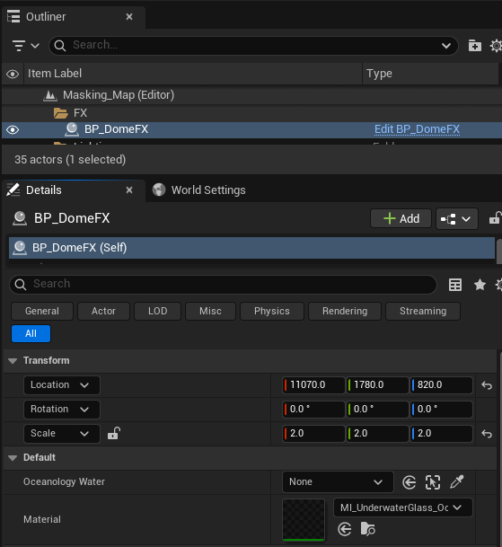
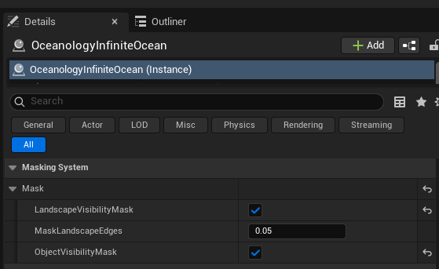

# Oceanology Next-Gen — Dome FX

_Last updated: 2025-12-13_

## Prerequisites
- Unreal Engine 5.5 or newer.
- **Oceanology** installed and configured (see the **Setup** page).
- At least one **OceanologyInfiniteOcean** actor placed in your level.
- Basic familiarity with **Blueprints** and **Materials** in Unreal Engine.

## Notes
- The Dome FX system in Oceanology creates transparent underwater dome structures that interact correctly with the ocean surface. This is ideal for underwater bases, observation domes, aquariums, or any scenario where players need to see the water from inside a protected enclosure.
- The dome uses a specialized glass material that properly renders the water surface visible through its transparent walls while maintaining correct refraction and visual effects.
- For the dome to display water correctly, it must be linked to an Oceanology water body. Without this connection, the dome interior will render incorrectly.

---

## Step-by-step

:::note 1. Locate the BP_DomeFX prefab in the Content Browser
In the **Content Browser**, navigate to:
`Plugins > OCEANOLOGY NEXT-GEN > Design > Ocean > Blueprints > Assets`

Here you will find several pre-configured effect Blueprints:
- **BP_Crystal** — Crystal effect for underwater environments.
- **BP_DomeFX** — The underwater dome effect. Select this for transparent observation structures.
- **BP_Dragon** — Decorative dragon model.
- **BP_Fire** — Fire effect for above-water scenarios.
- **BP_GlassFX** — Glass panel effect for windows and partitions.

Select **BP_DomeFX** and drag it into your scene within or near your water body.

:::

:::note 2. Configure the BP_DomeFX default settings
Select the **BP_DomeFX** actor in your scene. In the **Details** panel, you will see the following configuration options:

**Transform Settings:**
- **Location** — Position the dome where you want the underwater observation area.
- **Rotation** — `0.0, 0.0, 0.0` (adjust as needed for your scene).
- **Scale** — `2.0, 2.0, 2.0`. Increase or decrease to change the dome size. Uniform scaling maintains the spherical shape.

**Default Settings:**
- **Oceanology Water** — `None`. This is the critical setting that links the dome to your water body. Without this connection, the dome will not render water correctly.
- **Material** — `MI_UnderwaterGlass_Oc`. The specialized glass material that handles underwater refraction and transparency. You can assign a custom material if needed.

At this point, the dome is placed but not yet connected to the water system.

:::

:::note 3. Observe the incorrect rendering without water connection
Before connecting the dome to an Oceanology water body, observe how it renders incorrectly in the viewport.

**Visual symptoms of missing water connection:**
- The dome interior appears **yellow or greenish** instead of showing the water.
- The glass material cannot sample the water surface data.
- No proper refraction or underwater caustics are visible through the dome.
- The effect looks broken and unrealistic.

This is the expected behavior when **Oceanology Water** is set to `None`. The dome material needs water surface information to render correctly.

:::

:::note 4. Link the dome to the Oceanology water body
To fix the rendering, you must connect the dome to your water body. In the **Details** panel, locate the **Oceanology Water** property under the **Default** category.

Click the dropdown arrow next to the `None` value. A picker window will appear with the following options:

**Current Actor:**
- **Use Selected** — Assigns the currently selected actor in the Outliner.
- **Copy** — Copies the current reference.
- **Paste** — Pastes a previously copied reference.
- **Clear** — Removes the current assignment.

**Browse:**
Use the search field or scroll through the list to find your water body. You will see:
- **Masking_Map (Editor)** — Editor-only map reference (ignore this).
- **OceanologyInfiniteOcean** — Your ocean water body. Select this.

Click on **OceanologyInfiniteOcean** to assign it to the dome.

:::

:::note 5. Verify the correct rendering with water connection
After linking the dome to the **OceanologyInfiniteOcean** actor, the rendering updates immediately.

**Visual confirmation of correct setup:**
- The dome interior now shows **blue water** matching the ocean surface.
- The glass material correctly samples and displays the water through the dome.
- Proper refraction effects are visible at the dome edges.
- The water surface appears continuous and realistic when viewed from inside.
- Light caustics and underwater effects render correctly.

The dome now functions as intended — a transparent underwater observation structure that seamlessly integrates with the Oceanology water system.

:::

:::note 6. Configure the Masking System for proper water interaction
For optimal dome rendering, verify that the **Masking System** is properly configured on your **OceanologyInfiniteOcean** actor.

Select the **OceanologyInfiniteOcean** actor in the Outliner. In the **Details** panel, locate the **Masking System** category and expand the **Mask** subcategory:

- **LandscapeVisibilityMask** — ✅ **Enabled**. Allows the water to properly mask around landscape geometry.
- **MaskLandscapeEdges** — `0.05`. Controls the softness of the masking edge where water meets landscape. Lower values create sharper transitions.
- **ObjectVisibilityMask** — ✅ **Enabled**. Allows the water to properly interact with objects like the dome. This setting is essential for correct dome rendering.

These masking settings ensure the water surface correctly interacts with the dome geometry, preventing visual artifacts and z-fighting issues.

:::

---

## Configuration Guidelines

| Setting | Recommended Value | Use Case |
|---------|------------------|----------|
| **Scale** | `2.0, 2.0, 2.0` | Standard observation dome |
| **Scale** | `5.0+` | Large underwater bases |
| **Scale** | `0.5 - 1.0` | Small viewing portals |
| **Material** | `MI_UnderwaterGlass_Oc` | Default underwater glass effect |
| **ObjectVisibilityMask** | ✅ Enabled | Always enable for dome effects |
| **MaskLandscapeEdges** | `0.05` | Default edge softness |

---

## Troubleshooting Common Issues

| Problem | Likely Cause | Solution |
|---------|--------------|----------|
| Dome interior is yellow/green | Oceanology Water not assigned | Assign **OceanologyInfiniteOcean** to the Oceanology Water property |
| Water not visible through dome | ObjectVisibilityMask disabled | Enable **ObjectVisibilityMask** on the ocean actor |
| Z-fighting at dome edges | Masking settings incorrect | Adjust **MaskLandscapeEdges** value |
| Dome appears completely opaque | Wrong material assigned | Verify **MI_UnderwaterGlass_Oc** is assigned |
| Water clips through dome | Dome positioned incorrectly | Adjust dome location relative to water surface |
| Performance issues | Dome scale too large | Reduce dome scale or use simpler material |

---

## Summary

In this guide, you learned how to:

1. **Locate the BP_DomeFX prefab** — Find the dome effect in the Oceanology asset folders.
2. **Configure dome properties** — Adjust transform and default settings for your scene.
3. **Identify incorrect rendering** — Recognize the yellow/green interior that indicates missing water connection.
4. **Link to water body** — Use the Oceanology Water picker to connect the dome to OceanologyInfiniteOcean.
5. **Verify correct rendering** — Confirm the dome shows blue water with proper refraction.
6. **Configure masking settings** — Enable ObjectVisibilityMask for proper water-dome interaction.

With the Dome FX properly configured, you can create immersive underwater observation structures, submarine windows, and aquarium exhibits that seamlessly integrate with Oceanology's water rendering system.
