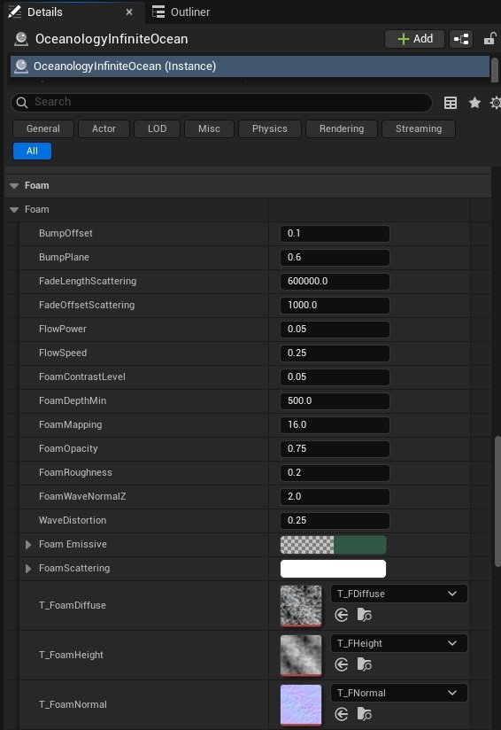

# Oceanology NextGen - Foam

🌊 Flow-Based

💨 Wave Crests

🎨 Procedural

Configure flow-based foam generation for wave crests, shorelines, and object interactions.

---

## Prerequisites

| Requirement | Details |
|-------------|---------|
| **Engine** | UE5.x (latest release) |
| **Plugin** | Oceanology NextGen installed and configured |
| **Scene** | Water body placed in your level |
| **Skills** | Basic Material Instance familiarity |

:::info About Foam
Foam parameters are exposed through the **OceanologyInfiniteOcean** material instance under the **Foam** category. Foam appears where waves crest, along shorelines, and around interacting objects.
:::
- The system uses three texture channels: **Diffuse** (color and transparency), **Height** (displacement detail), and **Normal** (surface micro-detail).
- Foam rendering combines procedural wave data with texture mapping to create realistic coastal patterns, wave crests, and dynamic foam movement.
- Proper configuration of foam parameters significantly impacts visual quality and performance.

---

## Step-by-step

:::note 1. Access the Foam parameters in OceanologyInfiniteOcean
Select the **OceanologyInfiniteOcean** actor in your level. In the **Details** panel, scroll to locate the **Foam** category. This section contains all parameters controlling foam appearance and behavior.

You will find parameters organized into several groups:

**Basic Foam Properties:**

- **BumpOffset** - Vertical position offset of foam relative to water surface.
- **BumpPlane** - Blending factor between foam and water surface.
- **FoamOpacity** - Overall foam transparency.
- **FoamRoughness** - Surface roughness of foam material.
- **FoamContrastLevel** - Contrast adjustment for foam visibility.

**Texture Mapping:**

- **FoamMapping** - UV scale for foam texture tiling.
- **FlowSpeed** - Speed of foam texture scrolling animation.
- **FlowPower** - Intensity of foam flow animation.

**Depth Control:**

- **FoamDepthMin** - Minimum water depth where foam appears.

**Wave Integration:**

- **FoamWaveNormalZ** - How foam follows wave surface normals.
- **WaveDistortion** - Procedural distortion applied to foam patterns.

**Distance Fading:**

- **FadeLengthScattering** - Distance over which foam fades from view.
- **FadeOffsetScattering** - Starting distance for foam fade.

**Color Properties:**

- **FoamEmissive** - Emissive color gradient for foam glow effects.
- **FoamScattering** - Scattering color that affects how light disperses through foam.

**Texture Channels:**

- **T_FoamDiffuse** - Diffuse color and alpha texture.
- **T_FoamHeight** - Height displacement texture.
- **T_FoamNormal** - Normal map for surface detail.

:::

---

## Foam Parameters Reference

The following sections provide detailed information about each foam parameter category.

### Basic Foam Properties

| Parameter | Default Value | Range | Description |
|-----------|---------------|-------|-------------|
| **BumpOffset** | `0.1` | `0.0` - `1.0` | Vertical offset of foam relative to the water surface. Higher values lift foam above the waves, creating a floating appearance. |
| **BumpPlane** | `0.6` | `0.0` - `1.0` | Blending factor between foam and water surface. Lower values create softer, more transparent edges. Higher values create sharper foam boundaries. |
| **FoamOpacity** | `0.75` | `0.0` - `1.0` | Overall transparency of foam. `1.0` = fully opaque, `0.0` = invisible. Primary control for foam visibility. |
| **FoamRoughness** | `0.2` | `0.0` - `1.0` | Surface roughness of foam material. Higher values create a matte appearance suitable for thick foam. Lower values create shinier, wetter-looking foam. |
| **FoamContrastLevel** | `0.05` | `0.0` - `0.5` | Contrast adjustment for foam appearance against water. Higher values make foam more pronounced and easier to see. |

### Texture Mapping and Animation

| Parameter | Default Value | Range | Description |
|-----------|---------------|-------|-------------|
| **FoamMapping** | `16.0` | `1.0` - `100.0` | UV scale for foam textures. Lower values stretch foam patterns over larger areas. Higher values create tighter tiling. Adjust based on world scale and desired foam size. |
| **FlowSpeed** | `0.25` | `0.0` - `2.0` | Speed of foam texture scrolling. Controls how quickly foam appears to move across the surface. `0.0` disables animation. |
| **FlowPower** | `0.05` | `0.0` - `1.0` | Intensity of foam flow animation. Higher values create more dramatic directional flow effects based on wave movement. |
| **WaveDistortion** | `0.25` | `0.0` - `2.0` | Amount of distortion applied to foam patterns. Creates organic, irregular foam edges. Higher values add visual complexity at the cost of performance. |

### Depth and Wave Integration

| Parameter | Default Value | Range | Description |
|-----------|---------------|-------|-------------|
| **FoamDepthMin** | `500.0` | `0.0` - `2000.0` | Minimum water depth where foam appears in Unreal units. Foam is visible in water shallower than this value. Lower values restrict foam to very shallow coastal areas. |
| **FoamWaveNormalZ** | `2.0` | `0.0` - `5.0` | Intensity of wave normal influence on foam placement. Higher values make foam follow wave peaks and crests more closely, creating concentrated foam on wave tops. |

### Distance Fading and Performance

| Parameter | Default Value | Range | Description |
|-----------|---------------|-------|-------------|
| **FadeLengthScattering** | `600000.0` | `10000.0` - `1000000.0` | Distance over which foam fades due to atmospheric scattering in Unreal units. Larger values extend foam visibility at distance. Reduce for performance optimization. |
| **FadeOffsetScattering** | `1000.0` | `0.0` - `10000.0` | Starting distance for foam scattering fade in Unreal units. Foam begins fading beyond this distance from the camera. |

### Color Properties

| Parameter | Default Value | Description |
|-----------|---------------|-------------|
| **FoamEmissive** | Color gradient | Emissive color applied to foam. Creates subtle glow effects, useful for bioluminescent water, magical effects, or stylized visuals. Left color represents minimum intensity, right color represents maximum. |
| **FoamScattering** | Color gradient | Controls how light scatters through foam. Affects the perceived color of foam when backlit or when light passes through thin foam areas. Useful for achieving realistic subsurface scattering in foam. |

### Foam Texture Channels

| Parameter | Default Texture | Purpose | Recommended Format |
|-----------|----------------|---------|-------------------|
| **T_FoamDiffuse** | `T_FDiffuse` | Color and alpha texture defining base foam appearance and transparency mask. | RGB + Alpha, sRGB enabled |
| **T_FoamHeight** | `T_FHeight` | Height map for foam displacement. Adds 3D surface detail to foam geometry. | Grayscale, sRGB disabled |
| **T_FoamNormal** | `T_FNormal` | Normal map for foam surface micro-detail. Creates fine surface variation and highlights. | RGB Normal Map, sRGB disabled |

---

## Foam Configuration Guidelines

Use these guidelines to achieve specific visual styles and optimize performance.

### Foam Intensity Presets

The following presets provide starting points for different ocean conditions:

| Scenario | FoamOpacity | FoamContrastLevel | FoamMapping | FoamDepthMin | FlowSpeed | WaveDistortion |
|----------|-------------|-------------------|-------------|--------------|-----------|----------------|
| **Calm Ocean** | `0.5` | `0.03` | `20.0` | `300.0` | `0.15` | `0.15` |
| **Moderate Waves** | `0.75` | `0.05` | `16.0` | `500.0` | `0.25` | `0.25` |
| **Storm Conditions** | `0.9` | `0.08` | `12.0` | `800.0` | `0.4` | `0.4` |
| **Shallow Beach** | `0.85` | `0.06` | `18.0` | `200.0` | `0.2` | `0.2` |
| **Deep Ocean (Minimal)** | `0.4` | `0.02` | `24.0` | `1000.0` | `0.1` | `0.1` |

### Coastal Foam Configuration

Coastal foam appears in shallow water where waves interact with shorelines. Control it with these parameters:

| Goal | Parameter | Recommended Value | Notes |
|------|-----------|------------------|-------|
| **More coastal foam** | FoamDepthMin | `200.0` - `400.0` | Lower values extend foam further from shore |
| **Less coastal foam** | FoamDepthMin | `600.0` - `1000.0` | Higher values restrict foam to very shallow areas |
| **Sharper coastal edge** | BumpPlane | `0.7` - `0.9` | Creates defined foam line along beach |
| **Softer coastal blend** | BumpPlane | `0.4` - `0.6` | Creates gradual foam transition |
| **Brighter beach foam** | FoamContrastLevel | `0.06` - `0.1` | Increases foam visibility against sand |

### Wave Crest Foam Configuration

Foam that appears on top of waves is controlled independently:

| Goal | Parameter | Recommended Value | Notes |
|------|-----------|------------------|-------|
| **More wave foam** | FoamWaveNormalZ | `2.5` - `4.0` | Increases foam on wave peaks |
| **Less wave foam** | FoamWaveNormalZ | `1.0` - `1.5` | Reduces foam concentration on crests |
| **Elevated foam caps** | BumpOffset | `0.15` - `0.3` | Lifts foam above wave surfaces |
| **Integrated foam** | BumpOffset | `0.0` - `0.1` | Keeps foam flush with water |
| **Thick foam bands** | BumpPlane | `0.6` - `0.8` | Creates wider foam strips on waves |

### Foam Animation Configuration

Control foam movement and flow with these parameters:

| Animation Style | FlowSpeed | FlowPower | WaveDistortion | Result |
|----------------|-----------|-----------|----------------|--------|
| **Static** | `0.0` | `0.0` | `0.0` | No animation, foam is fixed |
| **Subtle drift** | `0.1` - `0.2` | `0.03` - `0.05` | `0.1` - `0.2` | Gentle movement |
| **Moderate flow** | `0.25` - `0.35` | `0.05` - `0.08` | `0.25` - `0.35` | Noticeable scrolling |
| **Rapid turbulence** | `0.5` - `0.8` | `0.1` - `0.15` | `0.5` - `0.8` | Fast, chaotic motion |

---

## Performance Optimization

Foam rendering impacts GPU performance through texture sampling, shader complexity, and overdraw. Use these strategies to optimize:

### Texture Resolution Optimization

| Optimization Level | T_FoamDiffuse | T_FoamHeight | T_FoamNormal | Performance Gain |
|-------------------|---------------|--------------|--------------|------------------|
| **High Quality** | `2048x2048` | `2048x2048` | `2048x2048` | Baseline (0%) |
| **Medium Quality** | `1024x1024` | `1024x1024` | `1024x1024` | ~15% faster |
| **Low Quality** | `512x512` | `512x512` | `512x512` | ~30% faster |
| **Mobile** | `512x512` | `256x256` | `512x512` | ~40% faster |

### Shader Complexity Optimization

Reduce shader instruction count by disabling expensive features:

| Parameter | High Performance Value | Quality Impact | Performance Gain |
|-----------|----------------------|----------------|------------------|
| **WaveDistortion** | `0.0` - `0.1` | Reduced organic variation | ~10% faster |
| **FadeLengthScattering** | `200000.0` | Foam disappears sooner | ~5% faster |
| **FlowPower** | `0.0` - `0.03` | Less dynamic flow | ~3% faster |
| **FoamMapping** | `24.0` - `32.0` | Tighter tiling (fewer samples) | ~8% faster |

### Level of Detail (LOD) Strategy

Implement distance-based foam quality reduction:

| Distance Range | FoamOpacity | FadeLengthScattering | WaveDistortion | Notes |
|---------------|-------------|---------------------|----------------|-------|
| **0 - 5000 units** | `0.75` | `600000.0` | `0.25` | Full quality near player |
| **5000 - 20000** | `0.6` | `400000.0` | `0.15` | Reduced detail at medium range |
| **20000+** | `0.4` | `200000.0` | `0.05` | Minimal foam at far distances |

---

## Custom Foam Textures

Replace default foam textures to achieve unique visual styles.

### Preparing Custom Textures

**Texture Requirements:**

| Texture Type | Resolution | Channels | Compression | sRGB |
|--------------|-----------|----------|-------------|------|
| **Diffuse** | `1024x1024` - `2048x2048` | RGB + Alpha | BC3 (DXT5) | ✓ Enabled |
| **Height** | `1024x1024` | Grayscale | BC4 | ☐ Disabled |
| **Normal** | `1024x1024` | RGB Tangent Space | BC5 | ☐ Disabled |

### Foam Texture Styles

| Style | Diffuse Characteristics | Height Characteristics | Use Case |
|-------|------------------------|------------------------|----------|
| **Fine bubble foam** | Many small foam clusters | Low height variation | Calm seas, gentle waves |
| **Thick froth** | Large connected foam areas | High height variation | Storm conditions, turbulent water |
| **Coastal surf** | Irregular foam bands | Medium height, edge emphasis | Beach shorelines |
| **Ice/slush** | Solid foam areas with cracks | Sharp height transitions | Cold water environments |
| **Polluted/algae** | Greenish/brownish tint | Minimal height | Industrial or swamp water |

---

## Troubleshooting Common Issues

| Problem | Likely Cause | Solution |
|---------|--------------|----------|
| Foam not visible | FoamOpacity too low | Increase FoamOpacity to `0.5` or higher |
| Foam only in shallow water | FoamDepthMin too low | Increase FoamDepthMin value |
| Foam appears flat | T_FoamNormal not assigned or FoamRoughness too high | Assign normal texture and reduce roughness |
| Foam flickering at distance | FadeLengthScattering too low | Increase FadeLengthScattering value |
| Foam animation too fast | FlowSpeed too high | Reduce FlowSpeed to `0.1` - `0.2` |
| Foam edges too harsh | BumpPlane too high | Reduce BumpPlane to `0.4` - `0.5` |
| Foam not following waves | FoamWaveNormalZ too low | Increase FoamWaveNormalZ to `2.0` or higher |
| Performance issues | WaveDistortion and FlowPower too high | Reduce both values and increase FoamMapping |
| Foam color looks wrong | FoamScattering misconfigured | Adjust scattering color gradient |
| No foam glow effect | FoamEmissive not configured | Set emissive color gradient values |

---

## Summary

In this guide, you learned how to:

1. **Access foam parameters** - Locate and understand the Foam category in OceanologyInfiniteOcean material instance.
2. **Control foam appearance** - Adjust opacity, contrast, roughness, and surface offset for different visual styles.
3. **Configure coastal and wave foam** - Use depth parameters and wave normal influence to control where foam appears.
4. **Animate foam** - Control flow speed, power, and distortion for realistic foam movement and organic variation.
5. **Customize foam colors** - Use FoamEmissive and FoamScattering to achieve stylized or realistic color effects.
6. **Optimize performance** - Adjust texture resolution, mapping scale, and fade distances to balance quality and performance.
7. **Replace textures** - Import and assign custom foam textures for unique visual styles and artistic direction.
8. **Troubleshoot issues** - Diagnose and fix common foam visibility, animation, and performance problems.

With this knowledge, you can fine-tune foam appearance to match your ocean environment's artistic direction, performance requirements, and gameplay needs.
