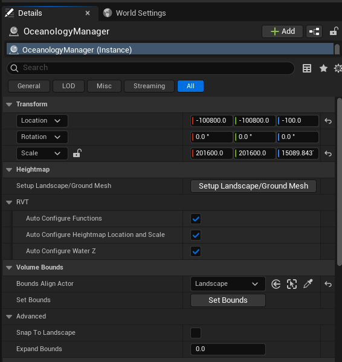
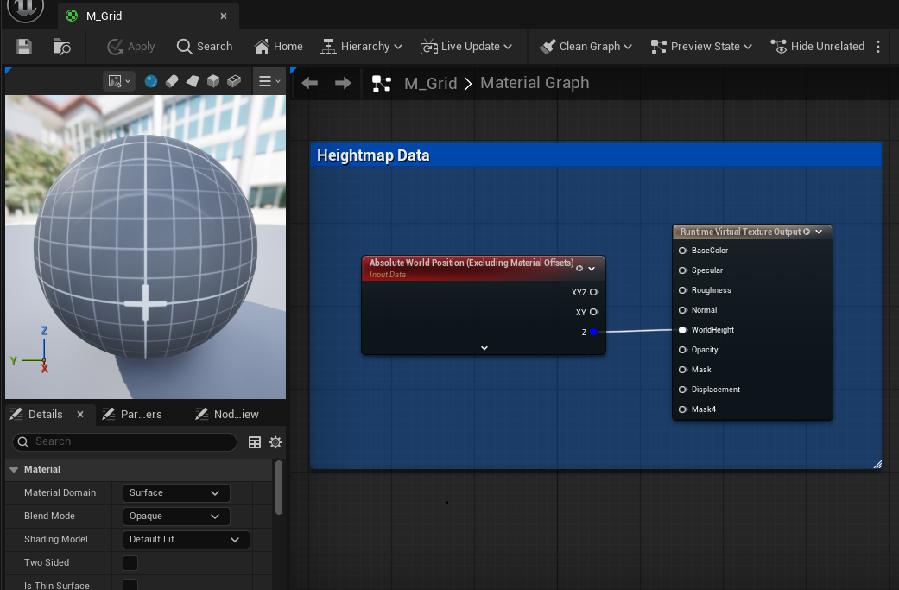

# Oceanology Next-Gen — RVT (Runtime Virtual Texture)

_Last updated: 2025-12-13_

## Prerequisites
- Unreal Engine 5.5 or newer.
- **Oceanology** installed and configured (see the **Setup** page).
- A **Landscape** actor in your level for terrain-water interaction.
- **Runtime Virtual Texturing** enabled in Project Settings.
- Basic familiarity with **Virtual Textures** and **Materials** in Unreal Engine.

## Notes
- The RVT (Runtime Virtual Texture) system in Oceanology enables seamless blending between water and terrain. It captures heightmap data from your landscape and uses it to create smooth shoreline transitions, proper depth-based effects, and accurate water-terrain intersections.
- RVT eliminates harsh water edges by sampling the actual terrain height at runtime, allowing the water shader to know exactly where land meets water.
- The system requires both the **OceanologyManager** (for heightmap capture setup) and the **OceanologyInfiniteOcean** (for RVT rendering settings) to be properly configured.

---

## Step-by-step

:::note 1. Add the Oceanology Manager to your scene
Open your level and use the **Quickly Add to the Project** menu (the `+` button in the toolbar or right-click in the viewport). Type `Oceanology` in the search field to filter the available actors.

Locate and add the following actor:
- **Oceanology Manager** — The central controller that manages RVT heightmap capture and other Oceanology systems.

The Manager is essential for RVT functionality as it handles the heightmap generation from your landscape. Without it, the water will not have terrain depth information for proper shoreline rendering.

Other useful actors visible in the menu:
- **Oceanology Infinite Ocean** — The main ocean water body.
- **Oceanology Lake** — Bounded water body for lakes.
- **Oceanology Water Volume** — Interaction volume for buoyancy and effects.

:::

:::note 2. Configure the Oceanology Manager for RVT
Select the **OceanologyManager** actor in your level. In the **Details** panel, you will find the RVT-related configuration sections:

**Transform:**
- **Location** — Position of the manager actor. Example: `-100800.0, -100800.0, -100.0`
- **Scale** — Defines the capture area size. Example: `201600.0, 201600.0, 15089.843`. This should cover your entire landscape.

**Heightmap:**
- **Setup Landscape/Ground Mesh** — Click this button to automatically configure the heightmap capture based on your landscape. This is the quickest way to set up RVT.

**RVT Settings:**
- **Auto Configure Functions** — ✅ Enabled. Automatically sets up RVT capture functions.
- **Auto Configure Heightmap Location and Scale** — ✅ Enabled. Automatically positions and scales the heightmap capture to match your landscape bounds.
- **Auto Configure Water Z** — ✅ Enabled. Automatically determines the water surface Z height.

**Volume Bounds:**
- **Bounds Align Actor** — `Landscape`. Select the landscape actor to align the capture volume.
- **Set Bounds** — Click to manually set the capture bounds if auto-configure doesn't produce desired results.

**Advanced:**
- **Snap To Landscape** — When enabled, snaps the manager to the landscape surface.
- **Expand Bounds** — `0.0`. Adds padding to the capture bounds.

:::

:::note 3. Configure RVT settings on the Ocean actor
Select the **OceanologyInfiniteOcean** actor in your level. In the **Details** panel, locate and expand the **RVT** category:

**RVT Parameters:**
- **WaterZMin** — `-100.0`. The minimum Z height for water rendering. Water below this level will not render RVT effects.
- **HeightmapLocation** — Vector defining the world position of the heightmap capture origin. Displayed as a blue color picker for X/Y coordinates.
- **HeightmapScale** — Vector defining the scale/size of the heightmap capture area. Displayed as a yellow color picker.
- **WaterBoxScale** — Vector defining the water rendering box dimensions. Displayed as a dark color picker.

**Heightmap Asset:**
- **RVT_Heightmap** — `RVT_Heightmap`. The Runtime Virtual Texture asset that stores the captured heightmap data. This texture is sampled by the water material to determine terrain depth.

The heightmap preview shows a grayscale representation of your terrain — white areas are high elevation, black areas are low. This data drives the water depth calculations and shoreline blending.

:::

:::note 4. Understand the RVT Material setup
The RVT system works through a material setup that captures terrain data and outputs it to a Runtime Virtual Texture. Open the **M_Grid** material (or your landscape material) to see how heightmap data flows:

**Heightmap Data Node:**
- **Absolute World Position (Excluding Material Offsets)** — Provides the world position for height sampling.
- **Input Data** — The heightmap input connection.
- **XYZ** — Full 3D position output.
- **XY** — Horizontal position only.
- **Z** — Vertical height value (most important for water depth).

**Runtime Virtual Texture Output:**
This node writes data to the RVT for the water shader to sample:
- **BaseColor** — Surface color information.
- **Specular** — Specular reflection data.
- **Roughness** — Surface roughness values.
- **Normal** — Surface normal vectors.
- **WorldHeight** — The terrain height at each point (critical for water depth).
- **Opacity** — Transparency information.
- **Mask** — General purpose masking.
- **Displacement** — Vertex displacement data.
- **Mask4** — Additional mask channel.

The **Z** output from Heightmap Data connects to **WorldHeight** on the RVT Output. This is how the water shader knows the terrain elevation at every point, enabling proper depth-based coloring and shoreline blending.

:::

---

## RVT Output Channels Reference

| Channel | Purpose | Used By Water For |
|---------|---------|-------------------|
| **WorldHeight** | Terrain elevation | Depth calculation, shoreline blending |
| **BaseColor** | Terrain color | Underwater terrain tinting |
| **Normal** | Surface normals | Caustic projection alignment |
| **Roughness** | Surface roughness | Wetness effect intensity |
| **Mask** | Custom masking | Foam generation, effect zones |
| **Opacity** | Transparency | Water edge softness |

---

## Configuration Guidelines

| Scenario | Recommended Settings |
|----------|---------------------|
| **Quick setup** | Click "Setup Landscape/Ground Mesh" on Manager |
| **Large landscapes** | Increase Manager Scale to cover entire terrain |
| **Multiple landscapes** | Position Manager at center, expand bounds |
| **Custom shorelines** | Adjust WaterZMin on Ocean actor |
| **Performance optimization** | Reduce RVT resolution in Project Settings |
| **Sharp water edges** | Verify HeightmapScale matches landscape bounds |

---

## Troubleshooting Common Issues

| Problem | Likely Cause | Solution |
|---------|--------------|----------|
| No shoreline blending | RVT not configured | Click "Setup Landscape/Ground Mesh" on Manager |
| Water ignores terrain | RVT_Heightmap not assigned | Verify RVT_Heightmap is set on Ocean actor |
| Incorrect depth colors | HeightmapLocation/Scale mismatch | Enable Auto Configure options on Manager |
| Harsh water edges | WaterZMin too low | Increase **WaterZMin** value |
| RVT not updating | Virtual Texturing disabled | Enable in Project Settings > Rendering |
| Heightmap appears blank | Landscape material missing RVT output | Add Runtime Virtual Texture Output to landscape material |
| Performance issues | RVT resolution too high | Reduce virtual texture size in Project Settings |
| Water floating above terrain | WaterZMin too high | Lower **WaterZMin** value |

---

## Summary

In this guide, you learned how to:

1. **Add the Oceanology Manager** — Place the manager actor that handles RVT heightmap capture.
2. **Configure Manager RVT settings** — Set up automatic heightmap capture aligned to your landscape.
3. **Configure Ocean RVT settings** — Adjust heightmap location, scale, and the RVT texture reference.
4. **Understand the Material setup** — See how heightmap data flows from terrain to the Runtime Virtual Texture Output.

With RVT properly configured, your ocean will seamlessly blend with the terrain, showing accurate depth-based coloring, smooth shoreline transitions, and proper water-land intersections without harsh edges.
