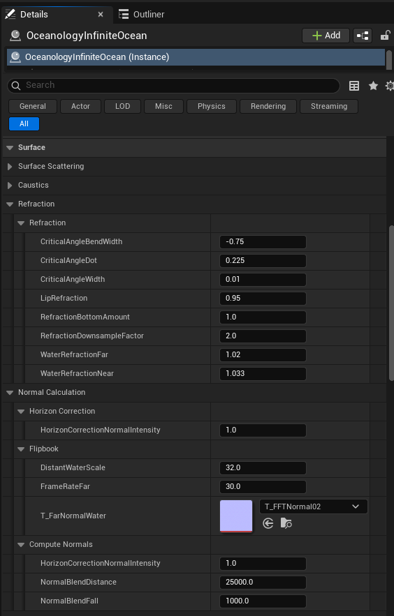

# Oceanology Next Gen — Surface

_Last updated: 2025-12-18_

## Prerequisites

- Unreal Engine 5.6 or newer.
- **Oceanology Next Gen** installed and configured (see the **Setup** page).
- At least one **Oceanology Next Gen** water body placed in your level (infinite ocean or lake).
- Basic familiarity with **material parameters** and **rendering concepts** in Unreal Engine.

## Notes

- The Surface system in Oceanology Next Gen controls the visual appearance of the water surface, including scattering, caustics, refraction, and normal calculation.
- These settings are configured directly on the **OceanologyInfiniteOcean** actor in your level.
- The workflow in this page focuses on understanding each parameter category and how they interact to create realistic water rendering.

---

## Step-by-step

:::note 1. Configure Surface Scattering parameters
Select the **OceanologyInfiniteOcean** actor in the **Outliner**. In the **Details** panel, expand the **Surface** category, then expand **Surface Scattering**.

**Surface Scattering** controls how light interacts with and scatters through the water volume:

- **DeepAbsorptionCoefficient** — Controls light absorption at depth. Higher values create darker deep water. Default: `7.0`.
- **PhaseGHigh** — Phase function parameter for forward scattering in bright areas. Default: `0.1`.
- **PhaseGLow** — Phase function parameter for backscattering. Default: `0.75`.
- **ShallowAbsorptionCoefficient** — Controls light absorption in shallow areas. Default: `100.0`.
- **SoftenEdges** — Softens the transition at water edges. Default: `200.0`.
- **SurfaceScatteringExponential** — Exponential falloff for surface scattering. Default: `8.0`.
- **WaterFresnelExponent** — Controls the Fresnel reflection curve steepness. Default: `10.0`.
- **WaterFresnelRoughness** — Roughness applied to Fresnel reflections. Default: `0.15`.
- **WaterFresnelSpecular** — Specular intensity for Fresnel reflections. Default: `1.0`.
- **WaterRoughness** — Overall surface roughness. Default: `0.1`.
- **WaterSpecular** — Base specular intensity. Default: `0.05`.
- **Absorption** — Color gradient defining light absorption tint.
- **DeepScatteringColor** — Color of light scattered in deep water areas.
- **ShallowScatteringColor** — Color of light scattered in shallow water areas.

**Caustics** settings are also visible in this panel:

- **FadeDistance** — Distance over which caustics fade out. Default: `1.0`.
- **MultiplyRefraction** — Multiplier for caustic refraction intensity. Default: `1.333`.

:::

:::note 2. Configure Refraction and Normal Calculation
Scroll down in the **Surface** category to find the **Refraction** and **Normal Calculation** subcategories.

**Refraction** controls how light bends when passing through the water surface:

- **CriticalAngleBendWidth** — Width of the critical angle bend effect. Default: `-0.75`.
- **CriticalAngleDot** — Dot product threshold for critical angle. Default: `0.225`.
- **CriticalAngleWidth** — Width of the critical angle zone. Default: `0.01`.
- **LipRefraction** — Refraction intensity at the water lip/edge. Default: `0.95`.
- **RefractionBottomAmount** — Amount of refraction applied to the bottom. Default: `1.0`.
- **RefractionDownsampleFactor** — Downsampling factor for refraction calculations (performance optimization). Default: `2.0`.
- **WaterRefractionFar** — Refraction index for distant water. Default: `1.02`.
- **WaterRefractionNear** — Refraction index for near water. Default: `1.033`.

**Normal Calculation** contains three subcategories:

**Horizon Correction:**
- **HorizonCorrectionNormalIntensity** — Intensity of normal correction at the horizon. Default: `1.0`.

**Flipbook:**
- **DistantWaterScale** — Scale of the distant water normal flipbook. Default: `32.0`.
- **FrameRateFar** — Frame rate for distant water animation. Default: `30.0`.
- **T_FarNormalWater** — Normal texture used for distant water. Default: `T_FFTNormal02`.

**Compute Normals:**
- **HorizonCorrectionNormalIntensity** — Normal intensity correction at horizon. Default: `1.0`.
- **NormalBlendDistance** — Distance over which normals blend. Default: `25000.0`.
- **NormalBlendFall** — Falloff for normal blending. Default: `1000.0`.

:::

:::note 3. Configure Camera Offset
Continue scrolling in the **Surface** category to find the **Camera** subcategory with **Camera Offset** settings.

These settings control how the surface rendering adjusts based on camera position:

- **CameraOffset** — Enable or disable camera-based offset adjustments. Default: ✅ Enabled.
- **TransitionFalloff** — Falloff distance for the camera transition effect. Default: `2500.0`.
- **TransitionThreshold** — Threshold distance at which the transition begins. Default: `1000.0`.

Camera Offset is useful for preventing z-fighting and ensuring smooth transitions when the camera moves close to or through the water surface.

:::

:::note 4. Visual result of Surface configuration
With the Surface parameters properly configured, your ocean will display realistic light scattering, refraction, and caustic effects.

The image below shows an example of a fully configured ocean surface with proper scattering colors, Fresnel reflections, and wave detail visible from the horizon to the foreground.

:::

---

## Parameter Quick Reference

### Surface Scattering

| Parameter | Default | Description |
|-----------|---------|-------------|
| DeepAbsorptionCoefficient | 7.0 | Light absorption at depth |
| PhaseGHigh | 0.1 | Forward scattering phase |
| PhaseGLow | 0.75 | Backscattering phase |
| ShallowAbsorptionCoefficient | 100.0 | Light absorption in shallows |
| SoftenEdges | 200.0 | Edge transition softness |
| SurfaceScatteringExponential | 8.0 | Scattering exponential falloff |
| WaterFresnelExponent | 10.0 | Fresnel curve steepness |
| WaterFresnelRoughness | 0.15 | Fresnel reflection roughness |
| WaterFresnelSpecular | 1.0 | Fresnel specular intensity |
| WaterRoughness | 0.1 | Overall surface roughness |
| WaterSpecular | 0.05 | Base specular intensity |

### Caustics

| Parameter | Default | Description |
|-----------|---------|-------------|
| FadeDistance | 1.0 | Caustics fade distance |
| MultiplyRefraction | 1.333 | Caustic refraction multiplier |

### Refraction

| Parameter | Default | Description |
|-----------|---------|-------------|
| CriticalAngleBendWidth | -0.75 | Critical angle bend width |
| CriticalAngleDot | 0.225 | Critical angle dot threshold |
| CriticalAngleWidth | 0.01 | Critical angle zone width |
| LipRefraction | 0.95 | Edge refraction intensity |
| RefractionBottomAmount | 1.0 | Bottom refraction amount |
| RefractionDownsampleFactor | 2.0 | Performance downsample factor |
| WaterRefractionFar | 1.02 | Distant refraction index |
| WaterRefractionNear | 1.033 | Near refraction index |

### Normal Calculation

| Parameter | Default | Description |
|-----------|---------|-------------|
| HorizonCorrectionNormalIntensity | 1.0 | Horizon normal correction |
| DistantWaterScale | 32.0 | Distant normal texture scale |
| FrameRateFar | 30.0 | Distant animation frame rate |
| NormalBlendDistance | 25000.0 | Normal blend distance |
| NormalBlendFall | 1000.0 | Normal blend falloff |

### Camera

| Parameter | Default | Description |
|-----------|---------|-------------|
| CameraOffset | ✅ Enabled | Enable camera offset |
| TransitionFalloff | 2500.0 | Transition falloff distance |
| TransitionThreshold | 1000.0 | Transition start threshold |

---

## Troubleshooting Common Issues

| Problem | Likely Cause | Solution |
|---------|--------------|----------|
| Water appears too dark | DeepAbsorptionCoefficient too high | Reduce DeepAbsorptionCoefficient value |
| No visible reflections | WaterFresnelSpecular too low | Increase WaterFresnelSpecular or WaterFresnelExponent |
| Harsh water edges | SoftenEdges too low | Increase SoftenEdges value |
| Refraction looks wrong | WaterRefractionNear/Far mismatch | Adjust refraction indices (typical range 1.0-1.1) |
| Caustics too intense | MultiplyRefraction too high | Reduce MultiplyRefraction value |
| Z-fighting near camera | CameraOffset disabled | Enable CameraOffset checkbox |
| Horizon normals look flat | HorizonCorrectionNormalIntensity too low | Increase horizon correction intensity |
| Performance issues | RefractionDownsampleFactor too low | Increase downsample factor (2.0 or higher) |

---

## Summary

In this guide, you learned how to:

1. **Configure Surface Scattering** — Control light absorption, phase functions, Fresnel reflections, and scattering colors for realistic water appearance.
2. **Adjust Caustics** — Fine-tune caustic fade distance and refraction intensity.
3. **Set up Refraction** — Configure critical angle parameters and refraction indices for accurate light bending.
4. **Configure Normal Calculation** — Set up horizon correction, flipbook normals, and normal blending for detailed wave surfaces.
5. **Enable Camera Offset** — Prevent z-fighting and ensure smooth camera transitions near the water surface.

With this knowledge, you can now customize the visual appearance of your ocean to match your project's artistic direction and performance requirements.
