# Oceanology NextGen - Swimming

🏊 Character System

💦 Splash Effects

🎮 Game Ready

Implement realistic character swimming with the OceanSwimming component and water interactors.

---

## Prerequisites

| Requirement | Details |
|-------------|---------|
| **Engine** | Unreal Engine 5.3 or newer |
| **Plugin** | Oceanology NextGen installed and configured |
| **Scene** | Water body with Oceanology Water Volume |
| **Character** | Blueprint with CharacterMovementComponent |

:::info About Swimming
Swimming requires two components: **OceanBuoyancy** (floating physics) and **OceanSwimming** (swim locomotion). **Water Interactor Meshes** are optional but create realistic splash effects when hands interact with water.
:::

---

## Part 1 - Scene Setup

This section covers the essential Water Volume configuration required for swimming to work.

:::note 1. Add the required Oceanology actors to your scene
Open your level and use the **Quickly Add to the Project** menu (the `+` button in the toolbar or right-click in the viewport). Search for `oceanology` to filter the available actors.

You will need the following actors in your scene:
- **Oceanology Manager** - The central controller that manages all Oceanology systems.
- **Oceanology Water Volume** - Defines the region where swimming is enabled. Characters entering this volume can transition to swim mode.
- **Oceanology Infinite Ocean** - The infinite ocean water body.
- **Oceanology Lake** _(optional)_ - A bounded lake water body for enclosed water areas.

Additional useful actors include:
- **Oceanology Light Source Controller** - Manages underwater lighting.
- **Oceanology Wave Audio** - Adds ambient wave sounds.
- **Oceanology Water Interactor** - Enables water surface interaction effects.

:::

:::note 2. Configure the Water Volume for swimming
Select the **OceanologyWaterVolume** actor in the **Outliner**. In the **Details** panel, locate the **Settings** category. Configure the following options:

- **Set Volume Bounds** - Click this button to automatically adjust the volume boundaries to match your water body extents.
- **Oceanology Water** - Select which water body this volume tracks (e.g., **OceanologyInfiniteOcean**).
- **Bounds Align Actor** - Optionally align the volume to a specific actor.
- **Check Initial Overlap on Begin Play** - ✅ Enable this to detect characters already inside the volume when the game starts.
- **Initial Overlap on Begin Play Delay** - `0.5` seconds delay before the initial overlap check.
- **Enable Buoyancy in Area** - ✅ Enable for floating objects within the volume.
- **Enable Swimming in Area** - ✅ **Enable this to allow characters to swim**. This is the critical setting for swimming functionality.
- **Physics Volume Terminal Velocity** - `4000.0` - Maximum fall speed within the volume.
- **Physics Volume Priority** - `0` - Priority when multiple volumes overlap.
- **Physics Volume Fluid Friction** - `0.7` - Drag applied to actors in the volume.

:::

:::note 3. Configure the Water Volume collision settings
Still on the **OceanologyWaterVolume**, scroll to the **Collision** category. These settings determine how the volume detects overlapping actors:

- **Simulation Generates Hit Events** - ❌ Disabled (not needed for overlap detection).
- **Generate Overlap Events** - ✅ **Enabled** - Required for detecting when characters enter/exit the volume.
- **Can Character Step Up On** - `Yes`
- **Collision Presets** - `OverlapAllDynamic`
- **Generate Overlap Events During Level Streaming** - ❌ Disabled
- **Update Overlaps Method During Level Streaming** - `Use Config Default`
- **Default Update Overlaps Method During Level Streaming** - `Only Update Movable`

The `OverlapAllDynamic` preset ensures the volume detects all dynamic actors (including characters) without blocking their movement.

:::

:::note 4. Adjust the Water Volume brush size
In the **Brush Settings** category, configure the volume dimensions to cover your swimming area:

- **X** - `160000.0` - Width of the volume.
- **Y** - `160000.0` - Depth of the volume.
- **Z** - `15000.0` - Height of the volume (should extend above and below the water surface).
- **Wall Thickness** - `10.0`
- **Hollow** - ❌ Disabled
- **Tessellated** - ❌ Disabled
- **Brush Shape** - `Box`
- **Display Shaded Volume** - ❌ Disabled (enable temporarily to visualize the volume in editor).
- **Shaded Volume Opacity Value** - `0.25`

For infinite oceans, use large X and Y values. The Z value should be tall enough that characters cannot swim above or below the volume boundaries.

:::

:::note 5. Review the Actor settings
In the **Actor** category, verify the spawn behavior:

- **1 selected in** - `Persistent Level`
- **Convert Actor** - Leave as default.
- **Can be Damaged** - ❌ Disabled
- **Initial Life Span** - `0.0` (infinite lifespan).
- **Spawn Collision Handling Method** - `Always Spawn, Ignore Collisions`

The `Always Spawn, Ignore Collisions` setting ensures the Water Volume spawns correctly regardless of overlapping geometry.

:::

---

## Part 2 - Character Blueprint Setup

This section covers adding the required components to your character Blueprint for swimming functionality.

:::note 6. Locate the character Blueprint
In the **Content Browser**, navigate to:
`Plugins > OCEANOLOGY NEXT-GEN > Character > Blueprints`

Here you will find:
- **BP_ThirdPersonCharacter** - A pre-configured character Blueprint with swimming support. Use this as a reference or starting point.
- **BP_ThirdPersonGameMode** - The associated game mode for the third person character.

You can duplicate **BP_ThirdPersonCharacter** to create your own swimming character, or examine its component setup to apply the same configuration to your existing character.

:::

:::note 7. Add the Ocean Swimming component
Open your character Blueprint in the **Blueprint Editor**. In the **Components** panel, click **+ Add** and search for `ocean`.

You will see several Oceanology components available:

**Buoyancy:**
- **Ocean Buoyancy** - Handles floating physics. Required for swimming characters.

**Custom:**
- **Ocean Audio** - Water interaction sounds.
- **Ocean Swimming** - **Add this component for swim locomotion**.
- **Oceanology Empty Wave Solver** - Blank wave solver for custom implementations.
- **Oceanology Game Time** - Synchronizes game time with Oceanology systems.
- **Oceanology Gerstner Wave Solver** - Samples Gerstner wave displacement.
- **Oceanology Heightmap** - Samples heightmap-based water surfaces.
- **Oceanology Infinite** - References the infinite ocean system.
- **Oceanology Underwater** - Underwater post-processing effects.

**Water Interaction:**
- **Ocean Water Interactor Mesh** - Creates splash effects when interacting with water.

Add both **Ocean Buoyancy** and **Ocean Swimming** to your character.

:::

:::note 8. Review the component hierarchy
After adding the swimming components, your character's component hierarchy should include:

- **BP_ThirdPersonCharacter (Self)**
  - **Character Movement (CharMoveComp)** - Handles ground/air locomotion.
  - **Capsule Component (CollisionCylinder)** - Character collision.
    - **Arrow Component (Arrow)** - Forward direction indicator.
    - **Mesh (CharacterMesh0)** - The skeletal mesh.
      - **OceanWaterInteractorMesh_LHand** - Left hand water interaction (attached to mesh).
      - **OceanWaterInteractorMesh_RHand** - Right hand water interaction (attached to mesh).
  - **CameraBoom** - Spring arm for camera.
    - **FollowCamera** - Third person camera.
  - **OceanBuoyancy** - Floating physics component.
  - **OceanSwimming** - Swim locomotion component.

The **OceanWaterInteractorMesh** components are attached as children of the **Mesh** component so they follow the character's skeletal animation.

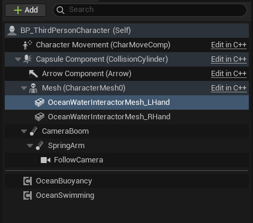
:::

:::note 9. Configure the left hand Water Interactor Mesh
Select **OceanWaterInteractorMesh_LHand** in the component hierarchy. In the **Details** panel, configure:

**Sockets:**
- **Parent Socket** - `hand_l` - Attaches this mesh to the left hand bone of the skeleton.

**Static Mesh:**
- **Static Mesh** - `Sphere` - A simple sphere mesh for detecting water surface interaction.

**Materials:**
- **Element 0** - `DefaultMaterial` - The material is not visible in-game; this mesh is used only for collision detection.

The sphere mesh attached to the hand socket will generate splash effects when the character's hand enters or exits the water during swimming animations.

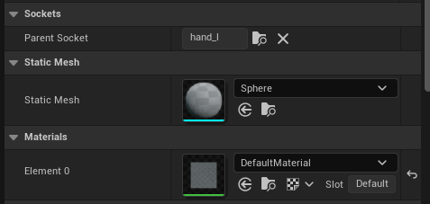
:::

:::note 10. Configure the left hand collision settings
Still on **OceanWaterInteractorMesh_LHand**, scroll to the **Collision** category:

- **Simulation Generates Hit Events** - ❌ Disabled
- **Generate Overlap Events** - ✅ **Enabled** - Required for detecting water surface interaction.
- **Can Character Step Up On** - `Yes`
- **Collision Presets** - `Custom...`
- **Collision Enabled** - `Collision Enabled (Query and Physics)`
- **Object Type** - `WorldStatic`

**Collision Responses:**
All channels set to **Overlap**:
- **Trace Responses:** Visibility ✅, Camera ✅
- **Object Responses:** WorldStatic ✅, WorldDynamic ✅, Pawn ✅, PhysicsBody ✅, Vehicle ✅, Destructible ✅

The overlap-only collision ensures the interactor mesh detects the water surface without interfering with character movement.

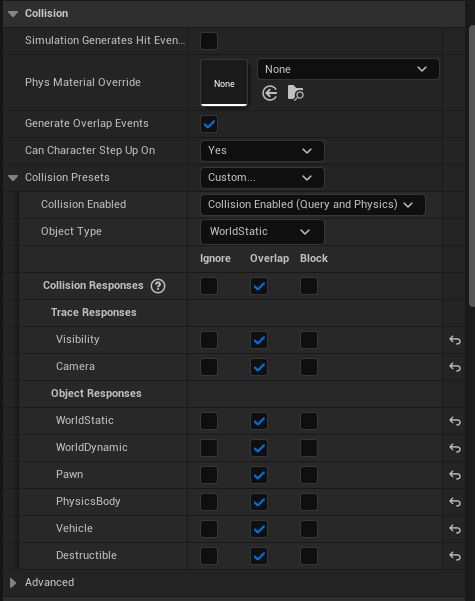
:::

:::note 11. Select the right hand Water Interactor Mesh
Select **OceanWaterInteractorMesh_RHand** in the component hierarchy. This component mirrors the left hand setup for the right hand.

:::

:::note 12. Configure the right hand Water Interactor Mesh
With **OceanWaterInteractorMesh_RHand** selected, configure the same settings as the left hand:

**Sockets:**
- **Parent Socket** - `hand_r` - Attaches to the right hand bone.

**Static Mesh:**
- **Static Mesh** - `Sphere`

**Materials:**
- **Element 0** - `DefaultMaterial`

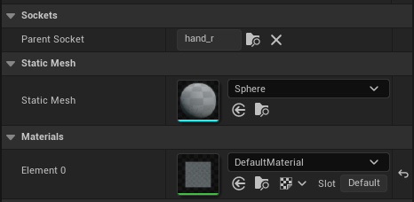
:::

:::note 13. Configure the right hand collision settings
Apply the same collision settings as the left hand interactor:

- **Simulation Generates Hit Events** - ❌ Disabled
- **Generate Overlap Events** - ✅ Enabled
- **Can Character Step Up On** - `Yes`
- **Collision Presets** - `Custom...`
- **Collision Enabled** - `Collision Enabled (Query and Physics)`
- **Object Type** - `WorldStatic`

**Collision Responses:**
All channels set to **Overlap**.

Both hand interactors should have identical collision configurations to ensure consistent splash effects.

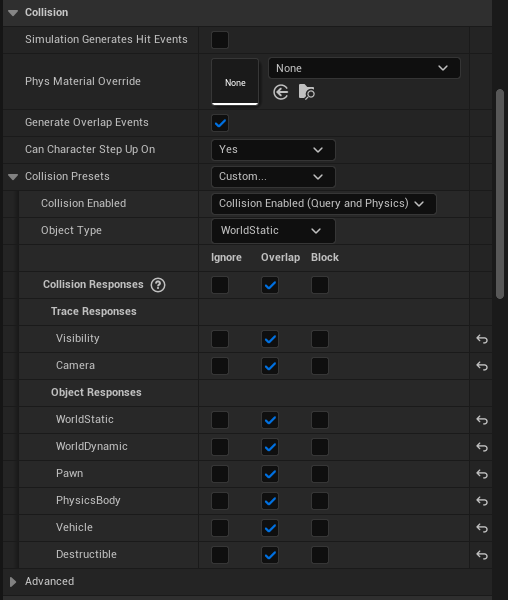
:::

---

## Part 3 - Component Configuration

This section covers the detailed configuration of the OceanBuoyancy and OceanSwimming components.

:::note 14. Select the OceanBuoyancy component
In the component hierarchy, select **OceanBuoyancy**. This component handles the floating physics that keep your character at the correct water level while swimming.

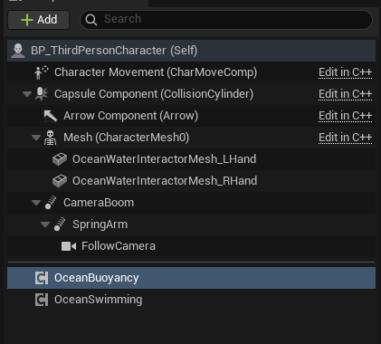
:::

:::note 15. Configure the OceanBuoyancy settings
With **OceanBuoyancy** selected, locate the **Buoyancy** category in the **Details** panel:

**Debug Controls:**
- **DebugPontoons** - Click to visualize pontoon positions.
- **ToggleDebug** - Toggle debug visualization on/off.
- **VerifySetup** - Validate the buoyancy configuration.

**Core Settings:**
- **Buoyancy Update Interval** - `0.0` (updates every frame).
- **Should Check First Init with Fail** - ✅ Enabled
- **Default Mesh Density** - `700.0` kg/m³ - Lower than water (1030) so the character floats.
- **Water Fluid Density** - `1030.0` kg/m³ - Standard seawater density.
- **Water Fluid Linear Damping** - `2.5` - Reduces linear velocity in water.
- **Water Fluid Angular Damping** - `2.5` - Reduces rotational velocity in water.
- **Water Velocity Damper** - `(0.1, 0.1, 0.1)` - Per-axis velocity dampening.
- **Limit Underwater Max Velocity** - ✅ Enabled
- **Max Underwater Velocity** - `1000.0` - Maximum speed when submerged.

**Pontoons:**
- **Pontoons** - `2 Array elements` - See next step for details.

**Forces:**
- **Wave XYDirectional Force Enabled** - ✅ Enabled - Waves push the character.
- **Wind Force Enabled** - ❌ Disabled
- **Wind Force Multiplier** - `1.0`

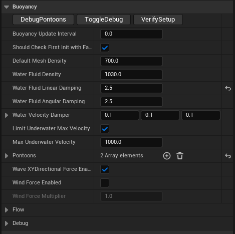
:::

:::note 16. Configure the Pontoons for character swimming
Expand the **Pontoons** array. For swimming characters, a two-pontoon setup works well:

**Index [0] - Head Pontoon:**
- **Socket** - `Head` - References the head bone.
- **Pontoon** - `(10.0, 0.0, 0.0)` - Offset from socket position.
- **Radius** - `20.0` - Small radius for head tracking.
- **Density Override** - `0.0` (uses default mesh density).
- **Mode** - `Water Enter Exit Event Only` - Only triggers enter/exit events, no buoyancy force.

**Index [1] - Body Pontoon:**
- **Socket** - `FullBody` - References the root or pelvis bone.
- **Pontoon** - `(0.0, 0.0, 100.0)` - Offset to center of mass.
- **Radius** - `500.0` - Large radius for stable floating.
- **Density Override** - `0.0`
- **Mode** - `Buoyancy` - Applies buoyancy forces to keep the character afloat.

The head pontoon detects when the character's head enters/exits water (useful for underwater detection), while the body pontoon provides the actual floating force.

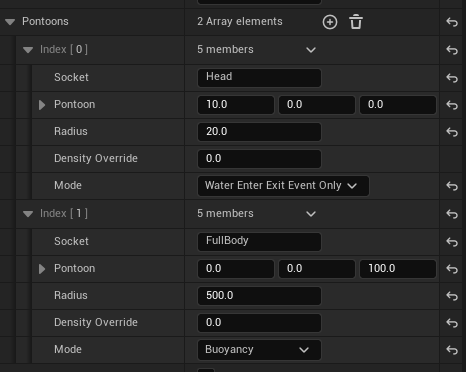
:::

:::note 17. Configure the Flow settings
Expand the **Flow** category to configure how water currents affect the character:

- **Enable Flow Physics** - ❌ Disabled by default. Enable if your water body has flow/current.
- **Angle Adjusted Force Strength** - `35.0` - How strongly flow direction affects the character.
- **Orient Mesh Rotation Yaw** - ❌ Disabled - When enabled, rotates the character to face the flow direction.

Flow physics are useful for rivers or areas with ocean currents. For calm water, leave disabled.

:::

:::note 18. Configure the Debug settings
Expand the **Debug** category for visualization options during development:

- **Debug Enabled** - ❌ Disabled in production. Enable to visualize pontoons in-game.
- **Debug Sphere Color Pontoon** - Gray - Color for pontoon positions.
- **Debug Sphere Color Buoyancy** - Magenta - Color for buoyancy force visualization.
- **Debug Sphere Color Buoyancy Active** - Red - Color when buoyancy is actively applying force.
- **Debug Sphere Segments** - `12` - Detail level of debug spheres.

Enable debug visualization while tuning your pontoon positions, then disable for release builds.

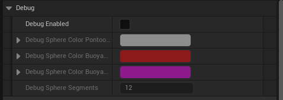
:::

:::note 19. Select and review the OceanSwimming component
Select **OceanSwimming** in the component hierarchy. This component manages:

- Swim locomotion state transitions (walking → swimming → diving).
- Swim animation triggers.
- Surface swimming vs. underwater swimming modes.
- Integration with the Character Movement Component.

The OceanSwimming component works in conjunction with OceanBuoyancy - buoyancy keeps the character floating while OceanSwimming handles the movement mechanics.

:::

:::note 20. Configure the OceanSwimming core settings
With **OceanSwimming** selected, locate the **Swimming** category in the **Details** panel:

- **Swimming Update Interval** - `0.0` (updates every frame for responsive controls).
- **Pontoon Name Full Body** - `FullBody` - Must match the socket name used in your OceanBuoyancy pontoon configuration.
- **Pontoon Name Head** - `Head` - Must match the head pontoon socket name.
- **Swimming Buoyancy Force Multiplier** - `0.03` - Scales the buoyancy force applied during swimming.
- **Immersion** - `100.0` - Depth threshold for full immersion detection.
- **Swim Up Limit Wave Distance** - `0.0` - Limits upward swimming near wave peaks (0 = no limit).

The pontoon names create the link between OceanSwimming and OceanBuoyancy - ensure these match exactly.

:::

:::note 21. Configure Speed, Water Walk, and Surface Locked Swimming
Expand the **Speed**, **Water Walk**, and **Surface Locked Swimming** categories:

**Speed:**
- **Swim Max Speed** - `300.0` - Normal swimming speed.
- **Swim Fast Max Speed** - `600.0` - Sprint swimming speed (when holding the fast swim input).

**Water Walk:**
- **Enable Water Walk** - ✅ Enabled - Allows the character to walk on shallow water instead of swimming.
- **Water Walk Max Walk Speed** - `300.0` - Walking speed in shallow water.
- **Water Walk Depth** - `20.0` - Maximum water depth where walking is allowed instead of swimming.

**Surface Locked Swimming:**
- **Enable Surface Locked Swimming** - ✅ Enabled - When active, the character stays at the water surface and cannot dive.
- **Surface Locked Swimming** - ❌ Disabled by default - Toggle this at runtime to lock/unlock surface swimming.

Surface Locked Swimming is useful for casual games or when you want to prevent players from diving underwater.

:::

:::note 22. Configure Underwater settings
Expand the **Underwater** category to configure drowning and visual effects:

**Drowning:**
- **Drowning Enabled** - ✅ Enabled - Characters can drown when underwater too long.
- **Drowning Time Warning** - `60` seconds - Time before drowning warning appears.
- **Drowning Time Death** - `120` seconds - Time until the character dies from drowning.

**Effects:**
- **Enable Underwater Effects** - ✅ Enabled
- **Head Bubbles Effect Niagara** - `NS_Head_Bubbles` - Particle system for breath bubbles.
- **Head Socket Name** - `head_Socket` - Socket where head bubbles spawn.
- **Right Foot Bubbles Effect** - `NS_Foot_Bubbles` - Particle system for right foot.
- **Left Foot Bubbles Effect** - `NS_Foot_Bubbles` - Particle system for left foot.
- **Right Foot Socket Name** - `foot_r_Socket`
- **Left Foot Socket Name** - `foot_l_Socket`
- **Stop Head Bubbles While...** - ✅ Enabled - Stops bubbles during certain states.
- **Stop Right Foot Bubbles...** - ✅ Enabled
- **Stop Left Foot Bubbles...** - ✅ Enabled
- **Swim Fast Trail Effect** - `NS_SwimFast_Trail` - Trail effect when sprint swimming.
- **Swim Fast Trail Socket** - `swim_fast_trail_Socket`

**Sound:**
- **Swim Fast Trail Sound** - `None` - Optional sound cue for fast swimming.

:::

:::note 23. Configure Debug and Controls settings
Expand the **Debug** and **Controls** categories:

**Debug:**
- **Debug Capsule Enabled** - ❌ Disabled - Visualizes the character capsule.
- **Debug Dependant Buoyancy** - ❌ Disabled - Shows buoyancy dependency info.
- **Debug State Enabled** - ❌ Disabled - Displays current swim state on screen.
- **Debug Controls Enabled** - ❌ Disabled - Shows input control debug info.
- **Debug Swimming Data Enabled** - ❌ Disabled - Displays swimming parameters.
- **Debug Water Surface Enabled** - ❌ Disabled - Visualizes water surface detection.

**Controls:**
- **Swimming Orient Rotation** - ✅ Enabled - Character rotates to face movement direction while swimming.
- **Swimming Use Controller Rotation Yaw** - ❌ Disabled - When enabled, uses controller yaw for rotation.
- **Swimming Use Controller Rotation Pitch** - ❌ Disabled - When enabled, uses controller pitch for diving angle.

Enable debug options during development to visualize swim states and troubleshoot issues.

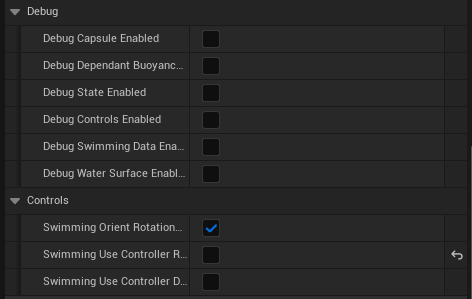
:::

---

## Part 4 - Blueprint Events and Input Mapping

This section covers the Blueprint event setup and input action configuration required for swimming controls.

:::note 24. Implement Swim Fast and Swim Up/Down input events
In the character Blueprint's **Event Graph**, implement the swimming input actions:

**Swim Fast (Left Panel):**
1. Add **EnhancedInputAction IA_SwimFast** event node.
2. Connect **Triggered** → **Server Swim Fast** (Value = ✅ true).
3. Connect **Canceled** → **Server Swim Fast** (Value = ❌ false).
4. Set **Target** to the **Ocean Swimming** component reference.

**Swim Up / Swim Down (Right Panel):**
1. Add **EnhancedInputAction IA_SwimUpOrDown** event node.
2. Connect **Triggered** → **Server Swim Up or Down** with **Value** and **Axis Value**.
3. Connect **Completed** → **Server Swim Up or Down** to reset when input is released.
4. Set **Target** to the **Ocean Swimming** component reference.

The `Server` prefix indicates these functions are replicated for multiplayer support.

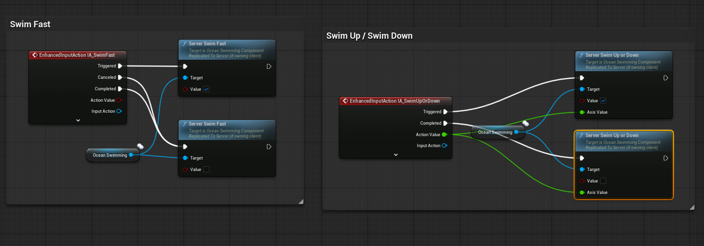
:::

:::note 25. Configure Begin Play and Input Mapping initialization
In the **Event Graph**, set up the initialization sequence on **Event BeginPlay**:

**Begin Play Sequence:**
1. **Event BeginPlay** → **Sequence** node
2. **Then 0** → **Register Example UI** (Target: self)
3. → **Register User Example Events** (Target: self)
4. → **Input Mapping** (Target: self)

**VSync Configuration (Optional):**
- **Get Game User Settings** → **Set VSync Enabled** (Enable: ✅)
- → **Execute Console Command** (Command: `t.MaxFPS 500`)

**Add Input Mapping (Custom Event):**
1. Create a **Input Mapping** custom event.
2. **Get Controller** → **Cast To PlayerController**
3. → **Enhanced Input Local Player Subsystem** → **Is Valid**
4. If valid → **Add Mapping Context**
   - **Mapping Context** - `IMC_Default`
   - **Priority** - `0`

This ensures the swimming input actions are registered when the game starts.

:::

:::note 26. Configure the Input Mapping Context (IMC_Default)
Open the **IMC_Default** Input Mapping Context asset. In the **Details** panel, configure the **Default Key Mappings**:

| Input Action | Key Binding | Description |
|--------------|-------------|-------------|
| **IA_Jump** | _(default)_ | Jump / Exit water |
| **IA_Move** | _(default)_ | WASD movement |
| **IA_Look** | _(default)_ | Mouse look |
| **IA_SwimFast** | `Left Shift` | Sprint swimming |
| **IA_SurfaceLockedSwimming** | `L` | Toggle surface lock |
| **IA_SwimUpOrDown** | `Q` (up), `E` (down) | Vertical swimming |
| **IA_ToggleUI** | _(default)_ | Toggle UI visibility |
| **IA_Zoom** | _(default)_ | Camera zoom |

The swimming-specific input actions are:
- **IA_SwimFast** - Hold `Left Shift` to swim faster.
- **IA_SurfaceLockedSwimming** - Press `L` to toggle between surface swimming and free diving.
- **IA_SwimUpOrDown** - Press `Q` to swim up, `E` to swim down.

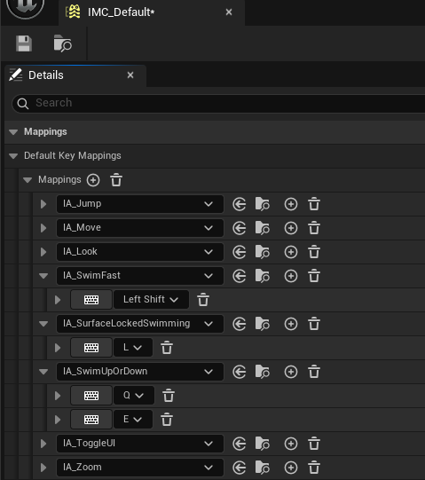
:::

---

## Pontoon Placement Guidelines for Characters

When configuring pontoons for swimming characters, follow these principles:

| Pontoon | Socket | Purpose | Recommended Radius |
|---------|--------|---------|-------------------|
| Head | `Head` or `head` | Water enter/exit detection | 15-25 |
| Body | `FullBody`, `pelvis`, or `root` | Primary buoyancy force | 400-600 |
| Hands _(optional)_ | `hand_l`, `hand_r` | Splash interaction | 10-20 |

**Character Pontoon Tips:**
1. Use **Water Enter Exit Event Only** mode for detection-only pontoons (head, hands).
2. Use **Buoyancy** mode for the main floating pontoon (body).
3. Keep the body pontoon radius large (400-600) for stable floating without oscillation.
4. Adjust **Default Mesh Density** (600-800) to control how high the character floats.
5. Increase **Water Fluid Linear/Angular Damping** (2.0-3.0) for smoother swimming motion.

---

## Troubleshooting Common Issues

| Problem | Likely Cause | Solution |
|---------|--------------|----------|
| Character doesn't enter swim mode | Swimming disabled in Water Volume | Enable **Enable Swimming in Area** in Water Volume settings |
| Character falls through water | Water Volume collision incorrect | Set collision to `OverlapAllDynamic` with **Generate Overlap Events** enabled |
| Character bobs excessively | Damping too low or radius too small | Increase **Water Fluid Linear Damping** or **Pontoon Radius** |
| Character sinks underwater | Mesh density too high | Reduce **Default Mesh Density** (try 600-700) |
| Character floats too high | Mesh density too low | Increase **Default Mesh Density** (try 800-900) |
| No splash effects | Water Interactor Meshes missing or misconfigured | Add **OceanWaterInteractorMesh** components attached to hand sockets |
| Swim animations not playing | OceanSwimming component missing | Add **OceanSwimming** component to character |
| Character doesn't respond to waves | Wave force disabled | Enable **Wave XYDirectional Force Enabled** in OceanBuoyancy |
| Swim Fast not working | Input action not configured | Verify **IA_SwimFast** is mapped in IMC_Default and Blueprint events are connected |
| Cannot dive underwater | Surface Locked Swimming enabled | Disable **Surface Locked Swimming** or press the toggle key (default: L) |
| Character walks instead of swims | Water Walk depth too high | Reduce **Water Walk Depth** or disable **Enable Water Walk** |
| No underwater bubbles | Effects disabled or sockets missing | Enable **Enable Underwater Effects** and verify socket names match skeleton |
| Character drowns too quickly | Drowning time too short | Increase **Drowning Time Warning** and **Drowning Time Death** values |
| Swim Up/Down not responding | Input mapping missing | Add **IA_SwimUpOrDown** to IMC_Default with Q/E bindings |
| Pontoon names mismatch error | Socket names don't match | Ensure **Pontoon Name Full Body** and **Pontoon Name Head** match OceanBuoyancy socket names exactly |

---

## Summary

In this guide, you learned how to:

1. **Set up the scene** - Add Oceanology Manager, Water Volume, and water bodies with swimming enabled.
2. **Configure the Water Volume** - Enable swimming, set collision to overlap detection, and size the volume appropriately.
3. **Locate character assets** - Find the pre-configured BP_ThirdPersonCharacter or prepare your own character Blueprint.
4. **Add swimming components** - Add OceanBuoyancy and OceanSwimming components to your character.
5. **Configure Water Interactor Meshes** - Attach sphere meshes to hand sockets for splash effects.
6. **Set up pontoons** - Configure head detection and body buoyancy pontoons for stable swimming.
7. **Tune buoyancy parameters** - Adjust density, damping, and forces for natural swimming behavior.
8. **Configure OceanSwimming settings** - Set up speed, water walk, surface locked swimming, and underwater effects.
9. **Implement input events** - Create Blueprint events for swim fast, swim up/down, and surface lock toggle.
10. **Set up Input Mapping Context** - Configure key bindings for all swimming actions.

With this setup, your character can seamlessly transition between walking on land, wading in shallow water, and swimming in Oceanology water bodies with full control over diving depth and swim speed.
