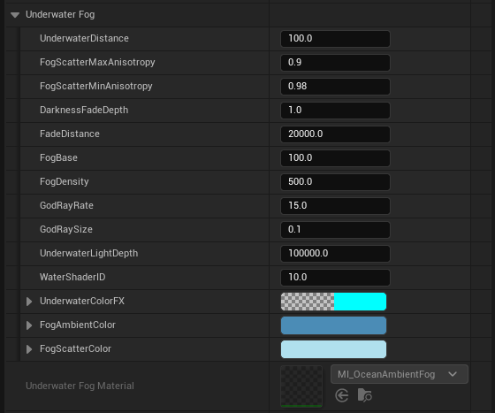
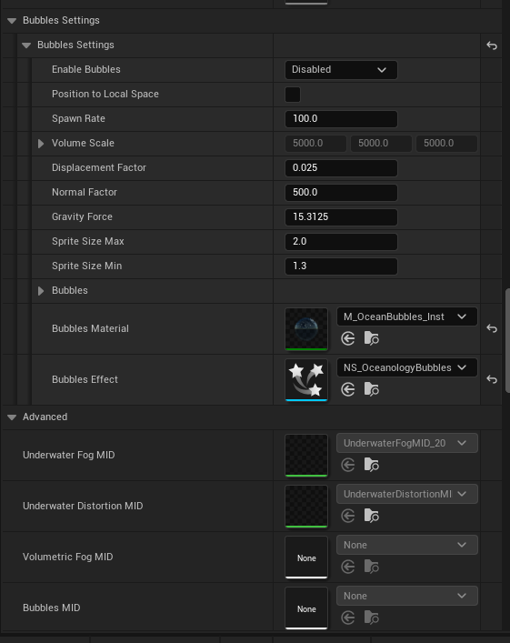
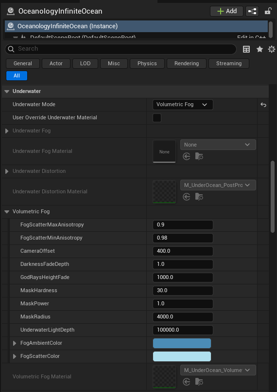

# Oceanology Next-Gen — Underwater

_Last updated: 2025-12-13_

## Prerequisites
- Unreal Engine 5.5 or newer.
- **Oceanology** installed and configured (see the **Setup** page).
- At least one **OceanologyInfiniteOcean** actor placed in your level.
- Basic familiarity with **post-processing** and **materials** in Unreal Engine.

## Notes
- The Underwater system in Oceanology provides comprehensive visual effects for when the camera or player submerges beneath the water surface. This includes fog, color tinting, distortion, god rays, and bubble particles.
- Oceanology offers two primary underwater rendering modes: **Underwater** (standard post-process fog) and **Volumetric Fog** (advanced volumetric rendering with depth-based effects).
- The system automatically detects when the camera enters the water volume and applies the appropriate underwater effects.

---

## Step-by-step

:::note 1. Access the Underwater settings
Select the **OceanologyInfiniteOcean** actor in your level. In the **Details** panel, locate and expand the **Underwater** category. Here you will find all underwater rendering options:

**Primary Settings:**
- **Underwater Mode** — Select the rendering method. Options are `Underwater` (standard fog) or `Volumetric Fog` (advanced volumetric effects).
- **User Override Underwater Material** — Optional custom material to override the default underwater rendering.

**Subcategories:**
- **Underwater Fog** — Standard fog settings and material (`MI_OceanAmbientFog`).
- **Underwater Distortion** — Screen distortion effects (`M_UnderOcean_PostPro`).
- **Volumetric Fog** — Advanced volumetric fog settings (only active when Volumetric Fog mode is selected).
- **Bubbles Settings** — Underwater bubble particle effects.
- **Advanced** — Material Instance Dynamic (MID) references for runtime modifications.

The default mode is `Underwater` which provides good performance with realistic underwater visuals.

:::

:::note 2. Configure Underwater Fog settings
Expand the **Underwater Fog** subcategory to access detailed fog parameters. These settings control the appearance of underwater visibility and atmosphere:

**Distance and Density:**
- **UnderwaterDistance** — `100.0`. Base distance for fog calculations.
- **FadeDistance** — `20000.0`. Distance at which fog reaches full density.
- **FogBase** — `100.0`. Base fog level applied uniformly.
- **FogDensity** — `500.0`. Overall fog thickness. Higher values reduce visibility.

**Light Scattering:**
- **FogScatterMaxAnisotropy** — `0.9`. Maximum anisotropic light scattering.
- **FogScatterMinAnisotropy** — `0.98`. Minimum anisotropic light scattering.
- **DarknessFadeDepth** — `1.0`. Depth at which darkness begins to fade in.

**God Rays:**
- **GodRayRate** — `15.0`. Frequency of god ray light shafts.
- **GodRaySize** — `0.1`. Size/width of individual god rays.
- **UnderwaterLightDepth** — `100000.0`. Maximum depth for light penetration.

**Shader and Colors:**
- **WaterShaderID** — `10.0`. Shader identifier for material switching.
- **UnderwaterColorFX** — Color effect applied to the underwater view.
- **FogAmbientColor** — Base ambient fog color (blue tint).
- **FogScatterColor** — Light scattering color (lighter blue).
- **Underwater Fog Material** — `MI_OceanAmbientFog`. The material instance used for fog rendering.

:::

:::note 3. Configure Bubbles Settings
Expand the **Bubbles Settings** subcategory to control underwater bubble particle effects. Also review the **Advanced** section for material instance references:

**Bubbles Settings:**
- **Enable Bubbles** — `Disabled` by default. Enable to spawn bubble particles underwater.
- **Position to Local Space** — When enabled, bubbles spawn relative to the actor rather than world space.
- **Spawn Rate** — `100.0`. Number of bubbles spawned per second.
- **Volume Scale** — `5000.0, 5000.0, 5000.0`. Size of the spawning volume (X, Y, Z).
- **Displacement Factor** — `0.025`. How much bubbles are displaced by water movement.
- **Normal Factor** — `500.0`. Influence of surface normals on bubble behavior.
- **Gravity Force** — `15.3125`. Upward buoyancy force on bubbles.
- **Sprite Size Max** — `2.0`. Maximum bubble sprite size.
- **Sprite Size Min** — `1.3`. Minimum bubble sprite size.

**Bubbles Assets:**
- **Bubbles Material** — `M_OceanBubbles_Inst`. Material for bubble particles.
- **Bubbles Effect** — `NS_OceanologyBubbles`. Niagara system for bubble simulation.

**Advanced (Material Instance Dynamics):**
- **Underwater Fog MID** — `UnderwaterFogMID_20`. Runtime-modifiable fog material.
- **Underwater Distortion MID** — `UnderwaterDistortionMI`. Runtime-modifiable distortion material.
- **Volumetric Fog MID** — Reference for volumetric fog material instance.
- **Bubbles MID** — Reference for bubbles material instance.

:::

:::note 4. Use Volumetric Fog mode for advanced rendering
Change **Underwater Mode** to `Volumetric Fog` for more advanced underwater rendering with depth-based volumetric effects. This mode provides more realistic light interaction but requires more GPU performance.

When Volumetric Fog is selected, expand the **Volumetric Fog** subcategory:

**Scattering:**
- **FogScatterMaxAnisotropy** — `0.9`. Maximum light scattering anisotropy.
- **FogScatterMinAnisotropy** — `0.98`. Minimum light scattering anisotropy.

**Camera and Depth:**
- **CameraOffset** — `400.0`. Offset for fog calculations relative to camera.
- **DarknessFadeDepth** — `1.0`. Depth where darkness begins.
- **GodRaysHeightFade** — `1000.0`. Height at which god rays fade out.
- **UnderwaterLightDepth** — `100000.0`. Maximum light penetration depth.

**Mask Settings:**
- **MaskHardness** — `30.0`. Edge hardness of the volumetric mask.
- **MaskPower** — `1.0`. Power curve for mask falloff.
- **MaskRadius** — `4000.0`. Radius of the volumetric fog mask.

**Colors:**
- **FogAmbientColor** — Base ambient color (deep blue).
- **FogScatterColor** — Light scattering color (darker blue for volumetric).

**Material:**
- **Volumetric Fog Material** — `M_UnderOcean_Volume`. The volumetric fog material.

Note that when using Volumetric Fog mode, the standard **Underwater Fog Material** is set to `None` as the volumetric system handles fog rendering instead.

:::

---

## Underwater Mode Comparison

| Feature | Underwater Mode | Volumetric Fog Mode |
|---------|-----------------|---------------------|
| **Performance** | ✅ Better | ⚠️ More demanding |
| **God Rays** | Basic | Advanced volumetric |
| **Depth Accuracy** | Good | Excellent |
| **Light Scattering** | Post-process | True volumetric |
| **Best For** | General use, mobile | High-end PC, cinematic |

---

## Configuration Guidelines

| Scenario | Recommended Settings |
|----------|---------------------|
| **Clear tropical water** | FogDensity: `200`, FogAmbientColor: light cyan |
| **Deep ocean** | FogDensity: `800`, FogAmbientColor: dark blue, DarknessFadeDepth: `0.5` |
| **Murky water** | FogDensity: `1000`, FogScatterColor: green-brown tint |
| **Performance priority** | Underwater Mode: `Underwater`, Enable Bubbles: Disabled |
| **Visual quality priority** | Underwater Mode: `Volumetric Fog`, Enable Bubbles: Enabled |
| **Subtle god rays** | GodRayRate: `5`, GodRaySize: `0.05` |
| **Dramatic god rays** | GodRayRate: `25`, GodRaySize: `0.2` |

---

## Troubleshooting Common Issues

| Problem | Likely Cause | Solution |
|---------|--------------|----------|
| No underwater effect | Camera not in water volume | Verify Water Volume placement |
| Fog too thick | FogDensity too high | Reduce **FogDensity** value |
| No god rays visible | GodRayRate too low | Increase **GodRayRate** and **GodRaySize** |
| Bubbles not appearing | Bubbles disabled | Set **Enable Bubbles** to Enabled |
| Poor performance underwater | Volumetric mode on low-end hardware | Switch to standard **Underwater** mode |
| Colors look wrong | Incorrect fog colors | Adjust **FogAmbientColor** and **FogScatterColor** |
| Distortion too strong | Distortion material settings | Modify **Underwater Distortion Material** parameters |
| Volumetric fog not working | Wrong mode selected | Verify **Underwater Mode** is set to `Volumetric Fog` |

---

## Summary

In this guide, you learned how to:

1. **Access Underwater settings** — Navigate the Underwater category and understand the two rendering modes.
2. **Configure Underwater Fog** — Adjust fog density, distance, god rays, and colors for standard underwater rendering.
3. **Set up Bubbles** — Enable and customize underwater bubble particle effects.
4. **Use Volumetric Fog mode** — Configure advanced volumetric underwater rendering for high-quality visuals.

With the Underwater system properly configured, your submerged environments will feature realistic fog, light scattering, god rays, and atmospheric effects that create immersive underwater experiences.
