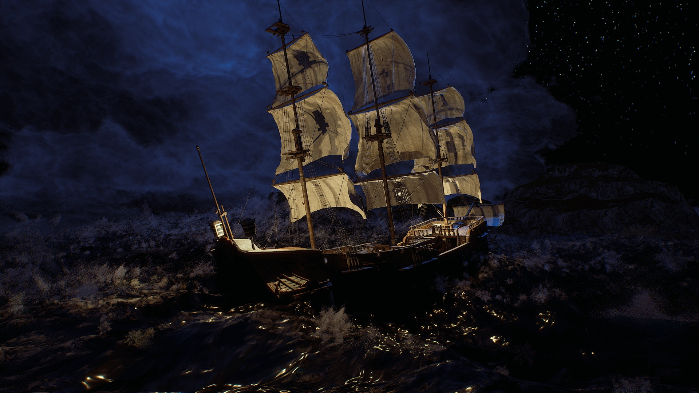

# Oceanology Next-Gen

**Oceanology Next-Gen** is a production-ready water simulation system for Unreal Engine, engineered from the ground up in C++ for predictable performance and scalability. Whether you're building vast open-world environments, cinematic sequences, or competitive multiplayer experiences, Oceanology Next-Gen delivers the visual fidelity and runtime efficiency your project demands.

---

## Who It's For

Oceanology Next-Gen is designed for teams who need water that works as good as it looks:

- **Open-World Studios** — Seamless oceans spanning kilometers with consistent performance via quadtree LOD and World Partition support.
- **Cinematic Productions** — Photoreal waves, volumetric underwater rendering, and god rays for film-quality visuals.
- **Multiplayer Projects** — Deterministic wave calculations ensure synchronized water states across all clients without network overhead.
- **Technical Artists** — Exposed parameters, preset Data Assets, and material hooks for full customization from stylized to hyperreal.

---

## Core Features

### Wave Simulation
- **Hybrid Spectral System** — Combines Gerstner waves for broad swells with FFT for high-frequency detail.
- **Coastal Breakers** — Math-based breaking waves with foam generation at configurable shore distances.
- **Deterministic Calculations** — Frame-perfect synchronization for multiplayer and replay systems.

### Performance & Scalability
- **C++ Quadtree Tessellation** — Dynamic mesh density based on camera distance and screen-space error.
- **World Partition Integration** — Native streaming support for massive worlds without manual chunking.
- **GPU-Optimized Shaders** — Designed for high-end hardware with Shader Model 6 and DirectX 12.

### Visual Effects
- **Flow-Based Foam** — Procedural foam that responds to wave motion, obstacles, and vessel wakes.
- **Crest Splashes** — Niagara-driven particle systems triggered by wave steepness thresholds.
- **Underwater Volumetrics** — Light scattering, caustics, and god rays with depth-based attenuation.
- **RVT Landscape Integration** — Seamless shoreline blending via Runtime Virtual Textures.

### Gameplay Systems
- **Pontoon Buoyancy** — Physics-accurate floating with configurable density, damping, and wave response.
- **Swimming Component** — Ready-to-use character swimming with surface detection and underwater states.
- **Water Volumes** — Trigger-based regions for gameplay logic, audio zones, and post-process effects.

### Workflow & Flexibility
- **Preset Data Assets** — Save and share complete water configurations across levels and projects.
- **Multiple Water Bodies** — Infinite oceans, bounded lakes, rivers, and pools with independent settings.
- **Appearance Range** — From photoreal ocean rendering to stylized toon shading with the same core system.

---

## Technical Requirements

| Requirement | Specification |
|-------------|---------------|
| **Engine** | Unreal Engine 5.6 or newer |
| **Platform** | Windows (macOS/Linux experimental) |
| **Graphics API** | DirectX 12 with Shader Model 6 |
| **Hardware** | High-end dedicated GPU recommended (RTX 3070+ or equivalent) |

:::caution Performance Note
Oceanology Next-Gen is optimized for high-end hardware. While it runs on mid-range GPUs, full visual quality requires modern graphics cards with adequate VRAM (8GB+).
:::

---

## Documentation Structure

This documentation is organized to get you productive quickly:

| Section | Description |
|---------|-------------|
| **[Setup](./setup.md)** | Installation, project configuration, and first scene verification. |
| **[Waves](./NextGenWaves.md)** | Gerstner wave parameters, presets, and wave layer customization. |
| **[Buoyancy](./NextGenBuoyancy.md)** | Pontoon-based floating physics for vessels and objects. |
| **[Swimming](./NextGenSwimming.md)** | Character swimming component setup and configuration. |
| **[Underwater](./NextGenUnderwater.md)** | Volumetric effects, post-processing, and caustics. |
| **[Surface](./NextGenSurface.md)** | Water surface rendering, reflections, and refractions. |
| **[QuadTree](./NextGenQuadTree.md)** | LOD system, tessellation settings, and performance tuning. |
| **[Infinite Ocean](./NextGenInfinite.md)** | Infinite ocean setup and world-scale water configuration. |
| **[Shore Waves](./NextGenShoreWaves.md)** | Math-based breaking waves and coastal wave behavior. |
| **[Shoreline Wetness](./NextGenShorelineWetness.md)** | Dynamic shoreline wetness and sand darkening effects. |
| **[Foam](./NextGenFoam.md)** | Flow-based foam generation and wave crest foam systems. |
| **[DomeFX](./NextGenDomeFX.md)** | Sky dome effects and atmospheric integration. |
| **[RVT](./NextGenRVT.md)** | Runtime Virtual Texture and landscape integration. |
| **[Audio](./NextGenAudio.md)** | Dynamic audio system and wave-driven soundscapes. |
| **[Presets](./NextGenPreset.md)** | Saving, loading, and managing water configuration presets. |

---

## Quick Start

1. **Install the Plugin** — Enable Oceanology Next-Gen in your project's Plugins menu.
2. **Add Water to Your Level** — Use Quick Add (`+`) and search for `Oceanology Infinite Ocean`.
3. **Add the Manager** — Place an `Oceanology Manager` actor to initialize the system.
4. **Configure Water Volume** — Add an `Oceanology Water Volume` for buoyancy and gameplay features.
5. **Play** — Enter Play mode to see your ocean in action.

For detailed instructions, see the **[Setup Guide](./setup.md)**.

---

## Support & Community

**Need Help?**
- **[Discord](https://discord.gg/VHJGBDR2as)** — Join our community for real-time support and discussions.
- **Marketplace** — Open a support ticket through the Unreal Marketplace page.
- **Issue Reports** — Include engine version, plugin version, logs (`Saved/Logs/`), and screenshots.

**Stay Updated**
- Follow the changelog for new features and fixes.
- Check the FAQ for common questions and solutions.

---

## Version History

| Version | Date | Highlights |
|---------|------|------------|
| **1.0.0** | 2025 | Initial release with hybrid wave system, quadtree tessellation, and buoyancy. |

---

**Ready to dive in?** Start with the **[Setup Guide](./setup.md)** →

