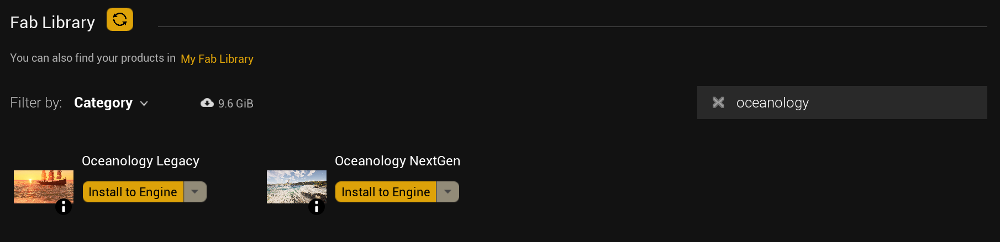
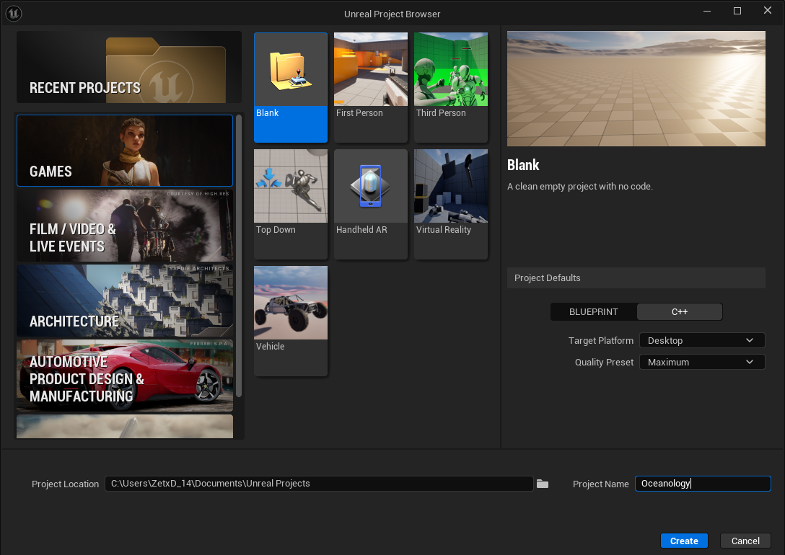
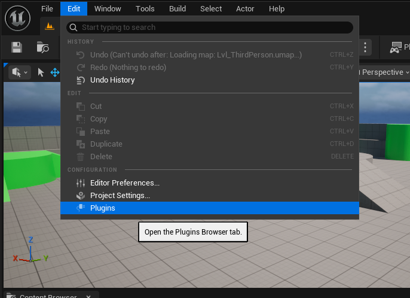
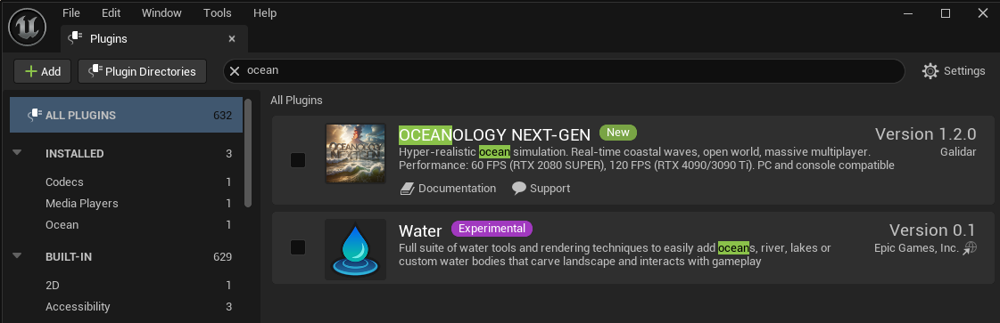

# Oceanology NextGen — Setup

_Last updated: 2025-10-16_

## Prerequisites
- Unreal Engine 5.6 or newer.
- Windows with **DirectX 12** capable GPU.
- **Shader Model 6** support recommended for advanced features.
- Optional: Mesh Distance Fields for shoreline effects.

## Notes
- NextGen features benefit from **DX12 + SM6**. Enable them before testing.
- Large worlds are supported via **World Partition** and streaming.

## Step-by-step

:::note 1. Install the plugin
- Install from Marketplace into your Engine, or copy the plugin folder into `<Project>/Plugins/`.
- Restart the editor if you manually copied files.

:::

:::note 2. Enable the plugin
- Open **Edit → Plugins**, search for **Oceanology NextGen**, enable it, and accept the restart prompt.
- After restart, confirm there are no missing dependencies in the Output Log.

:::

:::note 3. Project Settings essentials
- **Platforms → Windows**: set **Default RHI** to **DirectX 12** and enable **D3D12 Shader Model 6**.
- **Engine → Rendering**: toggle **Generate Mesh Distance Fields** for shoreline foam and interactions.
- Optional: **Global Illumination = Lumen**, **Reflections = Lumen**, **Shadow Map Method = Virtual Shadow Maps**.

:::

:::note 4. Open a demo map
- In **Content Drawer → Plugins → Oceanology NextGen → Maps**, open **NextGen Demo Map** to let shaders compile and verify assets.

:::

:::note 5. Place the NextGen Ocean
- In **Place Actors**, drag **NextGen Ocean** into the level.
- Scale/position to cover your playable area. For large worlds, prefer World Partition.

:::

:::note 6. Assign a starter Material Instance
- Use the provided material instance from the plugin content.
- Tweak wave height/length, foam thresholds, normals, and water color.

:::

:::note 7. Interaction and effects
- Enable collision if gameplay requires it.
- Optionally add Niagara splash/foam systems and audio cues.

:::

:::note 8. Save and test
- Save your level and **Play In Editor**.
- If performance is low: disable debug views, reduce wave layers, update GPU drivers.

:::

## Troubleshooting

:::warning Common issues
**Pink/preview materials**: shaders are compiling; wait.

**No shoreline foam**: enable **Generate Mesh Distance Fields** and ensure distance fields are built for landscape/meshes.

**DX12/SM6 errors**: verify Project Settings and restart the editor.

**Low performance**: disable expensive debug views, reduce wave/spectrum layers, and profile GPU.
:::