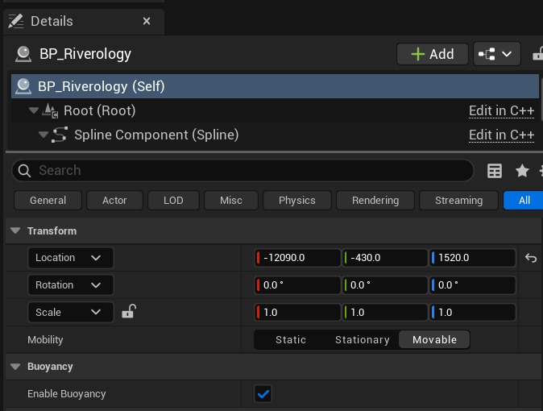

# Riverology - Buoyancy

⚓ Flow Physics

💨 Downstream Forces

🎮 Game Ready

Implement flow-based buoyancy with automatic downstream forces for floating objects.

---

## Prerequisites

| Requirement | Details |
|-------------|---------|
| **Engine** | Unreal Engine 5.3 or newer |
| **Plugin** | Riverology installed and configured |
| **Scene** | BP_Riverology actor with waves configured |
| **Skills** | Basic physics and collision familiarity |

:::info About River Buoyancy
Unlike ocean buoyancy, river buoyancy is handled directly by **BP_Riverology** - no additional components needed. Objects automatically receive buoyancy forces when **Enable Buoyancy** is active, and flow forces push them downstream along the spline direction.
:::

---

## Step-by-step

:::note 1. Add the Riverology actor to your level
Open your level and use the **Quickly Add to the Project** menu (the `+` button in the toolbar or right-click in the viewport). Type `BP_Riverology` in the search field.

Select **BP_Riverology** from the results and drag it into your scene. This Blueprint contains the river spline, water rendering, wave simulation, and buoyancy system.

If you already have a river placed, you can skip this step and select the existing BP_Riverology actor.

:::

:::note 2. Enable buoyancy on the river
Select the **BP_Riverology** actor in your level. In the **Details** panel, configure the following settings:

**Transform:**

| Property | Value | Description |
|----------|-------|-------------|
| **Location** | `X, Y, Z` | Position of the river spline origin |
| **Rotation** | `0.0°, 0.0°, 0.0°` | Orientation of the river |
| **Scale** | `1.0, 1.0, 1.0` | Uniform scale (typically unchanged) |
| **Mobility** | `Movable` | Required for runtime physics interaction |

**Buoyancy:**

| Property | Value | Description |
|----------|-------|-------------|
| **Enable Buoyancy** | ✅ Enabled | Master toggle for river buoyancy system |

**Important:** The **Mobility** must be set to **Movable** for buoyancy to function. Static or Stationary rivers cannot apply physics forces to overlapping actors.

When **Enable Buoyancy** is checked, any physics-simulating actor that enters the river volume will automatically receive upward buoyancy forces and downstream flow forces.

:::

---

## Configuring Buoyant Objects

For an object to float in the river, it must be properly configured for physics simulation. This section demonstrates the required settings using a simple cube.

:::note 3. Configure the Static Mesh for physics simulation
Create or select a **Static Mesh Actor** that you want to float in the river. In the **Details** panel, configure the following:

**Static Mesh:**

| Property | Value | Description |
|----------|-------|-------------|
| **Static Mesh** | `Cube` (or any mesh) | The visual geometry of the floating object |

**Physics:**

| Property | Value | Description |
|----------|-------|-------------|
| **Simulate Physics** | ✅ Enabled | **Critical** - Enables physics simulation |
| **Mass (kg)** | `177.827942` | Calculated from mesh volume and density. Affects how deep the object floats. |
| **Linear Damping** | `0.01` | Resistance to linear movement. Low values allow free floating. |
| **Angular Damping** | `0.0` | Resistance to rotation. Zero allows natural tumbling in current. |
| **Enable Gravity** | ✅ Enabled | Gravity pulls down, buoyancy pushes up |

**Constraints:**

| Property | Value | Description |
|----------|-------|-------------|
| **Lock Position** | `X ❌ Y ❌ Z ❌` | All unlocked for free movement |
| **Lock Rotation** | `X ❌ Y ❌ Z ❌` | All unlocked for natural rotation |
| **Mode** | `Default` | Standard constraint behavior |

**Advanced Physics Options:**

| Property | Value | Description |
|----------|-------|-------------|
| **Gravity Group Index** | `0` | Default gravity group |
| **Update Kinematic from Simulation** | ❌ Disabled | Not needed for standard buoyancy |
| **Gyroscopic Torque Enabled** | ❌ Disabled | Simplifies rotation behavior |
| **Ignore Radial Impulse** | ❌ Disabled | Allows explosion forces |
| **Ignore Radial Force** | ❌ Disabled | Allows radial force fields |
| **Apply Impulse on Damage** | ✅ Enabled | Reacts to damage events |
| **Replicate Physics to Autonomous Proxy** | ✅ Enabled | Network replication support |

The **Mass** value is particularly important for buoyancy behavior. Heavier objects sit lower in the water and are more resistant to wave motion, while lighter objects bob more dramatically.

:::

:::note 4. Configure collision settings
Still on the Static Mesh Actor, locate the **Collision** category. Proper collision setup is essential for buoyancy detection.

**Collision:**

| Property | Value | Description |
|----------|-------|-------------|
| **Simulation Generates Hit Events** | ❌ Disabled | Optional - enable for impact sounds/effects |
| **Phys Material Override** | `None` | Uses default physical material |
| **Generate Overlap Events** | ✅ Enabled | **Required** - Detects river volume overlap |
| **Can Character Step Up On** | `Yes` | Allows characters to stand on floating object |

**Collision Presets:**

| Property | Value | Description |
|----------|-------|-------------|
| **Collision Presets** | `PhysicsActor` | Pre-configured for physics objects |
| **Collision Enabled** | `Collision Enabled (Query and Physics)` | Full collision support |
| **Object Type** | `PhysicsBody` | Identifies as a physics-simulated object |

**Collision Responses:**

| Channel | Ignore | Overlap | Block |
|---------|--------|---------|-------|
| **Visibility** | | | ✅ |
| **Camera** | | | ✅ |
| **WorldStatic** | | | ✅ |
| **WorldDynamic** | | | ✅ |
| **Pawn** | | | ✅ |
| **PhysicsBody** | | | ✅ |
| **Vehicle** | | | ✅ |
| **Destructible** | | | ✅ |

The **PhysicsActor** preset provides sensible defaults for most floating objects. All channels are set to **Block**, ensuring the object collides properly with the environment and other physics objects.

**Streaming Settings:**

| Property | Value |
|----------|-------|
| **Generate Overlap Events During Level Streaming** | ❌ Disabled |
| **Update Overlaps Method During Level Streaming** | `Use Config Default` |
| **Default Update Overlaps Method During Level Streaming** | `Only Update Movable` |

:::

:::note 5. Configure actor settings
In the **Actor** category, configure general actor properties that affect spawning and gameplay:

| Property | Value | Description |
|----------|-------|-------------|
| **Actor Guid** | Auto-generated | Unique identifier for this actor instance |
| **1 selected in** | `Persistent Level` | Level where this actor resides |
| **Convert Actor** | `Select a Type` | Option to convert to different actor type |
| **Can be Damaged** | ✅ Enabled | Allows damage events to affect this actor |
| **Initial Life Span** | `0.0` | Infinite lifespan (0 = never destroyed) |
| **Spawn Collision Handling Method** | `Always Spawn, Ignore Collisions` | Ensures spawning even if overlapping |

The **Spawn Collision Handling Method** is important for runtime-spawned floating objects. Setting it to `Always Spawn, Ignore Collisions` ensures objects appear even if they initially overlap with terrain or other actors.

:::

---

## Buoyancy Behavior Summary

When properly configured, floating objects in Riverology exhibit these behaviors:

| Behavior | Description |
|----------|-------------|
| **Vertical Buoyancy** | Objects are pushed upward to float at the water surface |
| **Wave Response** | Objects rise and fall with Gerstner wave motion |
| **Flow Force** | Objects are pushed downstream along the spline direction |
| **Mass-Dependent Depth** | Heavier objects float lower in the water |
| **Damping Effects** | Linear/Angular damping affects how quickly objects settle |

---

## Object Configuration Reference

### Physics Settings by Object Type

| Object Type | Mass (kg) | Linear Damping | Angular Damping | Notes |
|-------------|-----------|----------------|-----------------|-------|
| **Small Debris** | `1` – `10` | `0.5` | `0.5` | Bobs freely, moves quickly with current |
| **Wooden Crate** | `50` – `150` | `0.1` | `0.1` | Stable floating, moderate wave response |
| **Barrel** | `100` – `300` | `0.2` | `0.3` | Rolls naturally in current |
| **Log** | `200` – `500` | `0.05` | `0.1` | Slow, stable, aligned with flow |
| **Small Boat** | `500` – `2000` | `1.0` | `1.0` | Stable platform, dampened motion |
| **Large Vessel** | `5000+` | `1.5` | `1.5` | Minimal wave response, strong stability |

### Damping Guidelines

| Damping Value | Effect |
|---------------|--------|
| `0.0` | No resistance - object moves/rotates freely |
| `0.01` – `0.1` | Minimal resistance - natural floating behavior |
| `0.5` – `1.0` | Moderate resistance - stabilized motion |
| `2.0` – `5.0` | High resistance - sluggish, dampened response |
| `10.0+` | Extreme resistance - nearly stationary in water |

---

## River vs Ocean Buoyancy Comparison

| Aspect | Ocean Buoyancy | River Buoyancy |
|--------|----------------|----------------|
| **Component Required** | `OceanBuoyancyComponent` | None (built into BP_Riverology) |
| **Pontoon System** | Yes (configurable points) | No (automatic volume detection) |
| **Flow Forces** | Optional (via settings) | Automatic (follows spline) |
| **Wave Sampling** | Per-pontoon | Per-object center |
| **Setup Complexity** | Higher (component + pontoons) | Lower (just enable physics) |
| **Fine-Tuning** | Extensive parameters | Limited to physics settings |

**When to use which:**
- **Ocean Buoyancy** - Complex vessels requiring precise floating behavior, multiple pontoon sampling, custom buoyancy forces.
- **River Buoyancy** - Simple floating objects, debris, quick prototyping, objects that need to flow with current.

---

## Integration with Other Systems

| System | Interaction |
|--------|-------------|
| **River Waves** | Wave amplitude affects vertical displacement of floating objects |
| **Landscape** | River depth from terrain deformation determines buoyancy volume |
| **Flow Direction** | Objects are pushed along the spline tangent direction |
| **Niagara Effects** | Splash particles can be triggered by floating object collisions |
| **Swimming** | Characters use different buoyancy system (see Swimming page) |

---

## Troubleshooting Common Issues

| Problem | Likely Cause | Solution |
|---------|--------------|----------|
| Object doesn't float | Simulate Physics disabled | Enable Simulate Physics on the object |
| Object sinks immediately | Mass too high | Reduce Mass value or increase object volume |
| Object flies out of water | Mass too low | Increase Mass value |
| Object doesn't move with current | River Mobility not Movable | Set BP_Riverology Mobility to Movable |
| Buoyancy not working at all | Enable Buoyancy unchecked | Enable the checkbox on BP_Riverology |
| Object passes through riverbed | Collision misconfigured | Set Collision Preset to PhysicsActor |
| Erratic floating behavior | Damping too low | Increase Linear and Angular Damping |
| Object rotates uncontrollably | Angular Damping at zero | Increase Angular Damping to 0.5+ |
| No flow movement | Object outside river volume | Ensure object overlaps with river spline area |

---

## Summary

In this guide, you learned how to:

1. **Enable river buoyancy** - Activate the Enable Buoyancy checkbox on BP_Riverology with Movable mobility.
2. **Configure physics simulation** - Set up Static Mesh Actors with Simulate Physics, appropriate Mass, and Damping values.
3. **Set up collision** - Use the PhysicsActor preset with Generate Overlap Events enabled.
4. **Configure actor settings** - Set spawn handling and damage properties for gameplay integration.
5. **Understand buoyancy behavior** - Learn how mass, damping, and wave settings affect floating objects.
6. **Compare river vs ocean buoyancy** - Understand when to use each system based on project requirements.

With this knowledge, you can create floating debris, logs, crates, and other objects that naturally float and flow with your Riverology rivers.
