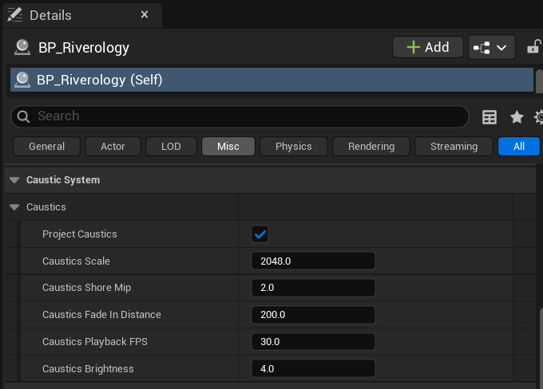

# Riverology - Caustics

💡 Light Patterns

🌊 Animated

☀️ Sun-Driven

Create dancing underwater light patterns projected onto the riverbed.

---

## Prerequisites

| Requirement | Details |
|-------------|---------|
| **Engine** | UE5.x (latest release) |
| **Plugin** | Riverology installed and configured |
| **Scene** | BP_Riverology river + Directional Light |
| **Skills** | Basic Materials and Lighting understanding |

:::info About Caustics
Caustics are animated light patterns on the riverbed from sunlight through moving water. Built into **BP_Riverology** - enable and configure directly from the Details panel.
:::

---

## Step-by-step

:::note 1. Select the BP_Riverology actor and locate the Caustic System settings
Select your **BP_Riverology** actor in the **Outliner**. In the **Details** panel, click the **Misc** category tab to filter the settings. Expand the **Caustic System** section to reveal all caustic parameters.

The following settings are available:

| Parameter | Default | Description |
|-----------|---------|-------------|
| **Project Caustics** | ✅ Enabled | Master toggle for the caustic effect. Disable to turn off caustics entirely. |
| **Caustics Scale** | `2048.0` | Controls the size of the caustic pattern in world units. Higher values create larger, more spread-out light patterns. |
| **Caustics Shore Mip** | `2.0` | Mip level used for caustics near the shore. Higher values create softer, less detailed caustics at shallow depths. |
| **Caustics Fade In Distance** | `200.0` | Distance in units over which caustics fade in from the water surface. Prevents harsh caustic boundaries at the waterline. |
| **Caustics Playback FPS** | `30.0` | Animation speed of the caustic texture. Higher values create faster-moving light patterns. |
| **Caustics Brightness** | `4.0` | Intensity multiplier for the caustic effect. Increase for sunnier scenes, decrease for overcast conditions. |

:::

:::note 2. Observe the caustic effect in your scene
With **Project Caustics** enabled, the caustic light patterns will appear on the riverbed and any submerged geometry. The effect is most visible in shallow, clear water with good lighting.

The caustics animate automatically based on the water surface motion and the **Caustics Playback FPS** setting. Adjust **Caustics Brightness** to match your scene's lighting conditions.

:::

---

## Parameter Tuning Guidelines

| Scenario | Recommended Adjustments |
|----------|------------------------|
| Bright sunny day | Increase **Caustics Brightness** to `6.0–8.0` |
| Overcast or shaded | Decrease **Caustics Brightness** to `2.0–3.0` |
| Wide river | Increase **Caustics Scale** to `3000.0–4096.0` |
| Narrow stream | Decrease **Caustics Scale** to `1024.0–1500.0` |
| Calm water | Decrease **Caustics Playback FPS** to `15.0–20.0` |
| Turbulent rapids | Increase **Caustics Playback FPS** to `45.0–60.0` |
| Deep water | Increase **Caustics Fade In Distance** to `400.0–600.0` |

---

## Troubleshooting Common Issues

| Problem | Likely Cause | Solution |
|---------|--------------|----------|
| No caustics visible | Project Caustics disabled | Enable **Project Caustics** checkbox |
| Caustics too faint | Low brightness or weak lighting | Increase **Caustics Brightness** or add stronger directional light |
| Caustics too harsh | Brightness too high | Decrease **Caustics Brightness** to `2.0–4.0` |
| Caustics appear pixelated | Scale too small | Increase **Caustics Scale** value |
| Caustics animate too fast | High playback FPS | Decrease **Caustics Playback FPS** to `20.0–30.0` |
| Sharp edge at waterline | Fade distance too low | Increase **Caustics Fade In Distance** |
| Caustics visible on land | Water volume bounds incorrect | Adjust river spline or water depth settings |

---

## Summary

In this guide, you learned how to:

1. **Locate the Caustic System settings** - Find and expand the caustic parameters in the BP_Riverology Details panel.
2. **Configure caustic appearance** - Adjust scale, brightness, and animation speed to match your scene.
3. **Tune for different scenarios** - Apply recommended settings for various lighting and water conditions.

Caustics add significant visual realism to river scenes with minimal performance cost. Experiment with the parameters to achieve the look that best matches your environment's lighting and mood.
