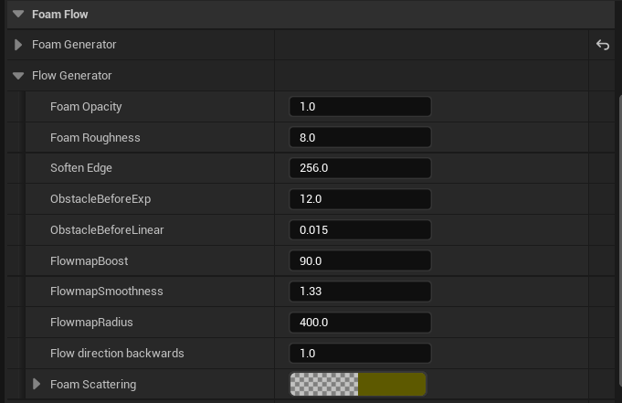

# Riverology - Foam

💨 Procedural

🌊 Flow-Driven

🪨 Obstacle Interaction

Configure dynamic foam generation at rapids, obstacles, and shorelines.

---

## Prerequisites

| Requirement | Details |
|-------------|---------|
| **Engine** | Unreal Engine 5.3 or newer |
| **Plugin** | Riverology installed and configured |
| **Scene** | BP_Riverology river in your level |
| **Skills** | Basic Materials and Flowmaps understanding |

:::info Foam System
The foam system has three subsystems: **Foam Generator** (texture/vertex foam), **Flow Generator** (flowmap/obstacle interaction), and **Distortion** (flow direction/distance field masking). Foam automatically appears around intersecting objects.
:::

---

## Step-by-step

:::note 1. Locate the Foam Flow settings and configure the Foam Generator
Select your **BP_Riverology** actor in the **Outliner**. In the **Details** panel, expand the **Foam Flow** section, then expand **Foam Generator**.

**Waterfall Textures:**

| Parameter | Default | Description |
|-----------|---------|-------------|
| **Waterfall** | `T_FoamParticle` | Base texture for waterfall foam particles. |
| **Waterfall (Normals)** | `T_FoamParticle_Normals` | Normal map for waterfall foam, adds surface detail. |
| **Waterfall Fast** | `0.25` | Animation speed of waterfall foam texture. Higher values create faster-moving foam. |
| **Waterfall Scale** | `1.0` | Tiling scale of the waterfall foam texture. |
| **Masking** | `1.28` | Controls the threshold for foam visibility. Higher values show less foam. |

**Vertex Settings:**

| Parameter | Default | Description |
|-----------|---------|-------------|
| **Vertex Normal** | `1.0` | Influence of vertex normals on foam placement. |
| **Multiply Vertex** | `1.005` | Multiplier for vertex-based foam intensity. |
| **Vertex Power** | `7.0` | Exponent controlling foam falloff based on vertex data. |

**Foam Flow Textures:**

| Parameter | Default | Description |
|-----------|---------|-------------|
| **Foam Flow** | `T_ProceduralFoam_13` | Primary procedural foam texture for flowing water. |
| **Foam Flow (Normals)** | `T_ProceduralFoam_13_V2Normals_1` | Normal map for foam flow, adds depth and detail. |
| **Foam Flow Fast** | `0.2` | Animation speed of the foam flow texture. |
| **Foam Flow Scale** | `0.2` | Tiling scale of foam flow texture. Lower values create larger foam patterns. |
| **DDX DDY** | `2.0` | Derivative calculation for foam edge sharpness. |

:::

:::note 2. Configure the Flow Generator settings
Still within the **Foam Flow** section, expand **Flow Generator** to access flowmap and obstacle interaction settings.

**Foam Appearance:**

| Parameter | Default | Description |
|-----------|---------|-------------|
| **Foam Opacity** | `1.0` | Overall opacity of the foam effect. Reduce for more transparent foam. |
| **Foam Roughness** | `8.0` | Surface roughness of foam. Higher values create more matte, less reflective foam. |
| **Soften Edge** | `256.0` | Distance over which foam edges blend with water. Higher values create softer transitions. |

**Obstacle Interaction:**

| Parameter | Default | Description |
|-----------|---------|-------------|
| **ObstacleBeforeExp** | `12.0` | Exponential factor for foam appearing before obstacles (upstream). |
| **ObstacleBeforeLinear** | `0.015` | Linear factor for upstream obstacle foam. Controls gradual foam buildup. |

**Flowmap Settings:**

| Parameter | Default | Description |
|-----------|---------|-------------|
| **FlowmapBoost** | `90.0` | Intensity multiplier for flowmap influence on foam direction. |
| **FlowmapSmoothness** | `1.33` | Smoothing applied to flowmap transitions. Higher values create smoother flow. |
| **FlowmapRadius** | `400.0` | Radius of influence for flowmap sampling in world units. |
| **Flow direction backwards** | `1.0` | Controls foam flow direction relative to river flow. `1.0` = downstream. |

**Scattering:**

| Parameter | Default | Description |
|-----------|---------|-------------|
| **Foam Scattering** | Color picker | Subsurface scattering color for foam. Affects how light passes through foam edges. |

:::

:::note 3. Configure the Distortion settings
Expand the **Distortion** subsection within **Foam Flow** to access flow vector and distance field settings.

| Parameter | Default | Description |
|-----------|---------|-------------|
| **Forward Flow Adjustment** | `-0.25` | Offsets foam position along the flow direction. Negative values shift foam upstream. |
| **Gradient Flow Amount** | `-0.6` | Controls how much the flow gradient affects foam placement. Negative values create trailing foam. |
| **Flow Vector** | Color (direction) | Visual representation of the primary flow direction vector. |
| **DF Mask Power** | `64.0` | Power exponent for distance field masking. Higher values create sharper foam boundaries around obstacles. |
| **DF Distance** | `512.0` | Maximum distance in units for distance field foam influence around obstacles. |
| **Perlin 3D Noise** | `2048.0` | Scale of 3D Perlin noise applied to foam for natural variation. |

:::

:::note 4. Observe the foam effect around obstacles in your scene
With the foam system configured, place static mesh actors (such as rocks or simple cubes) in your river. Ensure these meshes have collision enabled so the distance field can detect them.

The foam will automatically appear:
- **Upstream** of obstacles - controlled by **ObstacleBeforeExp** and **ObstacleBeforeLinear**
- **Around** obstacles - controlled by **DF Mask Power** and **DF Distance**
- **Downstream** as trailing foam - controlled by **Gradient Flow Amount**

The flowmap drives the foam animation direction, creating realistic water flow patterns around obstacles.

:::

---

## Parameter Tuning Guidelines

| Scenario | Recommended Adjustments |
|----------|------------------------|
| Calm river with subtle foam | Decrease **Foam Opacity** to `0.5–0.7`, increase **Soften Edge** to `400.0` |
| Turbulent rapids | Increase **FlowmapBoost** to `120.0–150.0`, decrease **Foam Flow Scale** to `0.1` |
| Large boulders/obstacles | Increase **DF Distance** to `800.0–1024.0`, increase **ObstacleBeforeExp** to `16.0–20.0` |
| Small rocks/debris | Decrease **DF Distance** to `256.0`, decrease **FlowmapRadius** to `200.0` |
| Waterfall sections | Increase **Waterfall Fast** to `0.4–0.5`, decrease **Masking** to `0.8–1.0` |
| Natural variation | Increase **Perlin 3D Noise** to `4096.0` for larger-scale variation |

---

## Troubleshooting Common Issues

| Problem | Likely Cause | Solution |
|---------|--------------|----------|
| No foam visible | Foam Opacity too low or textures missing | Set **Foam Opacity** to `1.0` and verify texture assignments |
| Foam doesn't appear around obstacles | Distance field not generated | Ensure obstacle meshes have **Generate Distance Field** enabled in mesh settings |
| Foam appears too uniform | Perlin noise scale too small | Increase **Perlin 3D Noise** to `2048.0–4096.0` |
| Foam edges too harsh | Soften Edge too low | Increase **Soften Edge** to `256.0–512.0` |
| Foam moves in wrong direction | Flow direction setting incorrect | Adjust **Flow direction backwards** or check river spline direction |
| Foam too bright/washed out | Foam Roughness too low | Increase **Foam Roughness** to `6.0–10.0` |
| Performance issues | DF Distance too high | Reduce **DF Distance** to `256.0–512.0` and **FlowmapRadius** to `200.0` |

---

## Summary

In this guide, you learned how to:

1. **Configure the Foam Generator** - Set up waterfall and foam flow textures with vertex-based masking controls.
2. **Configure the Flow Generator** - Adjust foam opacity, obstacle interaction, and flowmap settings for realistic water behavior.
3. **Configure Distortion settings** - Fine-tune flow direction, distance field masking, and procedural noise for natural variation.
4. **Create foam around obstacles** - Place collision-enabled meshes in your river to generate automatic foam effects.

The foam system adds significant visual realism to river scenes by simulating the turbulent white water that forms around obstacles and in fast-moving sections. Experiment with the parameters to match different river conditions from calm streams to rushing rapids.
