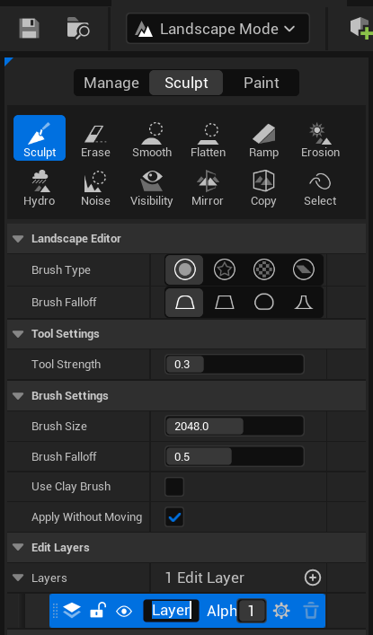

# Oceanology Legacy — Landscape

_Last updated: 2025-12-08_

## Prerequisites
- Unreal Engine 5.6 or newer.
- **Oceanology Legacy** installed and configured (see the **Setup** page).
- A **Landscape** actor already placed and configured in your level.
- Basic familiarity with **Landscape Mode**, **splines**, and **terrain sculpting** in Unreal Engine.

## Notes
- Oceanology Legacy includes **Riverology**, a river system that uses splines to define water flow paths. The **Landscape** feature allows these river splines to automatically deform the terrain, carving realistic riverbeds and banks.
- The deformation is non-destructive and can be applied or removed at any time during development. This makes it easy to iterate on river placement without permanently modifying your landscape.
- The system supports both **raising** and **lowering** terrain heights, allowing you to create embankments, levees, and natural river valleys.
- Landscape deformation works with **Edit Layers**, enabling you to isolate river modifications on a separate layer for better control and reversibility.

---

## Step-by-step

:::note 1. Add the Riverology actor to your level
Open your level and use the **Quickly Add to the Project** menu (the `+` button in the toolbar or right-click in the viewport). Type `BP_Riverology` in the search field.

Select **BP_Riverology** from the results and drag it into your scene. This Blueprint contains the river spline and all associated water rendering, flow simulation, and landscape deformation settings.

Position the actor where you want your river to begin. You will adjust the spline path in subsequent steps.

:::

:::note 2. Prepare the Landscape for editing
Before applying river deformation, ensure your Landscape is properly configured for editing.

Enter **Landscape Mode** by selecting it from the **Modes** panel or pressing `Shift + 3`. The Landscape tools will appear in the left panel.

**Key Tool Categories:**
- **Sculpt** — Manual terrain modification tools (Sculpt, Erase, Smooth, Flatten, Ramp, Erosion, Hydro, Noise, etc.)
- **Manage** — Landscape component and streaming settings
- **Paint** — Material layer painting

**Recommended Brush Settings for River Work:**

| Parameter | Value | Purpose |
|-----------|-------|---------|
| **Tool Strength** | `0.3` | Moderate strength for controlled deformation |
| **Brush Size** | `2048.0` | Large brush for broad river valleys |
| **Brush Falloff** | `0.5` | Soft edges for natural-looking banks |
| **Apply Without Moving** | ✅ Enabled | Allows continuous application while stationary |

**Edit Layers:**
If your Landscape uses Edit Layers, select or create a dedicated layer for river deformation. This isolates changes and allows easy modification or removal later. In the **Layers** section, you can see `Layer` with `Alpha: 1` — this is the active editing layer.

:::

:::note 3. Configure the Riverology Landscape settings
Select the **BP_Riverology** actor in your level. In the **Details** panel, locate the **Riverology Landscape** category. This section controls how the river spline deforms the terrain.

**Component Hierarchy:**
- **Root (Root)** — The base transform node
- **Spline Component (Spline)** — Defines the river's path through the level

**Landscape Settings:**

| Parameter | Value | Description |
|-----------|-------|-------------|
| **Apply Landscape Spline** | ✅ Enabled | Master toggle for landscape deformation |
| **Landscape** | `Landscape` | Reference to the target Landscape actor |
| **Raise Heights** | ✅ Enabled | Allow terrain to be raised (for banks/levees) |
| **Lower Heights** | ✅ Enabled | Allow terrain to be lowered (for riverbeds) |
| **Deform Width** | `-200.0` | Width of deformation zone. Negative values create inward slopes (valleys). |
| **Deform Falloff** | `1000.0` | Distance over which deformation blends to original terrain height |
| **Paint Layer Name** | `None` | Optional: Name of landscape layer to paint along the river |
| **Edit Layer to Paint On** | `Layer` | Target Edit Layer for deformation changes |
| **Refresh Grass Foliage** | ❌ Disabled | Toggle to update procedural foliage after deformation |

**Key Parameters Explained:**

- **Deform Width** controls the riverbed depth profile. Negative values create a valley shape where the center is lowest. The absolute value determines how far the slope extends from the spline center.

- **Deform Falloff** determines how gradually the deformation blends into the surrounding terrain. Higher values create smoother, more natural transitions. Lower values create sharper, more defined edges.

**Applying Changes:**
Click the **Editor Apply Spline** button in the **Landscape** section to execute the deformation. This calculates the spline path and modifies the terrain accordingly.

:::

---

## Understanding Deformation Parameters

### Deform Width

The **Deform Width** parameter controls the cross-sectional shape of the riverbed:

| Value | Effect |
|-------|--------|
| **Negative** (e.g., `-200.0`) | Creates a valley/channel. The spline centerline is the lowest point. |
| **Zero** (`0.0`) | No width deformation. Only falloff affects terrain. |
| **Positive** (e.g., `200.0`) | Creates a raised path/levee. The spline centerline is the highest point. |

### Deform Falloff

The **Deform Falloff** parameter controls the transition zone:

| Value | Effect |
|-------|--------|
| **Low** (e.g., `100.0`) | Sharp, defined riverbanks with minimal blending |
| **Medium** (e.g., `1000.0`) | Natural-looking gradual slopes |
| **High** (e.g., `5000.0`) | Very gradual, broad valleys affecting large terrain areas |

### Raise/Lower Heights

These toggles provide safety controls:

| Configuration | Use Case |
|---------------|----------|
| **Both Enabled** | Full deformation — creates complete riverbeds with banks |
| **Only Lower** | Carves channels without raising any terrain |
| **Only Raise** | Creates levees/embankments without cutting into terrain |
| **Both Disabled** | Deformation preview only (no terrain changes) |

---

## Workflow Recommendations

### Initial River Placement

1. **Plan the path** — Sketch the river route before deforming terrain.
2. **Use Edit Layers** — Create a dedicated layer named "Rivers" for all water deformation.
3. **Start with defaults** — Apply initial deformation, then refine parameters.
4. **Work incrementally** — Apply changes in sections rather than the entire river at once.

### Parameter Tuning

| River Type | Width | Falloff | Notes |
|------------|-------|---------|-------|
| **Mountain Stream** | `-50` to `-100` | `200` – `500` | Narrow, steep banks |
| **Forest River** | `-150` to `-250` | `800` – `1200` | Medium width, natural slopes |
| **Wide Valley River** | `-300` to `-500` | `2000` – `4000` | Broad riverbed, gentle slopes |
| **Canyon/Gorge** | `-400` to `-600` | `100` – `300` | Deep, steep walls |

### Manual Refinement

After applying spline deformation, you can use manual Landscape tools for refinement:

- **Smooth** — Blend harsh transitions at river junctions
- **Erosion** — Add natural weathering patterns to banks
- **Hydro** — Simulate water erosion for realistic flow channels
- **Noise** — Add subtle variation to prevent uniform appearance

---

## Integration with Other Systems

| System | Integration |
|--------|-------------|
| **Riverology Water** | Deformed terrain provides the visual bed for rendered water |
| **Buoyancy** | River depth affects buoyancy calculations for floating objects |
| **Flow Simulation** | Terrain slope influences water flow direction and speed |
| **Foliage** | Use **Refresh Grass Foliage** to update procedural plants after deformation |
| **Paint Layers** | Automatically paint riverbed material using **Paint Layer Name** |

---

## Troubleshooting Common Issues

| Problem | Likely Cause | Solution |
|---------|--------------|----------|
| No terrain deformation occurs | Apply Landscape Spline disabled | Enable the checkbox in Riverology Landscape settings |
| Deformation affects wrong Landscape | Incorrect Landscape reference | Select the correct Landscape actor in the dropdown |
| River cuts too deep | Deform Width too negative | Increase value (closer to zero) |
| Banks too steep/artificial | Deform Falloff too low | Increase Falloff value for smoother transitions |
| Changes not visible | Edit Layer not selected | Ensure correct Edit Layer is active in Landscape Mode |
| Terrain reverts after play | Edit Layers not saved | Save the Landscape and Edit Layer assets |
| Grass/foliage remains in riverbed | Refresh not triggered | Enable Refresh Grass Foliage and reapply |
| Spline changes don't update terrain | Manual refresh required | Click Editor Apply Spline button |

---

## Summary

In this guide, you learned how to:

1. **Add the Riverology actor** — Place BP_Riverology in your level using the Quick Add menu.
2. **Prepare the Landscape** — Configure Landscape Mode and Edit Layers for controlled editing.
3. **Configure deformation settings** — Understand and adjust Deform Width, Falloff, and height toggles.
4. **Apply spline deformation** — Use Editor Apply Spline to carve riverbeds automatically.
5. **Tune parameters for different river types** — Match settings to your desired river character.
6. **Integrate with other systems** — Understand how landscape deformation works with water rendering, buoyancy, and foliage.

With this knowledge, you can create realistic river valleys that integrate seamlessly with Oceanology's water simulation, producing natural-looking waterways that properly interact with buoyant objects and flow dynamics.
