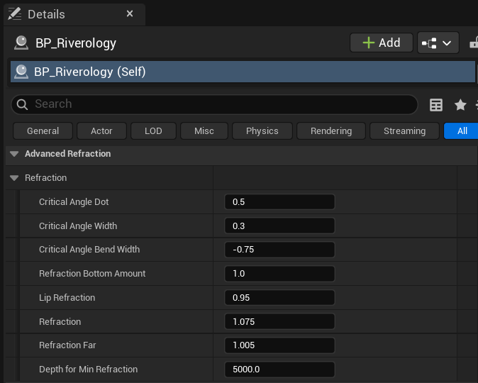

# Riverology - Refraction

💎 Light Bending

🔬 Physics-Based

🌊 Depth-Aware

Configure physically-based light bending for realistic underwater distortion.

---

## Prerequisites

| Requirement | Details |
|-------------|---------|
| **Engine** | Unreal Engine 5.3 or newer |
| **Plugin** | Riverology installed and configured |
| **Scene** | BP_Riverology river in your level |
| **Skills** | Basic Materials and optical effects |

:::info About Refraction
Refraction bends light through water, distorting underwater views. Uses critical angle calculations for realistic physics - light refracts more at shallow angles. Works with surface normals, waves, and ripples.
:::

---

## Step-by-step

:::note 1. Locate the Advanced Refraction settings
Select your **BP_Riverology** actor in the **Outliner**. In the **Details** panel, expand the **Advanced Refraction** section, then expand the **Refraction** subsection to reveal all parameters.

**Critical Angle Settings:**

| Parameter | Default | Description |
|-----------|---------|-------------|
| **Critical Angle Dot** | `0.5` | The dot product threshold that defines the critical viewing angle. Values closer to `0.0` mean more perpendicular viewing angles trigger refraction changes. |
| **Critical Angle Width** | `0.3` | Width of the transition zone around the critical angle. Higher values create smoother transitions between refraction states. |
| **Critical Angle Bend Width** | `-0.75` | Controls the bending intensity near the critical angle. Negative values invert the bending direction for realistic light behavior. |

**Refraction Intensity:**

| Parameter | Default | Description |
|-----------|---------|-------------|
| **Refraction Bottom Amount** | `1.0` | How much the riverbed is affected by refraction distortion. `1.0` = full refraction effect on bottom. |
| **Lip Refraction** | `0.95` | Refraction intensity at the water's edge (lip). Controls distortion where water meets air at shallow angles. |
| **Refraction** | `1.075` | Base refraction index multiplier. Values above `1.0` increase overall distortion intensity. |

**Depth-Based Refraction:**

| Parameter | Default | Description |
|-----------|---------|-------------|
| **Refraction Far** | `1.005` | Refraction multiplier for distant underwater objects. Subtle values prevent over-distortion at depth. |
| **Depth for Min Refraction** | `5000.0` | Depth in units at which refraction reaches its minimum intensity. Beyond this depth, refraction stabilizes. |

:::

:::note 2. Observe the refraction effect in your scene
With refraction configured, the effect is most visible when viewing underwater objects from above the surface or when looking at the water-air interface from below.

The refraction system creates realistic optical distortion:
- **Shallow angles** - Maximum distortion as light bends sharply at the water surface.
- **Steep angles** - Minimal distortion when looking straight down into the water.
- **Depth falloff** - Distortion decreases for objects at greater depths, controlled by **Refraction Far** and **Depth for Min Refraction**.

The image shows the view from beneath the water surface, demonstrating how refraction distorts the sky and shoreline when viewed through the water-air boundary.

:::

---

## Parameter Tuning Guidelines

| Scenario | Recommended Adjustments |
|----------|------------------------|
| Crystal clear water | Increase **Refraction** to `1.1–1.15` for more visible distortion |
| Murky/turbid water | Decrease **Refraction** to `1.0–1.03`, increase **Depth for Min Refraction** to `2000.0` |
| Calm water surface | Decrease **Critical Angle Width** to `0.15–0.2` for sharper transitions |
| Wavy/disturbed surface | Increase **Critical Angle Width** to `0.4–0.5` for smoother blending |
| Shallow river | Decrease **Depth for Min Refraction** to `1000.0–2000.0` |
| Deep river sections | Increase **Depth for Min Refraction** to `8000.0–10000.0` |
| Subtle effect | Set **Refraction** to `1.02–1.05`, **Lip Refraction** to `0.98` |

---

## Understanding Critical Angle

The critical angle in optics is the angle of incidence beyond which light is totally internally reflected rather than refracted. In Riverology, these parameters simulate this phenomenon:

| Parameter | Effect on Visual |
|-----------|-----------------|
| **Critical Angle Dot = 0.0** | Critical angle at perpendicular view (looking straight down) |
| **Critical Angle Dot = 1.0** | Critical angle at grazing view (looking along surface) |
| **Critical Angle Dot = 0.5** | Balanced - critical angle at 60° from surface normal |

The **Critical Angle Bend Width** negative value creates the characteristic "flip" in refraction direction that occurs at the critical angle boundary, matching real-world optical behavior.

---

## Troubleshooting Common Issues

| Problem | Likely Cause | Solution |
|---------|--------------|----------|
| No refraction visible | Refraction value too close to 1.0 | Increase **Refraction** to `1.05–1.1` |
| Refraction too extreme | Refraction value too high | Decrease **Refraction** to `1.03–1.05` |
| Harsh transition at water edge | Critical Angle Width too narrow | Increase **Critical Angle Width** to `0.3–0.5` |
| Underwater view looks flat | Lip Refraction too low | Increase **Lip Refraction** to `0.95–1.0` |
| Deep water still distorted | Depth for Min Refraction too high | Decrease **Depth for Min Refraction** to match your river depth |
| Riverbed appears to shimmer excessively | Refraction Bottom Amount too high | Decrease **Refraction Bottom Amount** to `0.7–0.9` |
| Unrealistic light bending direction | Critical Angle Bend Width incorrect | Adjust **Critical Angle Bend Width** (negative values for realistic behavior) |

---

## Summary

In this guide, you learned how to:

1. **Configure critical angle settings** - Control how viewing angle affects refraction intensity and transitions.
2. **Adjust refraction intensity** - Fine-tune the base refraction index and edge behavior.
3. **Set depth-based falloff** - Configure how refraction changes with water depth for realistic optical behavior.
4. **Understand the optical model** - Learn how critical angle parameters simulate real-world light bending physics.

Refraction is essential for realistic water rendering, creating the characteristic distortion that makes water feel like a true optical medium rather than a flat surface. Subtle adjustments to these parameters significantly impact visual quality.
