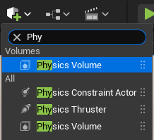
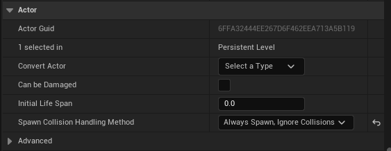
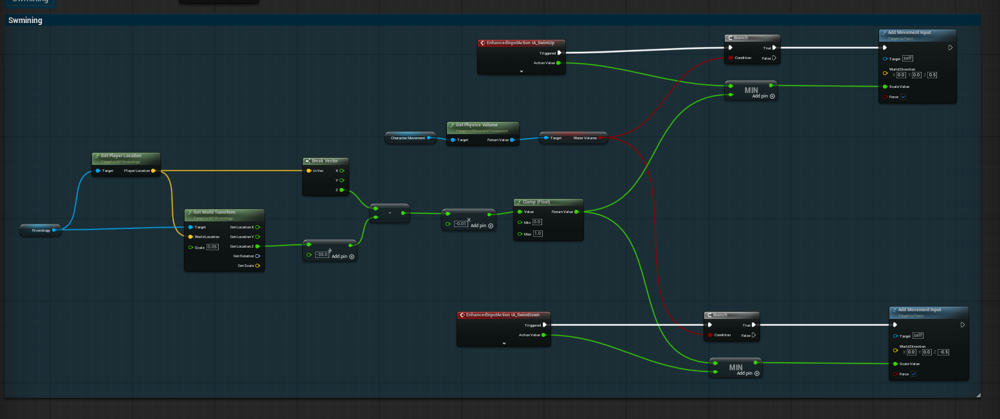
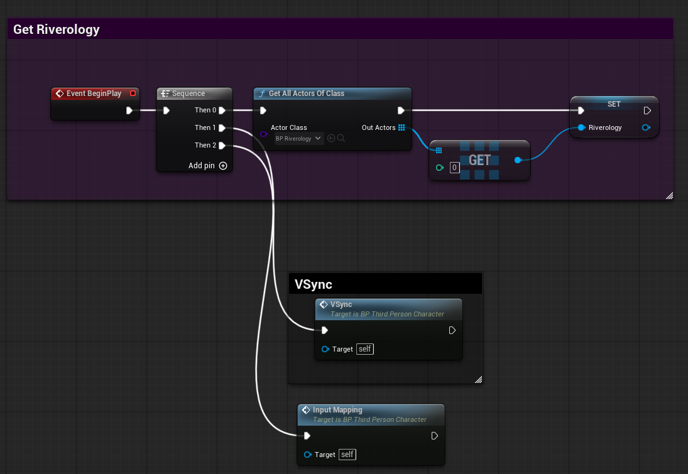

# Riverology - Swimming

🏊 Character System

💨 Current Response

🎮 Physics Volume

Implement character swimming with automatic current response in river environments.

---

## Prerequisites

| Requirement | Details |
|-------------|---------|
| **Engine** | Unreal Engine 5.3 or newer |
| **Plugin** | Riverology installed and configured |
| **Scene** | BP_Riverology river spline in your level |
| **Character** | Blueprint with CharacterMovementComponent |

:::info About River Swimming
Swimming uses a **Physics Volume** that defines the swimmable area. When characters enter, the CharacterMovementComponent automatically switches to swimming mode. Link the Physics Volume to BP_Riverology for current tracking.
:::

---

## Step-by-step

:::note 1. Select the BP_Riverology actor in your scene
Open your level and locate the **BP_Riverology** actor. Use the **Outliner** search box to quickly find it by typing `BP_Riverology`.

Select the actor to access its properties in the **Details** panel.

:::

:::note 2. Add a Physics Volume to your scene
Use the **Quickly Add to the Project** menu (the `+` button in the toolbar) and search for `Phy` to filter the available actors.

Select **Physics Volume** from the list and drag it into your scene. Position it so that it encompasses the area of the river where you want swimming to be enabled.

The Physics Volume defines the 3D region where the character's movement mode will switch to swimming.

:::

:::note 3. Link the Physics Volume to BP_Riverology
With **BP_Riverology** selected, scroll through the **Details** panel to find the **Swimming** category.

Locate the **Swim Volume** property and use the dropdown to select the **PhysicsVolume** actor you just added to your scene. This linkage tells Riverology which volume represents the swimmable area for this river.

:::

:::note 4. Configure the Physics Volume for swimming
Select the **PhysicsVolume** actor in the **Outliner**. In the **Details** panel, configure the following settings:

**Transform:**
- Position and scale the volume to cover your river's swimmable area.
- Set **Mobility** to `Movable` if the volume needs to follow a moving water body.

**Character Movement:**
- **Terminal Velocity** - Maximum falling speed in the volume (default: 4000.0).
- **Priority** - Volume priority when overlapping with other physics volumes (default: 0).
- **Fluid Friction** - Resistance applied to character movement (default: 0.5). Higher values slow the character more.
- **Water Volume** - ✅ **Enable this checkbox**. This is critical - it tells the Character Movement Component to switch to swimming mode.

**Volume:**
- **Physics on Contact** - Leave unchecked unless you need physics actors to react to entering the volume.

:::

:::note 5. Review the Actor settings
In the **Actor** category of the Physics Volume, note the following settings:

- **Spawn Collision Handling Method** - Set to `Always Spawn, Ignore Collisions` for reliable volume placement.
- **Initial Life Span** - Set to `0.0` for a persistent volume (never destroyed).

These settings ensure the Physics Volume remains active throughout gameplay.

:::

---

## Blueprint Implementation

To enable vertical swimming (swim up/down with input), you need to implement Blueprint logic in your Character.

:::note 6. Implement the Swimming input logic
Open your **Character Blueprint** and create the swimming input handling logic. The system uses **Enhanced Input Actions** for swim controls:

**Key nodes:**
- **EnhancedInputAction IA_SwimUp** - Triggered when the player presses the swim up input.
- **EnhancedInputAction IA_SwimDown** - Triggered when the player presses the swim down input.
- **Get Physics Volume** - Retrieves the current physics volume the character is in.
- **Water Volume** - Boolean check to verify the character is in a water volume.
- **Add Movement Input** - Applies vertical movement with World Direction `(0.0, 0.0, 0.5)` for up or `(0.0, 0.0, -0.5)` for down.

The logic flow:
1. Check if the swim input is triggered.
2. Verify the character is inside a Water Volume.
3. Apply vertical movement input based on the action (up or down).

:::

:::note 7. Get the Riverology reference at BeginPlay
In your Character Blueprint, set up the Riverology reference on **Event BeginPlay**:

**Implementation steps:**
1. Add a **Sequence** node after Event BeginPlay.
2. Use **Get All Actors Of Class** with `BP_Riverology` as the Actor Class.
3. Get the first element (index 0) from the Out Actors array.
4. Store it in a variable named `Riverology` for later use.

**Additional initialization (optional):**
- **VSync** - Call this function if you need vertical synchronization with the river surface.
- **Input Mapping** - Set up input mapping context for swimming controls.

This reference allows your character to query the river for surface height, flow direction, and other properties during swimming.

:::

---

## Physics Volume Settings Reference

| Parameter | Default | Description |
|-----------|---------|-------------|
| **Terminal Velocity** | 4000.0 | Maximum falling speed within the volume |
| **Priority** | 0 | Volume priority for overlapping volumes |
| **Fluid Friction** | 0.5 | Movement resistance (0.0 = none, 1.0 = maximum) |
| **Water Volume** | false | Enables swimming mode for characters |
| **Physics on Contact** | false | Triggers physics events on actor contact |

---

## Troubleshooting Common Issues

| Problem | Likely Cause | Solution |
|---------|--------------|----------|
| Character doesn't swim | Water Volume not enabled | Enable Water Volume checkbox on Physics Volume |
| Character sinks immediately | Fluid Friction too low | Increase Fluid Friction value |
| Swim up/down not working | Input Actions not configured | Verify Enhanced Input Actions are properly set up |
| Swimming only works in part of river | Physics Volume too small | Scale the Physics Volume to cover entire river |
| Character stuck in swimming mode | Physics Volume extends outside water | Resize volume to match water bounds |
| Riverology reference is null | BP_Riverology not in level | Ensure BP_Riverology exists before BeginPlay |

---

## Summary

In this guide, you learned how to:

1. **Add a Physics Volume** - Create the swimmable region for your river.
2. **Link the volume to Riverology** - Connect the Physics Volume to BP_Riverology via the Swim Volume property.
3. **Configure swimming physics** - Set up Fluid Friction, Terminal Velocity, and enable Water Volume.
4. **Implement swim controls** - Create Blueprint logic for vertical swimming using Enhanced Input.
5. **Get the Riverology reference** - Store the river reference for runtime queries.

With this setup, characters can swim in your Riverology rivers with full vertical movement control.
