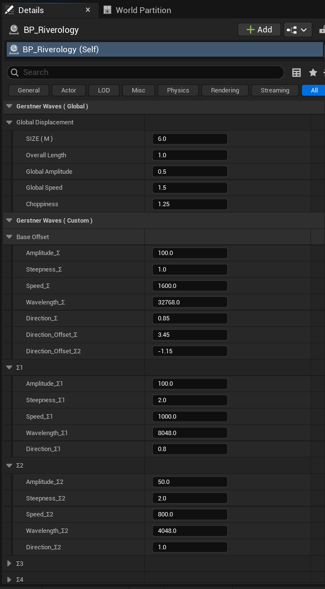

# Oceanology Legacy —  Waves

_Last updated: 2025-12-08_

## Prerequisites
- Unreal Engine 5.6 or newer.
- **Oceanology Legacy** installed and configured (see the **Setup** page).
- A **BP_Riverology** actor placed in your level (see the **Landscape** page for river setup).
- Basic familiarity with **Gerstner Waves** concepts (see the **Waves** page for ocean wave fundamentals).

## Notes
- Riverology uses the same **Gerstner Waves** system as the ocean, but with parameters tuned for river environments. River waves are typically smaller, faster, and more directional than open ocean swells.
- The wave system in rivers supports **4 wave layers (Σ1–Σ4)** that combine to create realistic ripple patterns, current disturbances, and surface turbulence.
- River waves follow the **spline direction** by default, creating the appearance of water flowing downstream. Direction parameters offset from this base flow direction.
- Wave settings affect both the visual water surface and **buoyancy calculations** for floating objects in the river.

---

## Step-by-step

:::note 1. Add the Riverology actor to your level
Open your level and use the **Quickly Add to the Project** menu (the `+` button in the toolbar or right-click in the viewport). Type `BP_Riverology` in the search field.

Select **BP_Riverology** from the results and drag it into your scene. This Blueprint contains the river spline, water rendering, and wave configuration.

If you already have a river placed from the Landscape setup, you can skip this step and select the existing BP_Riverology actor.

:::

:::note 2. Configure the Gerstner Waves settings
Select the **BP_Riverology** actor in your level. In the **Details** panel, locate the **Gerstner Waves** category. This section is divided into **Global** parameters and **Custom** per-layer parameters.

**Gerstner Waves (Global) — Global Displacement:**

| Parameter | Default | Description |
|-----------|---------|-------------|
| **SIZE (M)** | `6.0` | Wave mesh scale in meters. Smaller than ocean for tighter river patterns. |
| **Overall Length** | `1.0` | Wavelength multiplier. Affects spacing between wave peaks. |
| **Global Amplitude** | `0.5` | Master height multiplier. Lower than ocean for subtle river ripples. |
| **Global Speed** | `1.5` | Animation speed. Higher than ocean to simulate faster current. |
| **Choppiness** | `1.25` | Horizontal displacement. Lower than ocean for smoother water surface. |

**Gerstner Waves (Custom) — Base Offset:**

| Parameter | Value | Description |
|-----------|-------|-------------|
| **Amplitude_Σ** | `100.0` | Base amplitude for wave layer calculations |
| **Steepness_Σ** | `1.0` | Base steepness factor for wave peaks |
| **Speed_Σ** | `1600.0` | Base animation speed in units per second |
| **Wavelength_Σ** | `32768.0` | Base distance between wave peaks |
| **Direction_Σ** | `0.85` | Primary wave direction (aligned with river flow) |
| **Direction_Offset_Σ** | `3.45` | Secondary direction offset for wave variation |
| **Direction_Offset_Σ2** | `-1.15` | Tertiary direction offset (negative for counter-flow ripples) |

**Wave Layers (Σ1–Σ4):**

Each layer contributes distinct wave characteristics. The default river configuration uses two primary layers:

**Σ1 — Primary Current Waves:**

| Parameter | Value | Purpose |
|-----------|-------|---------|
| **Amplitude_Σ1** | `100.0` | Main wave height |
| **Steepness_Σ1** | `2.0` | Moderate peak definition |
| **Speed_Σ1** | `1000.0` | Primary flow speed |
| **Wavelength_Σ1** | `8048.0` | Medium wavelength for visible swells |
| **Direction_Σ1** | `0.8` | Aligned with downstream flow |

**Σ2 — Secondary Ripples:**

| Parameter | Value | Purpose |
|-----------|-------|---------|
| **Amplitude_Σ2** | `50.0` | Half the primary amplitude |
| **Steepness_Σ2** | `2.0` | Matching steepness |
| **Speed_Σ2** | `800.0` | Slightly slower than primary |
| **Wavelength_Σ2** | `4048.0` | Half the wavelength for finer detail |
| **Direction_Σ2** | `1.0` | Slight directional offset |

Layers **Σ3** and **Σ4** are available for additional detail but are collapsed by default. Expand them to add more wave complexity.

:::

---

## River vs Ocean Wave Comparison

River waves differ from ocean waves in several key ways:

| Aspect | Ocean (Default) | River (Default) | Reason |
|--------|-----------------|-----------------|--------|
| **SIZE (M)** | `8.0` | `6.0` | Rivers are narrower, need tighter patterns |
| **Global Amplitude** | `1.0` | `0.5` | Rivers have smaller waves than open ocean |
| **Global Speed** | `1.0` | `1.5` | River current creates faster surface motion |
| **Choppiness** | `3.0` | `1.25` | Rivers are more sheltered, less choppy |
| **Wavelength_Σ** | `16384.0` | `32768.0` | Longer base for smoother flow appearance |
| **Direction** | Variable | Flow-aligned | Waves follow the river spline direction |

---

## Wave Configuration Presets

Use these presets as starting points for different river types:

### Calm Stream

| Parameter | Value |
|-----------|-------|
| **SIZE (M)** | `4.0` |
| **Global Amplitude** | `0.2` |
| **Global Speed** | `1.0` |
| **Choppiness** | `0.5` |
| **Amplitude_Σ1** | `30.0` |
| **Amplitude_Σ2** | `15.0` |

Ideal for: Peaceful forest streams, meditation scenes, gentle brooks.

### Standard River (Default)

| Parameter | Value |
|-----------|-------|
| **SIZE (M)** | `6.0` |
| **Global Amplitude** | `0.5` |
| **Global Speed** | `1.5` |
| **Choppiness** | `1.25` |
| **Amplitude_Σ1** | `100.0` |
| **Amplitude_Σ2** | `50.0` |

Ideal for: General-purpose rivers, exploration environments, realistic waterways.

### Fast Current

| Parameter | Value |
|-----------|-------|
| **SIZE (M)** | `5.0` |
| **Global Amplitude** | `0.8` |
| **Global Speed** | `2.5` |
| **Choppiness** | `2.0` |
| **Amplitude_Σ1** | `150.0` |
| **Amplitude_Σ2** | `80.0` |

Ideal for: Mountain rivers, rapids sections, adventure sequences.

### Turbulent Rapids

| Parameter | Value |
|-----------|-------|
| **SIZE (M)** | `4.0` |
| **Global Amplitude** | `1.5` |
| **Global Speed** | `3.0` |
| **Choppiness** | `4.0` |
| **Amplitude_Σ1** | `200.0` |
| **Amplitude_Σ2** | `120.0` |

Ideal for: Whitewater rapids, dangerous crossings, dramatic river scenes.

---

## Direction Parameters Explained

River wave direction is more constrained than ocean waves:

### Direction_Σ (Base Direction)
- **Range:** `0.0` – `1.0`
- **Effect:** Primary flow direction relative to spline
- **Typical Value:** `0.8` – `0.9` (mostly downstream)

### Direction_Offset_Σ
- **Range:** `-5.0` – `5.0`
- **Effect:** Creates diagonal wave patterns crossing the main flow
- **Typical Value:** `2.0` – `4.0` (visible cross-ripples)

### Direction_Offset_Σ2
- **Range:** `-5.0` – `5.0`
- **Effect:** Third direction component for complex interference
- **Typical Value:** `-1.0` – `-2.0` (counter-flow for realism)

**Tip:** Negative offset values create waves that partially oppose the flow, simulating eddies and backwash near riverbanks.

---

## Multi-Layer Wave Design

For realistic rivers, use multiple wave layers strategically:

| Layer | Role | Amplitude | Wavelength | Speed |
|-------|------|-----------|------------|-------|
| **Σ1** | Primary flow | 100% | Large | Fast |
| **Σ2** | Cross-ripples | 50% | Medium | Medium |
| **Σ3** | Surface detail | 25% | Small | Slow |
| **Σ4** | Micro-turbulence | 10% | Very small | Variable |

**Design Principle:** Each successive layer should have roughly half the amplitude and wavelength of the previous layer. This creates natural-looking fractal wave patterns.

---

## Interaction with Other Systems

| System | Interaction |
|--------|-------------|
| **Buoyancy** | Wave height affects floating object stability. Higher amplitude = more rocking. |
| **Flow Direction** | Visual waves align with calculated flow vectors along the spline. |
| **Landscape Deformation** | Wave visibility depends on river depth carved by landscape settings. |
| **Niagara Effects** | Foam and spray particles respond to wave steepness and speed. |
| **Swimming** | Wave motion affects character movement in the water. |

---

## Performance Considerations

River waves are GPU-calculated and generally performant, but consider:

| Factor | Impact | Recommendation |
|--------|--------|----------------|
| **Active Layers** | Each layer adds computation | Use 2 layers for background rivers, 4 for hero rivers |
| **Amplitude** | High values require more vertex displacement | Keep below `2.0` for distant rivers |
| **Multiple Rivers** | Each BP_Riverology calculates independently | Share wave settings via Blueprint inheritance |
| **Mobile Platforms** | Limited GPU budget | Use Calm Stream preset, disable Σ3 and Σ4 |

---

## Troubleshooting Common Issues

| Problem | Likely Cause | Solution |
|---------|--------------|----------|
| River surface is flat | Global Amplitude set to 0 | Increase Global Amplitude to 0.5 or higher |
| Waves move wrong direction | Direction_Σ misconfigured | Set Direction_Σ closer to 1.0 for downstream flow |
| Waves look too ocean-like | Settings copied from ocean | Reduce Amplitude to 0.5, increase Speed to 1.5 |
| Floating objects unstable | Amplitude too high for river width | Reduce Amplitude_Σ1 and Σ2 values |
| Waves don't follow river curve | Spline not properly configured | Verify spline points and tangents |
| Visual flickering | Wavelength too short | Increase Wavelength_Σ values |
| Performance drops near river | Too many active wave layers | Disable Σ3 and Σ4, reduce river segment count |

---

## Summary

In this guide, you learned how to:

1. **Access river wave settings** — Find the Gerstner Waves category in the BP_Riverology Details panel.
2. **Understand Global parameters** — Configure SIZE, Amplitude, Speed, and Choppiness for overall river character.
3. **Configure wave layers** — Use Σ1–Σ4 to create layered, realistic wave patterns.
4. **Compare river vs ocean waves** — Understand why river defaults differ from ocean settings.
5. **Apply presets** — Use Calm Stream, Standard River, Fast Current, or Turbulent Rapids as starting points.
6. **Control wave direction** — Align waves with river flow using Direction parameters.
7. **Optimize performance** — Balance visual quality with computational cost.

With this knowledge, you can create rivers ranging from peaceful streams to dangerous rapids, all with physically-based wave behavior that properly interacts with buoyancy and other Oceanology systems.
