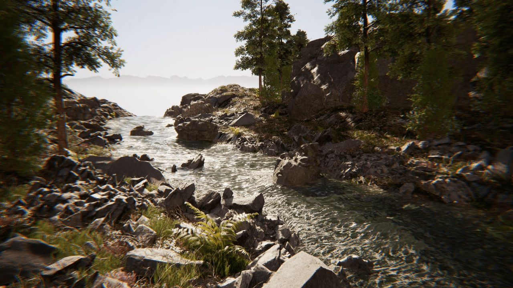

# Riverology

Riverology is a professional water solution for Unreal Engine. It focuses on predictable performance and clear controls so teams ship reliable results without surprises.

## Who it’s for
Teams needing believable rivers for expansive worlds and live gameplay.

## Highlights
- Advanced flow‑based physics and spline‑driven river generation.
- Optimized spline tools for natural paths and large‑world continuity.
- Buoyancy volumes, swimming mechanics, and real‑time interaction.
- Underwater effects, dynamic foam and ripples, and shallow‑water simulation.
- Waterfall generator and terrain deformation workflows.
- High performance across platforms; designed for open‑world scale.

## Requirements
- Unreal Engine 5.6 or newer.
- Windows with DirectX 12. Shader Model 6 recommended.

## Get started
Read the **Setup** guide to install and verify your first scene: [./setup.md](./setup.md)

## Support
Open a ticket via the Marketplace page or our Discord. Include engine version, plugin version, logs, and screenshots.