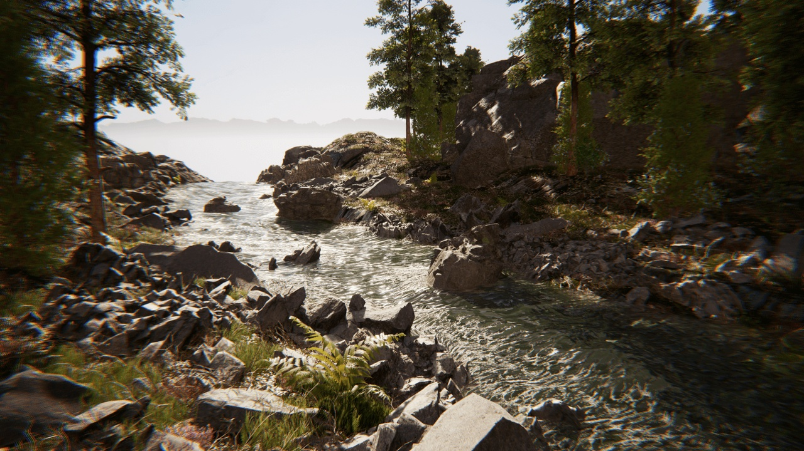

# Riverology

**Riverology** is a professional spline-based river and water flow system for Unreal Engine, engineered for seamless integration into open-world environments. From tranquil streams to rushing rapids, Riverology provides the tools to create believable, interactive water bodies that respond to terrain, physics, and gameplay — all while maintaining consistent performance across platforms.

---

## Who It's For

Riverology is designed for teams who need dynamic river systems at scale:

- **Open-World Studios** — Spline-driven river generation that spans kilometers with automatic terrain adaptation.
- **Adventure & Exploration Games** — Interactive water with swimming, buoyancy, and flow-based physics for immersive gameplay.
- **Environment Artists** — Intuitive spline tools with real-time foam, caustics, and surface effects for rapid iteration.
- **Technical Artists** — Exposed parameters for custom shaders, landscape integration, and procedural workflows.

---

## Core Features

### River Generation
- **Spline-Driven System** — Define river paths with intuitive spline tools that automatically adapt to terrain.
- **Flow-Based Physics** — Realistic water flow that affects buoyancy, swimming, and floating objects.
- **Large-World Continuity** — Rivers that span World Partition cells without seams or performance drops.

### Visual Effects
- **Dynamic Foam** — Procedural foam generation at rapids, obstacles, and shorelines.
- **Caustics** — Underwater light patterns that respond to surface movement and depth.
- **Surface Rendering** — Reflections, refractions, and flow-driven normal animation.
- **Refraction** — Physically-based light bending for realistic underwater distortion.

### Underwater Environment
- **Volumetric Effects** — Light scattering, fog, and depth-based color absorption.
- **Normal Maps** — Detailed surface normals for fine water detail and ripples.
- **Post-Processing** — Underwater camera effects with smooth surface transitions.

### Gameplay Systems
- **Buoyancy Volumes** — Physics-accurate floating with flow forces that push objects downstream.
- **Swimming Mechanics** — Complete character swimming with current response and stamina integration.
- **Debug Tools** — Visual debugging for flow vectors, spline paths, and collision volumes.

### Terrain Integration
- **Landscape Deformation** — Automatic riverbed carving and shoreline blending.
- **RVT Support** — Runtime Virtual Texture integration for seamless terrain-water transitions.
- **Waterfall Generator** — Tools for creating waterfalls with splash effects and mist.

---

## Technical Requirements

| Requirement | Specification |
|-------------|---------------|
| **Engine** | Unreal Engine 5.6 or newer |
| **Platform** | Windows (consoles supported) |
| **Graphics API** | DirectX 12 (Shader Model 6 recommended) |
| **Hardware** | Mid-range GPU or better |

---

## Documentation Structure

This documentation is organized to get you productive quickly:

| Section | Description |
|---------|-------------|
| **[Setup](./setup.md)** | Installation, project configuration, and first river creation. |
| **[Buoyancy](./Buoyancy.md)** | Flow-based buoyancy physics for objects and vessels. |
| **[Swimming](./Swimming.md)** | Character swimming with current response and transitions. |
| **[Surface](./Surface.md)** | Water surface rendering, flow animation, and reflections. |
| **[Underwater](./Underwater.md)** | Volumetric effects, fog, and underwater camera settings. |
| **[Foam](./Foam.md)** | Dynamic foam generation at rapids, obstacles, and edges. |
| **[Caustics](./Caustics.md)** | Underwater light patterns and caustic projection. |
| **[Refraction](./Refraction.md)** | Light bending and underwater distortion effects. |
| **[NormalMaps](./NormalMaps.md)** | Surface detail normals and ripple configuration. |
| **[Landscape](./Landscape.md)** | Terrain integration, riverbed carving, and shoreline blending. |
| **[Debug](./Debug.md)** | Visual debugging tools for flow, splines, and volumes. |

---

## Quick Start

1. **Install the Plugin** — Enable Riverology in your project's Plugins menu.
2. **Create a River Spline** — Use the Riverology spline actor to define your river path.
3. **Adjust Flow Settings** — Configure flow speed, width, and depth along the spline.
4. **Add Water Volume** — Place a Riverology Water Volume for buoyancy and swimming.
5. **Play** — Enter Play mode to see your river in action with flow physics.

For detailed instructions, see the **[Setup Guide](./setup.md)**.

---

## Key Concepts

### Flow Direction
Rivers in Riverology have a defined flow direction determined by the spline. Objects in the water experience forces pushing them downstream, and swimming characters must fight against or swim with the current.

### Spline Width & Depth
Each spline point can have independent width and depth values, allowing rivers to narrow through canyons, widen into deltas, or shallow out near banks — all with smooth interpolation.

### Terrain Adaptation
Riverology can automatically carve riverbeds into landscape geometry and blend shorelines using Runtime Virtual Textures, eliminating manual terrain painting.

---

## Support & Community

**Need Help?**
- **[Discord](https://discord.gg/VHJGBDR2as)** — Join our community for real-time support and discussions.
- **Marketplace** — Open a support ticket through the Unreal Marketplace page.
- **Issue Reports** — Include engine version, plugin version, logs (`Saved/Logs/`), and screenshots.

---

## Riverology vs Oceanology

| Feature | Riverology | Oceanology |
|---------|------------|------------|
| **Water Type** | Rivers, streams, lakes | Oceans, seas |
| **Generation** | Spline-based | Infinite plane |
| **Flow Physics** | Directional current | Wave-based |
| **Best For** | Inland water, flowing rivers | Open water, coastal scenes |

Use **Riverology** for rivers, streams, and inland water bodies. Use **Oceanology** for oceans, seas, and large open water. Both systems can coexist in the same project for complete water coverage.

---

**Ready to create your first river?** Start with the **[Setup Guide](./setup.md)** →

