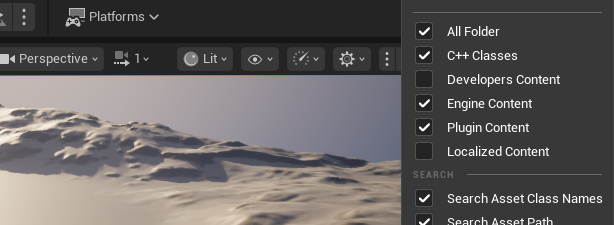

# Riverology - Setup

📋 Step-by-Step Guide

⏱️ 10 Minutes

🌊 Spline-Based

Get Riverology up and running in your Unreal Engine project with this comprehensive setup guide.

---

## Prerequisites

| Requirement | Details |
|-------------|---------|
| **Unreal Engine** | Version 5.3 or newer |
| **Operating System** | Windows with DirectX 12 capable GPU (GTX 1080 / RTX 3060+) |
| **Shader Model** | SM6 support recommended |
| **Optional** | Mesh Distance Fields for shoreline effects |

:::info River Setup Tips
Use spline points to shape your river. Adjust flow, width, and foam per-segment for varied river characteristics.
:::

---

## Installation Steps

### Step 1: Install the Plugin

Install from the FAB Marketplace into your Engine, or copy the plugin folder into `<Project>/Plugins/`.

If you manually copied files, restart the editor to load the plugin.

---

### Step 2: Enable the Plugin

1. Open **Edit → Plugins**
2. Search for **Riverology**
3. Enable the plugin and accept the restart prompt
4. After restart, confirm no missing dependencies in Output Log

---

### Step 3: Configure Project Settings

Navigate to **Edit → Project Settings** and configure:

#### Required Settings

| Category | Setting | Value |
|----------|---------|-------|
| **Platforms → Windows** | Default RHI | DirectX 12 |
| **Platforms → Windows** | D3D12 Shader Model 6 | ✅ Enabled |
| **Engine → Rendering** | Generate Mesh Distance Fields | ✅ Enabled |

#### Recommended Settings

| Category | Setting | Value |
|----------|---------|-------|
| **Engine → Rendering** | Global Illumination | Lumen |
| **Engine → Rendering** | Reflections | Lumen |
| **Engine → Rendering** | Shadow Map Method | Virtual Shadow Maps |

---

### Step 4: Open a Demo Map

Verify the installation:

1. Open **Content Drawer**
2. Navigate to **Plugins → Riverology → Maps**
3. Open **Riverology Demo Map**
4. Wait for shaders to compile

---

### Step 5: Place the River Spline

Add a river to your own level:

1. Open **Place Actors** panel
2. Search for **Riverology Spline**
3. Drag it into your level
4. Click to add spline points and shape your river

:::tip Large Worlds
For expansive maps, use World Partition for optimal streaming performance.
:::

---

### Step 6: Apply Material Instance

Configure the water's appearance:

1. Select the river spline actor
2. Locate the **Material** section in Details
3. Use the provided material instance
4. Customize flow speed, foam, and water color

---

### Step 7: Add Interactions

Enhance your river with gameplay features:

| Feature | Purpose |
|---------|---------|
| **Collision** | Enable for physical interaction |
| **Niagara Systems** | Add splash and foam effects |
| **Audio Cues** | Water flow and ambient sounds |

---

### Step 8: Test Your Setup

1. Save your level (**Ctrl+S**)
2. Click **Play In Editor**
3. Verify the river renders correctly
4. Test flow direction and water effects

---

## Troubleshooting

:::warning Common Issues

**Pink/Preview Materials**
Shaders are still compiling. Wait for compilation to complete.

**No Shoreline Foam**
Enable **Generate Mesh Distance Fields** in Project Settings.

**DX12/SM6 Errors**
Verify Project Settings and restart the editor.

**Low Performance**
- Disable debug views
- Reduce complexity settings
- Profile GPU with `stat gpu`

:::

---

## Next Steps

| Guide | Learn About |
|-------|-------------|
| **[Buoyancy](./Buoyancy.md)** | Add floating objects with flow forces |
| **[Swimming](./Swimming.md)** | Implement character swimming |
| **[Surface](./Surface.md)** | Configure water rendering |
| **[Foam](./Foam.md)** | Set up dynamic foam effects |

---

  <h3>Need Help?</h3>
  
Join our Discord community for setup assistance.

  <a href="https://discord.gg/VHJGBDR2as" target="_blank" rel="noopener noreferrer" className="btn btn-primary">Get Support</a>

