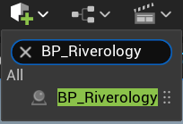
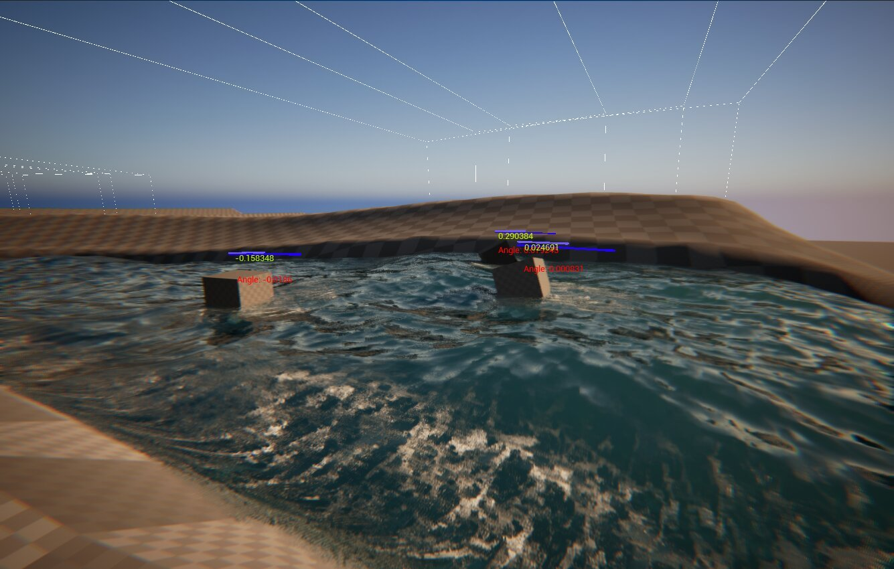
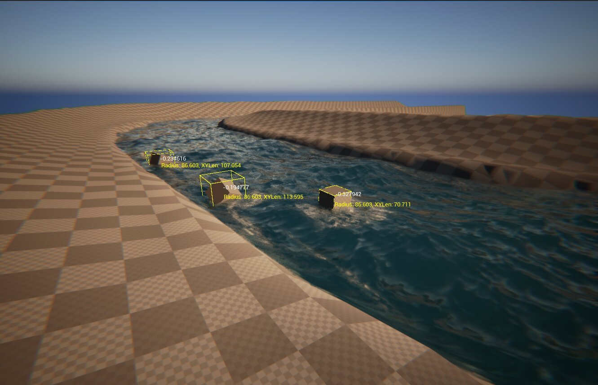
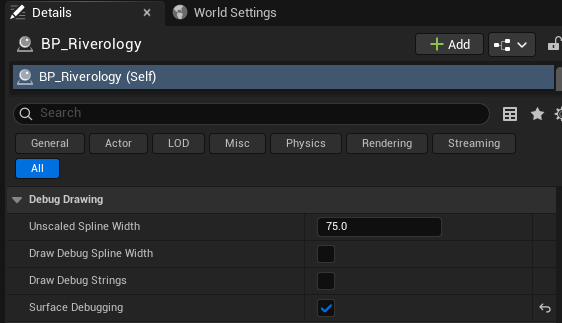
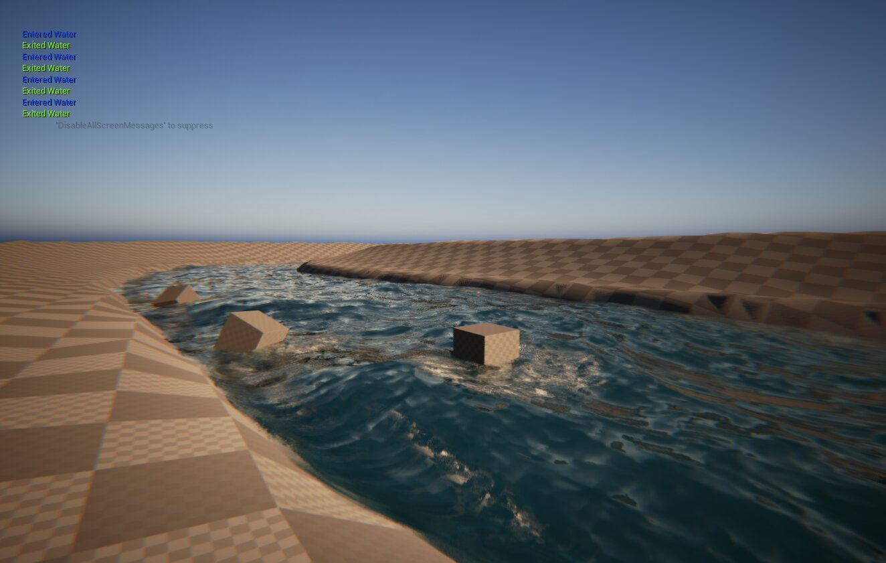

# Riverology - Debug

🔧 Visualization

🐛 Troubleshooting

📊 Runtime Tools

Visual debugging tools for flow vectors, spline paths, and collision volumes.

---

## Prerequisites

| Requirement | Details |
|-------------|---------|
| **Engine** | UE5.x (latest release) |
| **Plugin** | Riverology installed and configured |
| **Scene** | BP_Riverology river spline in your level |
| **Skills** | Basic spline editing familiarity |

:::info Debug System
Debug options in the **Debug Drawing** category help troubleshoot buoyancy issues, verify spline configuration, and understand water surface interactions. Rendered in viewport during Play mode.
:::

---

## Step-by-step

:::note 1. Select the BP_Riverology actor in your scene
Open your level and locate the **BP_Riverology** actor. You can use the **Outliner** search box to quickly find it by typing `BP_Riverology`.

Select the actor to access its properties in the **Details** panel.

:::

:::note 2. Locate the Debug Drawing category
With **BP_Riverology** selected, scroll through the **Details** panel to find the **Debug Drawing** category. This section contains all the debug visualization options:

- **Unscaled Spline Width** - The base width value used for debug visualization (default: 75.0).
- **Draw Debug Spline Width** - Visualizes the spline boundaries and width along the river path.
- **Draw Debug Strings** - Displays detailed numerical information about each point along the spline.
- **Surface Debugging** - Shows water entry and exit events for actors interacting with the river surface.

Each option can be toggled independently, allowing you to focus on specific aspects of the river behavior.

:::

:::note 3. Enable Draw Debug Spline Width
Check the **Draw Debug Spline Width** option and press **Play** to enter Play mode. The viewport will display debug lines showing the spline path and its boundaries.

**What you will see:**
- **White dashed lines** - The spline path and boundary edges.
- **Blue progress bars** - Visual indicators showing the normalized position along the spline.
- **Yellow/Red angle values** - The angle at each spline point, useful for identifying sharp turns or problematic curves.

This visualization helps you verify that the river boundaries are correctly defined and that the spline shape matches your intended design.

:::

:::note 4. Enable Draw Debug Strings
Disable **Draw Debug Spline Width** and enable **Draw Debug Strings** to see a different set of debug information.

:::

:::note 5. Observe the Debug Strings output
Press **Play** to see the debug strings visualization. Each buoyant actor interacting with the river will display detailed information:

**Displayed values:**
- **Normalized position** - A value between -1.0 and 1.0 indicating the actor's position relative to the spline center (negative = left side, positive = right side).
- **Radius** - The current river radius at the actor's position along the spline.
- **XYLen** - The horizontal distance from the actor to the spline center point.

This information is invaluable for debugging buoyancy behavior and understanding how actors interact with the river's variable width along its path.

:::

:::note 6. Enable Surface Debugging
Disable **Draw Debug Strings** and enable **Surface Debugging** to monitor water surface interactions.

:::

:::note 7. Observe Surface Debugging events
Press **Play** and watch the top-left corner of the viewport. The system will display real-time messages whenever actors enter or exit the water surface:

**Event messages:**
- **Entered Water** (green) - An actor has crossed into the water volume.
- **Exited Water** (yellow) - An actor has left the water volume.

A small hint message `'DisableAllScreenMessages' to suppress` appears, indicating you can disable these messages in production builds.

This debug mode is particularly useful for verifying that water detection is working correctly and for troubleshooting cases where actors unexpectedly enter or exit the water.

:::

---

## Debug Options Reference

| Option | Purpose | Best Used For |
|--------|---------|---------------|
| **Unscaled Spline Width** | Base width value for debug visualization | Adjusting debug line visibility |
| **Draw Debug Spline Width** | Shows spline path, boundaries, and angles | Verifying river shape and width |
| **Draw Debug Strings** | Displays position, radius, and distance data | Debugging buoyancy calculations |
| **Surface Debugging** | Shows water entry/exit events | Troubleshooting surface detection |

---

## Troubleshooting Common Issues

| Problem | Likely Cause | Solution |
|---------|--------------|----------|
| Debug lines not visible | Debug option disabled or not in Play mode | Enable the option and press Play |
| Angle values showing red | Sharp turns in spline | Smooth the spline curve at those points |
| Incorrect radius values | Spline width not properly configured | Adjust spline point scale or width settings |
| Missing Entered/Exited events | Actor not configured for water detection | Ensure actor has proper collision and buoyancy component |
| Too many debug messages | Multiple actors triggering events | Use Surface Debugging selectively or filter by actor |
| Debug strings overlapping | Multiple actors in close proximity | Zoom in or test with fewer actors |

---

## Summary

In this guide, you learned how to:

1. **Access debug options** - Locate the Debug Drawing category in the BP_Riverology Details panel.
2. **Visualize spline boundaries** - Use Draw Debug Spline Width to see the river path and width.
3. **Inspect numerical data** - Enable Draw Debug Strings to view position, radius, and distance values.
4. **Monitor surface events** - Use Surface Debugging to track water entry and exit interactions.
5. **Troubleshoot issues** - Interpret debug information to identify and resolve river configuration problems.

These debug tools are essential during development and should be disabled in production builds for optimal performance.
