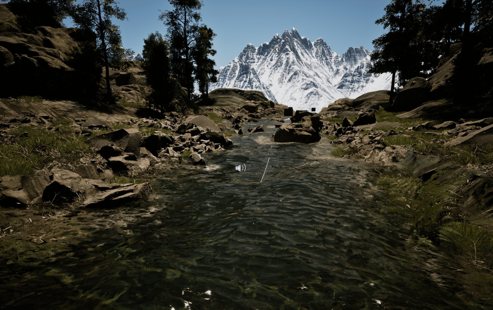

# Riverology - Normal Maps

🌊 Surface Detail

💨 Flow Animation

🎨 Ripples

Configure animated normal maps for realistic surface detail and ripple effects.

---

## Prerequisites

| Requirement | Details |
|-------------|---------|
| **Engine** | UE5.x (latest release) |
| **Plugin** | Riverology installed and configured |
| **Scene** | BP_Riverology river in your level |
| **Skills** | Basic Normal Maps understanding |

:::info About Normal Maps
Animated normal maps scroll across the water surface simulating flowing water. They affect reflections, refraction, specular highlights, and caustics - one of the most impactful visual settings.
:::

---

## Step-by-step

:::note 1. Locate the Normal Maps settings and configure wave appearance
Select your **BP_Riverology** actor in the **Outliner**. In the **Details** panel, expand the **Normal Maps** section to reveal the wave normal parameters.

| Parameter | Default | Description |
|-----------|---------|-------------|
| **Wave Normals** | `T_Water_TilingNormal_With_Height_L` | The normal map texture used for water surface detail. This texture tiles across the water surface and animates based on flow direction. |
| **Fast Wave** | `0.35` | Animation speed of the normal map. Higher values create faster-moving surface ripples. |
| **Scale Wave** | `0.2` | Tiling scale of the normal map texture. Lower values create larger wave patterns, higher values create smaller, more detailed ripples. |
| **Normal Flatness** | `0.75` | Controls the intensity of the normal map effect. `1.0` = flat water (no surface detail), `0.0` = maximum normal intensity. |

:::

:::note 2. Observe the normal map effect on the water surface
With the normal maps configured, the water surface displays realistic ripples and wave patterns that animate with the river flow.

The normal map affects multiple visual aspects:
- **Reflections** - Surface normals distort reflected sky and environment.
- **Refraction** - Underwater objects appear to shimmer and distort.
- **Specular highlights** - Sun and light reflections break into dynamic patterns.
- **Caustics** - Light patterns on the riverbed follow surface normal variations.

Adjust **Normal Flatness** to balance between calm water (higher values) and turbulent rapids (lower values).

:::

---

## Parameter Tuning Guidelines

| Scenario | Recommended Adjustments |
|----------|------------------------|
| Calm, slow river | Increase **Normal Flatness** to `0.85–0.95`, decrease **Fast Wave** to `0.15–0.25` |
| Fast-flowing rapids | Decrease **Normal Flatness** to `0.5–0.65`, increase **Fast Wave** to `0.5–0.7` |
| Wide river | Decrease **Scale Wave** to `0.1–0.15` for larger wave patterns |
| Narrow stream | Increase **Scale Wave** to `0.3–0.5` for smaller, detailed ripples |
| Stylized/cartoon water | Increase **Normal Flatness** to `0.9–1.0` for flatter appearance |
| Photorealistic water | Set **Normal Flatness** to `0.6–0.75` with **Scale Wave** at `0.15–0.25` |

---

## Custom Normal Map Textures

You can replace the default normal map with your own texture. When creating custom normal maps for Riverology:

| Requirement | Specification |
|-------------|---------------|
| **Format** | Tangent-space normal map (RGB) |
| **Tiling** | Must tile seamlessly in all directions |
| **Resolution** | 1024×1024 or 2048×2048 recommended |
| **Compression** | Use `TC_Normalmap` compression setting |
| **Color Space** | Ensure texture is imported as Normal Map (not sRGB) |

To assign a custom texture, click the **Wave Normals** dropdown and select your texture from the asset picker, or drag a texture directly onto the slot.

---

## Troubleshooting Common Issues

| Problem | Likely Cause | Solution |
|---------|--------------|----------|
| Water surface appears flat | Normal Flatness too high | Decrease **Normal Flatness** to `0.6–0.75` |
| Surface too noisy/busy | Scale Wave too high | Decrease **Scale Wave** to `0.15–0.25` |
| Waves move too fast | Fast Wave too high | Decrease **Fast Wave** to `0.2–0.35` |
| Waves appear static | Fast Wave too low | Increase **Fast Wave** to `0.3–0.5` |
| Visible texture tiling | Scale Wave too low | Increase **Scale Wave** or use higher-resolution normal map |
| Normal map not visible | Texture not assigned | Verify **Wave Normals** has a valid texture assigned |
| Incorrect normal direction | Wrong texture format | Ensure texture uses `TC_Normalmap` compression and is not sRGB |

---

## Summary

In this guide, you learned how to:

1. **Configure wave normal texture** - Assign and customize the normal map that defines water surface detail.
2. **Adjust animation speed** - Control how fast surface ripples move with the **Fast Wave** parameter.
3. **Control wave scale** - Set the tiling density to match your river's character.
4. **Balance normal intensity** - Use **Normal Flatness** to dial between calm and turbulent water.

Normal maps are fundamental to water realism. Small adjustments to these parameters dramatically change the river's visual character, from mirror-smooth pools to churning whitewater rapids.
