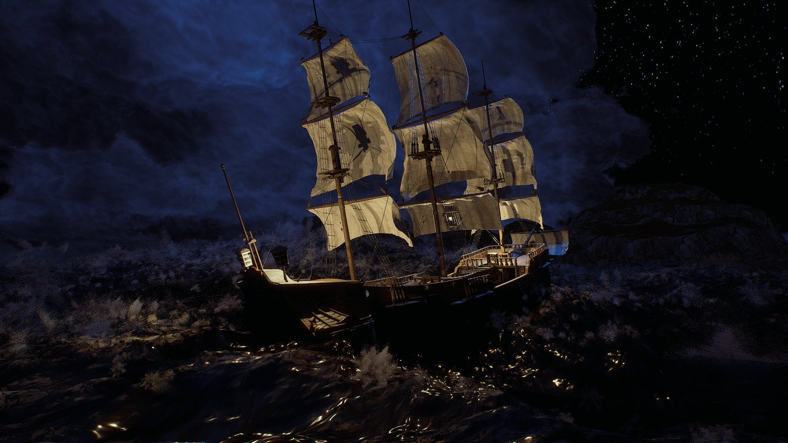

# Oceanology NextGen

🌊 FFT + Gerstner Waves

⚡ C++ Performance

🎬 AAA Quality

🔥 High-End GPUs

**Oceanology NextGen** is a production-ready water simulation system for Unreal Engine, engineered from the ground up in C++ for predictable performance and scalability. Whether you're building vast open-world environments, cinematic sequences, or competitive multiplayer experiences, Oceanology NextGen delivers the visual fidelity and runtime efficiency your project demands.

---

## Who It's For

| Target | Use Case |
|--------|----------|
| **Open-World Studios** | Seamless oceans spanning kilometers with consistent performance via quadtree LOD and World Partition |
| **Cinematic Productions** | Photoreal waves, volumetric underwater rendering, and god rays for film-quality visuals |
| **Multiplayer Projects** | Deterministic wave calculations ensure synchronized water states across all clients |
| **Technical Artists** | Exposed parameters, preset Data Assets, and material hooks for full customization |

---

## Core Features

### 🌊 Wave Simulation

- **Hybrid Spectral System** - Combines Gerstner waves for broad swells with FFT for high-frequency detail
- **Coastal Breakers** - Math-based breaking waves with foam generation at configurable shore distances
- **Deterministic Calculations** - Frame-perfect synchronization for multiplayer and replay systems

### ⚡ Performance & Scalability

- **C++ Quadtree Tessellation** - Dynamic mesh density based on camera distance and screen-space error
- **World Partition Integration** - Native streaming support for massive worlds without manual chunking
- **GPU-Optimized Shaders** - Designed for high-end hardware with Shader Model 6 and DirectX 12

### 🎨 Visual Effects

- **Flow-Based Foam** - Procedural foam that responds to wave motion, obstacles, and vessel wakes
- **Crest Splashes** - Niagara-driven particle systems triggered by wave steepness thresholds
- **Underwater Volumetrics** - Light scattering, caustics, and god rays with depth-based attenuation
- **RVT Landscape Integration** - Seamless shoreline blending via Runtime Virtual Textures

### 🎮 Gameplay Systems

- **Pontoon Buoyancy** - Physics-accurate floating with configurable density, damping, and wave response
- **Swimming Component** - Ready-to-use character swimming with surface detection and underwater states
- **Water Volumes** - Trigger-based regions for gameplay logic, audio zones, and post-process effects

### 🔧 Workflow & Flexibility

- **Preset Data Assets** - Save and share complete water configurations across levels and projects
- **Multiple Water Bodies** - Infinite oceans, bounded lakes, rivers, and pools with independent settings
- **Appearance Range** - From photoreal ocean rendering to stylized toon shading with the same core system

---

## Technical Requirements

| Requirement | Specification |
|-------------|---------------|
| **Engine** | UE5.x (latest release) |
| **Platform** | Windows (macOS/Linux experimental) |
| **Graphics API** | DirectX 12 with Shader Model 6 |
| **Hardware** | High-end GPU recommended (RTX 3080 / RTX 4070+ / 8GB+ VRAM) |

:::caution Performance Note
Oceanology NextGen is optimized for high-end hardware. While it runs on mid-range GPUs, full visual quality requires modern graphics cards with adequate VRAM (8GB+).
:::

---

## Documentation Structure

| Section | Description |
|---------|-------------|
| **[Setup](./setup.md)** | Installation, project configuration, and first scene verification |
| **[Waves](./NextGenWaves.md)** | Gerstner + FFT wave parameters and customization |
| **[Buoyancy](./NextGenBuoyancy.md)** | Pontoon-based floating physics for vessels |
| **[Swimming](./NextGenSwimming.md)** | Character swimming component setup |
| **[Underwater](./NextGenUnderwater.md)** | Volumetric effects, post-processing, caustics |
| **[Surface](./NextGenSurface.md)** | Water surface rendering, reflections |
| **[QuadTree](./NextGenQuadTree.md)** | LOD system and performance tuning |
| **[Infinite Ocean](./NextGenInfinite.md)** | World-scale water configuration |
| **[Shore Waves](./NextGenShoreWaves.md)** | Math-based breaking waves |
| **[Foam](./NextGenFoam.md)** | Flow-based foam generation |
| **[DomeFX](./NextGenDomeFX.md)** | Sky dome and atmospheric integration |
| **[RVT](./NextGenRVT.md)** | Runtime Virtual Texture integration |
| **[Audio](./NextGenAudio.md)** | Dynamic wave-driven soundscapes |
| **[Presets](./NextGenPreset.md)** | Save and manage water configurations |

---

## Quick Start

<ol className="doc-steps">
  <li><strong>Install the Plugin</strong> - Enable Oceanology NextGen in your project's Plugins menu</li>
  <li><strong>Add Water to Your Level</strong> - Use Quick Add (+) and search for Oceanology Infinite Ocean</li>
  <li><strong>Add the Manager</strong> - Place an Oceanology Manager actor to initialize the system</li>
  <li><strong>Configure Water Volume</strong> - Add an Oceanology Water Volume for buoyancy and gameplay</li>
  <li><strong>Play</strong> - Enter Play mode to see your ocean in action</li>
</ol>

For detailed instructions, see the **[Setup Guide](./setup.md)**.

---

## NextGen vs Legacy

| Feature | NextGen | Legacy |
|---------|---------|--------|
| **Target Hardware** | High-end GPUs (RTX 3080 / RTX 4070+) | Mid-range GPUs |
| **Wave System** | Spectral Gerstner + FFT | Gerstner (4 layers) |
| **Performance Focus** | Maximum visual quality | 60-120 FPS broad compatibility |
| **Shore Waves** | Math-based breaking waves | Basic coastal effects |
| **Best For** | Cinematics, AAA visuals | Games, multiplayer |

:::tip Choosing the Right Version
Choose **NextGen** for cutting-edge visuals on high-end systems. Choose **Legacy** for reliable performance across diverse hardware.
:::

---

  <h3>Need Help?</h3>
  
Join our Discord community for real-time support and discussions.

  <a href="https://discord.gg/VHJGBDR2as" target="_blank" rel="noopener noreferrer" className="btn btn-primary">Join Discord</a>

---

**Ready to dive in?** Start with the **[Setup Guide →](./setup.md)**

