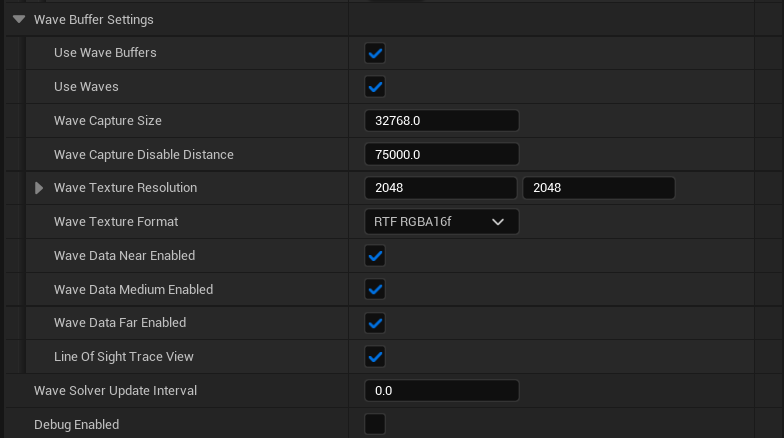

# Oceanology NextGen - Waves

🌊 Spectral Gerstner + FFT

🌬️ Beaufort Wind Scale

🎮 Deterministic

Configure the hybrid wave system combining Spectral Gerstner waves with FFT for photorealistic ocean surfaces.

---

## Prerequisites

| Requirement | Details |
|-------------|---------|
| **Engine** | UE5.x (latest release) |
| **Plugin** | Oceanology NextGen installed and configured |
| **Scene** | At least one water body in your level |
| **Skills** | Basic Blueprint and material parameter familiarity |

:::info About Spectral Waves
NextGen uses a **Spectral Gerstner** system based on the Beaufort wind scale for physically-based wave generation. **Wave Buffers** capture data at multiple LOD distances (Near, Medium, Far) for efficient GPU sampling. The system is **deterministic** for multiplayer synchronization.
:::

---

## Step-by-step

:::note 1. Add an Oceanology Infinite Ocean to your level
Open your level and use the **Quickly Add to the Project** menu (the `+` button in the toolbar or right-click in the viewport). Type `oceanology` in the search field to filter the available actors.

You will see several Oceanology actors available:

**Volumes:**
- **Oceanology Water Niagara Waves Volume** - Enables Niagara-based wave effects in specific regions.
- **Oceanology Water Volume** - Defines regions for buoyancy and underwater effects.

**All Actors:**
- **BP_OceanologyChronos** - Time-of-day controller for dynamic lighting.
- **Oceanology Infinite Ocean** - An infinite ocean water body with full wave simulation.
- **Oceanology Lake** - A bounded lake water body.
- **Oceanology Light Source Controller** - Controls light source behavior with water.
- **Oceanology Manager** - The central controller for all Oceanology systems.
- **Oceanology Material to Struct Converter** - Utility for converting material parameters.
- **Oceanology Preset Converter Actor** - Converts presets between versions.
- **Oceanology Scrubber** - Utility actor for timeline scrubbing.
- **Oceanology Water Depth Debugger** - Visualizes water depth calculations.
- **Oceanology Water Interactor** - Enables interaction effects with water.
- **Oceanology Water Niagara Waves Volume** - Niagara wave effects volume.
- **Oceanology Water Surface Debugger** - Visualizes wave calculations for debugging.
- **Oceanology Water Volume** - Water physics volume.
- **Oceanology Wave Audio** - Dynamic audio based on wave conditions.

For this guide, drag **Oceanology Infinite Ocean** into your scene along with the **Oceanology Manager**.

:::

:::note 2. Access the Wave settings
Select **OceanologyInfiniteOcean** in the **Outliner**. In the **Details** panel, you will find the **Waves** category containing all wave-related settings.

**Waves Category Overview:**

| Section | Description |
|---------|-------------|
| **Start/Stop Wave Simulation** | Buttons to control wave simulation in editor. |
| **Wave Solver Class** | The wave solver component used for calculations. Default is `OceanologyGerstnerWaveSolverComponent`. |
| **Gerstner Waves** | Spectral Gerstner parameters controlling wave shape and behavior. |
| **Wave Buffer System** | Materials and render targets for wave data capture. |
| **Wave Buffer Settings** | Resolution, distance, and LOD configuration for wave buffers. |
| **Wave Solver Update Interval** | Time between wave solver updates. `0.0` = every frame. |
| **Debug Enabled** | Toggle debug visualization for wave calculations. |
| **Shore Waves** | Coastal breaking wave parameters. |

Use **Start Wave Simulation** to preview waves in the editor without entering Play mode.

:::

---

## Configuring Spectral Gerstner Waves

The Spectral Gerstner system generates realistic ocean waves based on physical wind parameters and energy distribution.

:::note 3. Configure Spectral Gerstner parameters
Expand the **Gerstner Waves** category, then expand **Spectral Gerstner** to access the core wave generation parameters.

**Spectral Gerstner Parameters:**

| Parameter | Default | Description |
|-----------|---------|-------------|
| **BeaufortScale** | `5.0` | Wind intensity on the Beaufort scale (0-12). Higher values create larger, more powerful waves. `5` = Fresh breeze with moderate waves. |
| **DirectionalVariance** | `30.0` | Angular spread of wave directions in degrees. Lower values create more uniform wave direction; higher values create more chaotic seas. |
| **FoamThresholdHigh** | `-0.525` | Upper threshold for foam generation. Waves exceeding this steepness produce foam. |
| **FoamThresholdLow** | `-0.2` | Lower threshold for foam generation. Controls where foam begins to appear. |
| **MaxWaveHeight** | `13.7` | Maximum wave height in Unreal units. Caps the tallest waves in the simulation. |
| **MaxWaveLength** | `13312.0` | Maximum wavelength in Unreal units. Controls the longest wave period. |
| **MinWaveHeight** | `0.25` | Minimum wave height. Ensures small ripples are always present. |
| **MinWaveLength** | `128.0` | Minimum wavelength. Controls the shortest wave detail. |
| **SmallWaveThreshold** | `0.25` | Threshold below which waves are considered small and may be filtered. |
| **WaveComponentCount** | `128.0` | Number of wave components in the spectral simulation. Higher = more detail, more GPU cost. |
| **WaveEnergyDistribution** | `1.0` | Energy distribution across wave frequencies. Affects how energy is spread between large and small waves. |
| **WaveSpectrumResolution** | `1.0` | Resolution multiplier for the wave spectrum calculation. |
| **WindDirection** | Yellow vector | Direction the wind is blowing. Waves propagate in this direction. |

**Beaufort Scale Reference:**

| Beaufort | Wind Speed | Sea State | Description |
|----------|------------|-----------|-------------|
| 0-1 | 0-5 km/h | Calm | Mirror-like surface |
| 2-3 | 6-19 km/h | Smooth | Small wavelets |
| 4-5 | 20-38 km/h | Moderate | Moderate waves, some foam |
| 6-7 | 39-61 km/h | Rough | Large waves, extensive foam |
| 8-9 | 62-88 km/h | Very Rough | High waves, spray |
| 10-12 | 89+ km/h | Storm | Exceptionally high waves |

:::

---

## Wave Buffer System

The Wave Buffer System captures wave displacement data into render targets for efficient GPU-based sampling by materials and gameplay systems.

:::note 4. Understand the Wave Buffer System
Expand the **Wave Buffer System** category to view the material and render target configuration.

**Material Section:**

| Parameter | Default | Description |
|-----------|---------|-------------|
| **User Override Wave Buffer Material** | `☐` | Enable to use a custom wave buffer material instead of the default. |
| **Wave Buffer Material** | `MI_SpectralGerstner_Ocean` | The material instance used for wave buffer rendering. Contains the spectral Gerstner shader logic. |

**Render Target Section:**
The system uses three render targets at different LOD distances for optimal performance:

| Parameter | Default | Description |
|-----------|---------|-------------|
| **RT Wave Data Near** | `RT_WaveData_Near_8` | Render target for near-distance wave data. Highest detail for close-up waves. |
| **RT Wave Data Medium** | `RT_WaveData_Medium_8` | Render target for medium-distance wave data. Balanced detail and coverage. |
| **RT Wave Data Far** | `RT_WaveData_Far_8` | Render target for far-distance wave data. Covers distant ocean with lower detail. |

**Material Instance Dynamic:**

| Parameter | Default | Description |
|-----------|---------|-------------|
| **Wave Buffer MID** | `WaveBufferMID_8` | Dynamic material instance used at runtime for wave buffer updates. |

**How It Works:**
1. The wave solver calculates wave displacement each frame.
2. Results are rendered to the three LOD render targets.
3. Materials and buoyancy systems sample these textures for displacement data.
4. This approach offloads expensive wave math to a single GPU pass, enabling efficient reuse.

:::

:::note 5. Configure Wave Buffer Settings
Expand the **Wave Buffer Settings** category to control wave capture resolution and LOD distances.

**Core Settings:**

| Parameter | Default | Description |
|-----------|---------|-------------|
| **Use Wave Buffers** | `✓` | Master toggle for the wave buffer system. Disable for legacy wave sampling. |
| **Use Waves** | `✓` | Master toggle for wave displacement. Disable for flat water. |
| **Wave Capture Size** | `32768.0` | World-space size of the wave capture area in Unreal units. Larger = more coverage, less detail per unit. |
| **Wave Capture Disable Distance** | `75000.0` | Distance from camera beyond which wave capture is disabled for performance. |

**Resolution Settings:**

| Parameter | Default | Description |
|-----------|---------|-------------|
| **Wave Texture Resolution** | `2048 x 2048` | Resolution of the wave buffer render targets. Higher = more detail, more VRAM. |
| **Wave Texture Format** | `RTF RGBA16f` | Pixel format for wave data. 16-bit float provides precision for displacement data. |

**LOD Toggles:**

| Parameter | Default | Description |
|-----------|---------|-------------|
| **Wave Data Near Enabled** | `✓` | Enable near-distance wave buffer for close-up detail. |
| **Wave Data Medium Enabled** | `✓` | Enable medium-distance wave buffer. |
| **Wave Data Far Enabled** | `✓` | Enable far-distance wave buffer for distant ocean. |
| **Line Of Sight Trace View** | `✓` | Use line-of-sight tracing to optimize wave buffer updates. |

**Update Settings:**

| Parameter | Default | Description |
|-----------|---------|-------------|
| **Wave Solver Update Interval** | `0.0` | Time between wave solver updates in seconds. `0.0` = update every frame. |
| **Debug Enabled** | `☐` | Enable debug visualization for wave buffers. |

**Performance Tuning:**
- **Lower resolution** (1024x1024) for better performance on mid-range GPUs.
- **Disable Far LOD** if your camera never views distant ocean.
- **Increase Update Interval** (0.016 = 60fps cap) to reduce GPU load.

:::

---

## Shore Waves

Shore Waves simulate coastal breaking waves that transition from deep water to shallow shorelines.

:::note 6. Configure Shore Waves
Expand the **Shore Waves** category to access coastal wave parameters.

**Shore Wave Parameters:**

| Parameter | Default | Description |
|-----------|---------|-------------|
| **BaseWaveTransitionFactor** | `300.0` | Distance over which waves transition from deep to shallow behavior. Higher = more gradual transition. |
| **CoastalWaves** | `☐` | Enable coastal breaking wave simulation. Requires shoreline depth data. |
| **DirectionWaveSpeed** | `250.0` | Speed at which waves move toward the shore in Unreal units/second. |
| **GlobalNoiseScale** | `20000.0` | Scale of the noise pattern applied to shore waves. Larger = broader noise patterns. |
| **GlobalWaveScale** | `0.25` | Overall scale multiplier for shore wave displacement. |
| **SideBreakForce** | `500.0` | Force applied to waves breaking at an angle to the shore. Creates realistic diagonal breakers. |
| **WaveHeight** | `1500.0` | Height of shore waves in Unreal units. |
| **WaveLength** | `4000.0` | Wavelength of shore waves. Shorter = more frequent waves hitting the beach. |
| **WavePhaseSpeed** | `1.0` | Speed multiplier for wave phase animation. |
| **WaveSwayAmplitude** | `2000.0` | Horizontal sway amplitude of breaking waves. Creates the characteristic curling motion. |

**Shore Wave Behavior:**
- Shore waves are layered on top of the base spectral Gerstner simulation.
- They activate based on water depth, transitioning smoothly from deep water waves.
- **CoastalWaves** enables advanced breaking behavior with foam and spray generation.
- Requires proper landscape/depth setup for accurate shoreline detection.

**Tuning Tips:**
- **Increase WaveHeight** for dramatic beach breaks.
- **Reduce WaveLength** for more frequent wave sets.
- **Adjust BaseWaveTransitionFactor** to control how far from shore the transition begins.
- **Enable CoastalWaves** only when you have shoreline geometry configured.

:::

:::note 7. Preview the wave result
With the default Spectral Gerstner settings (Beaufort 5.0), the ocean displays realistic moderate waves with natural foam patterns on wave crests. The wind direction controls wave propagation, and the directional variance creates organic variation in wave angles.

**Default Configuration Result:**
- Moderate wave heights suitable for general ocean scenes.
- Natural foam distribution on wave crests and turbulent areas.
- Realistic wave spacing and movement patterns.
- Good balance between visual quality and performance.

This configuration works well for most gameplay scenarios and can be adjusted using the Beaufort scale for calmer or stormier conditions.

:::

---

## Wave Parameter Reference

### Spectral Gerstner Parameters

| Parameter | Range | Default | Description |
|-----------|-------|---------|-------------|
| **BeaufortScale** | `0.0` - `12.0` | `5.0` | Wind intensity scale |
| **DirectionalVariance** | `0.0` - `180.0` | `30.0` | Wave direction spread in degrees |
| **MaxWaveHeight** | `1.0` - `50.0` | `13.7` | Maximum wave height |
| **MaxWaveLength** | `1000.0` - `50000.0` | `13312.0` | Maximum wavelength |
| **WaveComponentCount** | `32.0` - `512.0` | `128.0` | Number of wave components |

### Wave Buffer Settings

| Parameter | Range | Default | Description |
|-----------|-------|---------|-------------|
| **Wave Capture Size** | `1000.0` - `100000.0` | `32768.0` | Capture area size |
| **Wave Texture Resolution** | `512` - `4096` | `2048` | Render target resolution |
| **Wave Capture Disable Distance** | `10000.0` - `200000.0` | `75000.0` | LOD cutoff distance |

### Shore Wave Parameters

| Parameter | Range | Default | Description |
|-----------|-------|---------|-------------|
| **WaveHeight** | `100.0` - `5000.0` | `1500.0` | Shore wave height |
| **WaveLength** | `500.0` - `10000.0` | `4000.0` | Shore wavelength |
| **WaveSwayAmplitude** | `100.0` - `5000.0` | `2000.0` | Breaking wave sway |

---

## Preset Configurations

The following presets demonstrate common ocean conditions using the Beaufort scale:

| Scenario | Beaufort | Dir. Variance | Max Height | Wave Length | Notes |
|----------|----------|---------------|------------|-------------|-------|
| **Calm Lake** | `1.0` | `15.0` | `2.0` | `5000.0` | Mirror-like with subtle ripples |
| **Light Breeze** | `3.0` | `25.0` | `5.0` | `8000.0` | Gentle waves, minimal foam |
| **Moderate Ocean** | `5.0` | `30.0` | `13.7` | `13312.0` | Default balanced setting |
| **Rough Seas** | `7.0` | `40.0` | `25.0` | `18000.0` | Large waves, significant foam |
| **Storm** | `9.0` | `60.0` | `40.0` | `25000.0` | Extreme waves, heavy spray |
| **Hurricane** | `11.0` | `90.0` | `50.0` | `35000.0` | Maximum intensity |

---

## Interaction with Other Systems

| System | Interaction |
|--------|-------------|
| **Buoyancy** | Pontoons sample wave buffer data for floating calculations. Higher waves = more dramatic vessel motion. |
| **Swimming** | Wave motion affects swimming character stability and movement speed. |
| **Underwater** | Wave surface determines the underwater/above-water boundary and light penetration. |
| **Niagara Effects** | Foam, spray, and splash particles respond to wave steepness and foam thresholds. |
| **Audio** | Ocean audio intensity can be driven by Beaufort scale for dynamic soundscapes. |
| **Materials** | Wave buffers provide displacement data for shoreline blending and wetness effects. |

---

## Troubleshooting

| Problem | Likely Cause | Solution |
|---------|--------------|----------|
| Ocean appears flat | Use Waves disabled | Enable **Use Waves** in Wave Buffer Settings |
| No wave animation | Wave simulation not started | Click **Start Wave Simulation** or enter Play mode |
| Waves look blocky | Low texture resolution | Increase **Wave Texture Resolution** to 2048 or higher |
| Poor performance | High wave component count | Reduce **WaveComponentCount** to 64 or lower |
| Buoyancy not synced with visuals | Wave buffers disabled | Enable **Use Wave Buffers** |
| Shore waves not appearing | CoastalWaves disabled or no depth data | Enable **CoastalWaves** and verify landscape setup |
| Waves all same direction | DirectionalVariance too low | Increase **DirectionalVariance** for more variation |
| Foam not visible | Foam thresholds misconfigured | Adjust **FoamThresholdHigh/Low** values |

---

## Summary

In this guide, you learned how to:

1. **Add an Oceanology Infinite Ocean** - Place the ocean actor and manager in your level.
2. **Access wave settings** - Find the Waves category in the ocean actor's Details panel.
3. **Configure Spectral Gerstner** - Adjust Beaufort scale, directional variance, and wave dimensions for desired sea state.
4. **Understand Wave Buffers** - Learn how wave data is captured to render targets for efficient GPU sampling.
5. **Configure Wave Buffer Settings** - Set resolution, capture size, and LOD distances for optimal performance.
6. **Configure Shore Waves** - Set up coastal breaking waves with transition factors and sway amplitudes.
7. **Preview results** - See the final wave simulation with realistic foam and motion.

With this knowledge, you can create any ocean condition from mirror-calm lakes to hurricane-force storms, all with physically-based wave behavior and optimized GPU performance.
